*************************************************
7.3.1 Editors - 3D View - Sidebar - Mini Lightlib
*************************************************

.. contents:: Contents

Detailed Table of content
=========================

Sidebar - Mini Lightlib
=======================

The Sidebar is the place where addons adds their content and tabs. Mini Lightlib is such an addon. it adds the Create tab to the tool shelf. And here you can find the Mini Lightlib addon then. You can turn this addon off in the Preferences if you want.

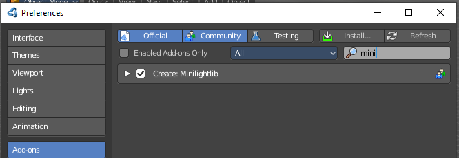

Mini Lightlib Panel
-------------------

Mini Lightlib is a little add-on that gives you some standard lighting settings for the Cycles renderer. It contains for example the classical three-point setup. But also some basic volumetrics examples.

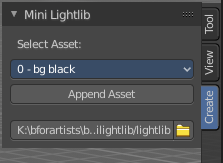

It can be turned off in the User Preferences.

Select Asset
------------

The Select Asset drop-down box contains the assets that comes with Mini Lightlib. Here you can select what you want to load.

The assets are grouped by numbers. 

0 is everything setup. We have three backgrounds here. And the studio camera that fits to the setup.

1 are the light set-ups for a studio setup. From classical three-point to white.

2 is everything not studio setup.

3 are some volumetrics set-ups. Be very careful with this ones. Especially the Musgrave example renders eons.

4 is the included test asset. Some colored spheres.

Append Asset
------------

The Append Asset Button appends what is currently selected in the drop-down box to the scene.

Path Editbox
------------

The Path Edit box shows the path to the library. You will usually not touch this edit box. This edit box gives you a hint where the Mini Lightlib library is located. So that you can add your own assets to that folder. At Windows it's in the Appdata Directory. Which is usually hidden and protected. You might need to adjust your rights to access this folder directly.

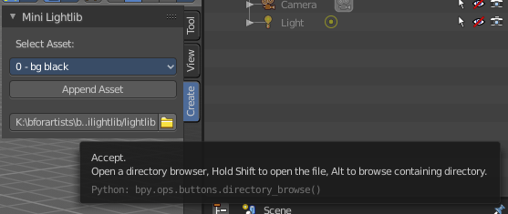

But it is also a Path selector. You can select other library folders here if you want, and append the assets from that folder. The Drop-down box will show the content of all blend files in this folder then.

Every blend file is also a library file. The add-on appends the content of this blend file then. To make your own library file is as easy as saving your blend file with your asset. That's already a library. But note that Mini Lightlib will append the whole content from this blend file. There is no filter as in the Blender append feature. So when you plan to create your own libraries, then take care to remove everything except the asset that you want to load.

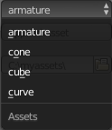

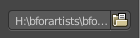

Note that changes in the Path Edit box are not permanent. The path to the Mini Lightlib is hard-coded. So when you restart Blender then every change is gone. That's also a quick method to get the original path to the light library back. Restart Blender.

Simple Usage
------------

Preparation
-----------

Make sure that you have the Cycles renderer selected!

Mini Lightlib is made for the Cycles renderer. It will not work with the Blender Internal renderer. At least not without adjustments.

Throw out all lights and cameras from the scene. 

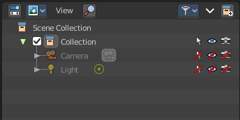

Or make them at least completely unavailable. They should not render. We don't want to have the standard lights ruin the result. Also the standard camera does not fit to our studio setup. 

This can be done in the Outliner. Or you select the lights and camera in the viewport and hit delete.

Load Assets
-----------

Select in the drop-down box what you want to append. And append it one by one to the scene. 

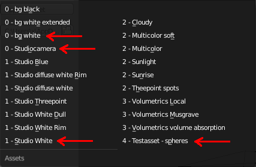

Let's start with a studio setup. I suggest to use the bg white, which is a white background. The camera. One of the studio light set-ups. And finally our test asset to have something to render.

So we select bg white, and click at the Append Asset Button.

Then we select Studiocamera, and click at the Append Asset Button.

Then we select let's say the Studio White, and click at the Append Asset Button.

And then we select the Test asset Spheres, and click at the Append Asset Button. What's left is to click at the render button.

The available light set-ups
---------------------------

Here you can get an overview how the result looks like for the different lighting set-ups.

Be careful with the volumetrics examples. Especially the Musgrave example can render eons.

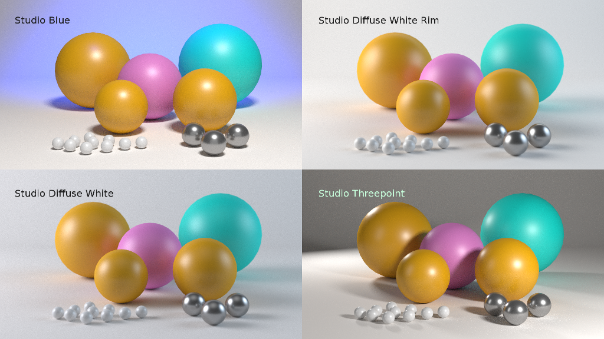

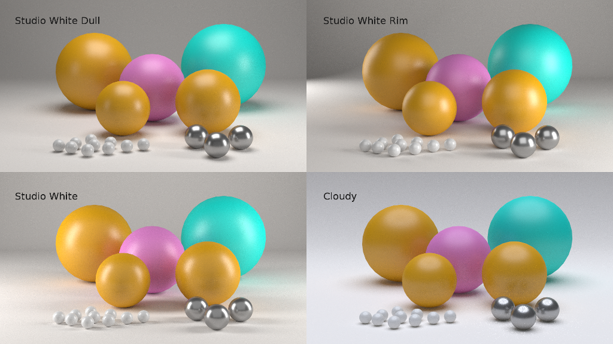

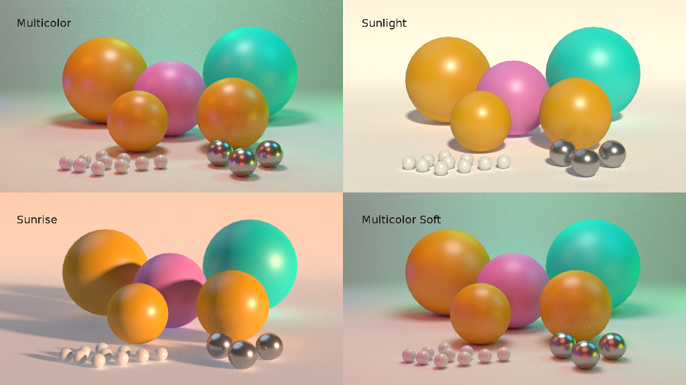

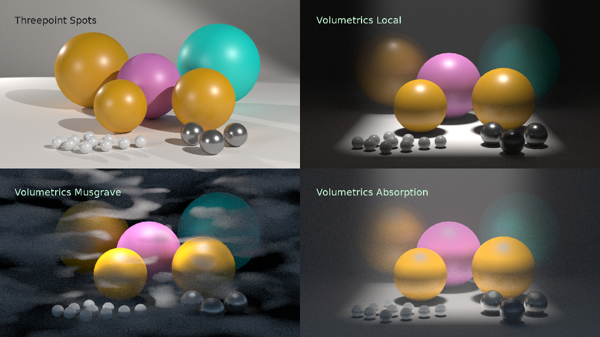

