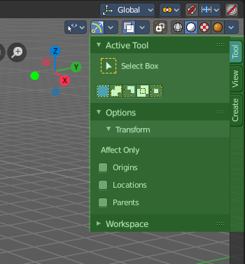

*******************************
7.3 Editors - 3D View - Sidebar
*******************************

.. contents:: Contents

Detailed Table of content
=========================

Introduction
============

The 3D View is made of several areas. At the right side you will find the sidebar.

In the sidebar you will find tool settings and view related settings. And it is also the home of addons. The Create tab is already created by an addon. The Mini Lightlib addon, which is covered in chapter 7.3.1

Tool Tab
========

In the tool tab you will find the tool related settings. This chapter is already covered in chapter 25.1 Editors - Properties Editor - Tools Tab. It is the very same content. We won't cover it here again.

Item tab - Transform Panel
==========================

When you add an object to the scene then the Item tab with the Transform panel becomes visible. The content changes, dependant of the object type. And it changes with the mode.

In general you will most of the time see the same content though. Location, Rotation, Scale and Dimension.

Keyframe and Driver coloring
----------------------------

When a keyframe exists at the current position, then the corresponding edit box turns yellow. When a driver exists at the current position, then the corresponding edit box turns purple.

Location
--------

The current location of the object in its X, X and Z axis. The lock button behind the edit boxes allows you to lock the values.

Rotation
--------

The current rotation of the object in its X, X and Z axis in world coordinates. The lock button behind the edit boxes allows you to lock the values.

Rotation Mode
-------------

Here you can adjust what method gets used for the rotation. Euler rotation can run into a so called gimbal lock, which can be avoided with quaternion rotation mode. But for most cases the default XYZ Euler method should work.

Scale
-----

The current scale of the object in its X, X and Z axis in world coordinates. The lock button behind the edit boxes allows you to lock the values.

Scale is not dimensions. Your object can have a scale of 1 in world coordinates. But a dimension of 4.5. Note that for some operations it is required to have a scale of 1 to get some operations to work. This can be achieved with applying scale in the Object menu.

Dimensions
----------

The current dimension of the object in its X, X and Z axis in world coordinates. The lock button behind the edit boxes allows you to lock the values.

The Dimensions edit boxes are just available for primitives objects. Objects like Empties or a Camera doesn't have a dimension, but a scale factor.

Right Click menu
----------------

Location, Rotation and Scale edit boxes and the locks have a right click menu with further functionality.

When there is already a keyframe available then the right click menu looks a bit different. Same counts for adding a driver first.

.. image:: graphics/7.3_Editors_-_3D_View_-_Sidebar/10000201000000C700000196176E2E1F3640A114.png

Insert Keyframe
---------------

Inserts a keyframe at the current position. The keyframe type depends of where you right click. Insert Keyframe adds a keyframe for all axis.

Insert Single Keyframe
----------------------

Inserts a keyframe at the current position. The keyframe type depends of where you right click. Insert Single Keyframe adds a keyframe for just the current axis.

Add Driver
----------

In Bforartists lots of things can be animated. Also buttons. Add Driver does exactly what it tells. It adds a driver for animation needs to the element. Drivers allows to control animation by properties like expressions, scripts or movements of other objects. Drivers are explained in the chapter 18 Editors - Drivers.

When you click the button the Driven Property panel will appear where you can change the properties for this driver. You don't need to confirm the driver creation. It is just further settings.

Driver Settings
---------------

Type
----

The Driver type. There are two categories of drivers. Built-in and Custom

Built-in functions (Average, Sum, Min and Max)
----------------------------------------------

The driven property will have the value of the average, sum, lowest or highest (respectively) of the values of the referenced Driver Variables. If there is only one driver variable, these functions will yield the same result.

Custom (Scripted Expression)
----------------------------

An arbitrary Python expression that can refer to the Driver Variables by name. 

Driver Value
------------

The current result of the driver setup.

Expression
----------

Expression edit box
-------------------

Here you can add a custom expression. An Expression to use for scripted expression.

The expression has access to a set of standard constants and math functions provided in the Driver Namespace. For an example of adding a custom function to the namespace.

When the expression is invalid then you get an error message. This error message appears also with the default values. Just ignore.

Use Self
--------

The variable self can be used for drivers to reference their own data. This is useful for objects and bones to avoid having creating a Driver Variable pointing to itself.

Example: self.location.x applied to the Y rotation property of the same object will make the object tumble when moving.

Note that dependencies for properties accessed via self may not be fully tracked.

Driver Variables
----------------

Driver Variables are references to properties, transformation channels, or the result of a comparison between transformations of two objects. It is displayed by a panel with all necessary settings, which gets filled in automatically when you create the driver.

Add Input variable
------------------

Here you can add manually a new driver variable.

Picker should allow you to pick a target object. But this is disfunctional here since the panel closes immediately when you move the mouse out of it. Please use the picker in the Driver Editor.

Copy and Paste buttons allows you to copy and paste Driver variable panels.

Driver Variable panel
---------------------

Variable type
-------------

The content of the Driver variable panel changes, dependant of the variable type that you choose here. We came from the transform panel, so our default type here is transform channel. That's what we will explain here. 

Object 
-------

Our object type.

Type
----

The type of the driver. 

Space
-----

The transform space in which the transform should happen.

Value
-----

The resulting value of the driver.

Update Dependencies
-------------------

Update all dependencies.

Show in Drivers Editor
----------------------

Opens the Drivers editor in a floating window. The drivers editor is explained in the chapter 18 Editors - Drivers.

Open Drivers Editor
-------------------

Opens the Drivers editor in a floating window. The drivers editor is explained in the chapter 18 Editors - Drivers.

Add All to Keying Set
---------------------

Add All to Keying Set adds the information of the element to the current keyframe.

Add single to Keying Set
------------------------

Add to Keying Set adds the information of the element to the current keyframe.

Remove from Keying Set
----------------------

Remove from Keying Set removes the information of the element from the current keyframe.

Reset All to Default Value 
---------------------------

Resets the X Y and Zvalues to the default value.

Reset Single to Default Value 
------------------------------

Resets the value for the single edit box under the mouse to the default value.

Unset
-----

Unset is usually a RMB menu entry when you right click at a edit box. It is somehow similar to Reset to Default Value. But it clears the property instead of resetting it to the default value. Which can end in another value.

Copy All to Selected
--------------------

Allows to copy the current rotation of all axis to another object.

Workflow. Select target object, hold down shift, select source object, and use Copy All to Selected.

Copy Single to Selected
-----------------------

Allows to copy the current rotation of the single selected axis to another object.

Workflow. Select target object, hold down shift, select source object, and use Copy All to Selected.

Copy Data Path
--------------

Copy Data Path copies the RNA data path for this property.

Copy as new Driver
------------------

Copies the current value as a new driver.

Assign Shortcut
---------------

This is just for the locks. Here you could assign a shortcut.

Online Python Reference
-----------------------

Developer feature. Open the Blender Python Reference.

Edit Source
-----------

Developer feature. When you have a text editor open in the current layout then you can call the UI script that contains this menu item.

Replace Keyframes
-----------------

Replaces the keyframes in all axis at the current position.

Replace single Keyframe
-----------------------

Replaces the keyframe in the currently selected axis at the current position.

Delete Keyframes
----------------

Deletes the keyframes in all axis at the current position.

Delete Single Keyframe
----------------------

Deletes the keyframe in the currently selected axis at the current position.

Clear Keyframes 
----------------

Deletes all keyframes for all axis.

Clear single Keyframe
---------------------

Deletes all keyframes for the currently selected axis.

Delete Drivers
--------------

Deletes the drivers for all axis.

Delete Single Driver
--------------------

Deletes the drivers for just the current axis.

Copy Driver
-----------

Copies the driver.

Edit Driver
-----------

Opens the Driven Property panel where you can change the settings for this driver.

Item tab - Transform Panel in Edit Mode
=======================================

Just primitive objects does have an edit mode. Non primitive objects like a camera or an empty doesn't have an edit mode. With two exceptions. Text and Force Field type Curve Guide. Both are curve types.

Mesh Objects
------------

Median
------

Median is the position of the selected mesh part.

Global / Local
--------------

Here you can define if the orientation of the selection is local to the selected object, or global to the world coordinates.

Vertices Data
-------------

Mean Bevel Weight 
------------------

Here you can adjust the bevel weight for the selected vertices when you have a bevel modifier at the mesh.

Edges Data
----------

Mean Bevel Weight
-----------------

Here you can adjust the bevel weight for the selected edges when you have a bevel modifier at the mesh.

Mean Crease
-----------

Here you can adjust the weight of the selected vertices when you have a subdivision surface modifier at the mesh.

Curve Objects / Surface Objects
-------------------------------

Median
------

Median is the position of the selected mesh part

Global / Local
--------------

Here you can define if the orientation of the selection is local to the selected object, or global to the world coordinates.

Mean Weight
-----------

Here you can adjust the weight used by softbody. Needs softbody.

Mean Radius
-----------

Here you can adjust the radius of the curve control points

Mean Tilt
---------

Here you can adjust the tilt of the curve control points.

Metaball Objects
----------------

Median
------

Median is the position of the selected mesh part

Global / Local
--------------

Here you can define if the orientation of the selection is local to the selected object, or global to the world coordinates.

Radius
------

Here you can adjust the radius of the selected meta element.

Stiffness
---------

Here you can adjust the stiffness of the selected meta element.

Type
----

Type is a dropdown box. Here you can adjust the meta element type.

Text Objects
------------

Text objects do have an edit mode, but they don't show content in the Transform panel.

Armature objects Edit Mode
--------------------------

Bones do have a head and a tail. You cannot position the whole bone by numeric values, but the head and tail joints.

Head
----

Here you can adjust the world position of the head joint.

Radius
------

This is just useful when you use Envelopes type bones. Here you can adjust the Envelope radius of the head joint.

Tail
----

Here you can adjust the world position of the tail joint.

Radius
------

This is just useful when you use Envelopes type bones. Here you can adjust the Envelope radius of the tail joint.

Roll
----

Here you can adjust the bone roll.

Length
------

Here you can adjust the length of the bone.

Envelope
--------

This is just useful when you use Envelopes type bones. Here you can adjust the overall Envelope size.

Lattice Objects
---------------

You need to have some vertices of the Lattice object selected to see the content.

Vertex
------

Here you can see and set the vertex positions of the lattice objects.

Global / Local
--------------

Here you can define if the orientation of the selection is local to the selected object, or global to the world coordinates.

Mean Weight
-----------

Lattice object is a deform cage. Here you can adjust the mean weight of the selected vertice(s).

Item tab - Transform Panel in Pose Mode
=======================================

Armature Objects in Pose Mode
-----------------------------

The content in Pose mode is the same than in Object mode. We have Location, Rotation and Scale Edit Boxes. And the corresponding lock buttons.

Wiht one small difference. The rotation mode starts with Quaternions by default. And not with Euler Angles.

View tab
========

The View tab contains viewport related settings.

The content is in all modes and for all object types the same.

View tab - View Panel
=====================

The View panel contains some camera settings for the world camera and the render camera.

Focal Length
------------

Here you can setup the focal length for the world camera. You need to be in perspectivic view. In Orthographic view the lens values doesn't have an effect.

Clip Near / Clip Far
--------------------

Here you can set up the clipping values for the world camera. Geometry behind the end value and before the start value will not be drawn.

Use Local Camera
----------------

Normally when you render an image it gets rendered from the currently active camera. Here you can define a custom camera that is always used for rendering. Regardless which camera is the active one.

Use Render Region
-----------------

When you have defined a render region rectangle, then you can toggle it on and off with this switch. See View menu in the 3d view header, the render region menu item.

Camera Lock
-----------

Camera Lock is a subtab with camera related settings.

Lock to Object
--------------

Locks the view of the world camera to an object. Here you can choose an object for it.

Lock to 3D Cursor
-----------------

Locks the view of the world camera to the 3D cursor. You can either lock to an object or to the 3d cursor. When you choose an object then the checkbox for the 3d cursor vanishes.

Lock Camera to view
-------------------

This menu item allows you to navigate in camera view like you would be in world view. When it is unticked then you can navigate the passepartout, you can zoom and move it. And when you rotate the view, then you will leave the camera mode.

View tab - Edit Panel
=====================

Lock Object Modes
-----------------

Restrict selection to content that is in the same mode than the current element.

View Tab - 3D Cursor Panel
==========================

Location
--------

The position of the 3D cursor in world coordinates.

Rotation
--------

The rotation of the 3D cursor in world coordinates.

Right Click menu
----------------

When you right click at the edit boxes then a menu with further functionality appears.

Reset All to Default Value 
---------------------------

Resets the X Y and Zvalues to the default value.

Reset Single to Default Value 
------------------------------

Resets the value for the single edit box under the mouse to the default value.

Unset
-----

Unset is usually a RMB menu entry when you right click at a edit box. It is somehow similar to Reset to Default Value. But it clears the property instead of resetting it to the default value. Which can end in another value.

Copy All to Selected
--------------------

Allows to copy the current rotation of all axis to another object.

Workflow. Select target object, hold down shift, select source object, and use Copy All to Selected.

Copy Single to Selected
-----------------------

Allows to copy the current rotation of the single selected axis to another object.

Workflow. Select target object, hold down shift, select source object, and use Copy All to Selected.

Copy Data Path
--------------

Copy Data Path copies the RNA data path for this property.

Copy as new Driver
------------------

Copies the current value as a new driver.

Online Python Reference
-----------------------

Developer feature. Open the Blender Python Reference.

Edit Source
-----------

Developer feature. When you have a text editor open in the current layout then you can call the UI script that contains this menu item.

View tab - Collections Panel
============================

Local Collections
-----------------

Display a different set of collections than in the viewport. 

This menu item is not documented yet by the Blender developers. It does what the tooltip says. The visibility of the set in the list seems to become independant. But what is this good for? The useage and use case is not to figure out. 

List of Collections
-------------------

The Collections panel shows a list of collections. They can be hidden in the viewport by clicking on the eye icon.

If a collection contains objects, there is a circle to the left of the collection name. If a collection is empty, there is no circle to the left of the collection name.

By clicking directly on the collection names, it “isolates” the collection by hiding all other collections, and showing the direct parents and all the children of the selected collection.

View tab - Annotations Panel
============================

.. image:: graphics/7.3_Editors_-_3D_View_-_Sidebar/10000201000000C70000003CA9F3C77F917B878C.png

Here you can manage the Annotation layers and materials.

When you don't have drawn a annotation yet then the panel just contains a New button.

Annotations prop
----------------

Here you can add, remove and rename new annotations.

.. image:: graphics/7.3_Editors_-_3D_View_-_Sidebar/10000201000000FF0000010D549C1B788BA0397E.png

Dropdown box
------------

A list of the available annotation layers.

.. image:: graphics/7.3_Editors_-_3D_View_-_Sidebar/10000201000000FD00000065D4FF171F4A77A298.png

Edit Box
--------

The name of the current annotation. You can rename the annotation to your needs here.

Fake User
---------

Assign a fake user to this annotation. Fake users is a odd concept to keep data in the scene even if it has no user somewhere. The fake user is then a dummy user so that the object is not deleted when saving the scene. 

Add Annotation
--------------

Add a new annotation.

Delete Annotation
-----------------

Delete the annotation.

List of Annotation Strokes
--------------------------

Here you see your Annotation layers for the current Annotation. Every layer can have a own color. 

At the right side you find buttons to sort them and to add and remove new Annotation layers. 

You can change the color by clicking at the color field. A color dialog will pop up. You can rename annotation layers by double clicking at it. 

The eye icon allows you to make it invisible And it has a search field.

Thickness
---------

The thickness of the annotation stroke.

Frame Locked/Unlocked
---------------------

Lock frame displayed by current layer. This toggles whether the active layer is the only one that can be edited.

Onion Skin 
-----------

Enable Onion Skinning.

Onion Skinning allows to show ghosts of the keyframes before and after the current frame. In this sub panel you can adjust the color of the onion skin frames.

With the numbers below the colors you can define how many frames before or after are displayed that way.

