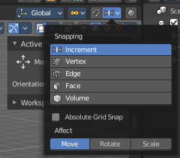
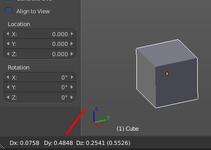
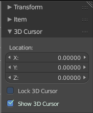
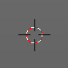

*******************
7 Editors - 3D View
*******************

.. contents:: Contents

3D View editor
==============

The 3D View editor is the editor where you edit your 3D data. Here you can display and modify all the scene data like meshes, curves, metalballs, etc. 

It has by default a grid in the middle. And you can navigate around in this view. 

The single parts will be explained in own chapters. In this chapter you will find general informations that doesn't fit elsewhere.

The 3D View has several areas.

.. image:: graphics/7_Editors_-_3D_View/10000201000004000000030019FC93C9EC96020D.png

At the top is the Tool Settings. Marked with blue. Here you can find settings for the currently active tool.

Below the tool settings is the Header. Marked with pink. It contains menus, tools and settings.

In the middle is the actual viewport. Here you see and modify for example your mesh data.

At the left you can find the Tool Shelf. Marked with green. It contains all the tools.

The yellow area is the navigate widgets. 

At the right of it you can find the Sidebar. Marked with blue again. It contains settings and transform values. And it is the place where addons adds its panels.

At the bottom left you can find the Adjust Last Operation panel. Marked with red. This panel appears when you do an operation, like move the mesh to another location, and allows you to adjust the values for the operation afterwards.

Viewport Navigation
===================

Navigation in the viewport happens by mouse or hotkeys. Some of them does not have a menu entry. And needs to be explained here.

For the rest of the available navigation functionality have a look into the Navi menu in the header.

Viewport navigation
-------------------

Right mouse button rotates the view.

Middle mouse button pans the view.

Holding ctrl + middle mouse button zooms the view.

Scroll Wheel zooms the view.

Holding down ALT and middle mouse button snaps the view to the next available orthographic view. Front, Left, etc. . When you continue dragging then you continue to the next orthographic view.

Numpad \* resets the 3D view.

Object navigation
-----------------

Hotkey W moves the selected object/s

Hotkey E rotates the selected object/s

Hotkey R scales the selected object/s

Trackball Navigation
--------------------

Pressing the hotkey for object rotation once (by default the E key in the Bforartists keymap) will rotate the object around the screen axis. Pressing the hotkey for rotation twice will activate trackball rotation. Now you can rotate the object freely around all three axis.

Calling Context Menus under the mouse
=====================================

Not every functionality has a menu entry. Some is hotkey only.

One of it is calling the so called context menu. You will find it in several places in the UI. Normally it's a simple right click. Right click is occupied by the navigation in Bforartists. So in the viewport we use double right click to reveal it.

It is not recommend to work with this menu. It is one gigantic double menu entry, and not contextual. It just adds noise!

Add to selection with Shift
===========================

When you want to parent two objects together, then you need to select them. You can do this with border select for example. Or you select the first object, hold down shift, then the second object. The first object selected will be the child object then when you parent them together.

Constraining the scaling axis (axis locking)
============================================

This method just works with the old transform hotkeys. Not with the transform tools in the tool shelf!

Scaling can be constrained to a particular axis or axes through the use of **Axis Locking**. To constrain scaling, the following shortcuts can be used:

- Scale Hotkey, X: Scale only along the **X Axis**
- Scale Hotkey, Y: Scale only along the **Y Axis**
- Scale Hotkey, Z: Scale only along the **Z Axis**

Axis locking can also be enabled by pressing the MMB after enabling scaling and moving the mouse in the desired direction e.g.

- Scale Hotkey, move the mouse along the X axis, MMB: Scale only along the **X Axis**
- 

Snapping with Increment snap
============================

Holding Ctrl during a transform operation (such as grab, rotate or scale) will temporary activate Transform Snapping. When the Snap Element is set to **Increment**, this allows the transformation to be performed in fixed steps.

Fine tuning Transform
=====================

This method just works with the old transform hotkeys. Not with the transform tools in the tool shelf!

Holding Shift during a transform operation will transform the object at 1/10th the speed, allowing much finer control over the snapping.

The magnitude of the transformation can be viewed in the 3D window header in the bottom left hand corner. Releasing Ctrl or Shift during the transformation will cause the movement to revert back to its normal mode of operation.

This fine tune transform operation works with both, the transform hotkeys and the 3D widget.

.. Tip:: Combining with other controls

Rotation transformations
------------------------

Holding Ctrl will cause rotations of 5 degrees.Holding Ctrl-Shift will cause rotations of 1 degree.

Scale transformations
---------------------

Holding Ctrl will cause size changes in increments of 0.1 BU.Hold Shift down while scaling to scale the selected element in very fine increments. Hold Shift-Ctrl down while scaling to scale the selected element in 0.01 BU increments. 

.. Tip:: Orientation dependent scaling

.. Note:: Snapping modes

Numeric input for Transform
===========================

Using the mouse for transformations is convenient. But if you require more precise control, then you can also enter numeric values. After pressing one of the navigation hotkeys, type a number to indicate the magnitude of the transformation.

You can see the numbers you enter in the bottom left hand corner of the 3D window header. Negative numbers and decimals can be entered by pressing the minus (Minus) and period (.) keys respectively.

The process is the same for translation, rotation and scale. Press the corresponding navigation hotkey, the header will show the values, then type in the values that you need. And finally left click or press enter to confirm. A right click abandons the operation.

For translation you have to define the axis in which you want to translate. So when you want to translate your object in X axis to 10, then press the translation hotkey, then type in X 10. And the object will arrive at X position 10. Keep in mind that pressing the navigation hotkey twice will work in local orientation.

3D Cursor
=========

The 3D Cursor is simply a point in 3D space which can be used for a number of purposes. It is often in the way. You can hide it in the properties sidebar in the 3D Cursor panel at the right.

Placement
---------

There are various methods to place this 3D cursor, including some snapping methods.

The free placement method with a hotkey is with Alt + RMB with the default Bforartists keymap.

