******************
71 Render - Camera
******************

.. contents:: Contents

Camera
======

A **Camera** is an object that provides a means of rendering images from Bforartists. It defines which portions of a scene is visible in the rendered image. By default a scene contains one camera. However, A scene can contain more than one camera, but only one of them will be used at a time. So you will only need to add a new camera if you are making cuts between them. See **Animating Cameras**.

Changing the Active Camera
--------------------------

Reference
=========

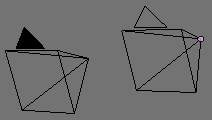

Active camera (left one).

The **active** camera is the camera that is currently being used for rendering and camera view (Numpad0).

Select the camera you would like to make active and press Ctrl-Numpad0 (by doing so, you also switch the view to camera view). In order to render, each scene **must** have an active camera.

The active camera can also be set in the **Scene** context of the **Properties Editor**

The camera with the solid triangle on top is the active camera.

.. list-table::

	* - Warning

	* - The active camera, as well as the layers, can be specific to a given view, or global (locked) to the whole scene - see **Local Camera**.

Camera Settings
---------------

Reference
=========

Cameras are invisible in renders, so they don’t have any material or texture settings. However, they do have **Object** and **Editing** setting panels available which are displayed when a camera is the selected (active!) object.

Lens
----

The camera lens options control the way 3D objects are represented in a 2D image. See **Camera Lens** for details.

Camera
------

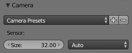

Camera Presets panel.

Sensor size 

This setting is an alternative way to control the focal-length, it’s useful to match the camera in Bforartists to a physical camera & lens combination, e.g. for **motion tracking**. 

Depth of Field
--------------

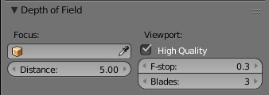

Camera Depth of Field Panel

Real world cameras transmit light through a lens that bends and focuses it onto the sensor. Because of this, objects that are a certain distance away are in focus, but objects in front and behind that are blurred.

The area in focus is called the **focal point** and can be set using either an exact value, or by using the distance between the camera and a chosen object:

Focus Object 

Choose an object which will determine the focal point. Linking an object will deactivate the distance parameter. Typically this is used to give precise control over the position of the focal point, and also allows it to be animated or constrained to another object. 

Distance 

	Sets the distance to the focal point when no **Focus Object** is specified. If **Limits** are enabled, a yellow cross is shown on the camera line of sight at this distance.

.. Hint:: Hover the mouse over the ``Distance`` property and press ``E`` to use a special ``Depth Picker``. Then click on a point in the 3D View to sample the distance from that point to the camera.

High Quality 

In order for the viewport to offer an accurate representation of depth of field, like a render, you must enable High Quality. Without it, you may notice a difference in shading. 

Viewport F-stop 

Controls the real-time focal blur effect used during sequencer or OpenGL rendering and, when enabled, camera views in the 3D viewport. The amount of blur depends on this setting, along with Focal Length and Sensor Size. Smaller Viewport F-stop values result in more blur. 

Blades 

Add a number of polygonal **blades** to the blur effect, in order to achieve a a **bokeh effect** in the viewport. To enable this feature, the blades must be set to at least 3 (3 sides, triangle) 

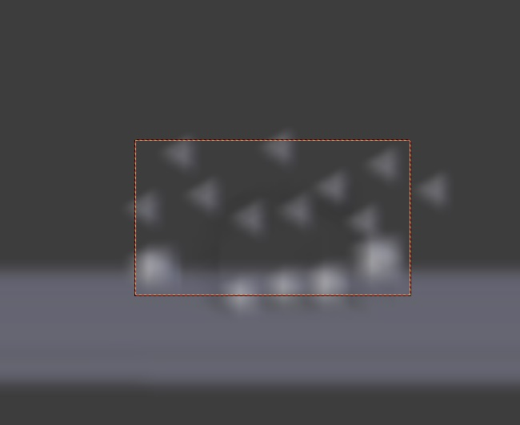

The viewport bokeh effect with the blades set to 3

Display
-------

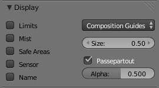

Camera Display panel

Limits 

Shows a line which indicates **Start** and **End Clipping** values. 

Mist 

Toggles viewing of the mist limits on and off. The limits are shown as two connected white dots on the camera line of sight. The mist limits and other options are set in the **World** panel, in the **Mist section**. 

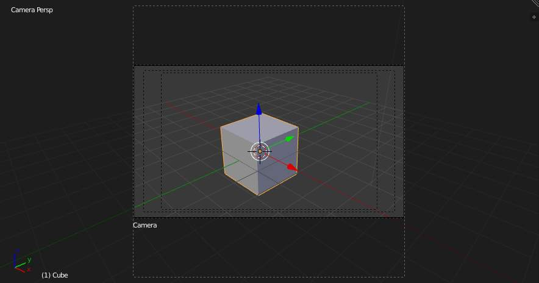

Camera view displaying safe areas, sensor and name

Sensor 

Displays a dotted frame in camera view. 

Name 

Toggle name display on and off in camera view. 

Size 

Size of the camera icon in the 3D view. This setting has no effect on the render output of a camera, and is only a cosmetic setting. The camera icon can also be scaled using the standard Scale S transform key. 

Passepartout, Alpha 

This mode darkens the area outside of the camera’s field of view, based on the **Alpha** setting. 

Composition Guides
------------------

**Composition Guides** are available from the drop-down menu, which can help when framing a shot. There are 8 types of guides available:

Center 

Adds lines dividing the frame in half vertically and horizontally. 

Center Diagonal 

Adds lines connecting opposite corners. 

Thirds 

Adds lines dividing the frame in thirds vertically and horizontally. 

Golden 

Divides the width and height into Golden proportions (About 0.618 of the size from all sides of the frame). 

Golden Triangle A 

Draws a diagonal line from the lower-left to upper-right corners, then adds perpendicular lines that pass through the top left and bottom right corners. 

Golden Triangle B 

Same as A, but with the opposite corners. 

Harmonious Triangle A 

Draws a diagonal line from the lower-left to upper-right corners, then lines from the top left and bottom right corners to 0.618 the lengths of the opposite side. 

Harmonious Triangle B 

Same as A, but with the opposite corners. 

Safe Areas
----------

When this is enabled, extra dotted frames are drawn when in camera view, delimiting the area considered as “safe” for important elements. **More information about them in the safe areas section**.

Render Border
-------------

Reference
=========

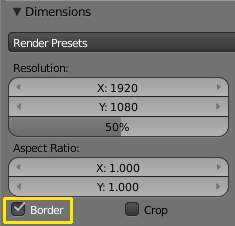

Render Border toggle

While in camera view, you can define a subregion to render by drawing out a rectangle within the cameras frame. Your renders will now be limited to the part of scene visible within the render border. This can be very useful for reducing render times for quick previews on an area of interest.

The border can be disabled by disabling the **Border** option in the **Dimensions** panel of the **Render** context or by activating the option again and selecting **Render Border** larger than the camera view.

.. Note:: Anti-Aliasing and blur options with borders

Render border and associated render.

Camera Lens
===========

Camera Lens panel.

The camera lens options control the way 3D objects are represented in a 2D image.

Lens Types
----------

There are three different lens types:

- Perspective 
- Orthographic 
- Panoramic 

Perspective
-----------

This matches how you view things in the real-world. Objects in the distance will appear smaller than objects in the foreground, and parallel lines (such as the rails on a railroad) will appear to converge as they get farther away.

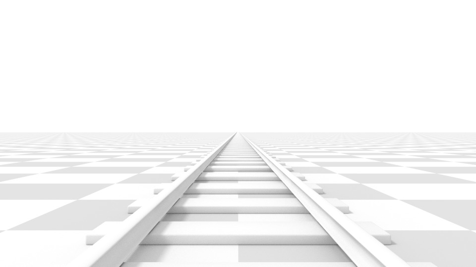

Render of a train track scene with a **Perspective** camera.

Settings which adjust this projection include:

- Focal length 
- Shift 
- Sensor size 

Focal length 

	The focal length setting controls the amount of zoom, i.e. the amount of the scene which is visible all at once. Longer focal lengths result in a smaller FOV (more zoom), while short focal lengths allow you to see more of the scene at once (larger FOV, less zoom).

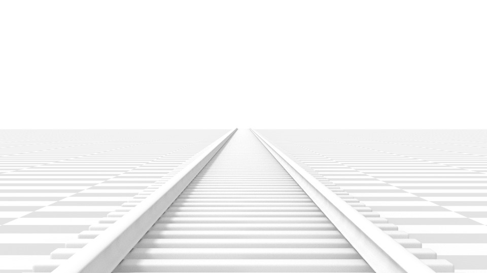

	Render of the same scene as above, but with a focal length of 210mm instead of 35mm.

Lens Unit 

The focal length can be set either in terms of millimeters or the actual Field of View as an angle. 

Orthographic
------------

With **Orthographic** perspective objects always appear at their actual size, regardless of distance. This means that parallel lines appear parallel, and do not converge like they do with **Perspective**.

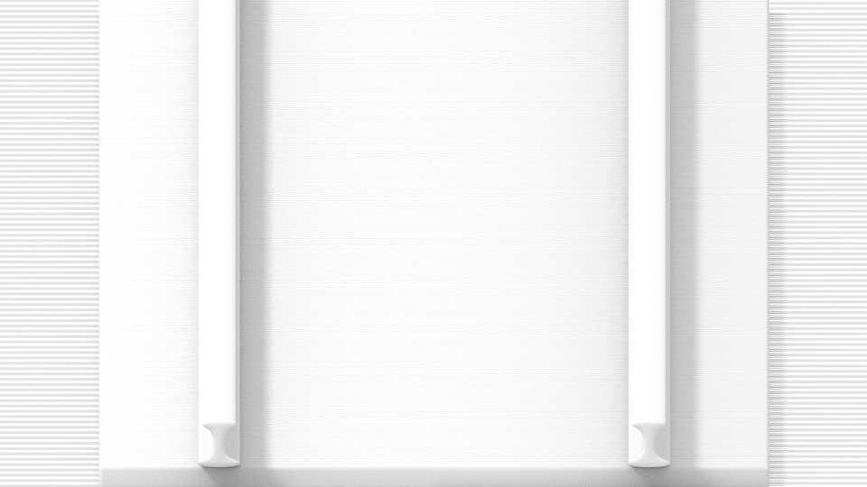

Render from the same camera angle as the previous examples, but with orthographic perspective.

Orthographic Scale 

	This controls the apparent size of objects in the camera.

	Note that this is effectively the only setting which applies to orthographic perspective. Since parallel lines do not converge in orthographic mode (no vanishing points), the lens shift settings are equivalent to translating the camera in the 3D view.

Panoramic
---------

Panoramic cameras are only supported in the Cycles render engine. See the Cycles documentation.

Shift
-----

The **Shift** setting allows for the adjustment of **vanishing points**. **Vanishing points** refer to the positions to which parallel lines converge. In this example, the most obvious vanishing point is at the end of the railroad.

To see how this works, take the following examples:

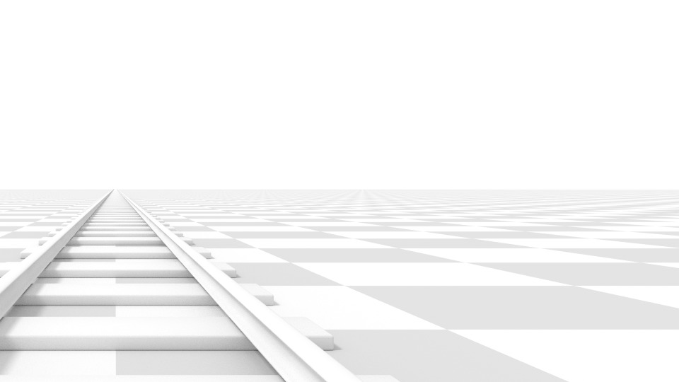

Render of a train track scene with a horizontal lens shift of 0.330.

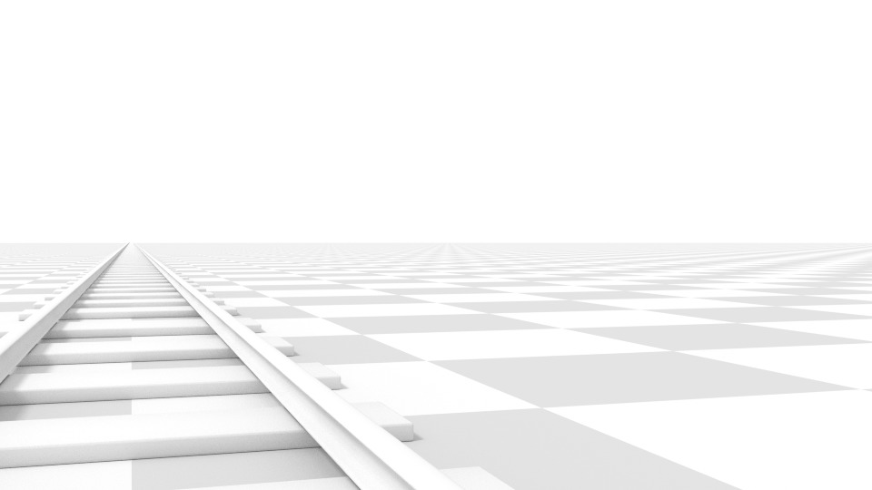

Render of a train track scene with a rotation of the camera object instead of a lens shift.

Notice how the horizontal lines remain perfectly horizontal when using the lens shift, but do get skewed when rotating the camera object.

Using lens shift is equivalent to rendering an image with a larger FOV and cropping it off-center.

Clipping
--------

Set the clipping limits with the **Start** and **End** values.

Only objects within the limits are rendered.

For OpenGL display, setting clipping distances to limited values is important to ensure sufficient rasterization precision. Ray tracing renders don’t suffer from this issue so much, and as such more extreme values can safely be set.

When **Limits** in the **Display** panel is enabled, the clip bounds will be visible as two yellow connected dots on the camera line of sight.

.. Note:: The ``3D View`` window contains settings similar to the camera, see the ``3D view options page`` for more details.

Safe Areas
==========

Safe areas are guides used to position elements to ensure that the most important parts of the content can be seen across all screens.

Different screens have varying amounts of overscan. (specially older TV sets). That means that not all content will be visible to all viewers, since parts of the image surrounding the edges are not shown. To work around this problem TV producers defined two areas where content is guaranteed to be shown: action safe and title safe.

Modern LCD/plasma screens with purely digital signals have no overscan, yet safe areas are still considered best practice and may be legally required for broadcast.

In Bforartists, safe areas can be set from the Camera and Sequencer views.

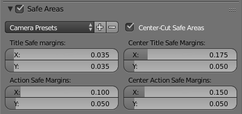

The Safe areas panel found in the camera properties, and the view mode of the sequencer.

Main Safe Areas
---------------

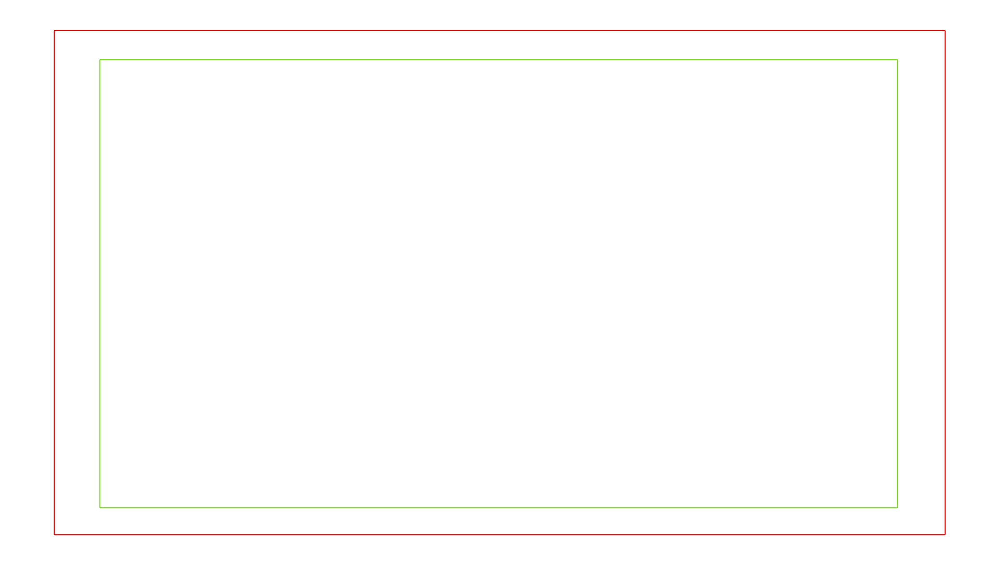

**Red line:** Action safe. **Green line:** Title safe

Title Safe 

Also known as **Graphics Safe**. Place all important information (graphics or text) inside this area to ensure it can be seen by the majority of viewers. 

Action Safe 

Make sure any significant action or characters in the shot are inside this area. This zone also doubles as a sort of “margin” for the screen which can be used to keep elements from piling up against the edges. 

.. Tip:: Legal Standards

Center-Cuts
-----------

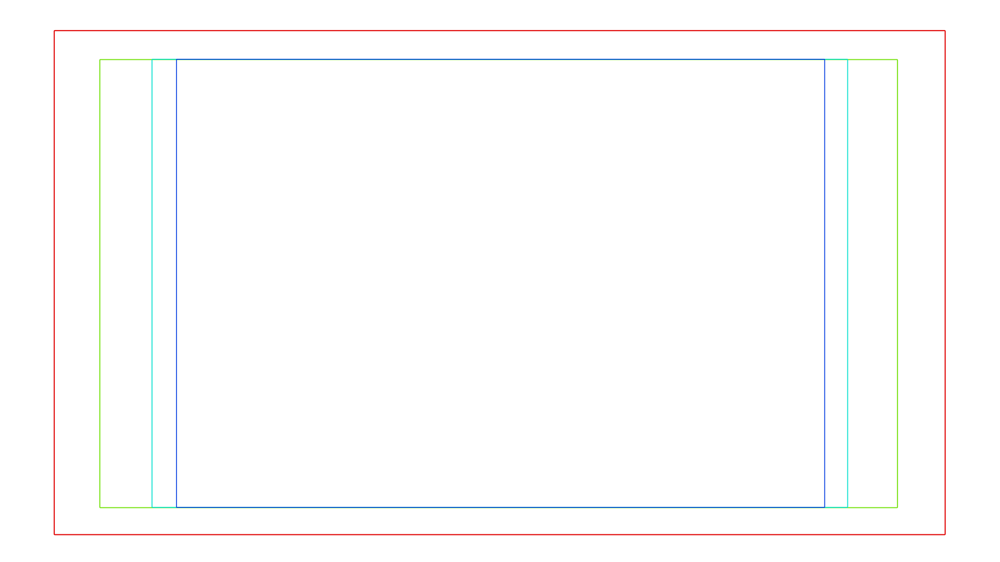

**Cyan line:** action center safe. **Blue line:** title center safe

Center-cuts are a second set of safe areas to ensure content is seen correctly on screens with a different aspect ratio. Old TV sets receiving 16:9 or 21:9 video will cut off the sides. Position content inside the center-cut areas to make sure the most important elements of your composition can still be visible in these screens.

Bforartists defaults show a 4:3 (square) ratio inside 16:9 (wide-screen).

