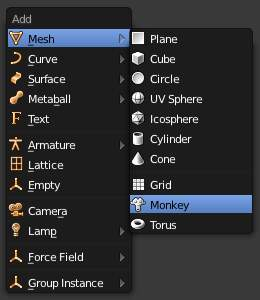

********************
42 Modeling - Curves
********************

.. contents:: Contents

Curves
======

Bird logo made from Bezier curves.

Curves and **Surfaces** are particular types of Bforartists Objects. They are expressed by mathematical functions rather than a series of points.

Bforartists offers both Bezier Curves and Non-Uniform Rational B-Splines (NURBS). Both Bezier curves and NURBS curves and surfaces are defined in terms of a set of “control points” (or “control vertices”) which define a “control polygon”.

Both bezier and NURBs curves are named after their mathematical definitions, and choosing between them is often more a matter of how they are computed behind the scenes than how they appear from a modeler’s perspective. Bezier curves are generally more intuitive because they start and end at the control points that you set, but NURBs curves are more efficient for the computer to calculate when there are many twists and turns in a curve.

The main advantage to using curves instead of polygonal meshes is that curves are defined by less data and so can produce results using less memory and storage space at modeling time. However, this procedural approach to surfaces can increase demands at render time.

Certain modeling techniques, such as **extruding a profile along a path**, are possible only using curves. On the other hand, when using curves, vertex-level control is more difficult and if fine control is necessary, **mesh editing** may be a better modeling option.

Bezier curves are the most commonly used curves for designing letters or logos. They are also widely used in animation, both as **paths** for objects to move along and as **F-curves** to change the properties of objects as a function of time.

Curve Primitives
----------------

Add Curve menu.

In Object mode, the **Add Curve** menu, Bforartists provides five different curve primitives:

Bezier Curve 

Adds an open 2D Bezier curve with two control points. 

Bezier Circle 

Adds a closed, circle-shaped 2D Bezier curve (made of four control points). 

NURBS Curve 

Adds an open 2D NURBS curve, with four control points, with **Uniform** knots. 

NURBS Circle 

Adds a closed, circle-shaped 2D NURBS curve (made of eight control points). 

Path 

Adds a NURBS open 3D curve made of five aligned control points, with **Endpoint** knots and the **CurvePath** setting enabled. 

Bezier Curves
-------------

The main elements used in editing Bezier Curves are the Control Points and Handles. A Segment (the actual Curve) is found between two Control Points. In the image below, the Control Points can be found in the middle of the pink line while the Handles comprise the extensions from the Control Point. By default the arrows on the Segment represents the direction and **relative** speed and direction of movement Objects will have when moving along the curve. This can be altered by defining a custom **Speed** Ipo.

.. image:: graphics/7.xx_Editors_-_Modeling_-_Curves/1000000000000237000000AE93827B4ECE070AE9.png

Bezier Curve in Edit mode.

Editing Bezier Curves
---------------------

A Bezier curve can be edited by moving the locations of the Control Points and Handles.

- Add a Curve by Shift-A to bring up the **Add** menu, followed by Curve > Bezier. 
- Press Tab to enter **Edit mode**. 
- Select one of the Control Points and move it around. Use LMB to confirm the new location of the Control Point, or use RMB to cancel. 
- Now select one of the Handles and move it around. Notice how this changes the curvature of the curve. 

To add more Control Points

- Select at least two adjacent Control Points. 
- Press W and select **Subdivide**. 
- Optionally, you can press F6 immediately after the subdivision to modify the number of subdivisions. 

Note that while in **Edit mode** you cannot directly select a Segment. To do so, select all of the Control Points that make up the Segment you want to move.

There are four Bezier curve handle types. They can be accessed by pressing V and selecting from the list that appears, or by pressing the appropriate hotkey combination. Handles can be rotated, moved, scaled and shrunk/fattened like any vertex in a mesh.

Bezier Curve Handle Types
-------------------------

Automatic V-A

	This handle has a completely automatic length and direction which is set by Bforartists to ensure the smoothest result. These handles convert to **Aligned** handles when moved.

Vector V-V

	Both parts of a handle always point to the previous handle or the next handle which allows you to create curves or sections thereof made of straight lines or with sharp corners. Vector handles convert to **Free** handles when moved.

Aligned V-L

	These handles always lie in a straight line, and give a continuous curve without sharp angles.

Free V-F

	The handles are independent of each other.

Additionally, the V-T shortcut can be used to toggle between Free and Aligned handle types.

Curve Properties
----------------

Curve Properties can be set from the **Object Data** option in the **Properties Header** (shown below in blue).

Shape
-----

.. image:: graphics/7.xx_Editors_-_Modeling_-_Curves/10000000000001D3000000C22C2DB968E49B36E5.png

Curves Shape panel.

2D and 3D Curves 

By default, new curves are set to be 3D, which means that Control Points can be placed anywhere in 3D space. Curves can also be set to 2D which constrain the Control Points to the Curve’s local XY axis. 

Resolution 

The **resolution** property defines the number of points that are computed between every pair of Control Points. Curves can be made more or less smooth by increasing and decreasing the resolution respectively. The **Preview U** setting determines the resolution in the 3D viewport while the **Render U** setting determines the Curve’s render resolution. If **Render U** is set to zero (0), then the **Preview U** setting is used for both the 3D viewport and render resolution. 

Curves with a resolution of 3 (left) and 12 (right).

Twisting 

A 3D Curve has Control Points that are not located on the Curve’s local XY plane. This gives the Curve a twist which can affect the Curve normals. You can alter how the twist of the Curve is calculated by choosing from **Minimum, Tangent** and **Z-Up** options from the drop-down menu. 

Curves with a twist of minimum (left) and tangent (right).

Fill 

Fill determines the way a Curve is displayed when it is Beveled (see below for details on Beveling). When set to **Half** (the default) the Curve is displayed as half a cylinder. The **Fill Deformed** option allows you to indicate whether the Curve should be filled before or after (default) applying any Shape Keys or Modifiers. 

Curves with a fill of half (left) and full (right).

Path/Curve-Deform 

These options are primarily utilized when using a Curve as a Path or when using the Curve Deform property. The **Radius, Stretch** and **Bounds Clamp** options control how Objects use the Curve and are dealt with in more detail in the appropriate links below. 

See also

- **Basic Curve Editing**
- **Animation Paths**

Geometry
--------

Curves Geometry panel.

Modification 

	Offset 

	By default, text Objects are treated as curves. The Offset option will alter the space between letters. 

	Extrude 

	Will extrude the curve along both the positive and negative local Z axes. 

Bevel 

	Depth 

	Changes the size of the bevel 

A Curve with different Bevel depths applied.

Resolution 

Alters the smoothness of the bevel 

A Curve with different resolutions applied.

Taper Object 

Tapering a Curve causes it to get thinner towards one end. You can also alter the proportions of the Taper throughout the tapered object by moving/scaling/rotating the Control Points of the Taper Object. The Taper Object can only be another Curve. Editing the Handles and Control Points of the Taper Object will cause the original Object to change shape. 

A Curve before (left) and after (right) a Bezier Curve Taper Object was applied.

Bevel Object 

Beveling a Bezier Curve with a Bezier Curve as the Bevel Object generally gives it the appearance of a plane, while using a Bezier Circle as the Bevel Object will give it the appearance of a cylinder. The Bevel Object can only be another Curve. Editing the Handles and Control Points of the Bevel Object will cause the original Object to change shape. Given the options available, it is best to experiment and see the results of this operation. 

A Curve with the Bevel Object as a Bezier Curve (left) and as a Bezier Circle (right).

Fill Caps 

Seals the ends of a beveled Curve. 

Map Taper 

For Curves using a Taper Object and with modifications to the **Start/End Bevel Factor** the **Map Taper** option will apply the taper to the beveled part of the Curve (not the whole Curve). 

A Curve without (left) and with (right) Map Taper applied.

Start Bevel Factor and End Bevel Factor 

These options determine where to start the Bevel operation on the Curve being beveled. Increasing the **Start Bevel Factor** to 0.5 will start beveling the Curve 50% of the distance from the start of the Curve (in effect shortening the Curve). Decreasing the **End Bevel Factor** by 0.25 will start beveling the Curve 25% of the distance from the end of the Curve (again, shortening the Curve). 

A Curve with no Bevel factor applied (left), with a 50% Start Bevel Factor (middle) and with a 25% End Bevel Factor (right).

Path Animation
--------------

The Path Animation settings can be used to determine how Objects move along a certain path. See the link below for further information.

**Read more about utilizing Curves for paths during animation**

Active Spline
-------------

Curves Active Spline panel.

The **Active Spline** panel becomes available during **Edit mode**.

Cyclic 

Closes the Curve. 

Resolution 

Alters the smoothness of each segment by changing the number of subdivisions. 

Interpolation 

	Tilt 

	Alters how the tilt of a segment is calculated. 

	Radius 

	Alters how the radius of a Beveled Curve is calculated. The effects are easier to see after Shrinking/Fattening a control point Alt-S. 

	Smooth 

	Smooths the normals of the Curve 

Non-Uniform Rational B-Splines (NURBS)
--------------------------------------

One of the major differences between Bezier Objects and NURBS Objects is that Bezier Curves are approximations. For example, a Bezier circle is an **approximation** of a circle, whereas a NURBS circle is an **exact** circle. NURBS theory can be a **very** complicated topic. For an introduction, please consult the Wikipedia page. In practice, many of the Bezier curve operations discussed above apply to NURBS curves in the same manner. The following text will concentrate only on those aspects that are unique to NURBS curves.

Editing NURBS Curves
--------------------

A NURBS Curve is edited by moving the location of the Control Points.

- Place a Curve by Shift-A to bring up the Add menu, followed by Curve > NURBS curve. 
- Press Tab to enter **Edit mode**. 
- Select one of the Control Points and move it around. Use LMB to confirm the new location of the Control Point, or use RMB to cancel. 
- If you want to add additional Control Points, select both of them, press W and select **Subdivide**. Press F6 immediately after to determine how many subdivisions to make. 

Active Spline
-------------

NURBS Active Spline panel.

Knots 

	One of the characteristics of a NURBS object is the **knot vector**. This is a sequence of numbers used to determine the influence of the control points on the curve. While you cannot edit the knot vectors directly, you can influence them through the **Endpoint** and **Bezier** options in the Active Spline panel. Note that the **Endpoint** and **Bezier** settings only apply to open NURBS curves.

	Cyclic 

	Makes the NURBS curve cyclic. 

	A NURBS curve with Cyclic applied.

	Bezier 

	Makes the NURBS curve act like a Bezier curve. 

	Endpoint 

	Makes the curve contact the end control points. Cyclic must be disabled for this option to work. 

	A NURBS curve with Endpoint enabled.

Order 

The order of the NURBS curve determines the area of influence of the control points over the curve. Higher order values means that a single control point has a greater influence over a greater relative proportion of the curve. The valid range of **Order** values is 2-6 depending on the number of control points present in the curve. 

NURBS curves with orders of 2 (left), 4 (middle) and 6 (right).

Weight 

	TODO. 

Path
----

As mentioned above, Curves are often used as **paths**. Any curve can be used as a Path if the **Path Animation** option is selected.

The Path option available from the **Add Curve** menu is identical to a 3D NURBS curve, except that you do not have access to the **Active Spline** panel.

Curve Selection
===============

Curve selection in **Edit** mode is much less complex than with meshes! Mainly this is because you have only one selectable element type, the control points (no select mode needed here...). These points are a bit more complex than simple vertices, however, especially for Béziers, as there is the central vertex, and its two handles...

The basic tools are the same as with **meshes**, so you can select a simple control point with a LMB -click, add to current selection with Shift-LMB -clicks, B order-select, and so on.

One word about the Bézier control points: when you select the main central vertex, the two handles are automatically selected too, so you can grab it as a whole, without creating an angle in the curve. However, when you select a handle, only this vertex is selected, allowing you to modify this control vector...

L (or Ctrl-L) will add to the selection the cursor’s nearest control point, and all the linked ones, i.e. all points belonging to the same curve. Note that for Bézier, using L with a handle selected will select the whole control point and all the linked ones.

Select Menu
-----------

With curves, all “advanced” selection options are regrouped in the **Select** menu of the 3D views header. Let’s detail them.

**Random...****Inverse****Select/Deselect All**

Border Select 

All these options have the same meaning and behavior as in **Object mode** (and the specifics of **Border Select** in **Edit** mode have already been discussed **here**). 

Every Nth
---------

Reference
=========

This only works if you already have at least one control point selected. Using the current selection, it will add to it every nth control point, before and after the initial selection. The “selection step” is specified in the **N** pop-up numeric field shown during the tool start.

Select/Deselect First/Last
--------------------------

Reference
=========

These commands will toggle the selection of the first or last control point(s) of the curve(s) in the object. This is useful to quickly find the start of a curve (e.g. when using it as path...).

Select Next/Previous
--------------------

Reference
=========

These commands will select the next or previous control point(s), based on the current selection (i.e. the control points following or preceding the selected ones along the curve).

Select More / Less
------------------

Reference
=========

Their purpose, based on the currently selected control points, is to reduce or enlarge this selection.

More 

for each selected control point, select **all** its linked points (i.e. one or two...). 

Less 

for each selected control point, if **all** points linked to this point are selected, keep this one selected. Otherwise, de-select it. 

This implies two points:

- First, when **all** control points of a curve are selected, nothing will happen (as for **Less**, all linked points are always selected, and of course, **More** can’t add any). Conversely, the same goes when no control points are selected. 
- Second, these tools will never “go outside” of a curve (they will never “jump” to another curve in the same object). 

Curve Editing
=============

This page covers the basics of curve editing. Curve basics, selecting and advanced editing are covered in the following pages:

- **Curve basics**
- **Curve Selecting**

Curve Display
-------------

Display Options
---------------

Curve Display panel

When in Edit mode, the Properties Shelf (N) contains options in the **Curve Display** panel for how curves are displayed in the 3D viewport.

Handles 

Toggles the display of Bezier handles while in edit mode. This does not affect the appearance of the curve itself. 

Normals 

Toggles the display of Curve Normals. 

Normal Size 

Sets the display scale of curve normals. 

Hiding Elements
---------------

When in **Edit** mode, you can hide and reveal elements from the display. This can be useful in complex models with many elements on the Screen.

Hide Selected elements 

Use H, or the Curve > Show/Hide > Hide Selected menu option from the 3D window header. 

Show Hidden elements 

Use Alt-H, or the Curve > Show/Hide > Show Hidden menu option from the 3D window header. 

Hide Unselected elements 

Use Shift-H, or the Curve > Show/Hide > Hide Unselected menu option from the 3D window header. 

Basic Curve Editing (translation, rotation, scale)
--------------------------------------------------

Reference
=========

Like other elements in Bforartists, Curve control points can be grabbed/moved (G), rotated (R) or scaled (S) as described in the **Basic Transformations** section. When in **Edit** mode, **proportional editing** is also available for transformation actions.

Snapping
--------

Reference
=========

**Mesh snapping** also works with curve components. Both control points and their handles will be affected by snapping, except for within itself (other components of the active curve). Snapping works with 2D curves but points will be constrained to the local XY axes.

Deforming Tools
---------------

Reference
=========

The **To Sphere**, **Shear**, **Wrap** and **Push/Pull** transform tools are described in the **Transformations** sections. The two other tools, **Tilt** and **Shrink/Fatten Radius** are related to **Curve Extrusion**.

Smoothing
---------

Reference
=========

Curve smoothing is available through the specials menu. For Bézier curves, this smoothing operation currently only smooths the positions of control points and not their tangents. End points are also constrained when smoothing.

Mirror
------

Reference
=========

The **Mirror** tool is also available, behaving exactly as with **mesh vertices**,

Set Bézier Handle Type
----------------------

Reference
=========

Handle types are a property of **Bézier curves.** and can be used to alter features of the curve. For example, switching to **Vector handles** can be used to create curves with sharp corners. Read the **Bézier curves** page for more details.

Extending Curves
----------------

Reference
=========

Once a curve is created you can add new segments (in fact, new control points defining new segments), either by extruding, or placing new handles with Ctrl-LMB clicks. Each new segment is added to one end of the curve. A new segment will only be added if a single vertex, or handle, at one end of the curve is selected. If two or more control points are selected, a new Bézier closed curve is started.

Subdivision
-----------

Reference
=========

Curve subdivision simply subdivides all selected segments by adding one or more control points between the selected segments. To control the number of cuts, press W to make a single subdivision. Then press F6 to bring up the **Number of Cuts** menu.

Duplication
-----------

Reference
=========

This command duplicates the selected control points, along with the curve segments implicitly selected (if any). The copy is selected and placed in **Grab** mode, so you can move it to another place.

Joining Curve Segments
----------------------

Reference
=========

Two open curves can be combined into one by creating a segment between the two curves. To join two separated curves, select one end control point from each curve then press F. The two curves are joined by a segment to become a single curve.

Curves before and after joining

Additionally, you can close a curve by joining the endpoints but note that you can only join curves of the same type (i.e. Bézier with Bézier, NURBS with NURBS)

Separating Curves
-----------------

Reference
=========

Curve objects that are made of multiple distinct curves can be separated into their own objects by selecting the desired segments and pressing P. Note, if there is only one curve in a Curve object, pressing P will create a new Curve object with no control points.

Deleting Elements
-----------------

Reference
=========

The **Erase** pop-up menu of curves offers you three options:

Selected 

This will delete the selected control points, **without** breaking the curve (i.e. the adjacent points will be directly linked, joined, once the intermediary ones are deleted). Remember that NURBS order cannot be higher than its number of control points, so it might decrease when you delete some control point. Of course, when only one point remains, there is no more visible curve, and when all points are deleted, the curve itself is deleted. 

Segment 

This option is somewhat the opposite to the preceding one, as it will cut the curve, without removing any control points, by erasing one selected segment. This option always removes **only one segment** (the last “selected” one), even when several are in the selection. So to delete all segments in your selection, you’ll have to repetitively use the same erase option... 

All 

As with meshes, this deletes everything in the object! 

.. list-table::

	* - 	  - 

Opening and Closing a Curve
---------------------------

Reference
=========

This toggles between an open curve and closed curve (Cyclic). Only curves with at least one selected control point will be closed/open. The shape of the closing segment is based on the start and end handles for Bézier curves, and as usual on adjacent control points for NURBS. The only time a handle is adjusted after closing is if the handle is an **Auto** one. (**Open curve**) and (**Closed curve**) is the same Bézier curve open and closed.

This action only works on the original starting control-point or the last control-point added. Deleting a segment(s) doesn’t change how the action applies; it still operates only on the starting and last control-points. This means that Alt-C may actually join two curves instead of closing a single curve! Remember that when a 2D curve is closed, it creates a renderable flat face.

Open and Closed curves.

Switch Direction
----------------

Reference
=========

This command will “reverse” the direction of any curve with at least one selected element (i. e. the start point will become the end one, and **vice versa**). This is mainly useful when using a curve as path, or using the bevel and taper options.

Converting Tools
----------------

Converting Curve Type
---------------------

Reference
=========

Set Spline Type button

You can convert splines in a curve object between Bézier, NURBS, and Poly curves. Press T to bring up the Toolshelf. Clicking on the **Set Spline Type** button will allow you to select the Spline type (Poly, Bézier or NURBS).

Note, this is not a “smart” conversion, i.e. Bforartists does not try to keep the same shape, nor the same number of control points. For example, when converting a NURBS to a Bézier, each group of three NURBS control points become a unique Bézier one (center point and two handles).

Convert Curve to Mesh
---------------------

Reference
=========

There is also an “external” conversion, from curve to mesh, that only works in **Object** mode. It transforms a **Curve** object in a **Mesh** one, using the curve resolution to create edges and vertices. Note that it also keeps the faces and volumes created by closed and extruded curves.

Convert Mesh to Curve
---------------------

Reference
=========

Mesh objects that consist of a series of connected vertices can be converted into curve objects. The resulting curve will be a Poly curve type, but can be converted to have smooth segments as described above.

Curve Parenting
---------------

Reference
=========

You can make other selected objects children of one or three control points Ctrl-P, as with mesh objects.

Select either 1 or 3 control points, then Ctrl-RMB another object and use Ctrl-P to make a vertex parent.

Hooks
-----

Reference
=========

**Hooks** can be added to control one or more points with other objects.

Set Goal Weight
---------------

Reference
=========

Set Goal Weight 

This sets the “goal weight” of selected control points, which is used when a curve has Soft Body physics, forcing the curve to “stick” to their original positions, based on the weight. 

Curve Deform
============

**Curve Deform** provides a simple but efficient method of defining a deformation on a mesh. By parenting a mesh object to a curve, you can deform the mesh up or down the curve by moving the mesh along, or orthogonal to, the dominant axis. This is a most useful tool to make an object follow a complex path, like e.g. a sheet of paper inside a printer, a film inside a camera, the water of a canal...

The **Curve Deform** works on a (global) dominant axis, X, Y, or Z. This means that when you move your mesh in the dominant direction, the mesh will traverse along the curve. Moving the mesh in an orthogonal direction will move the mesh object closer or further away from the curve. The default settings in Bforartists map the Y axis to the dominant axis. When you move the object beyond the curve endings the object will continue to deform based on the direction vector of the curve endings.

If the “curve path” is **3D**, the **Tilt** value of its control points will be used (see the **Extrusion** section above) to twist the “curved” object around it. Unfortunately, the other **Radius** property is not used (it would have been possible, for example, to make it control the size of the “curved” object...).

.. Tip:: Try to position your object over the curve immediately after you have added it, before adding the curve deform. This gives the best control over how the deformation works.

.. Note:: Use modifiers!

Interface
---------

Make Parent menu.

When parenting an object (mesh, curve, meta, ...) to a curve (Ctrl-P), you will be presented with a menu (**Make Parent****menu**).

By selecting **Curve Deform**, you enable the curve deform function on the mesh object.

Anim settings panel.

The dominant axis setting is set on the mesh object. By default the dominant axis in Bforartists is **Y**. This can be changed by selecting one of the **Track X**, **Y** or **Z** buttons in the **Anim** Panel, (**Anim settings****panel**), in **Object** context.

Curve and Surface panel.

Cyclic (or closed) curves work as expected where the object deformations traverse along the path in cycles. Note however that when you have more than one curve in the “parent” object, its “children” will only follow the first one.

The **Stretch** curve option allows you to let the mesh object stretch, or squeeze, over the entire curve. This option is in **Object Data** properties, for the “parent” curve. See (**Curve and Surface****panel**).

Example
-------

Let’s make a simple example:

Add a Monkey!

- Remove default cube object from scene and add a Monkey (Add > Mesh > Monkey, **Add a Monkey!**)! 
- Press Tab to exit **Edit** mode. 

Add a Curve.

- Now add a curve (Add > Curve > Bezier Curve, **Add a Curve**). 

Edit Curve.

- While in **Edit** mode, move the control points of the curve as shown in (**Edit Curve**), then exit **Edit** mode (Tab). 

Monkey on a Curve.

- Now, you can use the new, modern, modifier way of “curving” the Monkey:
- Or you can choose the old, deprecated method (note that it creates a “virtual” modifier...):
- The Monkey should be positioned on the curve, as in (**Monkey on a Curve**). 
- Now if you select the Monkey (RMB), and move it (G), in the Y-direction (the dominant axis by default), the monkey will deform nicely along the curve. 

- - Select the Monkey (RMB). 
- - In the **Object Modifiers** properties, **Modifiers** panel, add a **Curve** modifier. 
- - Type the name of the curve (should be Curve) in the **Ob** field of the modifier, and optionally change the dominant axis to **Y**. 

- - Select the Monkey (RMB), and then shift select the curve (Shift-RMB). 
- - Press Ctrl-P to open up the **Make Parent** menu. 
- - Select **Curve Deform** (**Make Parent****menu**). 

.. Tip:: If you press ``MMB`` (or one of the ``X`` / ``Y`` / ``Z`` keys) while moving the Monkey you will constrain the movement to one axis only.

- In (**Monkey deformations**), you can see the Monkey at different positions along the curve. To get a cleaner view over the deformation I have activated **SubSurf** with **Subdiv** to **2**, and **Set Smooth** on the Monkey mesh. 

.. Tip:: Moving the Monkey in directions other than the dominant axis will create some odd deformations. Sometimes this is what you want to achieve, so you’ll need to experiment and try it out!

Monkey deformations.

Curve Extrusion
===============

This section covers methods for extruding curves, or giving them thickness, and how to control the thickness along the path.

Extrusion
---------

Reference
=========

Extrusion can be especially with the bevel/taper/Tilt/Radius options. Note that this isn’t related to **Extrude** used in mesh edit-mode.

We will see the different settings, depending on their scope of action:

Width 

	This controls the position of the extruded “border” of the curve, relative to the curve itself. With closed 2D curves (see below), it is quite simple to understand - with a **Width** greater than **1.0**, the extruded volume is wider, with a **Width** of **1.0**, the border tightly follows the curve, and with a **Width** lower than **1.0**, the volume is narrower? The same principle remains for open 2D and 3D curves, but the way the “outside” and “inside” of the curve is determined seems a bit odd?

	It has the same effect with extruded “bevel” objects...

Tilt 

This setting - unfortunately, you can never see its value anywhere in Bforartists - controls the “twisting angle” around the curve for each point - so it is only relevant with 3D curves! You set it using the **Tilt** transform tool (T, or Curve > Transform > Tilt), and you can reset it to its default value (i.e. perpendicular to the original curve plane) with Alt-T (or Curve > Control Points > Clear Tilt). With NURBS, the tilt is always smoothly interpolated. However, with Bézier, you can choose the interpolation algorithm to use in the **Tilt Interpolation** drop-down list of the **Curve Tools** panel (you will find the classical **Linear**, **Cardinal**, **B Spline** and **Ease** options...). 

Simple Extrusion
----------------

Let’s first see the “simple” extrusion of curves, without additional bevel/taper objects.

Extrude 

	This controls the width (or height) of the extrusion. The real size is of course dependent on the scale of the underlying object, but with a scale of one, an **Extrusion** of **1.0** will extrude the curve one BU in both directions, along the axis perpendicular to the curve’s plane (see below for specifics of 3D curves?).

	If set to **0.0**, there is no “simple” extrusion!

Bevel Depth 

This will add a bevel to the extrusion. See below for its effects... Note that the bevel makes the extrusion wider and higher. If set to **0.0**, there is no bevel (max value: **2.0**). 

Bev Resol 

Controls the resolution of the bevel created by a **Bevel Depth** higher than zero. If set the **0** (the default), the bevel is a simple “flat” surface. Higher values will smooth, round off the bevel, similar to the resolution settings of the curve itself... 

We have three sub-classes of results, depending on whether the curve is open or closed or 3D:

Open 2D Curve 

	The extrusion will create a “wall” or “ribbon” following the curve shape. If using a **Bevel Depth**, the wall becomes a sort of slide or gutter. Note the direction of this bevel is sometimes strange and unpredictable, often the reverse of what you would get with the same curve closed? You can inverse this direction by switching the direction of the curve.

	This allows you, e.g., to quickly simulate a marble rolling down a complex slide, by combining an extruded beveled curve, and a sphere with a **Follow Path** constraint set against this curve?

Closed 2D Curve 

	This is probably the most useful situation, as it will quickly create a volume, with (by default) two flat and parallel surfaces filling the two sides of the extruded “wall”. You can remove one or both of these faces by disabling the **Back** and/or **Front** toggle buttons next to the **3D** one.

	The optional bevel will always be “right-oriented” here, allowing you to smooth out the “edges” of the volume.

3D Curve 

	Here the fact that the curve is closed or not has no importance - you will never get a volume with an extruded 3D curve, only a wall or ribbon, like with open 2D curves.

	However, there is one more feature with 3D curves: the **Tilt** of the control points (see above). It will make the ribbon twist around the curve ? to create a M?bius strip, for example!

Advanced Extrusion
------------------

These extrusions use one or two additional curve objects, to create very complex organic shapes.

To enable this type of extrusion, you have to type a valid curve object name in the **BevOb** field of the curve you are going to use as the “spinal column” of your extrusion. The “bevel” curve will control the cross section of the extruded object. Whether the **BevOb** curve is 2D or 3D has no importance, but if it is closed, it will create a “tube-like” extrusion; otherwise you will get a sort of gutter or slide object...

The object is extruded along the whole length of all internal curves. By default, the width of the extrusion is constant, but you have two ways to control it, the **Radius** property of control points, and the “taper” object.

The **Radius** of the points is set using the **Shrink/Fatten Radius** transform tool (Alt-S, or Curve > Transform > Shrink/Fatten Radius), or with the **Set Radius** entry in the **Specials** menu (W). Here again, you unfortunately cannot visualize anywhere the **Radius** of a given control point...

The **Radius** allows you to directly control the width of the extrusion along the “spinal” curve. As for **Tilt** (see above), you can choose the interpolation algorithm used for Bézier curves, in the **Radius Interpolation** drop-down list of the **Curve Tools** panel.

But you have another, more precise option: the “taper” object. As for the “bevel” one, you set its name in the **TaperOb** field of the main curve - it must be an **open curve**. The taper curve is evaluated along **the local X axis**, using **the local Y axis** for width control. Note also that:

- The taper is applied independently to all curves of the extruded object. 
- Only the first curve in a **TaperOb** is evaluated, even if you have several separated segments. 
- The scaling starts at the first control-point on the left and moves along the curve to the last control-point on the right. 
- Negative scaling, (negative local Y on the taper curve) is possible as well. However, rendering artifacts may appear. 
- It scales the width of normal extrusions based on evaluating the taper curve, which means sharp corners on the taper curve will not be easily visible. You’ll have to heavily level up the resolution (**DefResolU**) of the base curve. 
- With closed curves, the taper curve in **TaperOb** acts along the whole curve (perimeter of the object), not just the length of the object, and varies the extrusion depth. In these cases, you want the relative height of the **TaperOb** Taper curve at both ends to be the same, so that the cyclic point (the place where the endpoint of the curve connects to the beginning) is a smooth transition. 

Last but not least, with 3D “spinal” curves, the **Tilt** of the control points can control the twisting of the extruded “bevel” along the curve!

Examples
--------

Let’s taper a simple curve circle extruded object using a taper curve. Add a curve, then exit **Edit** mode. Add another one (a closed one, like a circle); call it BevelCurve, and enter its name in the **BevOb** field of the first curve (**Editing** context **Curve and Surface** panel). We now have a pipe. Add a third curve while in **Object** mode and call it TaperCurve. Adjust the left control-point by raising it up about 5 units.

Now return to the **Editing** context, and edit the first curve’s **TaperOb** field in the Curve and Surface panel to reference the new taper curve which we called **TaperCurve**. When you hit enter the taper curve is applied immediately, with the results shown in (**Taper extruded curve**).

.. list-table::

	* - 	  - 
You can see the **taper curve** being applied to the **extruded object**. Notice how the pipe’s volume shrinks to nothing as the taper curve goes from left to right. If the taper curve went below the local Y axis the pipe’s inside would become the outside, which would lead to rendering artifacts. Of course as an artist that may be what you are looking for!

Taper example 1.

In (**Taper example 1**) you can clearly see the effect the left taper curve has on the right curve object. Here the left taper curve is closer to the object center and that results in a smaller curve object to the right.

Taper example 2.

In (**Taper example 2**) a control point in the taper curve to the left is moved away from the center and that gives a wider result to the curve object on the right.

Taper example 3.

In (**Taper example 3**), we see the use of a more irregular taper curve applied to a curve circle.

TODO: add some “bevel” extrusion with **Tilt** examples.

