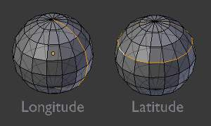
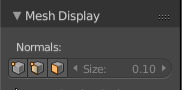
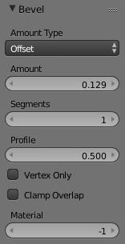

********************
41 Modeling - Meshes
********************

.. contents:: Contents

Modeling
========

The creation of a 3D scene needs at least three key components: Models, Materials and Lights. In this part, we will delve deeper into the creation of the first of these: modeling. Modeling is the art and science of creating a surface that either mimics the shape of a real-world object or expresses your imagination of abstract objects.

There are three primary types of modeling - mesh modeling, curve/surface modeling, and meta modeling.

**Mesh Modeling**

	is done within the **3D View** and typically begins with a primitive shape (e.g. circle, cube, cylinder...).

This **Mesh Primitive** is defined by an array of points in 3D space called vertices (singular form is Vertex). From there you might begin extruding faces and moving vertices to create a larger, more complex shape.

	Mesh Modeling Modes 

	The 3D View has three principal modes that allow for the creation of, editing and manipulation of the mesh models. Each of the three modes have a variety of tools. Some tools may be found in one or more of the modes.

	Modes that used for modeling:

- Object Mode 
- Edit Mode 
- Sculpt Mode 

	Creation of a mesh primitive typically starts by adding a mesh object in **Object Mode**. Limited types of editing such as size, location, and orientation can be accomplished in **Object Mode**. **Object mode** also provides the means to Join and Group multiple mesh primitives.

	More detailed editing of the mesh model shape is done in **Edit Mode**, and **Sculpt Mode**. The nature of these three modes determines the tools that are available within the various panels of the 3D View. Switching between modes while modeling is common. Some tools may be available in more than one mode while others may be unique to a particular mode.

**Curve modeling**

Uses control points to define the shape of the curve. 

**Surface modeling**

Similar to curve modeling, but instead of being limited to simple linear paths, they allow the creation of three dimensional surfaces, potentially with volume. 

**Meta Object (Metaball) Modeling**

	begins similarly to mesh modeling, with a base shape like a cube or sphere, but instead of extruding these base shapes, these objects are clumped together to form a larger object. In order to accomplish this, the metaballs have a liquid-like quality, when two or more are brought together they merge by smoothly rounding out the point of connection, appearing as one unified object.

	This can also be a quick way to get started with a rough shape which can be converted to a mesh later.

**Text Modeling** - 

	inserting text is quite common for the creation of logos, and can be seen as a special case of neither curve nor mesh modeling.

	You may define the text, font, bevel, extruded width and several other parameters that control generated object.

Scripted Modeling 

	Since Bforartists functionality is extensible via Python scripting, there are a number of very useful scripts that assist you in modeling. They may give you new mesh primitives to work with, or apply some fancy manipulation of the meshes that you are already working with.

	Modeling scripts are an advanced topic, while not essential automating some tasks can be a huge time saver in certain cases.

Meshes
======

Meshes are the polygonal objects. 

Edit Mode
=========

Entering Edit Mode
------------------

You can work with geometric objects in two modes.

**Object Mode**

Operations in **Object Mode** affect the whole object. **Object Mode** has the following header in the 3D view: 

Object Mode Header.

Edit mode 

Operations in **Edit mode** affect only the geometry of an object, but not global properties such as location or rotation. **Edit Mode** has the following header in the 3D view: 

Edit Mode Header.

Tools and modes in the 3D view header are (left to right):

- View, Select, and Mesh menus 
- Bforartists Mode 
- Display method for 3D view 
- Pivot center 
- 3D manipulator widget 
- Selection mode 
- Depth buffer clipping (hide 
- Proportional editing 
- Snap 
- OpenGL render 

You can switch between the Object and Edit modes with the Tab key. You can change to any mode by selecting the desired **Mode** in the menu in the 3d view header.

After creating an object youd may be immediately placed in **Edit mode** - depending on whether the **Switch to Edit Mode** button is toggled in the **User Preferences****Editing** tab. **Edit mode** only applies to one object at a time, the **active**, or most recently selected, object.

Visualization
-------------

One cube selected

Two cubes selected before entering Edit mode

By default, Bforartists highlights selected geometry in orange in both **Object mode** and **Edit mode**.

In **Object mode** with **Wireframe** shading enabled , objects are displayed in black when unselected and in orange when selected. If more than one object is selected, all selected object except the active object, typically the object last selected, is displayed in a darker orange color. Similarly, in **Edit mode**, unselected geometry is drawn in black while selected faces, edges, or vertices are drawn in orange. The active face is highlighted in white.

In **Edit mode**, only one mesh can be edited at the time. However, several objects can be joined into a single mesh and then separated again. If multiple objects are selected before entering **Edit mode**, all the selected objects remain highlighted in orange indicating that they are part of the active selection set.

If two vertices joined by an edge are selected in **Vertex selection mode**, the edge between them is highlighted too. Similarly, if enough vertices or edges are selected to define a face, that face is also highlighted.

Tool Shelf
----------

When entering **Edit mode**, several mesh tools become available.

Even more mesh editing tools can be enabled in the **User Preferences** ‘ **Add-ons** section.

For further information on panels see **Panels**.

Properties Shelf
----------------

.. image:: graphics/7.xx_Editors_-_Modeling_-_Meshes/100002010000009C0000021F0CBD7BFD287FBEB1.png

The Properties Shelf panel in edit mode (panel split in two parts for layout reasons)

In the **Properties Shelf**, panels directly related to mesh editing are the **Transform** panel, where numeric values can be entered, and the **Mesh Display** panel, where for example normals and numeric values for distances, angles, and areas can be turned on.

Other useful tools are found in the **Properties Editor** under the **Object** ‘s and **Object Data** ‘s **Context buttons**, including display options and **Vertex groups**.

Mesh Display
------------

Mesh Display Panel

This panel is available only in edit mode, when the object being edited is a mesh.

The Overlays section provides controls for highlighting parts of the mesh.

Edges 

Toggles the option to see the selected edges highlighted. If enabled the edges that have both vertices selected will be highlighted This only affects in vertex selection mode and when **UV Unwrapping**. 

Faces 

Defines if the selected faces will be highlighted in the **3D Viewport**. This affects all selection modes. 

Creases and Bevel Weight 

Highlights edges marked with a crease weight for the **Subdivision Surface Modifier** and/or a bevel weight for the **Bevel Modifier**, respectively. In both cases, the higher the weight, the brighter the highlight. 

Seams and Sharp 

Highlights edges marked as an UV seam for unwrapping and/or sharp edges for the **Edge Split Modifier**

Normals Section:

We can choose to show or not the normals of faces and/or vertices using the Face and Vertex tick boxes, under the Normals section. In addition, we can define the size of these with Normal Size.

The Numerics section lets us see some numerical measures of the selected elements on screen:

Edge Length 

shows the lenghts, in Bforartists units, of the selected edges. 

Face Angles and Face Area 

show the angles (in degrees) and area (in square Bforartists units) of the selected faces. 

Vertices, Edges and Faces
=========================

With meshes, everything is built from three basic structures: **Vertices**, **Edges** and **Faces**.

Vertices
--------

Vertex example

A vertex is primarily a single point or position in 3D space. It is usually invisible in rendering and in **Object mode**. Don’t mistake the center point of an object for a vertex. It looks similar, but it’s bigger and you can’t select it. (**Vertex example**) shows the center point labeled as A. B and C are vertices.

A simple way to create a new vertex is to click Ctrl-LMB in **Edit mode**. Of course, as a computer screen is two-dimensional, Bforartists can’t determine all three vertex coordinates from a single mouse click, so the new vertex is placed at the depth of the 3D cursor. Using the method described above, any vertices selected previously are automatically connected to the new ones by an edge. In the image above, the vertex labeled **C** is a new vertex added to the cube with a new edge added between in **B** and **C**.

Edges
-----

An edge always connects two vertices by a straight line. The edges are the “wires” you see when you look at a mesh in wireframe view. They are usually invisible on the rendered image. They are used to construct faces. 

Faces
-----

Faces are used to build the actual surface of the object. They are what you see when you render the mesh. If this area does not contain a face, it will simply be transparent or non-existent in the rendered image. 

A face is defined as the area between either three (triangles), four (quadrangles) or more (ngons) vertices, with an edge on every side. These are often abbreviated to **tris, quads & ngons**.

Triangles are always flat and therefore easy to calculate. On the other hand, quadrangles “deform well” and are therefore preferred for subdivision modeling.

While you could build a cube with triangular faces, it would just look more confusing in **Edit mode**.

Loops
-----

.. image:: graphics/7.xx_Editors_-_Modeling_-_Meshes/1000000000000376000001D0B6952D99D17A8508.png

Edge and Face Loops

**Edge** and **Face Loops** are sets of faces or edges that form continuous “loops” as shown in (**Edge and Face Loops**). The top row (1 - 4) shows a solid view, the bottom row (5 - 8) a wireframe view of the same loops.

Note that loops 2 and 4 do not go around the whole model. Loops stop at so called poles because there is no unique way to continue a loop from a pole. Poles are vertices that are connected to either three, five, or more edges. Accordingly, vertices connected to exactly one, two or four edges are not poles.

In the image above, loops that do not end in poles are cyclic (1 and 3). They start and end at the same vertex and divide the model into two partitions. Loops can be a quick and powerful tool to work with specific, continuous regions of a mesh and are a prerequisite for organic character animation. For a detailed description of how to work with loops in Bforartists, see: **Advanced Selection**.

Edge Loops
----------

Loops 1 and 2 in (**Edge and Face Loops**) are edge Loops. They connect vertices so that each one on the loop has exactly two neighbors that are not on the loop and placed on both sides of the loop (except the start and end vertex in case of poles).

Edge Loops are an important concept especially in organic (subsurface) modeling and character animation. When used correctly, they allow you to build models with relatively few vertices that look very natural when used as subdivision surfaces and deform very well in animation.

Take (**Edge Loops in organic modeling**) as an example: the edge loops follow the natural contours and deformation lines of the skin and the underlying muscles and are more dense in areas that deform more when the character moves, for example at the shoulders or knees.

Further details on working with Edge Loops can be found in Edge Loop Selection.

Face Loops
----------

These are a logical extension of Edge Loops in that they consist of the faces between two Edge Loops, as shown in loops 3 and 4 in (**Edge and Face Loops**). Note that for non-circular loops (4) the faces containing the poles are not included in a Face Loop.

Further details on working with Face Loops can be found in Face Loop Selection.

Mesh Primitives
===============

Reference
=========

A common object type used in a 3D scene is a mesh. Bforartists comes with a number of “primitive” mesh shapes that you can start modeling from.

Bforartists’s ten standard primitives

Options included in more than one primitive are:

Radius 

Sets the starting size for **Circle**, **Cylinder**, **Cone**, **UVSphere** and **IcoSphere**. 

Depth 

Sets the starting length for **Cylinder** and **Cone**. 

.. Note:: Note about planar primitives

Plane
-----

A standard plane contains four vertices, four edges, and one face. It is like a piece of paper lying on a table; it is not a real three-dimensional object because it is flat and has no thickness. Objects that can be created with planes include floors, tabletops, or mirrors.

Cube
----

A standard cube contains eight vertices, twelve edges, and six faces, and is a real three-dimensional object. Objects that can be created out of cubes include dice, boxes, or crates.

Circle
------

A standard circle is comprised of **n** vertices. The number of vertices and radius can be specified in the context panel in the **Tool Shelf** which appears when the circle is created.

Vertices 

The number of vertices that define the circle. The more vertices the circle contains, the smoother its contour will be; see (**“Circles” obtained with various settings**). In contrast, a circle with only 3 vertices is actually a triangle - the circle is actually the standard way of adding polygons such as triangles, pentagons, et cetera. 

Radius 

Sets the radius of the circle. 

Fill Type 

	Set how the circle will be filled

	Triangle Fan 

	Fill with triangular faces which share a vertex in the middle. 

	Ngon 

	fill with a single ngon 

	Nothing 

	Do not fill. Creates only the outer ring of vertices 

UV Sphere
---------

A standard UV sphere is made out of **n** segments and **m** rings. The level of detail and radius can be specified in the context panel in the **Tool Shelf** which appears when the UV sphere is created. Increasing the number of segments and rings makes the surface of the UV sphere smoother.

Segments 

Number of vertical segments. Like Earth’s meridians, going pole to pole and 

Rings 

Number of horizontal segments. These are like Earth’s parallels. 

.. Note:: If you specify a six segment, six ring UVsphere you’ll get something which, in top view, is a hexagon (six segments), with five rings plus two points at the poles. Thus, one ring fewer than expected, or one more, if you count the poles as rings of radius 0.

Icosphere
---------

An icosphere is a polyhedra sphere made up of triangles. The number of subdivisions and radius can be specified in the context panel in the **Tool Shelf** after the Icosphere is created. Icospheres are normally used to achieve a more isotropical and economical layout of vertices than a UV sphere.

Subdivisions 

How many recursions are used to define the sphere. Increasing the number of subdivisions makes the surface of the Icosphere smoother. At level 1 the Icosphere is an icosahedron, a solid with 20 equilateral triangular faces. Any increasing level of subdivision splits each triangular face into four triangles, resulting in a more spherical appearance. 

Size 

The radius of the sphere. 

.. Note:: It is possible to add an icosphere subdivided 500 times. Adding such a dense mesh is a sure way to cause a program crash. An icosphere subdivided 10 times would have 5,242,880 triangles, so be very careful about this!

Cylinder
--------

A standard cylinder is made out of **n** vertices. The number of vertices in the circular cross-section can be specified in the context panel in the **Tool Shelf** that appears when the object is created; the higher the number of vertices, the smoother the circular cross-section becomes. Objects that can be created out of cylinders include handles or rods.

Vertices 

Then number of vertical edge loops used to define the cylinder. Similarly to the circle, specifying a small number of vertices produces an object with a polygonal cross section (a prism). 

Radius 

Sets the radius of the cylinder. 

Depth 

Sets the height of the cylinder. 

Cap Fill Type 

Similar to circle (see above). When set to none, the created object will be a tube. Objects that can be created out of tubes include pipes or drinking glasses (the basic difference between a cylinder and a tube is that the former has closed ends). 

Cone
----

A standard cone is made out of **n** vertices. The number of vertices in the circular base, dimensions and option to close the base of the cone can be specified in the context panel in the **Tool Shelf** that appears when the object is created; the higher the number of vertices, the smoother the circular base becomes. Objects that can be created out of cones include spikes or pointed hats.

Vertices 

The number of vertical edge loops used to define the cone. Similarly to the circle and cylinder, specifying a small number of vertices produces an object with a polygonal base section (a pyramid). 

Radius 1 

Sets the radius of the base of the cone. 

Radius 2 

Sets the radius of the tip of the cone. A value of 0 will produce a standard cone shape. 

Depth 

Sets the height of the cylinder. 

Base Fill Type 

Similar to circle (see above). 

Torus
-----

A doughnut-shaped primitive created by rotating a circle around an axis. The overall dimensions are defined by the **Major** and **Minor Radius**. The number of vertices (in segments) can be different for the circles and is specified in the context panel in the **Tool Shelf** with both radii (**Major Segments** and **Minor Segments**).

Major Radius 

Radius from the origin to the center of the cross sections 

Minor Radius 

Radius of the torus’s cross section 

Major Segments 

Number of segments for the main ring of the torus. If you think of a torus as a “spin” operation around an axis, this is how many steps in the spin. 

Minor segments 

Number of segments for the minor ring of the torus. This is the number of vertices of each circular segment. 

Use Int+Ext Controls 

Change the way the torus is defined: 

Exterior Radius 

When **Use Int+Ext Controls** is active, if viewed along the major axis, this is the radius from the center to the outer edge. 

Interior Radius 

When **Use Int+Ext Controls** is active, if viewed along the major axis, this is the radius of the hole in the center. 

Grid
----

A standard grid is made out of **n** by **m** vertices. The resolution of the x-axis and y-axis can be specified in the context panel in the **Tool Shelf** which appears when the object is created; the higher the resolution, the more vertices are created. Example objects that can be created out of grids include landscapes (with the proportional editing tool or **Displace** modifier) and other organic surfaces. You can also obtain a grid when you create a plane and then use a subdivide modifier in **Edit mode**. However, there is a **Landscape** add-on available in the **User Preferences**.

X Subdivisions 

The number of spans in the x direction. Minimum of 3, creating two face loops. 

Y Subdivisions 

The number of spans in the y direction. 

Size 

The length of the sides of the grid. 

Monkey
------

This is a gift from old NaN to the community and is seen as a programmer’s joke or “Easter Egg”. It creates a monkey’s head once you press the **Monkey** button. The Monkey’s name is “Suzanne” and is Bforartists’s mascot. Suzanne is very useful as a standard test mesh, much like the Utah Tea Pot or the Stanford Bunny.

Add-ons
-------

A few of the mesh primitives available as add-ons.

In addition to the basic geometric primitives, Bforartists has a constantly increasing number of script generated meshes to offer as pre-installed add-ons. These become available when enabled in the **User Preferences** ‘ **Add-ons** section (filter by **Add Mesh**). Only a few are mentioned here:

Landscape 

Adds a landscape primitive. Many parameters and filters appear in the **Tool Shelf**. 

Pipe Joints 

Adds one of five different pipe joint primitives. Radius, angle, and other parameters can be changed in the **Tool Shelf**. 

Gears 

Adds a gear or a worm with many parameters to control the shape in the **Tool Shelf**. 

Mesh Analysis
=============

Mesh analysis is useful for displaying attributes of the mesh that may impact certain use cases.

The mesh analysis works in editmode and shows areas with a high value in red, and areas with a low value in blue. Geometry outside the range is displayed grey.

Currently the different modes target 3d-printing as their primary use.

Overhang
--------

Overhang

Extrusion 3D printers have a physical limit to the overhang that can be printed, this display mode shows the overhang with angle range and axis selection.

Thickness
---------

Thickness

Printers have a limited **wall-thickness** where very thin areas can’t be printed, this test uses ray casting and a distance range to the thickness of the geometry.

Intersections
-------------

Intersecting faces

Another common cause of problems for printing are intersections between surfaces, where the inside/outside of a model can’t be reliably detected.

Unlike other display modes, intersections have no variance and are either on or off.

Distortion
----------

Distorted Faces

Distorted geometry can cause problems since the triangulation of a distorted ngon is undefined.

Distortion is measured by faces which are not flat, with parts of the face pointing in different directions.

Sharp Edges
-----------

Sharp edges

Similar to wall-thickness, sharp edges can form shapes that are too thin to be able to print.

.. list-table::

	* - Warning

	* - There are some known limitations with mesh analysis

Selecting
=========

Selecting Mesh Components
=========================

There are many ways to select elements, and it depends on what **Mesh Select Mode** you are in as to what selection tools are available. First we will go through these modes and after that a look is taken at basic selection tools.

Selection Mode
--------------

Select Mode Header Widgets
--------------------------

Edit mode selection buttons

In **Edit mode** there are three different selection modes. You can enter the different modes by selecting one of the three buttons in the toolbar.

Vertices 

	In this mode vertices are drawn as points.

	Selected vertices are drawn in orange, unselected vertices in black, and the active or last selected vertex in white.

Edges 

	In this mode the vertices are not drawn.

	Instead the selected edges are drawn in orange, unselected edges black, and the active or last selected edge in white.

Faces 

	In this mode the faces are drawn with a selection point in the middle which is used for selecting a face.

	Selected faces and their selection point are drawn in orange, unselected faces are drawn in black, and the active or last selected face is highlighted in white.

When using these button, you can make use of modifier keys, see: Switching Select Mode.

Almost all tools are available in all three mesh selection modes. So you can **Rotate**, **Scale**, **Extrude**, etc. in all modes. Of course rotating and scaling a **single** vertex will not do anything useful **(without setting the pivot point to another location)**, so some tools are more or less applicable in some modes.

Select Mode Pop-up
------------------

Reference
=========

Mesh Select Mode menu

You can choose a selection mode with the pop-up menu:

Select Mode > Vertices 

Select Mode > Edges 

Select Mode > Faces 

You can assign a hotkey to access the modes faster. The standard Bforartists keymap has assigned the keys 1 to 8 above the letter area to do so.

When using this menu, you can make use of modifier keys, see: Switching Select Mode.

Switching Select Mode
---------------------

When switching modes in an “ascendant” way (i.e. from simpler to more complex), from **Vertices** to **Edges** and from **Edges** to **Faces**, the selected parts will still be selected if they form a complete element in the new mode.

For example, if all four edges in a face are selected, switching from **Edges** mode to **Faces** mode will keep the face selected. All selected parts that do not form a complete set in the new mode will be unselected.

Hence, switching in a “descendant” way (i.e. from more complex to simpler), all elements defining the “high-level” element (like a face) will be selected (the four vertices or edges of a quadrangle, for example).

Multiple Selection Modes
------------------------

By holding Shift-LMB when selecting a selection mode, you can enable multiple **Selection Modes** at once.

This allows you to quickly select Vertices/Edges/Faces, without first having to switch modes.

Expanding Selection Modes
-------------------------

By holding Ctrl when selecting a higher selection mode, all elements touching the current selection will be added, even if the selection does not form a complete higher element.

See (**Vertices****mode example**), (**Edges****mode example**), (**Faces****mode example**) and (**Mixed mode example**) for examples of the different modes.

.. list-table::

	* - 	  - 
	* - 	  - 

Selection Tools
---------------

The select menu in edit mode contains tools for selecting components. These are described in more detail in the following pages.

Border Select 

Enables a rectangular region for selection 

Circle Select 

Enables a circular shaped region for selection 

(De)select All 

Select all or none of the mesh components. 

Invert Selection

Selects all geometry that are not selected, and deselect currently selected components. 

Select Random 

Selects a random group of vertices, edges, or faces, based on a percentage value. 

Checker Deselect 

Deselect alternating faces, to create a checker like pattern. 

Select Sharp Edges 

This option will select all edges that are between two faces forming an angle less than a given value, which is asked you **via** a small pop-up dialog. The lower is this angle limit, the sharper will be the selected edges. At 180, **all** manifold edges will be selected. 

Linked Flat Faces 

Select connected faces based on a threshold of the angle between them. This is useful for selecting faces that are planar. 

Interior Faces 

Select faces where all edges have more than 2 faces. 

Side of Active 

Selects all data on the mesh in a single axis 

Select Faces by Sides 

Selects all faces that have a specified number of edges. 

Non Manifold 

Selects non-manifold geometry. See **Mesh Advanced Selection**. 

Loose 

Select all vertices or edges that do not form part of a face. 

Similar 

	Select geometry based on how similar certain properties are to it.

.. Note:: The items shown in the menu depend on the Selection Mode.

More 

Propagates selection by adding geometry that are adjacent to selected elements. 

Less 

Deselects geometry that form the bounds of the current selection 

Mirror 

Select mesh items at the mirrored location. 

Pick Linked

Selects all geometry connected to the geometry under the cursor. 

Linked

Selects all geometry that are connected to the current selection. 

Vertex Path 

Selects a vertex path between two selected vertices 

Edge Loop 

Selects a loop of edges from a selected edge 

Edge Ring 

Selects edges parallel to a selected edge in the same ring of faces 

Loop Inner-Region 

Converts a closed selection of edges to the region of faces it encloses 

Boundary Loop 

Converts a selection of faces to the ring of edges enclosing it 

Basic Selection
===============

Reference
=========

The most common way to select an element is to RMB on that item; this will replace the existing selection with the new item.

Adding to a Selection
---------------------

To add to the existing selection, hold down Shift while right clicking. Clicking again on a selected item will deselect it.

As in **Object** mode, there is a unique **active** element, displayed in a lighter shade (in general, the last element selected). Depending on the tools used, this element might be very important!

Note that there is no option to choose what element to select between overlapping ones (like the Alt-RMB click in **Object** mode). However, if you are in solid, shaded, or textured viewport shading mode (not bounding box or wireframe), you will have a fourth button in the header that looks like a cube, just right of the select mode ones.

When enabled, this limits your ability to select based on visible elements (as if the object was solid), and prevents you from accidentally selecting, moving, deleting or otherwise working on backside or hidden items.

Selecting Elements in a Region
------------------------------

Reference
=========

Region selection allows you to select groups of elements within a 2D region in your 3D view. The region can be either a circle or rectangle. The circular region is only available in **Edit mode**. The rectangular region, or **Border Select, is available in both \*Edit mode** and **Object** mode.

.. Note:: What is selected using both these tools is affected by the ``Limit Selection to visible`` feature (available under the 3D viewport) in ``Solid Viewport Shading Mode``.

Rectangular region (Border select)
----------------------------------

**Border Select** is available in either **Edit mode** or **Object** mode. To activate the tool use the B. Use **Border Select** to select a group of objects by drawing a rectangle while holding down LMB. In doing this you will select all objects that lie within or touch this rectangle. If any object that was last active appears in the group it will become selected **and** active.

.. list-table::

	* - 	  - 	  - 
In (**Start**), **Border Select** has been activated and is indicated by showing a dotted cross-hair cursor. In (**Selecting**), the **selection region** is being chosen by drawing a rectangle with the LMB. The selection area is only covering the selection handles of three faces. Finally, by releasing LMB the selection is complete; see (**Complete**).

.. Reference:: Border select adds to the previous selection, so in order to select only the contents of the rectangle, deselect all with ``A`` first. In addition, you can use ``MMB`` while you draw the border to deselect all objects within the rectangle.

Circular region
---------------

This selection tool is only available in **Edit mode** and can be activated with C. Once in this mode the cursor changes to a dashed cross-hair with a 2D circle surrounding it. The tool will operate on whatever the current select mode is. Clicking or dragging with the LMB, causing elements to be inside the circle will cause those elements to be selected.

You can enlarge or shrink the circle region using NumpadPlus and NumpadMinus, or the Wheel.

Circle Region Select

.. list-table::

	* - 	  - 
(**Circle Region Select**) is an example of selecting edges while in **Edge Select Mode**. As soon as an edge intersects the circle the edge becomes selected. The tool is interactive such that edges are selected while the circle region is being dragged with the LMB.

If you want to deselect elements, hold MMB and begin clicking or dragging again.

For **Faces** select mode, the circle must intersect the face indicators usually represented by small pixel squares; one at the center of each face.

To exit from this tool, click RMB, or press the Esc key.

Lasso region
------------

**Lasso** select is similar to **Border** select in that you select objects based on a region, except **Lasso** is a hand-drawn region that generally forms a circular/round-shaped form; kind of like a lasso.

**Lasso** is available in either **Edit Mode** or **Object Mode**. To activate the tool use the Ctrl-LMB while dragging. The one difference between **Lasso** and **Border** select is that in **Object mode**, **Lasso** only selects objects where the lasso region intersects the objects’ center.

To deselect, use Ctrl-Shift-LMB while dragging.

Lasso selection

.. list-table::

	* - 	  - 	  - 
(**Lasso selection**) is an example of using the **Lasso** select tool in **Vertex Select Mode**.

Additional Selection Tools
--------------------------

The select menu in edit mode contains additional tool for selecting components:

(De)select All

Select all or none of the mesh components. 

Invert Selection

Selects all components that are not selected, and deselect currently selected components. 

More 

Propagates selection by adding components that are adjacent to selected elements. 

Less 

Deselects components that form the bounds of the current selection 

Advanced Selection
==================

The select menu in edit mode contains additional tool for selecting components:

Mirror 

Select mesh items at the mirrored location. 

Linked 

Selects all components that are connected to the current selection. (see Select Linked) 

Random 

Selects a random group of vertices, edges, or faces, based on a percentage value. 

Checker Deselect 

Deselect alternating faces, to create a checker like pattern. 

Select Every N Number of Vertices 

Selects vertices that are multiples of N. 

Sharp Edges 

This tool selects all edges between two faces forming an angle greater than the angle option, Where an increasing angle selects sharper edges. 

Linked Flat Faces 

Select connected faces based on a threshold of the angle between them. This is useful for selecting faces that are planar. 

Non Manifold

	Selects the non-manifold geometry of a mesh. This entry is available when editing a mesh, in Vertex and Edge selection modes only. The **redo** panel provides several selection options:

	Extend 

	Lets you extend the current selection. 

	Wire 

	Selects all the edges that don’t belong to any face. 

	Boundaries 

	Selects edges in boundaries and holes. 

	Multiple Faces 

	Selects edges that belong to 3 or more faces. 

	Non Contiguous 

	Selects edges that belong to exactly 2 faces with opposite normals. 

	Vertices 

	Selects vertices that belong to **wire** and **multiple face** edges, isolated vertices, and vertices that belong to non adjoining faces. 

Interior Faces 

Select faces where all edges have more than 2 faces. 

Side of Active 

Selects all data on the mesh in a single axis 

Select Faces by Sides 

Selects all faces that have a specified number of edges. 

Loose Geometry 

Select all vertices or edges that do not form part of a face. 

Select Linked
-------------

Reference
=========

Select parts of a mesh connected to already selected elements. This is often useful when a mesh has disconnected, overlapping parts, where isolating it any other way would be tedious.

To give more control, you can also enable delimiters so the selection is constrained by seans, sharp-edges, materials or UV islands.

.. Hint:: You can also select linked data directly under the cursor, using the ``L`` shortcut to select or ``Shift-L`` to deselect linked.

Select Similar
--------------

Reference
=========

Select components that have similar attributes to the ones selected, based on a threshold that can be set in tool properties after activating the tool. Tool options change depending on the selection mode:

Vertex Selection Mode: 

	Normal 

	Selects all vertices that have normals pointing in similar directions to those currently selected. 

	Amount of Adjacent Faces 

	Selects all vertices that have the same number of faces connected to them. 

	Vertex Groups 

	Selects all vertices in the same **vertex group**. 

	Amount of connecting edges 

	Selects all vertices that have the same number of edges connected to them. 

Edge Selection Mode: 

	Length 

	Selects all edges that have a similar length as those already selected. 

	Direction 

	Selects all edges that have a similar direction (angle) as those already selected. 

	Amount of Faces Around an Edge 

	Selects all edges that belong to the same number of faces. 

	Face Angles 

	Selects all edges that are between two faces forming a similar angle, as with those already selected. 

	Crease 

	Selects all edges that have a similar **Crease** value as those already selected. The **Crease** value is a setting used by the **Subsurf Modifier**. 

	Bevel 

	Selects all edges that have the same **Bevel Weight** as those already selected. 

	Seam 

	Selects all edges that have the same **Seam** state as those already selected. **Seam** is a true/false setting used in UV-texturing. 

	Sharpness 

	Selects all edges that have the same **Sharp** state as those already selected. **Sharp** is a true/false setting (a flag) used by the **EdgeSplit Modifier**. 

Face Selection Mode: 

	Material 

	Selects all faces that use the same material as those already selected. 

	Image 

	Selects all faces that use the same UV-texture as those already selected (see UV-texturing pages). 

	Area 

	Selects all faces that have a similar area as those already selected. 

	Polygon Sides 

	Selects all faces that have the same number of edges. 

	Perimeter 

	Selects all faces that have a similar perimeter as those already selected. 

	Normal 

	Selects all faces that have a similar normal as those selected. This is a way to select faces that have the same orientation (angle). 

	Co-planar 

	Selects all faces that are (nearly) in the same plane as those selected. 

Selecting Loops
---------------

You can easily select loops of components:

Edge Loops and Vertex Loops
---------------------------

Reference
=========

Holding Alt while selecting an edge selects a loop of edges that are connected in a line end to end, passing through the edge under the mouse pointer. Holding Alt-Shift while clicking adds to the current selection.

Edge loops can also be selected based on an existing edge selection, using either Select > Edge Loop

.. Note:: ``Vertex`` mode

Longitudinal and latitudinal edge loops.

The left sphere shows an edge that was selected longitudinally. Notice how the loop is open. This is because the algorithm hit the vertices at the poles and terminated because the vertices at the pole connect to more than four edges. However, the right sphere shows an edge that was selected latitudinally and has formed a closed loop. This is because the algorithm hit the first edge that it started with.

Face Loops
----------

Reference
=========

In face select mode, holding Alt while selecting an **edge** selects a loop of faces that are connected in a line end to end, along their opposite edges.

In vertex select mode, the same can be accomplished by using Ctrl-Alt to select an edge, which selects the face loop implicitly.

Face loop selection.

This face loop was selected by clicking with Alt-RMB on an edge, in **face** select mode. The loop extends perpendicular from the edge that was selected.

Alt versus Ctrl-Alt in vertex select mode.

A face loop can also be selected in **Vertex** select mode. Technically Ctrl-Alt-RMB will select an **Edge Ring**, however in **Vertex** select mode, selecting an **Edge Ring** implicitly selects a **Face Loop** since selecting opposite edges of a face implicitly selects the entire face.

Edge Ring
---------

Reference
=========

In **Edge** select mode, holding Ctrl-Alt while selecting an edge selects a sequence of edges that are not connected, but on opposite sides to each other continuing along a **face loop**.

As with edge loops, you can also select edge rings based on current selection, using Select > Edge Ring

.. Note:: ``Vertex`` mode

A selected edge loop, and a selected edge ring.

In (**A selected edge loop, and a selected edge ring**), the same edge was clicked on but two different “groups of edges” were selected, based on the different commands. One is based on edges during computation and the other is based on faces.

Path Selection
--------------

Reference
=========

Select a face or vertex path with Ctrl-RMB

Selects all geometry along the shortest path from the active vertex/edge/face to the one which was selected.

Loop Inner-Region
-----------------

Reference
=========

**Select Loop Inner-Region** selects all edges that are inside a closed loop of edges. While it is possible to use this operator in **Vertex** and **Face** selection modes, results may be unexpected. Note that if the selected loop of edges is not closed, then all connected edges on the mesh will be considered inside the loop.

Loop to Region.

This tool handles multiple loops fine, as you can see.

This tool handles “holes” just fine as well.

Boundary Loop
-------------

Reference
=========

**Select Boundary Loop** does the opposite of **Select Loop Inner-Region**, based on all regions currently selected, it selects only the edges at the border of these regions. It can operate in any select mode, but will always switch to **Edge** select mode when run.

All this is much more simple to illustrates with examples:

Select Boundary Loop does the opposite and forces into Edge Select Mode

Selecting Edges
===============

Buttons for the selection modes

Edges can be selected in much the same way as vertices and faces - by right-clicking them while Edge Select Mode is activated. Pressing Shift while clicking will add/subtract to the existing selection.

Edge Loops
----------

Reference
=========

Edge loops can be selected by first selecting an edge (vertex or edge selection mode), and then going to Select > Edge Loop. The shortcut Alt-RMB on an edge (either vertex or edge select mode) is a quicker and more powerful way of doing so. More powerful, because you can add/remove loops from an existing selection if you press Shift too.

Note, that if you want to select a loop while being in vertex select mode, you still have to perform the shortcut on an edge - while you, for just selecting vertices, would rightclick on a vertex.

An edge loop

.. Note:: ``Alt`` on Linux

Edge Rings
----------

Reference
=========

Edge Rings are selected similarly. Based on the selection of an edge go to Select > Edge Ring. Or use Alt-Ctrl-RMB on an edge.

An Edge Ring

.. Note:: Convert selection to whole faces

Selecting Faces
===============

Activated the Face Select Mode

To select parts of a mesh face-wise, you have to switch to Face Select Mode. Do this by clicking the button shown above, or press Ctrl-Tab to spawn a menu. The selection works as usual with RMB ; to add/remove to an existing selection, additionally press Shift

Face Loops
----------

Reference
=========

Face Loops are pretty much the same as Edge Rings. If you want to select a Face Loop, there is no menu entry that works based on a selected face. Using Select > Edge Ring would select a “cross” with the prior selected face as the middle. If you want to avoid switching to Edge Select Mode to select a Face Loop, use the Alt-RMB shortcut.

Different Loopselect Operations on a grid in Face Select Mode

- Just the selected face. 
- Select the face, then Select > Edge Ring. See, how Bforartists selects edges, even if being in Face Select Mode. If these edges are desired and you want to work on them, switch in Edge Select Mode. Switching to Vertex Select Mode would flood the selection and leave you with the 4th image as result, after going back to Face Select Mode. 
- Select the face, the Select > Edge Loop. As in the example above, Bforartists pretends to be in Edge Select Mode and takes the four edges of the selected face as base for the selection operation. 
- This selection was created by Alt-RMB on the left edge of the center face, followed by twice Shift-Alt-RMB on the top edge of the center face. Two times, because the first click will remove the selected face loop (in this case, just the original selected face), while the second click will add the whole vertical running loop to the selection, creating the cross. 

Ngons in Face Select Mode
-------------------------

Ngon-Face having its center dot inside another face

As already known, faces are marked with a little square dot in the middle of the face. With ngons that can lead in certain cases to a confusing display. The example shows the center dot of the U-shaped ngon being inside of the oblong face inside the “U”. It is not easy to say which dot belongs to which face (the orange dot in the image is the object center). Luckily, you don’t need to care much - because to select a face, you don’t have to click the center dot, but the face itself.

.. Tip:: Face selection

Editing
=======

Mesh Editing
============

Bforartists provides a variety of tools for editing meshes. These are available through the **Mesh Tools** palette, the Mesh menu in the 3d view header, and context menus in the 3d view, as well as individual shortcut keys.

Note that all the “transform precision/snap” keys (Ctrl and/or Shift) work also for all these advanced operations... However, most of them do not have **axis locking** possibilities, and some of them do not take into account **pivot point** and/or **transform orientation** either.

These transform tools are available in the **Transform** section of the **Mesh** menu in the menu bar. Note that some of these can also be used on other editable objects, like curves, surfaces, and lattices.

Types of Tools
--------------

The mesh tools are found in various places, and available through shortcuts as well.

.. list-table::

	* - **Transform and Deform tools**:
	  - **Add and Divide tools**:

Accessing Mesh Tools
--------------------

Mesh Tools Palette
------------------

When you select a mesh and Tab into edit mode, the **Tool Shelf** changes from **Object Tools** to **Mesh Tools**. These are only some of the mesh editing tools.

Menus
-----

The **Mesh** is located in the Header bar. 

Basics
======

Basic Mesh Editing
==================

In this section we explain how to do basic editing on a mesh.

- **Translation, Rotation, Scale**
- **Adding Elements**
- **Deleting Elements**
- **Creating Faces and Edges**
- **Mirror editing**

Translation, Rotation, Scale
============================

Reference
=========

Once you have a selection of one or more elements, you can grab/move (G), rotate (R) or scale (S) them, like many other things in Bforartists, as described in the **Manipulation in 3D Space** section.

To move, rotate and scale selected components, either use the **Translate**, **Rotate**, and **Scale** buttons, the **transform manipulators**, or the shortcuts. This shortcuts depends of your keymap. See important hotkeys addon.

After moving a selection, the options in the Tool Shelf allow you to fine-tune your changes, limit the effect to certain axes, turn proportional editing on and off, etc.

Of course, when you move an element of a given type (e.g. an edge), you also modify the implicitly related elements of other kinds (e.g. vertices and faces).

You also have in **Edit** mode an extra option when using these basic manipulations: the **proportional editing**.

Adding Geometry
===============

Adding Geometry
---------------

In Bforartists, for modeling, you have several ways of adding mesh elements. Some of them are basic objects that adds a starting block of data (called data-block in Bforartists) when adding their basic geometry to the scene. We have 10 available mesh Objects, and those starting meshes are also called mesh primitives. In Bforartists, we have a set of basic primitives so you can add a starting mesh to modify and model to suit your specific needs. Also, you have specific tools to add, duplicate, move and delete elements, which will be explained in other pages of the modeling section present in this manual.

This page explains how to add basic geometry creating objects from primitives and how to add more elements to your primitives, including the addition of other primitives and basic elements when you’re modeling.

To enter Edit you can select Edit from the modes menu as explained in the Interface overview, or use Tab with a mesh object selected.

Bforartists’s mesh primitives.

To select and add one of the primitives to work with press Shift-A in Edit mode. Bforartists automatically detects the appropriate context for the object type you are editing, and will show a list of compatible, combining elements. If you are editing Mesh types, Bforartists will show a list of primitive meshes to add to your object. Other contexts are also automatically detected for the correct element additions. (See Fig. `Bforartists’s mesh primitives. <https://www.blender.org/manual/de/modeling/meshes/editing/basics/adding.html#fig-mesh-basics-b-primitives>`_, you can add primitives to already existing objects, in Edit Mode)

A dropdown menu opens from which you can select the primitive you wish to add to the object.

There are many cases when it is useful to directly add a mesh to an object. Maybe you want to model a teapot. It would be useful to model the cup and the handle as separate meshes and only combine them when you are done.

Adding elementary parts to meshes
---------------------------------

As explained before in `Mesh Structures <https://www.blender.org/manual/de/modeling/meshes/mesh_structures.html>`_, meshes are objects formed from basic elements such as vertices, edges and faces.

The most elementary part of a mesh is the vertex, a point in 3D space; the line between two or more interconnected vertices is called an edge, and three or more edges can be connected to form a face. The geometry of the faces performing the model is called topology.

Creating vertices
-----------------

The most basic element, a vertex, can be added with a left button mouse click while pressing Ctrl when no other vertices are selected, or Ctrl-LMB.

To create interconnected vertices, you can add a vertex and continuously make subsequent Ctrl-LMB operations with the last one vertex selected. This will link the last selected vertex with the vertex created at the mouse position with an edge (See Fig. `Adding vertices one by one. <https://www.blender.org/manual/de/modeling/meshes/editing/basics/adding.html#fig-mesh-basics-add-one>`_, and will continuously connect them creating vertices if you continue repeating this operation. (see Fig. 3 - Creating simple connected vertices with Ctrl-LMB.

Adding vertices one by one.

Creating Edges
--------------

In addition to automatically creating edges from vertices, if you have two vertices selected, you can connect them with and edge using the shortcut F (Fill). If you have more than two vertices selected, this will automatically create face(s).

Creating Faces
--------------

Creating Faces with the Mouse 
------------------------------

Quad from an Edge with source automatically rotated.

If you have two vertices selected and already connected with an edge, left-click while pressing Ctrl-LMB will create a planar face, also known as a quad. Bforartists will follow your mouse cursor and will use the planar view from your viewport to create those quads.

For Ctrl-LMB, Bforartists will automatically rotate the last selected Edge (the source) for the subsequent operations if you have at least one face created, dividing the angles created between the newly-created edge and the last two edges, performing a smooth angle between them. Bforartists will calculate this angle using the last positive and negative position of the last X and Y coordinates and the last connected unselected edge. If this angle exceeds a negative limit (following a quadrant rule) between the recently created edge and the last two, Bforartists will wrap the faces. But if you do not want Bforartists rotating and smoothing edges automatically when extruding from Ctrl-LMB, you can also inhibit Bforartists from rotating sources using the shortcut Ctrl-Shift-LMB. In this case, Bforartists won’t rotate the source dividing the angle between those edges when creating a face.

For both cases, Bforartists will inform the user about the source rotation during the creation process. If you look at the Bottom of the Mesh Tools Panel, if you press Ctrl-LMB, you will see that the Rotate Source is automatically checked and if Ctrl-Shift-LMB is used, it will be automatically unchecked. Examples:

- Creating Faces with shortcut Ctrl-LMB, (see Fig. - Faces created with source automatically rotated) 
- Creating Faces with shortcut Ctrl-Shift-LMB, (see Fig. Faces created with no source rotation) 

If you have three or more vertices selected, and left click with mouse while pressing Ctrl-LMB, you will also create planar faces, but along the vertices selected, following the direction of the cursor. This operation is similar to an extrude operation, which is explained in the `Extrude <https://www.blender.org/manual/de/modeling/meshes/editing/duplicating/extrude.html>`_ page.

.. Tip:: When adding Objects with ``Ctrl-LMB``, The extrusions of the selected elements, being vertices, edges and faces with the ``Ctrl-LMB``, is viewport dependent. This means, once you change your viewport, for example, from top to left, bottom or right, the extrusion direction will also follow your viewport and align your extrusions with your planar view.

Filling Faces
-------------

Filling a triangle.

You can also create faces with at least three vertices selected, using F to fill them with edges and faces, or only fill edges with faces if they are already connected (Fill) (See Fig. `Filling a triangle. <https://www.blender.org/manual/de/modeling/meshes/editing/basics/adding.html#fig-mesh-basics-fill-tri>`_). For four or more vertices, it’s mandatory that you have coplanar vertices. four coplanar vertices will create a quad when filled, and more than four coplanar vertices will create a Ngon face.

.. Note:: Note that you can only modify the mesh of the object you’re editing. To modify other objects you need to leave, select them and re-enter Edit Mode.

.. Tip:: When you’re modeling, that, in order to facilitate the modeling, the best solution is to imagine what primitive type suits better for your model. If you will model a cuboid, the best solution is to start with a primitive cube, and so on.

Deleting and Merging
====================

These tools can be used to remove components.

Delete
------

Delete 

	Deletes selected vertices, edges, or faces. This operation can also be limited to:

	Vertices 

	Delete all vertices in current selection, removing any faces or edges they are connected to. 

	Edges 

	Deletes any edges in the current selection. Removes any faces that the edge shares with it. 

	Faces 

	Removes any faces in current selection. 

	Only Edges & Faces 

	Limits the operation to only selected edges and adjacent faces. 

	Only faces 

	Removes faces, but edges within face selection are retained. 

	Edge Collapse 

	Collapses edges into single vertices. This can be used to remove a loop of faces. 

	Edge Loop 

	Deletes an edge loop. If the current selection is not an edge loop, this operation does nothing. 

Dissolve
--------

Dissolve operations are also accessed from the delete menu. Instead of removing the geometry, which may leave holes that you have to fill in again, dissolve will remove the geometry and fill in the surrounding geometry.

Dissolve 

Removes selected geometry, but keeps surface closed, effectively turning the selection into a single n-gon. Dissolve works slightly different based on if you have edges, faces or vertices selected. You can add detail where you need it, or quickly remove it where you don’t.

Limited Dissolve 

Limited Dissolve reduces detail on planar faces and linear edges with an adjustable angle threshold. 

Example showing the how Limited Dissolve can be used.

Face Split - dissolve option. 

When dissolving vertices into surrounding faces, you can often end up with very large, uneven ngons. The face split option limits dissolve to only use the corners of the faces connected to the vertex. 

Dissolve Face Split option. Left - the input, middle - regular dissolve, right - Face Split enabled

Convert Triangles to Quads
--------------------------

**Tris to Quads**Alt-J This takes adjacent tris and removes the shared edge to create a quad. This tool can be performed on a selection of multiple triangles.

This same action can be done on a selection of just 2 tris, by selecting them and using the shortcut F, to create a face.

Unsubdivide
-----------

Reference
=========

Unsubdivide functions as the reverse of subdivide by attempting to remove edges that were the result of a subdivide operation. If additional editing has been done after the subdivide operation, unexpected results may occur.

Iterations 

How many subdivisions to remove. 

Merging
-------

Merging Vertices
----------------

Reference
=========

This tool allows you to merge all selected vertices into an unique one, deleting all others. You can choose the location of the surviving vertex in the menu this tool pops up before executing:

At First 

Only available in **Vertex** select mode, it will place the remaining vertex at the location of the first one selected. 

At Last 

Only available in **Vertex** select mode, it will place the remaining vertex at the location of the last one selected (the active one). 

At Center 

Available in all select modes, it will place the remaining vertex at the center of the selection. 

At Cursor 

Available in all select modes, it will place the remaining vertex at the 3D Cursor. 

Collapse 

This is a special option, as it might let “live” more than one vertex. In fact, you will have as many remaining vertices as you had “islands” of selection (i.e. groups of linked selected vertices). The remaining vertices will be positioned at the center of their respective “islands”. It is also available **via** the Mesh > Edges > Collapse menu option... 

Merging vertices of course also deletes some edges and faces. But Bforartists will do everything it can to preserve edges and faces only partly involved in the reunion.

AutoMerge Editing
-----------------

Reference
=========

The **Mesh** menu as a related toggle option: **AutoMerge Editing**. When enabled, as soon as a vertex moves closer to another one than the **Limit** setting (**Mesh Tools** panel, see below), they are automatically merged.

Remove Doubles
--------------

Reference
=========

Remove Doubles is a useful tool to simplify a mesh by merging vertices that are closer than a specified distance to each other. An alternate way to simplify a mesh is to use the **Decimate modifier**.

Merge Distance 

Sets the distance threshold for merging vertices, in Bforartists units. 

Unselected 

Allows vertices in a selection to be merged with unselected vertices. When disabled, selected vertices will only be merged with other selected ones. 

Make Edge/Face
==============

Reference
=========

This is a context sensitive tool which creates geometry by filling in the selection. When only 2 vertices are selected it will create an edge, otherwise it will create faces.

The following methods are used automatically depending on the context.

Isolated vertices.

.. list-table::

	* - 	  - 
Isolated edges

.. list-table::

	* - 	  - 
N-gon from edges: **When there are many edges Bforartists will make an ngon, note that this doesn’t support holes, to support holes you need to use the** Fill **Faces tool.**

.. list-table::

	* - 	  - 
Mixed vertices/edges: **existing edges are used to make the face as well as an extra vertex.**

.. list-table::

	* - 	  - 
Edge-Net: **sometimes you may have many connected edges without interior faces.**

.. list-table::

	* - 	  - 
Point Cloud: **when there are many isolated vertices, Bforartists will calculate the edges for an n-gon.**

.. list-table::

	* - 	  - 
Single Vertex Selection: **with a single vertex selected on a boundary, the face will be created along the boundary, this saves manually selecting the other 2 vertices. Notice this tool can run multiple times to continue creating faces.’‘**

Further Reading
---------------

For other ways to create faces see:

- Fill 
- Grid Fill 
- Bridge Edge Loops 

Mirror Editing
==============

X-Mirror
--------

Reference
=========

The **X-mirror** option of the **Mesh Options** panel allows you edit both “sides” of your mesh in a single action. When you transform an element (vertex, edge or face), if there is its **exact X-mirrored counterpart** (in local space), it will be transformed accordingly, **through a symmetry along the local X axis**.

Topology Mirror
---------------

The **Topology Mirror** option is available in the 3D View Editor > Toolshelf Region > Mesh Options Panel whilst in **Edit Mode**

For **Topology Mirror** to work the **X Mirror** option must be enabled.

When using the **X Mirror** option to work on mirrored Mesh Geometry the vertices that are mirrored must be perfectly placed. If they are not exactly positioned in their mirror locations then **X Mirror** will not treat those vertices as mirrored. This can be annoying because often the out of position vertices are only very slightly out of position.

**Topology Mirror** tries to solve this problem by determining which vertices are mirrored vertices not only by using their positions but also by looking at how those vertices are related to others in the Mesh Geometry. It looks at the overall Mesh Geometry topology to determine if particular vertices will be treated as mirrored. The effect of this is that mirrored vertices can be non-symetrical and yet still be treated as mirrored when **X Mirror** and **Topology Mirror** are both active.

Note that **Topology Mirror** functionality will work more reliably on Mesh Geometry which is more detailed. If you use very simple Mesh Geometry such as a Cube or UV Sphere for example the **Topology Mirror** option will often not work.

For an example of how to use **Topology Mirror** open up a new Bforartists scene, then delete Bforartists’s default cube and add a Monkey Object to the 3D Viewport.

Press the TAB Key to put the Monkey Object into **Edit Mode**.

With the **X Mirror** option disabled move one of the Monkey Object’s vertices slightly.

Then Turn **X Mirror** option on again but leave **Topology Mirror** disabled

If you now move that vertice again **X Mirror** will not work and the mirrored vertices will not be altered.

If you then enable **Topology Mirror** and move the same vertices again, then **X Mirror** should still mirror the other vertice, even though they are not perfectly positioned.

Mirror Modifier
---------------

The conditions for X-mirror to work are quite strict, which can make it difficult to use. To have an exact mirrored version of a (half) mesh, its easier and simpler to use the **Mirror modifier**

Snap to Symmetry
----------------

Reference
=========

The **Snap to Symmetry** tool works on meshes which are mostly symmetrical but have vertices which have been moved enough that Bforartists does not detect then as mirrored (when x-mirror option is enable for example).

This can be caused by accident when editing without x-mirror enabled. Sometimes models imported from other applications are asymmetrical enough that mirror fails too.

Direction 

Specify the axis and direction to snap. Can be any of the 3 axes, and either positive to negative, or negative to positive. 

Threshold 

Specify the search radius to use when finding matching vertices. 

Factor 

Support for blending mirrored locations from one side to the other (0.5 is an equal mix of both). 

Center 

Snap vertices in the center axis to zero. 

Before Snap to Symmetry

After Snap to Symmetry

Symmetrize Mesh
---------------

Reference
=========

The **Symmetrize** tool is a quick way to make a mesh symmetrical. **Symmetrize** works by cutting the mesh at the pivot point of the object, and mirroring over the geometry in the specified axis, and merges the two halves together (if they are connected)

Direction 

Specify the axis and direction of the effect. Can be any of the 3 axes, and either positive to negative, or negative to positive. 

Mesh before Symmetrize

Mesh after Symmetrize

Mirroring Geometry
------------------

See **Mirror** for information on mirroring, which allows you to flip geometry across an axis

Normals
=======

Introduction
------------

Displaying Normals
------------------

Showing the normals is located in the Transform Panel, in the Mesh display tab. Here you can display the normals for edges, faces and vertices. You can also change the height of the axis that points the direction of the normal. The default is 0.1.

Normal Display Options

Editing
-------

Flip Direction
--------------

Reference
=========

Flip direction will reverse the normals direction of all selected faces. It will not change the orientation. 

Recalculate Normals
-------------------

Reference
=========

The Recalc outside and Recalc inside commands will recalculate the normals of selected faces so that they point outside or inside the volume that the face belongs to. This volume does not need to be closed. In fact, this means that the face of interest must be adjacent with at least one non-coplanar other face. For example, with a **Grid** primitive, neither **Recalculate Outside** nor **Recalculate Inside** will never modify its normals.

Vertex Tools
============

This page covers many of the tools in the Mesh > Vertices menu. These are tools that work primarily on vertex selections, however, some also work with edge or face selections.

Merging
-------

Merging Vertices
----------------

Reference
=========

This tool allows you to merge all selected vertices to an unique one, deleting all others. You can choose the location of the surviving vertex in the menu this tool pops up before executing:

At First 

Only available in **Vertex** select mode, it will place the remaining vertex at the location of the first one selected. 

At Last 

Only available in **Vertex** select mode, it will place the remaining vertex at the location of the last one selected (the active one). 

At Center 

Available in all select modes, it will place the remaining vertex at the center of the selection. 

At Cursor 

Available in all select modes, it will place the remaining vertex at the 3D Cursor. 

Collapse 

This is a special option, as it might let “live” more than one vertex. In fact, you will have as much remaining vertices as you had “islands” of selection (i.e. groups of linked selected vertices). The remaining vertices will be positioned at the center of their respective “islands”. It is also available **via** the Mesh > Edges > Collapse menu option... 

Merging vertices of course also deletes some edges and faces. But Bforartists will do everything it can to preserve edges and faces only partly involved in the reunion.

AutoMerge Editing
-----------------

Reference
=========

The **Mesh** menu as a related toggle option: **AutoMerge Editing**. When enabled, as soon as a vertex moves closer to another one than the **Limit** setting (**Mesh Tools** panel, see below), they are automatically merged.

Remove Doubles
--------------

Reference
=========

Remove Doubles is a useful tool to simplify a mesh by merging vertices that are closer than a specified distance to each other. An alternate way to simplify a mesh is to use the **Decimate modifier**.

Merge Distance 

Sets the distance threshold for merging vertices, in Bforartists units. 

Unselected 

Allows vertices in selection to be merged with unselected vertices. When disabled, selected vertices will only be merged with other selected ones. 

Separating
----------

Rip
---

Reference
=========

Rip creates a “hole” into a mesh by making a copy of selected vertices and edges, still linked to the neighbor non-selected vertices, so that the new edges are borders of the faces on one side, and the old ones, borders of the faces of the other side of the rip.

Examples
--------

selected vertex

Hole created after using rip on vertex

Edges selected

Result of rip with edge selection

A complex selection of vertices

Result of rip operation

Limitations
-----------

Rip will only work when edges and/or vertices are selected. Using the tool when a face is selected (explicitly or implicitly), will return an error message **“Can’t perform ripping with faces selected this way”** If your selection includes some edges or vertices that are not “between” two faces (manifold), it will also fail with message **“No proper selection or faces include”**.

Rip Fill
--------

Reference
=========

Rip fill works the same as the Rip tool above, but instead of leaving a hole, it fills in the gap with geometry.

Edges selected

Result of rip fill

Split
-----

Reference
=========

A quite specific tool, it makes a sort of copy of the selection, removing the original data **if it is not used by any non-selected element**. This means that if you split an edge from a mesh, the original edge will still remain unless it is not linked to anything else. If you split a face, the original face itself will be deleted, but its edges and vertices remain unchanged. And so on.

Note that the “copy” is left exactly at the same position as the original, so you must move it (G) to see it clearly...

Separate
--------

Reference
=========

This will separate the selection in another mesh object, as described **here**.

Connect Vertex Path
-------------------

Reference
=========

This tool connects vertices in the order they’re selected, splitting the faces between them.

Runnign a second time will connect the first/last endpoints.

Vertices not connected to any faces will create edges, so this can be used as a way to quickly connect isolated vertices too.

Connect Vertices
----------------

Reference
=========

This tool connects selected vertices by creating edges between them and splitting the face.

This tool can be used on many faces at once.

Selected vertices before connecting

After connecting vertices

Two faces created from vertex connect operation

Vertex Slide
------------

Reference
=========

Vertex Slide will transform a vertex along one of its adjacent edges. Use Shift-V to enter tool. Highlight the desired edge by moving the mouse, then confirm with LMB. Drag the cursor to specify the position along the line formed by the edge, then LMB again to move the vertex.

Shift

Higher precision control. 

Ctrl

Snap to value (useful to combine with auto merge) 

LMB

confirms the tool 

RMB or Esc

Cancels. 

Alt or C

Toggle clamping the slide within the edge extents. 

Selected vertex

Positioning vertex interactively

Repositioned vertex

Smooth
------

Reference
=========

This will apply once the **Smooth Tool**.

Make Vertex Parent
------------------

Reference
=========

This will parent the other selected object(s) to the vertices/edges/faces selected, as described **here**.

Add Hook
--------

Reference
=========

Adds a **Hook Modifier** (using either a new empty, or the current selected object) linked to the selection. Note that even if it appears in the history menu, this action cannot be undone in **Edit** mode - probably because it involves other objects...

Blend From Shape, Propagate Shapes
----------------------------------

Reference
=========

These are options regarding **shape keys**.

Edges
=====

Make Edge/Face
--------------

Reference
=========

It will create an edge or some faces, depending on your selection.

See also **Make Edge/Face**.

Set Edge Attributes
-------------------

Edges can have several different attributes that affect how certain other tools affect the mesh.

Mark Seam and Clear Seam
------------------------

Reference
=========

Seams are a way to create separations, “islands”, in UV maps. See the UVTexturing section for more details. These commands set or unset this flag for selected edges.

Mark Sharp and Clear Sharp
--------------------------

Reference
=========

The **Sharp** flag is used by the **EdgeSplit modifier**, which is part of the smoothing technics. As seams, it is a property of edges, and these commands set or unset it for selected ones.

Adjust Bevel Weight
-------------------

Reference
=========

This edge property (a value between **0.0** and **1.0**) is used by the **Bevel modifier** to control the bevel intensity of the edges. This command enters an interactive mode (a bit like transform tools), where by moving the mouse (or typing a value with the keyboard) you can set the (average) bevel weight of selected edges.

Crease SubSurf
--------------

Reference
=========

This edge property (a value between **0.0** and **1.0**) is used by the **Subsurf modifier** to control the sharpness of the edges in the subdivided mesh. This command enters an interactive mode (a bit like transform tools), where by moving the mouse (or typing a value with the keyboard) you can set the (average) crease value of selected edges. To clear the crease edge property, enter a value of **-1**.

Edge Slide
----------

Reference
=========

Slides one or more edges across adjacent faces with a few restrictions involving the selection of edges **(i.e. the ****selection must define a valid loop, see below.)**

Shift

Higher precision control. 

Ctrl

Snap to value (useful to combine with auto merge) 

LMB

confirms the tool 

RMB or Esc

Cancels. 

Even E

Forces the edge loop to match the shape of the adjacent edge loop. You can flip to the opposite vertex using F. Use Alt-Wheel to change the control edge. 

Flip F

When Even mode is active, this flips between the two adjacent edge loops the active edge loop will match 

Alt or C

Toggle clamping the slide within the edge extents. 

This tool has a factor, which is displayed in the 3D View footer and in the **Tool Shelf** (after confirmation). A numerical value between -1 and 1 can be entered for precision.

In **Proportional** mode, Wheel, or Left and Right changes the selected edge for calculating a proportion. Unlike **Percentage** mode, **Proportional**

Holding Ctrl or Shift control the precision of the sliding. Ctrl snaps movement to 10% steps per move and Shift snaps movement to 1% steps. The default is 5% steps per move.

Usage
-----

By default, the position of vertices on the edge loop move as a percentage of the distance between their original position and the adjacent edge loop, regardless of the edges’ lengths.

.. list-table::

	* - 	  - 

Even mode
---------

**Even** mode keeps the shape of the selected edge loop the same as one of the edge loops adjacent to it, rather than sliding a percentage along each perpendicular edge.

In **Even** mode, the tool shows the position along the length of the currently selected edge which is marked in yellow, from the vertex that as an enlarged red marker. Movement of the sliding edge loop is restricted to this length. As you move the mouse the length indicator in the header changes showing where along the length of the edge you are.

To change the control edge that determines the position of the edge loop, use the Alt-Wheel to scroll to a different edge.

.. list-table::

	* - 	  - 
Moving the mouse moves the selected edge loop towards or away from the start vertex, but the loop line will only move as far as the length of the currently selected edge, conforming to the shape of one of the bounding edge loops.

Limitations & Workarounds
-------------------------

There are restrictions on the type of edge selections that can be operated upon. Invalid selections are:

Loop crosses itself 

This means that the tool could not find any suitable faces that were adjacent to the selected edge(s). (**Loop crosses**) is an example that shows this by selecting two edges that share the same face. A face cannot be adjacent to itself. 

Multiple edge loops 

The selected edges are not in the same edge loop, which means they don’t have a common edge. You can minimize this error by always selecting edges end to end or in a “Chain”. If you select multiple edges just make sure they are connected. This will decrease the possibility of getting looping errors. 

Border Edge 

When a single edge was selected in a single sided object. An edge loop can not be found because there is only one face. Remember, edge loops are loops that span two or more faces. 

A general rule of thumb is that if multiple edges are selected they should be connected end to end such that they form a continuous chain. This is **literally** a general rule because you can still select edges in a chain that are invalid because some of the edges in the chain are in different edge loops.

Rotate Edge
-----------

Reference
=========

Rotating an edge clockwise or counter-clockwise spins an edge between two faces around their vertices. This is very useful for restructuring a mesh’s topology. The tool can operate on one explicitly selected edge, or on two selected vertices or two selected faces that implicitly share an edge between them.

.. list-table::

	* - 	  - 

Using Face Selection
--------------------

To rotate an edge based on faces you must select two faces, (**Adjacent selected faces**), otherwise Bforartists notifies you with an error message, **“ERROR: Could not find any select edges that can be rotated”**. Using either **Rotate Edge CW** or **Rotate Edge CCW** will produce exactly the same results as if you had selected the common edge shown in (**Selected edge rotated CW and CCW.**).

Delete Edge Loop
----------------

Reference
=========

**Delete Edge Loop** allows you to delete a selected edge loop if it is between two other edge loops. This will create one face-loop where two previously existed.

.. Note:: The ``Edge Loop`` option is very different to the ``Edges`` option, even if you use it on edges that look like an edge loop. Deleting an edge loop merges the surrounding faces together to preserve the surface of the mesh. By deleting a chain of edges, the edges are removed, deleting the surrounding faces as well. This will leave holes in the mesh where the faces once were.

Example
-------

The selected edge loop on the UV Sphere has been deleted and the faces have been merged with the surrounding edges. If the edges had been deleted by choosing **Edges** from the (**Erase****Menu**) there would be an empty band of deleted faces all the way around the sphere instead.

.. list-table::

	* - 	  - 

Collapse
--------

Reference
=========

This takes a selection of edges and for each edge, merges its two vertices together. This is useful for taking a ring of edges and collapsing it, removing the face loop it ran through.

.. list-table::

	* - 	  - 

Edge Split
----------

Reference
=========

**Edge split** is similar to the rip tool. When two or more touching interior edges, or a border edge is selected when using **Edge split**, a hole will be created, and the selected edges are duplicated to form the border of the hole

.. list-table::

	* - 	  - 

Bridge Edge Loops
-----------------

Reference
=========

**Bridge Edge Loops** connects multiple edge loops with faces.

Simple example showing 2 closed edge loops.

.. list-table::

	* - 	  - 
Example of bridge tool between edge loops with different numbers of vertices.

.. list-table::

	* - 	  - 
Example using the bridge tool to punch holes in face selections and connect them.

.. list-table::

	* - 	  - 
Example showing how bridge tool can detect multiple loops and loft them in one step.

.. list-table::

	* - 	  - 
Example of the subdivision option and surface blending with UV’s.

.. list-table::

	* - 	  - 

Face Tools
==========

These are tools that manipulate faces.

Creating Faces
--------------

Make Edge/Face
--------------

Reference
=========

This will create an edge or some faces, depending on your selection. Also see **Make Edge/Face**.

.. list-table::

	* - 	  - 

Fill
----

Reference
=========

The **Fill** option will create **triangular** faces from any group of selected edges or vertices, **as long as they form one or more complete perimeters**.

Filled using fill

note, unlike creating n-gons, fill supports holes.

.. list-table::

	* - 	  - 

Beauty Fill
-----------

Reference
=========

**Beautify Fill** works only on selected existing faces. It rearrange selected triangles to obtain more “balanced” ones (i.e. less long thin triangles).

.. list-table::

	* - 	  - 

Grid Fill
---------

Reference
=========

**Grid Fill** uses a pair of connected edge-loops to fill in a grid that follows the surrounding geometry.

.. list-table::

	* - 	  - 

Convert Quads to Triangles
--------------------------

Reference
=========

As its name intimates, this tool converts each selected quadrangle into two triangles. Remember that quads are just a set of two triangles.

Convert Triangles to Quads
--------------------------

Reference
=========

This tool converts the selected triangles into quads by taking adjacent tris and removes the shared edge to create a quad, based on a threshold. This tool can be performed on a selection of multiple triangles.

This same action can be done on a selection of 2 tris, by selecting them and using the shortcut F, to create a face, or by selecting the shared edge and dissolving it with the shortcut [X] > Dissolve.

To create a quad, this tool needs at least two adjacent triangles. If you have an even number of selected triangles, it is also possible not to obtain only quads. In fact, this tool tries to create “squarishest” quads as possible from the given triangles, which means some triangles could remain.

.. list-table::

	* - 	  - 
All the menu entries and hotkey use the settings defined in the **Mesh Tools** panel:

Max Angle 

This values (between **0** and **180**) controls the threshold for this tool to work on adjacent triangles. With a threshold of **0.0**, it will only join adjacent triangles that form a perfect rectangle (i.e. right-angled triangles sharing their hypotenuses). Larger values are required for triangles with a shared edge that is small, relative to the size of the other edges of the triangles. 

Compare UVs 

When enabled, it will prevent union of triangles that are not also adjacent in the active UV map. Note that this seems to be the only option working... 

Compare Vcol 

When enabled, it will prevent union of triangles that have no matching vertex color. I’m not sure how this option works - or even if it really works... 

Compare Sharp 

When enabled, it will prevent union of triangles that share a “sharp” edge. I’m not sure either if this option works, and what is the “sharp” criteria - neither the **Sharp** flag nor the angle between triangles seem to have an influence here... 

Compare Materials 

When enabled, it will prevent union of triangles that do not use the same material index. This option does not seem to work neither... 

Solidify
--------

Reference
=========

This takes a selection of faces and solidifies them by extruding them uniformly to give volume to a non-manifold surface. This is also available as a **Modifier**. After using the tool, you can set the offset distance in the Tool Palette.

Thickness 

Amount to offset the newly created surface. Positive values offset the surface inward relative to the normals. Negative values offset outward. 

Mesh before solidify operation

Solidify with a positive thickness

Solidify with a negative thickness

Rotate Edges
------------

Reference
=========

This command functions the same edge rotation in edge mode.

It works on the shared edge between two faces and rotates that edge if the edge was selected.

.. list-table::

	* - 	  - 
See Rotate Edge for more information.

Normals
-------

See Editing Normals for more information.

Deforming
=========

Mirror
======

Reference
=========

The mirror tool mirrors a selection across a selected axis.

The mirror tool in **Edit** mode is similar to **Mirroring in Object mode**. It is exactly equivalent to scaling by -1 vertices, edges or faces around one chosen pivot point and in the direction of one chosen axis, only it is faster/handier.

After this tool becomes active, select an axis to mirror the selection on entering x,y, or z.

You can also interactively mirror the geometry by holding the MMB and dragging in the direction of the desired mirror direction.

Axis of symmetry
----------------

For each transformation orientation, you can choose one of its axes along which the mirroring will occur.

As you can see, the possibilities are infinite and the freedom complete: you can position the pivot point at any location around which we want the mirroring to occur, choose one transformation orientation and then one axis on it.

Pivot point
-----------

**Pivot points** must be set first. Pivot points will become the center of symmetry. If the widget is turned on it will always show where the pivot point is.

On (**Mirror around the Individual Centers ...**) the pivot point default to **median point of the selection of vertices** in **Edit** mode. This is a special case of the **Edit** mode as explained on the **pivot point page**.

Mesh before mirror.

Mesh after mirrored along X axis

On (**Mirror around the 3D Cursor ...**) the pivot point is the **3D Cursor**, the transformation orientation is **Local**, a.k.a. the Object space, and the axis of transformation is X.

Mesh before mirror.

Mesh after mirrored along X axis using the 3d cursor as a pivot point

Transformation orientation
--------------------------

**Transformation Orientations** are found on the 3D area header, next to the **Widget** buttons. They decide which coordinate system will rule the mirroring.

Shrink/Fatten Along Normals
===========================

Reference
=========

This tool translates selected vertices/edges/faces along their own normal (perpendicular to the face), which, on “standard normal meshes”, will shrink/fatten them.

This transform tool does not take into account the pivot point or transform orientation.

mesh before shrink/flatten

Inflated using a positive value

Shrunk using a negative value

Smooth
======

Reference
=========

This tool smooths the selected components by averaging the angles between faces. After using the tool, options appear in the **Tool Shelf**:

Number of times to smooth 

The number of smoothing iterations 

Axes 

Limit the effect to certain axes. 

mesh before smoothing

mesh after 1 smoothing iteration

mesh after 10 smoothing iterations

Laplacian Smooth
----------------

Reference
=========

See the **Laplacian Smooth Modifier** for details.

Laplacian smooth is uses an alternative smoothing algorithm that better preserves the overall mesh shape. Laplacian smooth exists as a mesh operation and as a non-destructive modifier.

Note
====

Note
====

Noise
=====

Reference
=========

.. Note:: ``Noise`` is an old feature. The ``Displace Modifier`` is a non-destructive alternative to the Noise tool and is a more flexible way to realize these sort of effects. The key advantages of the modifier are that it can be canceled at any moment, you can precisely control how much and in which direction the displacement is applied, and much more.... See also the ANT Landscape ``add-on``.

The **Noise** function allows you to displace vertices in a mesh based on the grey values of the first texture slot of the material applied to the mesh.

The mesh must have a material and a texture assigned to it for this tool to work. To avoid having the texture affect the material’s properties, it can be disabled in the texture menu.

The **Noise** function displaces vertices along the object’s ±Z-Axis only.

**Noise** permanently modifies your mesh according to the material texture. Each click adds onto the current mesh. For a temporary effect, map the texture to Displacement for a render-time effect. In **Object** / **Edit** mode, your object will appear normal, but will render deformed.

The deformation can be controlled by modifying the **Mapping** panel and/or the texture’s own panel (e.g. **Clouds**, **Marble**, etc.).

mesh before noise is added

mesh after noise is added, using basic cloud texture

Push/Pull
=========

Reference
=========

Description
-----------

Push/Pull distance.

**Push/Pull** will move the selected elements (Objects, vertices, edges or faces) closer together (Push) or further apart (Pull). Specifically, each element is moved towards or away from the center by the same distance. This distance is controlled by moving the mouse up (Push) or down (Pull), numeric input or through slider control.

Usage
-----

Select the elements you want to operate on and activate the Push/Pull transform function. The Push/Pull option can be invoked from the Object/Mesh > Transform > Push/Pull menu option or by pressing Spacebar and using the search menu to search for **Push** or **Pull**. The amount of movement given to the selection can be determined interactively by moving the mouse or by typing a number. Pressing Return will confirm the transformation. The confirmed transformation can be further edited by pressing F6 or by going into the Toolshelf and altering the Distance slider provided that no other actions take place between the **Push/Pull** transform confirmation and accessing the slider.

Note that the result of the **Push/Pull** transform is also dependant on the number and type of selected elements (Objects, vertices, faces etc). See below for the result of using **Push/Pull** on a number of different elements.

Equidistant Objects being pushed together.

Random Objects being pushed together.

Vertices being pushed together, then pulled apart.

Edges on separate meshes being pushed together, then pulled apart.

Shear
=====

Reference
=========

Description
-----------

Shear Offset Factor.

Shearing is a form of movement where parallel surfaces move past one another. During this transform, movement of the selected elements will occur along the horizontal axis of the current view. The axis location will be defined by the **Pivot Point**. Everything that is “above” this axis will move (Shear) in the same direction as your mouse pointer (but always parallel to the horizontal axis). Everything that is “below” the horizontal axis will move in the opposite direction.

**Read more about Pivot Points**

Usage
-----

Select the elements you want to operate on and activate the **Shear** transform function. The **Shear** option can be invoked from the Object/Mesh/Curve/Surface > Transform > Shear menu option or by pressing Shift-Ctrl-Alt-S. The amount of movement given to the selection can be determined interactively by moving the mouse or by typing a number. Pressing Return will confirm the transformation. The confirmed transformation can be further edited by going into the Toolshelf and altering the Offset slider provided that no other actions take place between the **Shear** transform confirmation and accessing the slider.

Note that the result of the **Shear** transform is also dependant on the number and type of selected elements (Objects, vertices, faces etc). See below for the result of using **Shear** on a number of different elements.

The effects of a Shear transform with different Pivot Points. See the text below for additional information.

The three frames of the image above show the effects of shearing on the selected vertices when the pivot point is altered. In frame B, the **Pivot Point** is set to **Median Point** (indicated by the yellow line) and the mouse was moved to the left during the transform. In frame C, the **Pivot Point** is set to the 3D cursor which is located above the mesh (indicated again by the yellow line). When the mouse is moved to the left during a **Shear** transform the selected vertices are moved to the right as they are below the horizontal axis.

.. Tip:: Shear transform magnitude

The effects of a Shear transform on Objects with different Pivot Points. See the text below for additional information.

The three frames of the image above show the effects of shearing on the selected Objects when the **Pivot Point** is altered. In frame B, the **Pivot Point** is set to **Median Point** (indicated by the yellow line) and the mouse was moved to the left during the transform. In frame C, the **Pivot Point** is set to the 3D cursor which is located above the Objects (indicated again by the yellow line). When the mouse is moved to the left during a **Shear** transform all of the selected Objects are moved to the right as they are below the horizontal axis. Again, note that the magnitude of the transform is proportional to the distance from the horizontal axis. In this case, the lower Objects move further than the upper ones.

To Sphere
=========

Reference
=========

Description
-----------

The **To Sphere** transformation will give the selection spherical qualities. The **Suzanne with increasing sphericity** image below shows the results of applying the **To Sphere** transformation to the Suzanne mesh.

Suzanne with increasing sphericity.

The sequence above shows a Suzanne mesh with a 0, 0.25 (25%), 0.5 (50%) and 1 (100%) To Sphere transform applied.

Usage
-----

To Sphere Factor.

Select the elements you want to operate on and activate the **To Sphere** transform function. The **To Sphere** option can be invoked from the Mesh > Transform > To Sphere menu option or by pressing Shift-Alt-S. The amount of sphericity given to the selection can be determined interactively by moving the mouse or by typing a number between 0 and 1. Pressing Return will confirm the transformation. The confirmed transformation can be further edited by pressing F6 or by going into the **Toolshelf** and altering the **Factor** slider provided that no other actions take place between the **To Sphere** transform confirmation and accessing the slider.

Note that the result of the **To Sphere** transform is also dependant on the number of selected mesh elements (vertices, faces etc). As can be seen in the below image, the result will be smoother and more spherical when there are more mesh elements available to work with.

To Sphere applied to cubes with different subdivision levels. In this image sequence, To Sphere was applied to the entire cube at levels of 0, 0.25 (25%), 0.5 (50%) and 1 (100%) respectively.

The **To Sphere** transform will generate different results depending on the number and arrangement of elements that were selected (as shown by the below image).

To Sphere applied to different selections.

Warp
====

Reference
=========

warp tool options

In **Edit mode**, the **Warp** transformation takes selected elements and warps them around the 3D cursor by a certain angle. Note that this transformation is always dependent on the location of the 3D cursor. The Pivot Point is not taken into account. The results of the **Warp** transformation are also view dependent.

In **Object mode**, the **Warp** transformation takes the selected Objects and causes them to move in an orbit-like fashion around the 3D cursor. Similar to **Edit mode**, the Pivot Point is not taken into account and the results are view dependent.

Usage
-----

In this example, a plane is warped around the 3D cursor by the indicated number of degrees.

Select the elements you want to operate on and activate the **Warp** transform function. The **Warp** option can be invoked from the Object/Mesh/Curve/Surface > Transform > Warp menu option. The amount of warping given to the selection can be determined interactively by moving the mouse or by typing a number. Pressing Return will confirm the transformation. The confirmed transformation can be further edited by pressing F6 or by going into the Toolshelf and altering the Angle slider provided that no other actions take place between the **Warp** transform confirmation and accessing the slider.

Cursor position and view
------------------------

The location of the 3D cursor can be used to alter the results of the **Warp** transformation. As can be seen from the example in this section, the **Warp** radius is dependent on the distance of the cursor from the selected elements. The greater the distance, the greater the radius.

The result of the **Warp** transform is also influenced by your current view. The example in this section shows the results of a 180 degree **Warp** transform applied to the same Suzanne mesh when in different views. A 3D render is also provided for comparison.

The left side of this image shows how the Warp transform is influenced by the location of the cursor. The right hand side shows the influence of the current view.

Note
====

Example
-------

Text wrapped around logo. This was made by creating the Bforartists logo and text as separate Objects. The text was converted to a mesh and then warped around the Bforartists logo.

Bend
====

Reference
=========

Bend Transform with Clamp ON and OFF

This tool rotates a line of selected elements forming an arc between the mouse-cursor and the 3D-cursor.

Usage
-----

The bend tool can be used in any case where you might want to bend a shape in two with a gradual transition between both sides.

This may take a little getting used to, the basics are listed below controls are noted here.

- The initial position of the cursors define the axis to bend on. 
- The distance of the mouse-cursor to the 3d-cursor controls how sharp the bend will be. 
- The relative angle of the mouse-cursor to the initial axis defines the bend angle. 

If this seems overly complicated, its probably best to try the tool where it becomes quickly apparent how the tool reacts to your input.

Bend Angle 

The amount of rotation. 

Radius 

The sharpness of the bend. 

Clamp 

	Normally the arc turns through a clamped rotation angle with the selected elements extended along a tangent line beyond that (see above left). When the clamp is OFF, the arc continues around aligning the selected elements into a circle (right).

	When OFF (Alt) all selected elements follow a circle, even when outside the segment between the 3d cursor and the mouse.

.. Note:: Unlike most other transform modes ``Bend`` isn’t effected by ``Pivot Point`` or ``Transform Orientation``, always using the View Plane instead.

.. Hint:: You can turn the bend angle through multiple rotations potentially forming a spiral shape.

Duplicating
===========

Mesh Duplicating Tools
======================

This section covers mesh editing tools that add additional geometry by duplicating existing geometry in some way.

- **Duplicate Geometry**. 
- **Extrusion**. 
- **Spin**. 
- **Screw**. 

.. Note:: Multiple Viewports

Duplicate
=========

Reference
=========

This tool simply duplicates the selected elements, without creating any links with the rest of the mesh (unlike extrude, for example), and places the duplicate at the location of the original. Once the duplication is done, **only the new duplicated elements are selected**, and you are automatically placed in grab/move mode, so you can translate your copy elsewhere...

In the **Tool Shelf** are settings for **Vector** offset, **Proportional Editing**, **Duplication Mode** (non-functional?), and **Axis Constraints**.

Note that duplicated elements belong to the same **vertex groups** as the “original” ones. The same goes for the **material indices**, the edge’s **Sharp** and **Seam** flags, and probably for the other vertex/edge/face properties...

Extrude
=======

Extrude Region
--------------

Reference
=========

One tool of paramount importance for working with meshes is the **Extrude** tool. It allows you to create parallelepipeds from rectangles and cylinders from circles, as well as easily create such things as tree limbs. **Extrude** is one of the most frequently used modeling tools in Bforartists. It’s simple, straightforward, and easy to use, yet very powerful.

The selection is extruded along the common normal of selected faces. In every other case the extrusion can be limited to a single axis by specifying an axis (e.g. X to limit to the X axis or Shift-X to the YZ plane. When extruding along the face normal, limiting movement to the global Z axis requires pressing Z twice, once to disable the face normal Z axis limit, and once to enable the global Z axis limit.

.. list-table::

	* - 	  - 	  - 
Although the process is quite intuitive, the principles behind **Extrude** are fairly elaborate as discussed below:

- First, the algorithm determines the outside edge-loop of the extrude; that is, which among the selected edges will be changed into faces. By default (see below), the algorithm considers edges belonging to two or more selected faces as internal, and hence not part of the loop. 
- The edges in the edge-loop are then changed into faces. 
- If the edges in the edge-loop belong to only one face in the complete mesh, then all of the selected faces are duplicated and linked to the newly created faces. For example, rectangles will result in parallelepipeds during this stage. 
- In other cases, the selected faces are linked to the newly created faces but not duplicated. This prevents undesired faces from being retained “inside” the resulting mesh. This distinction is extremely important since it ensures the construction of consistently coherent, closed volumes at all times when using **Extrude**. 
- When extruding completely closed volumes (like e.g. a cube with all its six faces), extrusion results merely in a duplication, as the volume is duplicated, without any link to the original one. 
- Edges not belonging to selected faces, which form an “open” edge-loop, are duplicated and a new face is created between the new edge and the original one. 
- Single selected vertices which do not belong to selected edges are duplicated and a new edge is created between the two. 

Extrude Individual
------------------

Reference
=========

**Extrude Individual** allows you to extrude a selection of multiple faces as individuals, instead of as a region. The faces are extruded along their own normals, rather than their average. This has several consequences: first, “internal” edges (i.e. edges between two selected faces) are no longer deleted (the original faces are).

.. list-table::

	* - 	  - 	  - 

Extrude Edges and Vertices Only
-------------------------------

Reference
=========

If vertices are selected while doing an extrude, but they do not form an edge or face, they will extrude as expected, forming a non-manifold edge. Similarly, if edges are selected that do not form a face, they will extrude to form a face.

Single vertex extruded

Single edge extruded

When a selection of vertices forms an edge or face, it will extrude as if the edge was selected. Likewise for edges that form a face.

To force a vertex or edge selection to extrude as a vertex or edge, respectively, use Alt-E to access the Extrude **Edges Only** and **Vertices Only**.

Vertex selected

Vertices Only extrude

Edge selected

Edge Only extrude

Inset
=====

Reference
=========

This tool takes the currently selected faces and creates an inset of them, with adjustable thickness and depth. The tool is modal, such that when you activate it, you may adjust the thickness with your mouse position.

.. list-table::

	* - 	  - 

Options
-------

Inset Operator Settings

Boundary 

Determines whether open edges will be inset or not. 

Offset Even 

Scale the offset to give more even thickness. 

Offset Relative 

Scale the offset by surrounding geometry. 

Thickness 

Set the size of the inset. 

Depth 

Raise or lower the newly inset faces to add depth. 

Outset 

Create an outset rather than an inset. 

Select Outer 

Toggle which side of the inset is selected after operation. 

Mirror
======

Reference
=========

Description
-----------

Mirroring a selection.

Mirroring an Object or Mesh selection will create a reversed version of the selection. The position of the mirrored version of the selection is determined by the **Pivot Point.** A common use of mirroring is to model half an object, duplicate it and then use the mirror transform to create a reversed version to complete the model. Note that mirrored duplicates can also be created with a **Mirror modifier.**

**Read more about the Pivot Point**

**Read more about the Mirror Modifier**

Usage
-----

To mirror a selection along a particular global axis use the mirror tool, followed by X, Y or Z.

The image **Mirroring a selection** shows the results of this action after a mesh element has been duplicated.

In Mesh mode, you can mirror the selection on the currently selected Transform Orientation by pressing the appropriate axis key a second time. For example, if the Transform Orientation is set to **Normal**, use the mirror tool, followed by X and then X again

will mirror the selection along the X-axis of the **Normal Orientation.**

**Read more about Transform Orientations**

.. image:: graphics/7.xx_Editors_-_Modeling_-_Meshes/100000000000009C0000008335C7A19835F2A1F7.jpg

Interactive mirror.

You can alternatively hold the MMB to interactively mirror the object by moving the mouse in the direction of the mirror axis.

Spin
====

Reference
=========

Use the **Spin** tool to create the sort of objects that you would produce on a lathe (this tool is often called a “lathe”-tool or a “sweep”-tool in the literature, for this reason). In fact, it does a sort of circular extrusion of your selected elements, centered on the 3D cursor, and around the axis perpendicular to the working view...

- The point of view will determine around which axis the extrusion spins... 
- The position of the 3D cursor will be the center of the rotation. 

Here are its settings:

Steps 

Specifies how many copies will be extruded along the “sweep”. 

Dupli 

When enabled, will keep the original selected elements as separated islands in the mesh (i.e. unlinked to the result of the spin extrusion). 

Angle 

specifies the angle “swept” by this tool, in degrees (e.g. set it to 180 for half a turn). 

Center 

Specifies the center of the spin. By default it uses the cursor position. 

Axis 

Specify the spin axis as a vector. By default it uses the view axis. 

Example
-------

Glass profile.

First, create a mesh representing the profile of your object. If you are modeling a hollow object, it is a good idea to thicken the outline. (**Glass profile**) shows the profile for a wine glass we will model as a demonstration.

Go to the **Edit** mode and select all the vertices of the Profile with A.

We will be rotating the object around the cursor in the top view, so switch to the top view with Numpad7.

Glass profile, top view in Edit mode, just before spinning.

Place the cursor along the center of the profile by selecting one of the vertices along the center, and snapping the 3D cursor to that location with Mesh > Cursor > Selection. (**Glass profile, top view in****Edit****mode, just before spinning**) shows the wine glass profile from top view, with the cursor correctly positioned.

Click the **Spin** button. If you have more than one 3D view open, the cursor will change to an arrow with a question mark and you will have to click in the window containing the top view before continuing. If you have only one 3D view open, the spin will happen immediately. (**Spun profile**) shows the result of a successful spin.

Angle
-----

Spun profile using an angle of 360

Spun profile using an angle of 120

Dupli
-----

Result of spin operation

Result of Dupli enabled

Merge Duplicates
----------------

Duplicate vertices

The spin operation leaves duplicate vertices along the profile. You can select all vertices at the seam with Box select (B) shown in (**Seam vertex selection**) and perform a **Remove Doubles** operation.

Notice the selected vertex count before and after the **Remove Doubles** operation (**Vertex count after removing doubles**). If all goes well, the final vertex count (38 in this example) should match the number of the original profile noted in (**Mesh data - Vertex and face numbers**). If not, some vertices were missed and you will need to weld them manually. Or, worse, too many vertices will have been merged.

.. Note:: Merging two vertices in one

Recalculate Normals
-------------------

All that remains now is to recalculate the normals to the outside by selecting all vertices, and validating **Recalc Normals Outside****.**

Screw Tool
==========

Reference
=========

Introduction
------------

The **Screw** Tool is an effective way to revolve a profile, giving similar results to what you would expect from a lathe, with the option to offset the operation to give a screw effect.

You can see some examples of Meshes generated with the **Screw** tool in Fig. 1 - Wood Screw tip done with the screw tool and Fig. 2 - Spring done with the screw tool.

Fig. 1 - Wood Screw tip done with the screw tool

Fig. 2- Spring done with the screw tool

Description
-----------

The **Screw** tool combines a repetitive **Spin** with a translation, to generate a screw-like, or spiral-shaped, object. Use this tool to create screws, springs, or shell-shaped structures (Sea shells, Wood Screw Tips, Special profiles, etc).

The main difference between the Screw Tool and the **Screw Modifier** is that the Screw Tool can calculate the angular progressions using the basic profile angle automatically. Or it can adjusting the Axis angular vector without using a second modifier (for example, using the Screw Modifier with a Bevel Modifier, Curve Modifier, etc...), resulting in a much cleaner approach for vertex distribution and usage.

This tool works using open or closed profiles, as well as profiles closed with faces. You can use profiles like an open-edge part that is a part of a complete piece, as well as a closed circle or a half-cut sphere, which will also close the profile end.

Usage
-----

- This tool works only with Meshes. 
- In **Edit Mode**, the button for the **Screw** tool operation is located in the **Mesh Tools** Panel, –> Add –> Screw Button. 
- To use this tool, you need to create at least one open profile or line to be used as a vector for the height, angular vector and to give Bforartists a direction. 
- The **Screw** function uses two points given by the open line to create an initial vector to calculate the height and basic angle of the translation vector that is added to the “Spin” for each full rotation (see examples below). If the vector is created with only two vertices at the same **X**, **Y** and **Z** location (which won’t give Bforartists a vector value for height), this will create a normal “Spin”. 
- Having at least one vector line, you can add other closed support profiles that will follow this vector during the extrusions (See limitations). 
- The direction of the extrusions is calculated by two determinant factors, your point of view in Global Space and the position of your cursor in the 3DView Space using Global coordinates. 
- The profile and the vector must be fully selected in **Edit Mode** before you click the **Screw Button** (See Limitations.) 
- When you have the vector for the open profile and the other closed profiles selected, click the **Screw** Button. 

Limitations
-----------

There are strict conditions about your profile selection when you want to use this tool. You must have at least one open line or open profile, giving Bforartists the starting Vector for extrusion, angular vector and height. (e.g. a simple edge, a half circle, etc...). You need only to ensure that at least one reference line has two “free” ends. If two open Lines are given, Bforartists won’t determine which of them is the vector, and will then show you an error message, **“You have to select a string of connected vertices too”**. You need to select all of the profile vertices that will participate in the **Screw** Tool operation; if they are not properly selected, Bforartists will also show you the same message.

Note that the open line is always extruded, so if you only use it to “guide” the screw, you will have to delete it after the tool completion (use linked-selection to select the whole extrusion of the open line).

If there is any problem with the selection or profiles, the tool will warn you with the error message: **“You have to select a string of connected vertices too”** as seen in Fig. 3 and 4, both in the info Window and at the place where you clicked to start performing the operation (when you click the Screw Button).

.. image:: graphics/7.xx_Editors_-_Modeling_-_Meshes/100000000000013600000016610C790A3973EE88.png

Fig. 3 - Screw Error message in the Header of the Info Window

Fig. 4 - Error message when clicking in the Screw Tool with an incorrect or bad selection

You may have as many profiles as you like (like circles, squares, and so on) - Note that not all vertices in a profile need to be in the same plane, even if this is the most common case. You may also have other, more complex, selected closed islands, but they have to be closed profiles because Bforartists will seek for only one open profile for the translation, height and angular vector. Some closed meshes that overlap themselves may not screw correctly (for example: Half UVsphere = OK, more than half = could cause the Screw Tool to have wrong behavior or errors), and profiles that are closed with faces (like a cone or half sphere) will be closed automatically at their ends, like if you were extruding a region.

.. Tip:: Simple way to not result in error

Options
-------

This tool is an interactive and modal tool, and only works in the **Edit Mode**.

Once you click in the **Screw** tool in the Mesh Tools Panel, Bforartists will enter in the **Screw** interactive mode, and the Operator Panel at the end of the Mesh Tools Panel will be replaced so you can adjust the values explained below. To show the Mesh Tools Panel, use the shortcut T in the Edit Mode of the 3D View Window.

Once you perform any other operation, Bforartists leaves the interactive mode and accepts all of the values. Because it’s modal, you can’t return to the interactive mode after completing/leaving the operation or changing from **Edit Mode** to **Object Mode**. If you want to restart the operation from its beginning, you can press Ctrl-Z at any time in **Edit Mode**.

- The basic location of the cursor at the point of view (using Global coordinates) will determine around which axis the selection is extruded and spun at first (See Fig. 6 - Cursor Basic Location - Transform Panel). Bforartists will copy your cursor location coordinates to the values present in the **Center** values of the **Screw** interactive Panel. Depending on the Global View position, Bforartists will automatically add a value of **1** to one of the Axis Vectors, giving the profiles a starting direction for the Screw Operation and also giving a direction for the extrusions. (See examples below.) 
- The position of the 3D cursor will be the starting center of the rotation. Subsequent operations (e.g. pressing the Screw button again), will start from the last selected element. Continuous operations without changing the selection will repeat the operation continuously from the last point. 

Fig. 6 - Cursor Basic Location - Transform Panel

Fig. 7 - Screw Interactive Panel - Mesh Tools Panel (Edit Mode)

Center 

These numeric fields specify the center of the spin. When the tool is called for the first time, it will copy the X, Y and Z location (Global Coordinates) of the cursor presently in the 3D View to start the operation. You can specify the cursor coordinates using the Transform Panel in 3D View, using shortcut T to toggle the Panel, and typing in the 3D Cursor Location coordinates. You can adjust these coordinates interactively and specify another place for the spin center during the interactive session. (See Fig. 7 - Screw Interactive Panel - Mesh Tools Panel (Edit Mode)) 

Steps 

This numeric field specifies how many extrusion(s) will be done for each 360 turn. The steps are evenly distributed by dividing 360 by the number of steps given. The minimum value is 3; the maximum is 256 (See Fig. 7) 

Turns: 

This numeric field specifies how many turns will be executed. Bforartists will add a new full 360 turn for each incremental number specified here. The minimum value is 1; the maximum is 256. (See Fig. 7) 

Axis 

These 3 numeric fields vary from -1.0 to 1.0 and are clamped above those limits. These values correspond to angular vectors from -90 to 90 degrees. Depending on the position where you started your cursor location and Object operation in the viewport and its axis positions in Global View space and coordinates, Bforartists will give the proper Axis vector a value of 1, giving the angular vector of the profile a starting direction and giving the extrusions a starting direction based on your view. Bforartists will let you adjust your axis angular vectors and you can tweak your object such that you can revert the direction of the screw operation (by reverting the angular vector of the height), meaning you can revert the clockwise and counterclockwise direction of some operations, and also adjust the angular vectors of your profile, bending it accordingly. (See Fig. 7) 

Examples
--------

The Spring example
------------------

Fig. 8 - Circle placed at X -3,0,0

- Open Bforartists and delete the default Cube. 
- Change from perspective to orthographic view using shortcut Numpad5. 
- Change your view from **User Ortho** to **Front Ortho**, using the shortcut Numpad1. You will see the X (red) and Z (blue) coordinate lines. 
- In case you have moved your cursor by clicking anywhere in the screen, again place your cursor at the Center
- Add a circle
- Rotate this circle by 90
- Apply the Rotation
- Grab and move this circle to the left 3 Bforartists Units on the X Axis
- You will have to scale your circle by 5
- Now enter **Edit Mode**
- De-select all vertices

Now we will create a height vector for Bforartists:

Fig. 9 - Profile and vector created

.. list-table::

	* - To Do 

	* - Removed original explanation text. for the upper image. It was a spelling lesson with press this press that hotkey. Not a single hint of what tool was used. No way to convert this one into a useful text that explains what tools are in use and how to reach the goal by menu. Bollocks. To Do!

Clockwise and Counterclockwise using the Spring Example
-------------------------------------------------------

Still in the interactive session of the **Screw Tool**, you will see that the **Z** Axis Value of the **Screw** Panel is set to **1.000**. Left click LMB in the middle of the Value and set this value to **-1.000**. At first, the Spring was being constructed in a Counterclockwise direction, and you reverted the operation **180** degrees in the **Z** Axis. This is because you have changed the angular vector of the height you have given to Bforartists to the opposite direction (remember, **-90** to **90** = **180** degrees ?). See Fig. 10 - Counterclockwise direction and Fig. 11 - Flipped to Clockwise direction.

Fig. 10 - Counterclockwise direction

Fig. 11 - Flipped to Clockwise direction.

It’s also important to note that this vector is related to the same height vector axis used for the extrusion and we have created a parallel line with the **Z** Axis, so, the sensibility of this vector is in practical sense reactive only to negative and positive values because it’s aligned with the extrusion axis. Bforartists will clamp the positive and negative to its maximum values to make the extrusion follow a direction, even if the profile starts reverted. The same rule applies to other Global axes when creating the Object for the **Screw** Tool; this means if you create your Object using the Top View, the vector that gives the height for extrusion will also change abruptly from negative to positive and vice versa to give the extrusion a direction, and you will have to tweak the corresponding Axis accordingly to achieve the Clockwise and Counterclockwise effect.

.. Note:: Vectors that aren’t parallel with Bforartists Axis

Bending the Profiles using the Spring Example
---------------------------------------------

Still using the Spring Example, we can change the remaining vector for the angles that aren’t related to the extrusion Axis of our Spring, thus bending our spring with the remaining vectors and creating a profile that will also open and/or close because of the change in starting angular vector values. What we are really doing is changing the starting angle of the profile prior to the extrusions. It means that Bforartists will connect each of the circles inclined with the vector you have given. Below we show two bent Meshes using the Axis vectors and the Spring example. See Fig. 12 and Fig. 13. These two Meshes generated with the **Screw** tool were created using the Top Ortho View.

Fig. 12 - Bended Mesh, Example 1 - The Axis will give the profile a starting vector angle

Fig. 13 - Bended Mesh Example 2 - The vector angle is maintained along the extrusions

Creating perfect Screw Spindles
-------------------------------

Using the Spring Example, it’s easy to create perfect Screw Spindles (like the ones present in normal screws that we can buy in hardware stores). Perfect Screw Spindles use a profile with the same height as its vector, and the beginning and ending vertex of the profile are placed at a straight parallel line with the axis of extrusion. The easiest way of achieving this effect is to create a simple profile where the beginning and ending vertices create a straight parallel line. Bforartists won’t take into account any of the vertices present in the middle but those two to take its angular vector, so the spindles of the screw (which are defined by the turns value) will assembly perfectly with each other.

.. list-table::

	* - To Do 

	* - Removed original explanation text. for the upper image. It was a spelling lesson with press this press that hotkey. Not a single hint of what tool was used. No way to convert this one into a useful text that explains what tools are in use and how to reach the goal by menu. Bollocks. To Do!

Fig. 14 - Profile for a perfect screw spindle. The starting and ending vertices are forming a parallel line with the Bforartists Axis

Fig. 15 - Generated Mesh. You can use this technique to perform normal screw modeling.

Here, in Fig. 16 and Fig. 17, we show you an example using a different profile, but maintaining the beginning and ending vertices at the same position. The generated mesh looks like a medieval ramp!

Fig. 16 - Profile with starting and ending vertices forming a parallel line with the Bforartists Axis

Fig. 17 - Generated Mesh with the profile at the left. We have inclined the visualization a bit.

As you can see, the Screw spindles are perfectly assembled with each other, and they follow a straight line from top to bottom. You can also change the Clockwise and Counterclockwise direction using this example, to create right and left screw spindles. At this point, you can give the screw another dimension, changing the Center of the Spin Extrusion, making it more suitable to your needs or calculating a perfect screw and merging its vertices with a cylinder, modeling its head, etc.

A Screw Tip
-----------

As we have explained before, the **Screw** tool generates clean and simple meshes to deal with; they are light, well-connected and are created with very predictable results. This is due to the Bforartists calculations taking into account not only the height of the vector, but also its starting angle. It means that Bforartists will connect the vertices with each other in a way that they follow a continuous cycle along the extruded generated profile.

In this example, you will learn how to create a simple Screw Tip (like the ones we use for wood; we have shown an example at the beginning of this page). To make this new example as short as possible, we will recycle our last example (again).

- Open Bforartists and click in **File** located in the header of the Info Window again; choose **Open Recent** and the file we saved for this exercise. All of the things will be placed exactly the way you saved before. Choose the last saved Bforartists file; in the last exercise, we gave it the name **Screw Hardware Example.blend**. 
- Grab the upper vertex and move a bit to the left, but no more than you have moved your last vertex. (See Fig. 18 - Profile With Starting Vector Angle) 
- Press the shortcut A twice to de-select and select all. 
- **Set ****Cursor to Center**
- Press Screw. 

Fig. 18 - Profile With Starting Vector Angle

Fig. 19 - Generated Mesh with the Profile

As you can see in Fig. 19, Bforartists follows the basic angular vector of the profile, and the profile basic angle determines whether the extruded subsequent configured turns will open or close the resulting mesh following this angle. The vector of the extrusion angle is determined by the starting and ending Vertex of the profile.

Subdividing
===========

Mesh Subdividing Tools
======================

Subdividing adds resolution by cutting existing faces and edges into smaller pieces. There are several tools that allow you to do this:

**Subdivide**

Divide a face or edge into smaller units, adding resolution. 

**Loop Subdivide**

Insert a loop of edges between existing ones 

**Vertex Connect**

Connects selected vertices with edges that split faces. 

**Knife Subdivide**

Cut edges and faces interactively 

**Bevel**

Subdivides edges or vertices, making them faceted or rounded 

Subdivide
=========

Reference
=========

Subdividing splits selected edges and faces by cutting them in half or more, adding necessary vertices, and subdividing accordingly the faces involved, following a few rules, depending on the settings:

- When only one edge of a face is selected (Tri mode), triangles are subdivided into two triangles, and quads, into three triangles. 
- When two edges of a face are selected:
- When three edges of a face are selected:
- When four edges of a face (a quad) are selected, the face is subdivided into four smaller quads. 

- - If the face is a triangle, a new edge is created between the two new vertices, subdividing the triangle in a triangle and a quad. 
- - If the face is a quad, and the edges are neighbors, we have **three** possible behaviors, depending on the setting of **Corner Cut Type** (the drop-down menu next to the **Subdivide** button, in **Mesh Tools** panel) See below for details. 
- - If the face is a quad, and the edges are opposite, the quad is just subdivided in two quads by the edge linking the two new vertices. 

- - If the face is a triangle, this means the whole face is selected - it is then sub-divided in four smaller triangles. 
- - If the face is a quad, first the two opposite edges are subdivided as described above. Then, the “middle” edge is subdivided, affecting its new “sub-quad” as described above for only one edge. 

Options
-------

These options are available in the **Tool Panel** after running the tool;

Number of Cuts 

Specifies the number of cuts per edge to make. By default this is 1, cutting edges in half. A value of 2 will cut it into thirds, and so on. 

Smoothness 

Displaces subdivisions to maintain approximate curvature, The effect is similar to the way the subdivision modifier might deform the mesh. 

.. list-table::

	* - 	  - 	  - 
Quad/Tri Mode 

Forces subdivide to create triangles instead of ngons, simulating old behavior (see examples below) 

Corner Cut Type 

	This drop-down menu controls the way quads with only two adjacent selected edges are subdivided

	Fan 

	the quad is sub-divided in a fan of four triangles, the common vertex being the one opposite to the selected edges. 

	Innervert 

	(i.e. “inner vertex”), The selected edges are sub-divided, then an edge is created between the two new vertices, creating a small triangle. This edge is also sub-divided, and the “inner vertex” thus created is linked by another edge to the one opposite to the original selected edges. All this results in a quad sub-divided in a triangle and two quad. 

	Path 

	First an edge is created between the two opposite ends of the selected edges, dividing the quad in two triangles. Then, the same goes for the involved triangle as described above. 

	Straight Cut 

	Currently non functioning... 

.. list-table::

	* - 	  - 	  - 
Fractal 

Displaces the vertices in random directions after the mesh is subdivided 

.. list-table::

	* - 	  - 	  - 
Along Normal 

Causes the vertices to move along the their normals, instead of random directions 

Along normal set to 1

Random Seed 

Changes the random seed of the noise function, producing a different result for each seed value. 

Same mesh with a different seed value

Examples
--------

Below are several examples illustrating the various possibilities of the **Subdivide** and **Subdivide Multi** tools. Note the selection after subdivision.

The sample mesh.

One Edge
--------

.. list-table::

	* - 	  - 

Two Tri Edges
-------------

.. list-table::

	* - 	  - 

Two Opposite Quad Edges
-----------------------

.. list-table::

	* - 	  - 

Two Adjacent Quad Edges
-----------------------

.. list-table::

	* - 	  - 
.. list-table::

	* - 	  - 
.. list-table::

	* - 	  - 

Three Edges
-----------

.. list-table::

	* - 	  - 

Tri
---

.. list-table::

	* - 	  - 

Quad/Four Edges
---------------

.. list-table::

	* - 	  - 

Multicut
--------

.. list-table::

	* - 	  - 

Loop Subdivide
==============

Reference
=========

**Loop Cut** splits a loop of faces by inserting a new edge loop intersecting the chosen edge. The tool is interactive and has two steps:

Usage
-----

Pre-visualizing the cut 

After the tool is activated, move the cursor over a desired edge. The cut to be made is marked with a magenta colored line as you move the mouse over the various edges. The to-be-created edge loop stops at the poles (tris and ngons) where the existing face loop terminates. 

Sliding the new edge loop 

Once an edge is chosen via LMB, you can move the mouse along the edge to determine where the new edge loop will be placed. This is identical to the Edge Slide tool. Clicking LMB again confirms and makes the cut at the pre-visualized location, or clicking RMB forces the cut to exactly 50%. This step is skipped when using multiple edge loops (see below) 

mesh before inserting edge loop

Preview of edge loop location

Interactive placement of edge loop between adjacent loops

Options
-------

Options are only available while the tool is in use, and are displayed in the 3d view header

Even 

Only available for single edge loops. This matches the shape of the edge loop to one of the adjacent edge loops. (See Edge Slide tool for details) 

Flip 

When Even is enabled, this flips the target edge loop to match. (See Edge Slide tool for details) 

Number of Cuts Wheel or NumpadPlus / NumpadMinus

After activating the tool, but before confirming initial loop location, you can increase and decrease the number of cuts to create, by entering a number with the keyboard, scrolling Wheel or using NumpadPlus and NumpadMinus. Note that when creating multiple loops, these cuts are uniformly distributed in the original face loop, and **you will not be able to control their positions**. 

Preview of multiple edge loops

Result of using multiple cuts

Smoothing Alt-Wheel

Smoothing causes edge loops to be placed in an interpolated position, relative to the face it is added to, causing them to be shifted outwards or inwards by a given percentage, similar to the **Subdivide Smooth** command. When not using smoothing, new vertices for the new edge loop are placed exactly on the pre-existing edges. This keeps subdivided faces flat, but can distort geometry, particularly when using **Subdivision Surfaces**. Smoothing can help maintain the curvature of a surface once it is subdivided. 

Added edge loops without smoothing

Same edge loops, but with smoothing value

Knife Tool
==========

Reference
=========

The knife tool can be used to interactively cut up geometry by drawing lines or closed loops to create holes.

Usage
-----

Click at the button, the Knife tool becomes active.

Drawing the cut line 

When using **Knife**, the cursor changes to an icon of a scalpel and the header changes to display options for the tool. You can draw connected straight lines by clicking LMB. 

Mesh before knife cut

Knife cut active

After confirming knife cut

Options
-------

Knife selection 

Activates the knife so only selected faces are cut. 

New cut 

Begins a new cut. This allows you to define multiple distinct cut lines. If multiple cuts have been defined, they are recognized as new snapping points. 

Creating multiple cuts

Result of starting new cuts while in the tool

Midpoint snap 

Hold to snap the cursor to the midpoint of edges 

Ignore snap

Hold to make the tool ignore snapping. 

Cut through

Allow the cut tool to cut through to obscured faces, instead of only the visible ones. 

Angle constrain

Constrains the cut to 45 degree increments. 

Close loop

This is a quick way to close the loop you’re currently cutting. 

Draw a continuous line

So you can draw a freehand line over a surface, points will be created at edge intersections. 

Constraining cut angle

Result of constraining cut angle

Confirming and selection
------------------------

Pressing Esc or RMB at any time cancels the tool, and pressing LMB or Return confirms the cut, with the following options:

Return will leave selected every edge except the new edges created from the cut.

Limitations
-----------

Cuts that begin or end in the middle of a face, will be ignored. This is a limitation of the current geometry that can be modeled in Bforartists.

Knife Project
-------------

Knife projection is a non-interactive tool where you can use objects to cookie-cut into the mesh rather than hand drawing the line.

This works by using the outlines of other selected objects in edit-mode to cut into the mesh, resulting geometry inside the cutters outline will be selected.

Outlines can be wire or boundary edges.

To use Knife Project, in ‘object’ mode select the “cutting object” first then shift select the “object to be cut”. Now tab into edit mode and press “knife project”.

Examples
--------

Before projecting from a text object

Resulting knife projection

Before projecting from a mesh object

Resulting knife projection (extruded after)

Before projecting from a 3D curve object

Resulting knife projection (extruded after)

Known Issues
------------

Cutting holes into single faces may fail, this is the same limitation as with the regular knife tool but more noticeable for text, this can be avoided by projecting onto more highly subdivided geometry.

Mesh Bisect
===========

Reference
=========

The bisect tool is a quick way to cut a mesh in-two along a custom plane.

There are three important differences between this and the knife tool.

- The plane can be numerically adjusted in the operator panel for precise values. 
- Cuts may remove geometry on one side. 
- Cuts can optionally fill in the holes created, with materials and UV’s & vertex-colors based on the surrounding geometry. 

This means the bisect tool can cut off parts of a mesh without creating any holes.

Example of a common use of bisect

Example of bisect with fill option

Vertex Connect
==============

Reference
=========

This tool joins selected vertices by edges, The main difference between this and creating edges is that faces are split by the newly joined vertices.

When many vertices are selected, faces will be split by their selected vertices.

.. list-table::

	* - 	  - 
When there are only 2 vertices selected, a cut will be made across unselected faces, a little like the knife tool; however this is limited to straight cuts across connected faces.

.. list-table::

	* - 	  - 

Bevel
=====

Reference
=========

.. image:: graphics/7.xx_Editors_-_Modeling_-_Meshes/100000000000013800000090E441426653E61574.jpg

With bevel and without bevel.

The bevel tool allows you to create chamfered or rounded corners to geometry. A bevel is an effect that smooths out edges and corners. True world edges are very seldom exactly sharp. Not even a knife blade edge can be considered perfectly sharp. Most edges are intentionally beveled for mechanical and practical reasons.

Bevels are also useful for giving realism to non-organic models. In the real world, the blunt edges on objects catch the light and change the shading around the edges. This gives a solid, realistic look, as opposed to un-beveled objects which can look too perfect.

Bevel Modifier
--------------

The **Bevel Modifier** is a non destructive alternative to the bevel tool. It gives you the same options, with additional goodies, like the bevel width controlled by the vertices weight, and all the modifiers general enhancements (non-destructive operations, ...).

Usage
-----

The **Bevel** tool works only on selected edges. It will recognize any edges included in a vertex or face selection as well, and perform the bevel the same as if those edges were explicitly selected. In “vertex only” mode, the **Bevel** tool works on selected vertices instead of edges. The **Bevel** tool smooths the edges and/or “corners” (vertices) by replacing them with faces making smooth profiles with a specified number of **segments** (see the options below for details about the bevel algorithm).

Move the mouse to interactively specify the bevel offset, and scroll the Wheel to increase or decrease the number of segments. (see below)

Selected edge before beveling

Result of bevel (one segment)

Result of bevel (vertex only)

.. Note:: Normal (edge) beveling only works on edges that have exactly two faces attached to them. Vertex bevel has no such restriction.

Options
-------

Amount 

You can change the bevel amount by moving the mouse towards and away from the object, a bit like with transform tools. The exact meaning of the value depends on the **Amount Type** option (see below). As usual, the scaling can be controlled to a finer degree by holding Shift to scale in 0.001 steps. LMB finalizes the operation, RMB or Esc aborts the action. 

Amount Type 

Selects how the **Amount** value controls the size of the bevel. According to the selection, the amount is: - **Offset** - the distance of a new edge from the original - **Width** - the width of the bevel face - **Depth** - the perpendicular distance from the original edge to the bevel face - **Percent** - the percentage of the length of adjacent edges that the new edges slide 

Segments 

	The number of segments in the bevel can be defined by scrolling the mouse Wheel to increase or decrease this value. The greater the number of segments, the smoother the bevel.

	Alternatively, you can manually enter a segment number value while using the tool, or in the Mesh Tool options panel after using the tool.

Bevel with 4 segments

Profile 

This is a number between 0 and 1 that controls the shape of the profile (side view of a beveled edge). The default value, 0.5, gives a circular arc (if the faces meet at right angles). Values less than that give a flatter profile, with 0.25 being exactly flat, and values less than that giving a concave bevel. Values more than 0.5 give a more “bulged-out” profile. 

Vertex Only 

When selected, the tool is in “vertex only” mode, and only vertices will be beveled. 

Clamp Overlap 

When selected, the bevel amount is not allowed to go larger than an amount that causes overlapping collisions with other geometry. 

Material 

The **Material** number specifies which material should be assigned to the new faces created by the **Bevel** tool. With the default, -1, the material is inherited from the closest existing face (“closest” can be a bit ambiguous). Otherwise, the number is the slot index of the material to use for all newly created faces. 

Examples
--------

Result of beveling multiple edges

Another example of beveling multiple edges

An example using Profile=0.150

Miscellaneous Editing Tools
===========================

Sort Elements
-------------

This tool (available from the **Specials**, **Vertices**, **Edges** and **Faces** menus) allows you to reorder the matching selected mesh elements, following various methods. Note that when called from the **Specials** menu, the affected element types are the same as the active select modes.

View Z Axis 

Sort along the active view’s Z axis, from farthest to nearest by default (use **Reverse** if you want it the other way). 

View X Axis 

Sort along the active view’s X axis, from left to right by default (again, there’s the **Reverse** option). 

Cursor Distance 

Sort from nearest to farthest away from the 3D cursor position (**Reverse** also available). 

Material 

**Faces only!** Sort faces from those having the lowest material’s index to those having the highest. Order of faces inside each of those “material groups” remains unchanged. Note that the **Reverse** option only reverses the order of the materials, **not** the order of the faces inside them. 

Selected 

Move all selected elements to the beginning (or end, if **Reverse** enabled), without affecting their relative orders. **Warning: this option will also affect unselected elements’ indices!**

Randomize 

Randomizes indices of selected elements (**without** affecting those of unselected ones). The seed option allows you to get another randomization - the same seed over the same mesh/set of selected elements will always give the same result! 

Reverse 

Simply reverse the order of the selected elements. 

Vertex Groups
=============

The Vertex Group Panel

Vertex Groups are mainly used to tag the vertices belonging to parts of a Mesh Object or Lattice. Think of the legs of a chair or the hinges of a door, or hands, arms, limbs, head, feet, etc. of a character. In addition you can assign different **weight values** (in the range [ 0.0, 1.0 ] ) to the vertices within a Vertex Group. Hence Vertex Groups are sometimes also named **Weight Groups**.

Vertex Groups are most commonly used for Armatures (See also **Skinning Mesh Objects**). But they are also used in many other areas of Bforartists, like for example:

- Shape keys 
- Modifiers 
- Particle Generators 
- Physics Simulations 

Many more usage scenarios are possible. Actually you can use Vertex Groups for whatever makes sense to you. In some contexts Vertex Groups can also be automatically generated (i.e. for rigged objects). However in this section we will focus on manually created (user-defined) Vertex Groups.

.. Note:: Vertex groups only apply to Mesh and Lattice Objects

Typical usage scenarios for Vertex groups
-----------------------------------------

Skinning an armature 

If you want to animate your mesh and make it move, you will define an armature which consists of a bunch of bones. Vertex Groups are used to associate parts of the Mesh to Bones of the Armature, where you can specify an influence **weight** in the range [0.0 ... 1.0] for each vertex in the Vertex Group. 

Working with Modifiers 

Many modifiers contain the ability to control the modifier influence on each vertex separately. This is also done via Vertex Groups and the weight values associated to the vertices. 

Quickly select/edit/hide parts of a mesh 

By defining mesh regions with Vertex Groups you can easily select entire parts of your mesh with 3 clicks and work on them in isolation without having to create separate objects. With the hide function you can even remove a vertex group from the view (for later unhide). 

Cull out and duplicate parts of a mesh 

Consider modeling a Lego block. The most simple brick consists of a base and a stud (the bump to connect the bricks together). To create a four-stud block, you would want to be able to easily select the stud vertices, and, still in **Edit mode**, duplicate them and position them where you want them. 

Creating Vertex Groups
----------------------

Empty Vertex Group Panel

Vertex Groups are maintained within the **Object Data Properties** window (1), and there in the **Vertex Groups** panel. As long as no Vertex groups are defined (the default for new Mesh Objects), the Panel is empty (2).

You create a vertex group by LMB**+** on the right Panel border (3). Initially the group is named **Group** (or **Group.nnn** when the name already exists) and gets displayed in the Panel (2) (see next image).

Vertex Groups Panel Controls
----------------------------

One Vertex Group

Once a new Vertex Group has been added, the new Group appears in the vertex Groups panel. There you find 3 clickable elements:

Group Name 

The Groupname can be changed by double clicking LMB on the name itself. Then you can edit the name as you like. 

Plus Icon 

When the little icon in the left lower corner can be clicked, a new row opens up where you can enter a search term. This becomes handy when the number of vertex groups gets big. 

Drag Handle 

If you have a large number of vertex groups and you want to see more then a few Groups, you can LMB on the small drag handle to tear the vertex groups list larger or smaller. 

Active Group 

When a Vertex Group is created, then it is also automatically marked as the **Active Group**. This is indicated by setting the background of the panel entry to a light blue color. If you have two or more groups in the list, then you can change the active group by LMB on the corresponding entry in the Vertex Group panel. 

Deleting vertex Groups
----------------------

Delete a Vertex Group

You delete a Vertex Group by first making it the active group (select it in the panel) and then LMB the **-** button at the right Panel border.

Deleting a Vertex Group only deletes the vertex assignments to the Group. The vertices themselves are not deleted.

Locking Vertex Groups
---------------------

.. image:: graphics/7.xx_Editors_-_Modeling_-_Meshes/1000000000000108000000765146393E9DAD0696.png

Lock a Vertex Group

Right after creation of a Vertex Group, an open lock icon shows up on the right side of the Vertex Group List entry. This icon indicates that the Vertex Group can be edited. You can add vertex assignments to the group or remove assignments from the group. And you can change it with the weight paint brushes, etc.

When you click on the icon, it changes to a closed lock icon and all vertex group modifications get disabled. You can only rename or delete the group, and unlock it again. No other operations are allowed on locked Vertex Groups, thus all corresponding function buttons become disabled for locked Vertex Groups.

Working with Content of Vertex Groups
-------------------------------------

Vertex Group Panel in Edit Mode

When you switch either to **Edit-Mode** or to **Weight-Paint** Vertex Selection Mode, then the Vertex Group panel expands and displays 2 more rows:

The first row contains 4 buttons for maintaining the Assign- and Select- status of vertices of the active Vertex Group:

Assign 

To assign the Selected vertices to the Group with the weight as defined in the “Weight:” input field (see below) 

Remove 

To Remove the selected vertices from the Group (and thus also delete their weight values) 

Select 

To Select all vertices contained in the Group 

Deselect 

To deselect all verts contained in the group 

Below this row of buttons you see a numeric “Weight:” input field where you specify the weight value that gets assigned to the selected verts when you press the Assign Button.

Assigning verts to a Group
--------------------------

Assign weights to active group

You add vertices to a group as follows:

- Select the group from the group list, thus make it the Active Group (1). 
- From the 3D Viewport select Shift-RMB all vertices that you want to add to the group. 
- Set the weight value that shall be assigned to all selected verts (2). 
- LMB the **Assign** button to assign the selected verts to the active group using the given weight (3). 

Note that weight Assignment is not available for locked Vertex Groups. The Assign button is grayed out in that case.

.. Note:: Assign is additive

Checking Assignments
--------------------

To be sure the selected verts are in the desired Vertex Group, you can try press the deselect button. If the vertices remain selected then they’re not yet in the current Vertex Group.

At this point you may assign then, but take care since all selected vertices will have their weight set to the value in the **Weight:** field.

Removing assignments from a Group
---------------------------------

You remove vertices from a group as follows:

- Select the group from the group list (make it the active group). 
- Select all vertices that you want to remove from the group. 
- Press the **Remove** button. 

Note that Removing weight Assignments is not available for locked Vertex Groups. The Remove button is grayed out in that case.

Using groups for Selecting/Deselecting
--------------------------------------

You can quickly select all assigned vertices of a group:

- (optionally) press A once or twice to unselect all vertices. 
- Select the group from the group list (make it the active group). 
- When you now LMB click the **Select** button, then the vertices assigned to the active group will be selected and highlighted in the 3D Viewport. 
- When you LMB click the **Deselect** button instead, then the vertices assigned to the active group will be deselected in the 3D Viewport. 

.. Note:: Selecting/Deselecting is additive

Finding ungrouped verts
-----------------------

You can find ungrouped vertices as follows:

- Press A once or twice to unselect all vertices. 
- In the footer of the 3D Viewport: Navigate to Select –> Ungrouped verts 

Vertex Groups pop-up menu

Vertex Group Management
-----------------------

Vertex groups panel’s dropdown menu

Vertex Groups provide a more complex set of functions inside a Pull down menu. This menu is accessible from the Vertex Group Panel by clicking on the dark gray **arrow down** icon on the right panel border.

The following functions of the Pulldown Menu operate on the assigned vertices:

Sort Vertex Groups: 

Sorts Vertex Groups Alphabetically 

Copy Vertex Group: 

Add a Copy of the active Vertex Group as a new Group. The new group will be named like the original group with “_copy” appended at the end of its name. And it will contain associations to exactly the same verts with the exact same weights as in the source vertex group. 

Copy Vertex Groups to Linked: 

Copy Vertex Groups of this Mesh to all linked Objects which use the same mesh data (all users of the data). 

Copy Vertex Group to Selected: 

Copy all Vertex Groups to other Selected Objects provided they have matching indices (typically this is true for copies of the mesh which are only deformed and not otherwise edited). 

Mirror Vertex Group: 

Mirror all Vertex Groups, flip weights and/or names, editing only selected vertices, flipping when both sides are selected; otherwise copy from unselected. Note this function will be reworked (and fully documented) in a future release. 

Remove from All Groups: 

(not available for locked groups) Unassigns the selected Vertices from all groups. After this operation has been performed, the verts will no longer be contained in any vertex group. 

Clear Active group (not available for locked groups): 

Remove all assigned vertices from the active Group. The group is made empty. Note that the vertices may still be assigned to other Vertex Groups of the Object. 

Delete All Groups: 

Remove all Vertex Groups from the Object. 

The following functions operate only on the lock state settings:

Lock All 

Lock all groups 

Unlock All 

Unlock all groups 

Lock_Invert All 

Invert Group Locks 

Hints
-----

- Multiple objects sharing the same mesh data have the peculiar property that the group names are stored on the object, but the weights in the mesh. This allows you to name groups differently on each object, but take care because removing a vertex group will remove the group from all objects sharing this mesh. 

Weight Editing
==============

Vertex Weights Panel

As mentioned before in **Vertex Groups** each entry in a Vertex Group also contains a weight value in the range of [0.0,1.0]. Bforartists provides a **Vertex Weights** panel from where you can get (and edit) information about the weight values of each Vertex of a mesh. That is: to which Vertex Groups the vertex is assigned with which weight value.

The Vertex Weights panel can be found in the right property sidebar of the 3D Viewport. It is available in Edit mode and in Weight Paint mode (when Vertex Selection masking is enabled as well). The panel is separated into the sections

- Vertex Group Categories (1) 
- Weight Table (2) 
- function bar (3) 

Vertex Group Categories
-----------------------

Actually we do not have any strict categories of Vertex Groups in Bforartists. Technically they all behave the same way. However we can identify 2 implicit categories of Vertex Groups:

The Deform Groups
-----------------

These Vertex groups are sometimes also named **Weight Groups**. They are used for defining the weight tables of Armature bones. All Deform Groups of an Object are strictly related to each other via their weight values.

Strictly speaking, the sum of all deform weights for any vertex of a mesh should be exactly 1. 0. In Bforartists this constraint is a bit relaxed (see below). Nevertheless, Deform Groups should always be seen as related to each other. Hence we have provided a filter that allows restricting the Vertex Weight panel to display only the Deform bones of an Object.

The Other Groups
----------------

All other usages of Vertex Groups are summarized into the **Other** category. These vertex groups can be found within Shape keys, Modifiers, etc... There is really no good name for this category, so we kept it simple and named it **Other**.

The Weight Table
----------------

The Weight Table shows all weights associated to the **active vertex**. Note that a vertex does not necessarily have to be associated to any vertex groups. In that case the Vertex Weights Panel is not displayed.

.. Tip:: The active Vertex

Each row in the Weight table contains 4 active elements:

Change Active Group

Set the Active Group
--------------------

As soon as you select any of the Vertex Group Names in the Weight table, the referenced Vertex Group becomes the new Active group.

Enable display of Weights in Edit Mode

Display Weights in Edit Mode
----------------------------

When you are in edit mode, you can make the Weights of the active Group visible on the mesh:

Search the **Mesh Display** panel in the Properties sidebar. And there enable the **Show Weights** option. Now you can see the weights of the active Vertex Group displayed on the mesh surface.

Weights in Edit Mode

Edit Weights in Edit Mode
-------------------------

It is now very easy to work with weightmaps in Edit mode. All edit options of the mesh are available and you have direct visual control over how your Weights change when you edit the weight values.

Change Weight Value

Change a weight
---------------

You can either enter a new weight value manually (click on the number and edit the value), or you can change the weight by LMB and while holding down the mouse button, drag right or left to increase/decrease the weight value. You also can use the right/left arrows displayed around the weight value to change the weight in steps.

Paste weights

Paste a weight to other verts
-----------------------------

LMB the Paste Icon allows you to forward a single weight of the active Vertex to all selected vertices. But note that weights are only pasted to verts which already have a weight value in the affected Vertex Group.

Delete weights

Delete a weight from a Group
----------------------------

LMB the Delete Icon will instantly remove the weight from the active vertex. Thus the entire row disappears when you click on the delete icon.

The Function bar
----------------

Vertex Weights panel Function Bar

The function bar contains 2 functions:

Normalize 

Normalizes the weights of the active Vertex. That is all weights of the active vertex are recalculated such that their relative weight is maintained and the weight sum is 1.0. 

Copy 

Copies all weights defined for the active Vertex to all selected Verts. Thus all previously defined weights are overwritten. 

.. Tip:: The filter setting is respected

About locked Vertex Groups
--------------------------

Vertex Weights panel Locked

Whenever a Weight Group is locked, all data changing functions get disabled:

- Normalize the vertex Weights. 
- Copy the Vertex weights. 
- Change the Weight of the active vert. 
- Paste to selected verts. 

.. Tip:: The filter setting is respected

Smoothing
=========

Mesh Shading
------------

Example mesh rendered flat, smoothed using edge split, and using Subdivision Surface. Note how edges are rendered differently. Sample .blend

http://wiki.Bforartists.org/index.php/:File:25-manual-meshsmooth-example.blend

.. list-table::

	* - 	  - 	  - 
As seen in the previous sections, polygons are central to Bforartists. Most objects are represented by polygons and truly curved objects are often approximated by polygon meshes. When rendering images, you may notice that these polygons appear as a series of small, flat faces.

Sometimes this is a desirable effect, but usually we want our objects to look nice and smooth. This section shows you how to visually smooth an object, and how to apply the **Auto Smooth** filter to quickly and easily combine smooth and faceted polygons in the same object.

The last section on this page shows possibilities for smoothing a mesh’s geometry, not only its appearance.

Smooth shading
--------------

Reference
=========

Same mesh smooth shaded

.. list-table::

	* - 	  - 
The easiest way is to set an entire object as smooth or faceted by selecting a mesh object, and in **Object** mode, click **Smooth** in the **Tool Shelf**. This button does not stay pressed; it forces the assignment of the “smoothing” attribute to each face in the mesh, including when you add or delete geometry.

Notice that the outline of the object is still strongly faceted. Activating the smoothing features doesn’t actually modify the object’s geometry; it changes the way the shading is calculated across the surfaces, giving the illusion of a smooth surface. Click the **Flat** button in the **Tool Shelf** ‘s **Shading panel** to revert the shading back to that shown in the first image above.

Smoothing parts of a mesh
-------------------------

Alternatively, you can choose which edges to smooth by entering **Edit mode**, then selecting some faces and clicking the **Smooth** button. The selected edges are marked in yellow.

When the mesh is in **Edit mode**, only the selected edges will receive the “smoothing” attribute. You can set edges as flat (removing the “smoothing” attribute) in the same way by selecting edges and clicking the **Flat** button.

Auto Smooth
-----------

Reference
=========

Example mesh with **Auto Smooth** enabled

.. list-table::

	* - 	  - 
It can be difficult to create certain combinations of smooth and solid faces using the above techniques alone. Though there are workarounds (such as splitting off sets of faces by selecting them and pressing Y), there is an easier way to combine smooth and solid faces, by using **Auto Smooth**.

Auto smoothing can be enabled in the mesh’s panel in the **Properties** window. Angles on the model that are smaller than the angle specified in the **Angle** button will be smoothed during rendering (i.e. not in the 3D view) when that part of the mesh is set to smooth. Higher values will produce smoother faces, while the lowest setting will look identical to a mesh that has been set completely solid.

Note that a mesh, or any faces that have been set as **Flat**, will not change their shading when **Auto Smooth** is activated: this allows you extra control over which faces will be smoothed and which ones won’t by overriding the decisions made by the **Auto Smooth** algorithm.

Edge Split Modifier
-------------------

With the **Edge Split Modifier** we get a result similar to **Auto Smooth** with the ability to choose which edges should be split, based on angle - those marked as sharp.

.. list-table::

	* - 	  - 	  - 

Smoothing the mesh geometry
---------------------------

The above techniques do not alter the mesh itself, only the way it is displayed and rendered. Instead of just making the mesh look like a smooth surface, you can also physically smooth the geometry of the mesh with these tools:

Mesh editing tools
------------------

You can apply one of the following in **Edit mode**:

**Smooth**

This relaxes selected components, resulting in a smoother mesh. 

**Laplacian Smooth**

Smooths geometry by offers controls for better preserving larger details. 

**Subdivide Smooth**

Adjusting the **smooth** parameter after using the **subdivide** tool results in a more organic shape. This is similar to using the subdivide modifier. 

**Bevel**

This Bevels selected edged, causing sharp edges to be flattened. 

Modifiers
---------

Alternatively, you can smooth the mesh non-destructively with one or several of the following modifiers:

**Smooth Modifier**

Works like the **Smooth** tool in **Edit mode**; can be applied to specific parts of the mesh using vertex groups. 

**Laplactian Smooth Modifier**

Works like the **Laplacian Smooth** tool in **Edit mode**; can be applied to specific parts of the mesh using vertex groups. 

**Bevel Modifier**

Works like the **Bevel** tool in **Edit mode**; Bevel can be set to work on an angle threshold, or on edge weight values. 

Catmull-Clark subdivision produces smooth results. Sharp edges can be defined with subdivision creases or by setting certain edges to “sharp” and adding an **EdgeSplit modifier** (set to **From Marked As Sharp**) before the **Subsurf** modifier. 

Example mesh with **Auto Smooth** enabled

.. list-table::

	* - 	  - 
	* - 	  - 

Mesh Clean-up
=============

These tools are to help cleanup degenerate geometry and fill in missing areas of a mesh.

Fill Holes
----------

Reference
=========

This tool is can take a large selection and detect the holes in the mesh, filling them in.

This is different from the face creation operator in three important respects.

- holes are detected, so there is no need to manually find and select the edges around the holes. 
- holes can have a limit for the number of sides (so only quads or tris are filled in for example). 
- mesh data is copied from surrounding geometry (UV’s, vertex-colors, multi-res, all layers), since manually creating this data is very time consuming. 

Split Non-Planar Faces
----------------------

Reference
=========

This tool avoids ambiguous areas of geometry by splitting non-flat faces when they are bent beyond a given limit.

Delete Loose Geometry
---------------------

Reference
=========

This tool removes disconnected vertices and edges (optionally faces - off by default).

Degenerate Dissolve
-------------------

Reference
=========

This tool collapses / removes geometry which you typically won’t want.

- Edges with no length. 
- Faces with no areas (faces on a point or thin faces). 
- Face corners with no area. 

