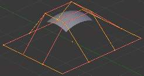
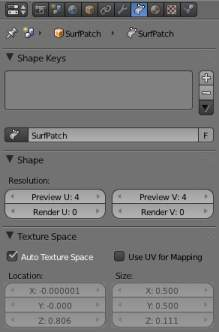
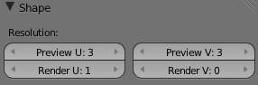
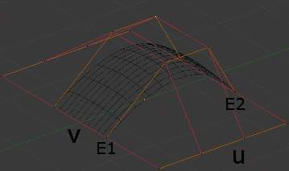
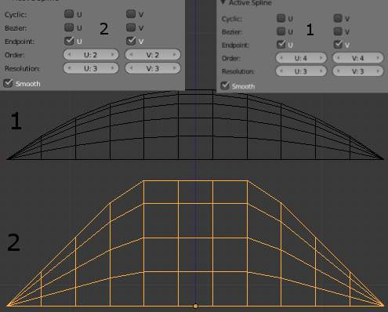
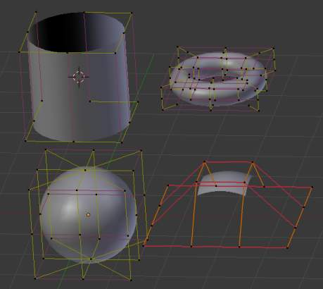
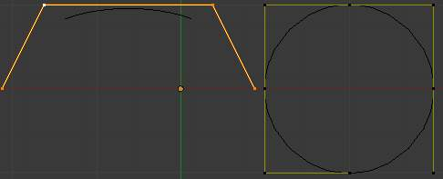
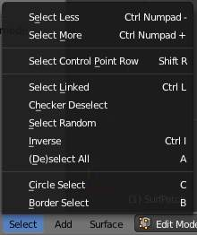

**********************
44 Modeling - Surfaces
**********************

.. contents:: Contents

Surfaces
========

Surface.

Curves are 2D objects, and surfaces are their 3D extension. Note however that in Bforartists, you only have NURBS surfaces, no Bézier (you have the **Bezier** knot type, though; see below), nor polygonal (but for these, you have meshes!). Even though curves and surfaces share the same object type (with texts also...), they are not the same thing; for example, you cannot have in the same object both curves and surfaces.

As surfaces are 2D, they have two interpolation axes, U (as for curves) and V. It is important to understand that **you can control the interpolation rules (knot, order, resolution) independently for each of these two dimensions** (the **U** and **V** fields for all these settings, of course).

You may ask yourself “but the surface appears to be 3D, why is it only 2D?”. In order to be 3D, the object needs to have “Volume,” and a surface, even when it is closed, doesn’t have volume; it is infinitely thin. If it had a volume the surface would have a thickness (its third dimension). Hence, it’s only a 2D object, and has only two interpolation dimensions or axes or coordinates (if you know a bit of math, think of non-euclidean geometry - well, surfaces are just non-euclidean 2D planes...). To take a more “real life” example, you can roll a sheet of paper to create a cylinder; well, even if it “draws” a volume, the sheet itself will remain a (nearly...) 2D object!

In fact, surfaces are very similar to the results you get when **extruding a curve**

Finding Surface Tools
---------------------

Surface Tools.

The panels of the **Editing** context are the same as for **curves**, just with fewer options... And as usual, you have the **Select** and **Surface** menus in the 3D view headers, and the **Specials** (W) pop-up one.

Visualization
-------------

There is nearly no difference from NURBS curves, except that the U direction is indicated by yellow grid lines, and the V one is materialized by pink grid lines, as you can see in (**Surface**).

You can hide and reveal control points just as with curves.

Surface Structure
-----------------

Many of the concepts from **curves**, especially NURBS ones, carry directly over to NURBS surfaces, such as control points, **Order**, **Weight**, **Resolution**, etc. Here we will just talk about the differences.

It is very important to understand the difference between NURBS curves and NURBS surfaces: the first one has one dimension, the latter has two. Bforartists internally treats NURBS surfaces and NURBS curves completely differently. There are several attributes that separate them but the most important is that a NURBS curve has a single interpolation axis (U) and a NURBS surface has two interpolation axes (U and V).

However, you can have “2D” surfaces made of curves (using the **extrusion tools**, or, to a lesser extent, the filling of closed 2D curves. And you can have “1D” curves made of surfaces, like a NURBS surface with only one row (either in U or V direction) of control points produces only a curve...

Visually you can tell which is which by entering **Edit** mode and looking at the 3D window’s header: either the header shows **Surface** or **Curve** as one of the menu choices. Also, you can **extrude** a whole NURBS surface curve to create a surface, but you can’t with a simple NURBS curve (we talk here about the “standard” **Extrude** tool, the one activated with the **E** shortcut, not the quite-specific curve extrusion tools - yes, I know, it’s not easy to follow...).

Control Points, Rows and Grid
-----------------------------

Control points for NURBS surfaces are the same as for NURBS curves. However, their layout is quite constraining. The concept of “segment” disappears, replaced by “rows” and the overall “grid”.

A “row” is a set of control points forming one “line” in one interpolation direction (a bit similar to edge loops for meshes). So you have “U-rows” and “V-rows” in a NURBS surface. The key point is that **all rows of a given type (U or V) have the same number of control points**. Each control point belongs to exactly one U-row and one V-row.

All this forms a “grid”, or “cage”, the shape of which controls the shape of the NURBS surface. A bit like a **lattice** ...

This is very important to grasp: you cannot add a single control point to a NURBS surface; you have to add a whole U- or V-row at once (in practice, you will usually use the Extrude tool, or perhaps the Duplicate one, to add those...), containing exactly the same number of points as the others. This also means that you will only be able to “merge” different pieces of surfaces if at least one of their rows match together.

Surface Resolution
------------------

Just like NURBS curves, **Resolution** controls the detail of the surface. The higher the **Resolution** the more detailed and smoother the surface is. The lower the **Resolution** the rougher the surface. However, here you have two resolution settings, one for each interpolation axis (U and V). Note that unlike with curves, you have only one resolution (the **Resol U** and **V** fields, in the **Curve Tools** panel)...

.. list-table::

	* - 	  - 
(**Resolution 1x1**) is an example of a surface resolution of 3 for both U and V. (**Resolution 3x3 surface**) is an example of a surface resolution of 12 for both U and V.

Resolution panel.

You can adjust the resolution separately for both preview and render, to not slow things down in the viewport, but still get good render results.

Closed and Open Surfaces
------------------------

Like curves, surfaces can be closed (cyclical) or open, independently in both directions, allowing you to easily create a tube, donut or sphere shape, and they can be drawn as “solids” in **Edit** mode. This makes working with surfaces quite easy.

Knots
-----

Just like with NURBS curves, NURBS surfaces have two knot vectors, one for each U and V axis. Here again, they can be one of **Uniform**, **Endpoint**, or **Bezier**, with the same properties as for curves. And as with curves, only open surfaces (in the relevant direction) are affected by this setting...

Endpoint U.

In (**Endpoint U**), the U interpolation axis is labeled as U and the V interpolation axis is labeled as V. The U ‘s interpolation axis has been set to **Endpoint** and as such the surface now extends to the outer edges from E1 to E2 along the U interpolation axis.

To cause the surface to extend to all edges you would set the V ‘s axis to **Endpoint** as well.

Order
-----

One more time, this property is the same as with NURBS Curves; it specifies how much the control points are taken into account for calculating the curve of the surface shape. For high **Orders**, (**1**), the surface pulls away from the control points, creating a smoother surface - assuming that the Surface Resolution is high enough. For lowest **Orders**, (**2**), the surface follows the control points, creating a surface that tends to follow the grid cage.

Order 2 and order 4 surface.

For illustration purposes, in both (**Order 4 surface**) and (**Order 2 surface**), the knot vectors were set to **Endpoint**, causing the surface to extend to all edges.

You can set independently the order for each interpolation axis, and like curves, it cannot be lower than **2**, and higher than **6** or the number of control points on the relevant axis.

Weight
------

Surface Weight 5.

Guess what? Yes, it works exactly like NURBS Curves ! **Weight** specifies how much each control point “pulls” on the curve.

In (**Surface Weight 5**), a single control point, labeled C, has had its **Weight** set to **5.0** while all others are at their default of **1. 0**. As you can see, that control point **pulls** the surface towards it.

If all the control points have the same **Weight** then each effectively cancels each other out. It is the difference in the weights that cause the surface to move towards or away from a control point.

The **Weight** of any particular control point is visible in the **Transform Properties panel** (N), **in the****W****field** (and not the **Weight** field...).

Preset Weights
--------------

A sphere surface.

NURBS can create pure shapes such as circles, cylinders, and spheres (note that a Bézier circle is not a pure circle). To create pure circles, globes, or cylinders, you must set to specific values the weights of the control points - some of which are provided as presets in the **Curve Tools** panel (lower right corner). This is not intuitive, and you should read more on NURBS before trying this.

To create a sphere with 2D surfaces, its the same principle as with a 2D circle - you’ll note that the four different weights needed for creating a sphere (**1.0**, **0.707** = sqrt(0.5), **0.354** = sqrt(2)/4, and **0.25**).

Primitives
----------

To help get started in creating surfaces there are four preset NURBS surfaces, found in the Add > Surface menu: **NURBS Surface**, **NURBS Tube**, **NURBS Sphere** and **NURBS Torus**.

NURBS surface primitives.

There are also two preset NURBS surface curves (with only one control point on each V-row): **NURBS Curve** and **NURBS Circle**.

NURBS curve primitives.

Note how a circle NURBS surface is never filled, unlike its “real” curve counterpart...

Surface Selection
=================

Surface selection in **Edit** mode is very similar to **NURBS curve selection**. The basic tools are the same as with **meshes**, so you can select a simple control point with a LMB -click, add to current selection with Shift-LMB -clicks, Border-select, and so on.

Select Menu
-----------

The **Select** menu (3D view headers) is even simpler than for curves...

All these options have the same meaning and behavior as in **Object mode** (and the specificities of **Border Select** in **Edit** mode have already been discussed **here**).

frame[left].

Every Nth
---------

Reference
=========

This is the same option as for curve selection. However, the behavior of the **N** (“selection step”) parameter in the 2D of a NURBS surface “cage” seems quite difficult to understand...

Control Point Row
-----------------

Reference
=========

This option works a bit like edge loop selection for meshes, inasmuch it selects a whole row of control points, based on the active (the last selected) one. The first time you press Shift-R, the V-row passing through (containing) the active point will be **added to the current selection**. If you use again this shortcut, you will toggle between the U- and V-row of this point, **removing everything else from the selection**.

More and Less
-------------

Reference
=========

These two options are complementary and very similar to **those for meshes**. Their purpose, based on current selected control points, is to reduce or enlarge this selection.

The algorithm is the same as with meshes:

More 

for each selected control point, select **all** its linked points (i.e. two, three or four). 

Less 

for each selected control point, if **all** points linked to this point are selected, keep it selected. For all other selected control points, de-select them. 

This implies two points:

- First, when **all** control points of a surface are selected, nothing will happen (as for **Less**, all linked points are always selected, and of course, **More** can’t add any). Conversely, the same goes when no control point is selected. 
- Second, these tools will never “go outside” of a surface (they will never “jump” to another surface in the same object). 

Surface Editing
---------------

Surface editing has even fewer tools and options than its curve counterpart - and has many common points with it... So this page covers (or tries to cover) all the subjects, from the basics of surface editing to more advanced topics, like retopology.

Basic Surface Editing (translation, rotation, scale)
----------------------------------------------------

Reference
=========

Once you have a selection of one or more control points, you can grab/move, rotate or scalethem, like many other things in Bforartists, as described in the **Manipulation in 3D Space** section.

You also have in **Edit** mode an extra option when using these basic manipulations: the **proportional editing**.

Advanced Transform Tools
------------------------

Reference
=========

The **To Sphere**, **Shear**, **Warp** and **Push/Pull** transform tools are described in the **Mesh Deforming** section. Surfaces have no specific transform tools.

NURBS Control Points Settings
-----------------------------

Reference
=========

We saw in a previous page that NURBS control points have a weight, which is the influence of this point on the surface. You set it either using the big **Set Weight** button in the **Curve Tools** panel (after having defined the weight in the numeric field to the right), or by directly typing a value in the **W** numeric field of the **Transform Properties** panel.

Adding or Extruding
-------------------

Reference
=========

Unlike meshes or curves, you cannot generally directly add new control points to a surface (with Ctrl-LMB clicks), as you can only extend a surface by adding a whole U- or V-row at once. The only exception is when working on a NURBS surface curve, i.e. a surface with only one control point on each U- or V-row. In this special case, all works exactly as with curves.

Most of the time, only extrusion is available. As usual, once the tool is activated the extrusion happens immediately and you are placed into **Grab mode**, ready to drag the new extruded surface to its destination.

There are two things very important to understand:

- Surfaces are **2D** objects - so you can’t extrude anything **inside** a surface (e.g. “inner” row); it wouldn’t make any sense! 
- The control “grid” **must remain “squarish”**, which means that you can only extrude a whole row, not parts of rows here and there... 

To summarize, the **Extrude** tool will only work when one and only one whole border row is selected - otherwise nothing happens.

As for curves, you cannot create a new surface in your object out of nowhere, by just Ctrl-LMB -clicking with nothing selected. However, unlike for curves, there is no “cut” option allowing you to separate a surface into several parts, so you only can create a new surface by copying (Duplication) an existing one (Shift-D), or adding a new one (**Add** menu...).

Examples
--------

Images (**Selecting control-point**) to (**Complete**) show a typical extrusion along the side of a surface.

You can continue this process of extruding - or adding - new surface sections until you have reached the final shape for your model.

Opening or Closing a Surface
----------------------------

Reference
=========

As in curves, surfaces can be closed (cyclic) or open. However, as surfaces are 2D, you can control this property independently along the U and V axes.

To toggle the cyclic property of a surface along one axis, use C and choose either **cyclic U** or **cyclic V** from the **Toggle pop-up menu**. The corresponding surface’s outer edges will join together to form a “closed” surface.

.. Note:: Inner and Outer

Duplication
-----------

Reference
=========

Well, as with meshes and curves, this command just duplicates the selection. As usual, the copy is selected and placed in **Grab** mode, so you can move it to another place.

However, with surfaces there are some selections that can’t be duplicated, in which case they will just be placed in **Grab** mode... In fact, only selections forming **a single valid sub-grid** are copyable; let’s see this in practice:

- You can copy a single control point. From it, you will be able to “extrude” a “surface curve” along the U axis, and then extrude this unique U-row along the V axis to create a real new surface. 
- You can copy a single continuous part of a row (or a whole row, of course). This will give you a new **U-row**, even if you selected (part of) a V-row! 
- You can copy a single whole sub-grid. 

Note that trying to duplicate several valid “sub-grids” (even being single points) at once won’t work; you’ll have to do it one after the other...

Deleting Elements
-----------------

Reference
=========

The **Erase** pop-up menu of surfaces offers you two options:

Selected 

	This will delete the selected rows, **without** breaking the surface (i.e. the adjacent rows will be directly linked, joined, once the intermediary ones are deleted). The selection must abide by the following rules:

- Whole rows, and only whole rows must be selected. 
- Only rows along the same axis must be selected (i.e. you can’t delete both U- and V-rows at the same time). 

	Also remember that NURBS order cannot be higher than its number of control points in a given axis, so it might decrease when you delete some control points... Of course, when only one row remains, the surface becomes a “surface curve”; when only one point remains, there is no more visible surface; and when all points are deleted, the surface itself is deleted.

All 

As with meshes or curves, this deletes everything in the object! 

Example
-------

Before and after

In (**Before**) a row of control points has been selected by initially selecting the control point labeled A and using Shift-R to select the remaining control points. Then, using the **Delete Menu** (X), the **selected** row of control points is erased, resulting in (**After**).

Joining or Merging Surfaces
---------------------------

Reference
=========

Just like curves, merging two surfaces requires that a single edge, a border row of control points, from two separate surfaces are selected. This means that the surfaces must be part of the same object. For example, you can’t join two surfaces while in **Object** mode - but you can of course, as with any objects of the same type, join two or more **Surface** objects into one object. They just won’t be “linked” or merged in a single one... Yes, it’s a bit confusing!

This command is equivalent to creating edges or F aces for meshes (hence its shortcut), and so it only works in **Edit** mode. The selection must contains only border rows of the same resolution (with the same number of control points), else Bforartists will try to do its best to guess what to merge with what, or the merge will fail (either silently, or stating that Resolution doesn't match if rows with different number of points are selected, or that there is Too few selections to merge if you only selected points in one surface...).

So to avoid problems, you should always only select border rows with the same number of points... Note that you can join a border U-row of one surface with a border V-row of another one, Bforartists will automatically “invert” the axis of one surface for them to match correctly.

NURBS surface curves are often used to create objects like hulls, as they define cross sections all along the object, and you just have to “skin” them as described above to get a nice, smooth and harmonious shape.

Examples
--------

(**Joining ready**) is an example of two NURBS surface curves, **not** NURBS curves, in **Edit** mode, ready to be joined. (**Joining complete**) is the result of joining the two curves.

Joining ready.

Subdivision
-----------

Reference
=========

Surface subdivision is most simple: using either the **Subdivide** entry in the **Specials** menu (W), or the **Subdivide** button of the **Curve Tools1** panel, you will subdivide once all **completely selected grids** by subdividing each “quad” into four smaller ones.

If you apply it to a 1D surface (a “surface curve”), this tool works exactly as with curves.

Spin
----

Reference
=========

This tool is a bit similar to its **mesh counterpart** - but with less control and options (in fact, there’s none!).

It only works on selected “surfaces” made of **one U-row** (and not with one V-row), so-called “surface curves”, by “extruding” this “cross section” in a square pattern, automatically adjusting the weights of control points to get a perfect circular extrusion (this also implies closing the surface along the V axis), following exactly the same principle as for the **NURBS Tube** or **NURBS Donut** primitives.

Switch Direction
----------------

Reference
=========

This command will “reverse” the direction of any curve with at least one selected element (i. e. the start point will become the end one, and **vice versa**). Mainly useful when using a curve as path, or the bevel and taper options...

Conversion
----------

As there are only NURBS surfaces, there is no “internal” conversion here.

However, there is an “external” conversion available, from surface to mesh, that only works in **Object** mode. It transforms a **Surface** object into a **Mesh** one, using the surface resolutions in both directions to create faces, edges and vertices.

Misc Editing
------------

You have some of the same options as with meshes, or in **Object** mode. You can separate a given surface (P), make other selected objects children of one or three control points (Ctrl-P - note however that parenting to three control points has a strange behavior with curves...), or **add hooks** to control some points with other objects.

The **Mirror** tool is also available, behaving exactly as with **mesh vertices**.

