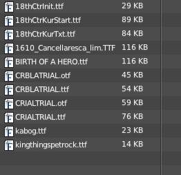
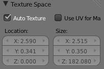
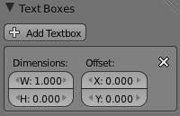

******************
45 Modeling - Text
******************

.. contents:: Contents

Text
====

Special Characters
------------------

Reference
=========

If you need special characters (such as accented chars, which aren’t on your keyboard) you can produce many of them using a combination of two other characters. To do so, type the main char, press Alt-Backspace, and then press the desired “modifier” to produce the special character. Some examples are given below:

.. list-table::

	* - A, Alt-Backspace, ~
	  - ã
	  - A, Alt-Backspace, '
	  - á
	  - A, Alt-Backspace, `
	  - à

	* - A, Alt-Backspace, O
	  - å
	  - E, Alt-Backspace, "
	  - ë
	  - O, Alt-Backspace, /
	  - ø

Convert Text to Text Object
---------------------------

Using an existing text-block, you can convert it to an object from the text editor’s header, select Edit > Text to 3D Object, **One Object** or **One Object per Line** depending on your needs.

It is also possible to paste from the clipboard or a file from the **Edit** menu, while editing 3D Text.

3D Mesh
-------

It is possible to convert a Text Object to a 3D Mesh object. This can be useful so that you may edit the vertices in **Edit Mode**, but you will lose the ability to edit the text itself. To do this, go to **Object Mode** and select your Text Object. Press Alt-C and select **Mesh From Curve/Meta/Surf/Text**. Now you can return to **Edit Mode** and manually edit the vertices. They are usually a bit messy, so it may be useful to use a **Limited Dissolve** deletion or **Remesh** Object **Modifier** at a low threshold to clean up your mesh.

left normal text, right the made text object.

Text Selection
--------------

Text in Edit mode.

In **Edit** mode, your text has a white cursor, and as in any text editor, it determines where new chars will be inserted! You move this cursor with the arrow keys or PageUp / PageDown and Home / End keys.

Hold Shift while using the arrow keys to select a part of the text. You can use it to specify different materials, the normal/bold/italic state, and not much more...

Formatting Text
---------------

Fonts
-----

Reference
=========

The **Font** panel has several options for changing the look of characters.

Loading and Changing Fonts
--------------------------

Loading a Type 1 font file.

Bforartists comes with a **built-in** font by default and is displayed in each of the four font style choosers. The **built-in** font is always present and shows in this list as Bfont. The first icon contains a drop-down list displaying currently loaded fonts. Select one for each font style.

To load a different **Font**, click one of the **Load** buttons in the **Font** panel and navigate to a **valid** font. The **File Browser** window will give all valid fonts a capital F icon, as seen in **Loading a Type 1 font file.**

.. Note:: Unix note

If you select a font that Bforartists can’t understand, you will get the error Not a valid font.

Remember the same font will be applied to all chars with same style in a text, but that a separate font is required for each style. For example, you will need to load an **Italics** font in order to make characters or words italic. Once the font is loaded you can apply that font “Style” to the selected characters or the whole object. In all, you would need to load a minimum of four different types of fonts to represent each style (**Normal**, **Italics**, **Bold**, **Bold-Italics**).

It is important to understand that Bforartists does not care what font you load for “normal”, “bold”, etc., styles. This is how you can have up to four different fonts in use in the same text - but you have to choose between different styles of a same font, or different fonts. Bforartists has a number of typographic controls for changing the style and layout of text, found in the **Font** panel.

Size and Shear
--------------

Size 

Controls the size of the whole text (no way to control each char size independently). Note however that chars with different fonts (different styles, see below) might have different visible sizes. 

shear: ‘Bforartists’ has a shear value of 1, ‘2.59’ a shear value of 0

Shear 

Controls the inclination of the whole text. Even if this seems similar to italics style, **this is not the same thing** ! 

Objects as Fonts
----------------

You can also “create” your own “font” inside Bforartists! This is quite a complex process, so let’s detail it:

- First, you must create your chars. Each char is an object **of any type** (mesh, curve, meta...). They all must have a name following the schema: common prefix followed by the char name (e.g. ft.a, ft.b, etc.). 
- Then, for the **Text** object, you must enable the **Dupli Verts** button (**Object** context - **Anim Settings** panel). 
- Back in **Editing** context, in the **Font** panel, fill the **Ob Family** field with the **common prefix** of your “font” objects. 

Now, each time a char in your text matches the **suffix part** of a “font” object’s name, this object is duplicated on this char. **The original chars remain visible**. The objects are duplicated so that their center is positioned at the **lower right corner** of the corresponding chars.

Text on Curve
-------------

With the **curve modifier** you can let text follow a curve.

Text on curve.

In (**Text on curve**) you can see a text deformed by a curve (a 2D Bézier circle).

To apply the curve modifier, the text object first has to be converted to a mesh, using Alt-C and click mesh.

.. Note:: There is also a Text on Curve feature, but the curve modifier offers more options.

Underline
---------

Underline 

	Toggled with the **Underline** button before typing. Text can also be set to Underlined by selecting it then using the **Underline** button in the Tool Shelf.

	Position 

	This allows you to shift vertically the position of the underline. 

	Thickness 

	This controls the thickness of the underline. 

check a character option to, for example, type bold text

Character
---------

Bold text.

Bold 

Toggled with the **Bold** button before typing. Text can also be set to Bold by selecting it then using the **Bold** button in the Tool Shelf. 

Italics 

Toggled with the **Italic** button before typing. Text can also be set to Italic by selecting it then using the **Italic** button in the Tool Shelf. 

Underline 

Enables underlining, as controlled by the Underline settings above. 

Small Caps 

type small capital text. 

Bforartists’s **Bold** and **Italic** buttons don’t work the same way as other applications, as they also serve as placeholders for you to load up other fonts manually, which get applied when you define the corresponding style; see Fonts.

To apply the Bold/Italics/Underline attribute to a set of characters, you either turn on **Bold** / **Italics** / **Underline** prior to typing characters, or highlight (select) first and then toggle Bold/Italics/Underline.

Setting Case
------------

You can change the text case by selecting it then clicking the **To Upper** or **To Lower** in the tool shelf.

Enable the **Small Caps** option to type characters as small caps.

The size of the **Small Caps** can be changed with the **Small Caps Scale** setting. Note that the **Small Caps Scale** is applied the same to all **Small Caps** formatted characters.

Paragraph
---------

The **Paragraph** Panel has settings for the alignment and spacing of text.

the paragraph tab

Align
-----

Left 

Aligns text to left of frames when using them, else uses the center point of the **Text** object as the starting point of the text (which grows to the right). 

Center 

Centers text in the frames when using them, else uses the center point of the **Text** object as the mid-point of the text (which grows equally to the left and right). 

Right 

Aligns text to right of frames when using them, else uses the center point of the **Text** object as the ending point of the text (which grows to the left). 

Justify 

Only flushes a line when it is **terminated** by a wordwrap (**not** by Return), it uses **whitespace** instead of **character spacing** (kerning) to fill lines. 

Flush 

**Always** flushes the line, even when it’s still being entered; it uses character spacing (kerning) to fill lines. 

Both **Justify** and **Flush** only work within frames.

Spacing
-------

Character 

A factor by which space between each character is scaled in width 

Word 

A factor by which whitespace between words is scaled in width. You can also control it by pressing Alt-Left or Alt-Right to decrease/increase spacing by steps of 0.1. 

Line 

A factor by which the vertical space between lines is scaled. 

Offset
------

X offset and Y offset 

Well, these settings control the X and Y offset of the text, regarding its “normal” positioning. Note that with frames (see **Text Boxes**), it applies to all frames’ content... 

Shape
-----

Reference
=========

As you can see in the **Curve and Surface** panel, texts have most of the same options as curves.

Resolution
----------

Preview, Render resolution. See curve resolution.

the shape settings

Fast Editing 

disables curve filling while in edit mode. 

Fill
----

The fill options control how the text curves are filled in when text is **Extruded** or **Beveled** in the **Geometry** Panel.

Front 

Fills in the front side of the surface. 

Back 

Fills in the back side of the surface. 

Fill Deformed 

Fills the curves after applying shape keys and modifiers. 

Textures
--------

Texture Settings

Use UV for Mapping 

Use UV values as generated texture coordinates. 

Auto Texture Space 

Adjusts the active object’s texture space automatically when transforming object. 

Geometry
--------

Text objects have all the **curves extrusion features**.

Text Editing
============

Text Boxes
----------

Reference
=========

Text frame.

Text “Boxes” allow you to distribute the text amongst rectangular areas within a single text object. An arbitrary number of freely positionable and re-sizable text frames are allowed per text object.

Text flows continuously from the lowest-numbered frame to the highest-numbered frame with text inside each frame word-wrapped. Text flows between frames when a lower-numbered frame can’t fit any more text. If the last frame is reached, text overflows out of it.

Text frames are very similar to the concept of **frames** from a desktop publishing application, like Scribus. You use frames to control the placement and flow of text.

Frames are controlled in the **Text Boxes** panel.

Frame size
----------

By default the first frame for a new text object, and any additional frames, has a size of **zero** for both **Width** and **Height**, which means the frame is initially not visible.

Frames with a width of **0.0** are ignored completely during text flow (no wordwrap happens), and frames with a height of **0.0** flow forever (no flowing to the next text frame).

In order for the frame to become visible, the frame’s **Width** must be greater than **0.0**.

.. Note:: Technically the height is never actually ``0.0`` because the font itself always contributes height.

Frame width.

(**Frame width**) is a text object with a width of 5.0. And because the frame width is greater than 0.0 it is now visible and is drawn in the active theme color as a dashed rectangle. The text has overflowed because the text has reached the end of the last frame, the default frame.

Adding/Deleting a Frame
-----------------------

To add a frame click the **Add Textbox** button on the **Text Boxes** panel. A new frame is inserted just after (in text flow order) the current one, with its attributes (position and size). Be sure to modify the offset for the new frame in the **X** and/or **Y** fields. Just an **X** modification will create a new column.

To delete the current frame, click the Delete button. Any text in higher frames will be re-flowed downward into lower frames.

Example: Text Flow
------------------

wrapping

With two or more frames you can organize text to a finer degree. For example, create a text object and enter Bforartists is super duper. This text object has a frame; it just isn’t visible because its **Width** is **0.0**.

Set the width to **5.0**. The frame is now visible and text is wrapping according to the new width, as shown in (**Text 2**). Notice that the text has overflowed out of the frame. This is because the text has reached the end of the last frame, which just happens to be the default/initial frame.

text flowing from box 1 to box 2

When we add another frame and set its width and height, the text will flow into the new frame.

Example: Multiple columns
-------------------------

Text 5.

To create two columns of text just create a text object and adjust the initial frame’s **Width** and **Height** to your requirements, then insert a new frame. The new frame will have the same size as the initial frame. Set the **X** position to something greater or less than the width of the initial frame; see (**Text 5**).

Assigning Materials
-------------------

Reference
=========

Each character can have a different **Material index** in order to have different materials on different characters.

You can assign indices either as you type, or after by selecting blocks of text and clicking on the **Assign** button in the Materials panel.

Red Green Blue.

For example, to create (**Red Green Blue**) you would need to create three separate materials and three separate material indices. Each word would be assigned a **Material index** by selecting the characters for each word and clicking the **Assign** button. (**Red Green Blue**) is still one single **Text** object.

