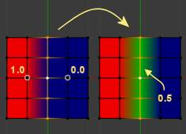

*************************
48 Painting and Sculpting
*************************

.. contents:: Contents

Painting & Sculpting
====================

TODO.

Painting
========

TODO.

Texture Paint
=============

A UV Texture is a picture (image, sequence or movie) that is used to color the surface of a mesh. The UV Texture is mapped to the mesh through one or more UV maps. There are three ways to establish the image used by the UV Texture:

- Paint a flat image in the UV/Image Editor onto the currently selected UV Texture, using its UV map to transfer the colors to the faces of the mesh. 
- Paint the mesh in the 3D View, and let Bforartists use the currently selected UV map to update the UV Texture (see Projection Painting). 
- Use any image-editing (paint) program to create an image. In the UV/Image Editor, select the UV Texture and load the image. Bforartists will then use that texture’s UV map to transfer the colors to the faces of the mesh 

Bforartists features a built-in paint mode called Texture Paint which is designed specifically to help you edit your UV Textures and images quickly and easily in either the UV/Image Editor window or the 3D View window. Since a UV Texture is just a special-purpose image, you can also use any external paint program. For example, GIMP is a full-featured image manipulation program that is also open-source.

Texture painting in Bforartists

Since a mesh can have layers of UV Textures, there may be many images that color the mesh. However, each UV Texture only has one image.

Texture Paint works in both a 3D window and the UV/Image Editor window. In the 3D window in Texture Paint mode, you paint directly on the mesh by projecting onto the UVs.

Getting Started
---------------

Once you have unwrapped your model to a UV Map (as explained in previous pages), you can begin the texturing process. You cannot paint on a mesh in Texture Paint mode without **first** unwrapping your mesh, **and** doing one of the following steps. Either:

See: **Applying Textures**.

After you have done one of these two things, you can modify the image using the Texture Paint mode:

Enabling paint mode

- In the 3D View window, select Texture Paint mode from the mode selector in the window header, and you can paint directly onto the mesh. 
- In the UV/Image Editor window, switch the editing context from View to Paint (shown to the right). 

.. Note:: Square Power of 2

Once you enable Texture Painting, your mouse becomes a brush. To work with the UV layout (for example, to move coordinates) you must go back to “View” mode.

As soon as you enable Texture Painting or switch to Texture Paint mode, brush settings become available in the Toolbar Panel (T-key).

In the UV/Image Editor window, you paint on a flat canvas that is wrapped around the mesh using UV coordinates. Any changes made in the UV/Image Editor window show up immediately in the 3D window, and vice versa.

A full complement of brushes and colors can be selected from the Properties panel in the UV/Image Editor. Brush changes made in either panel are immediately reflected in the other panel. However, the modified texture will **not** be saved automatically; you must explicitly do so by Image–>Save in the UV/Image Editor window.

Texture Preview
---------------

If your texture is already used to color, bump map, displace, alpha-transparent, etc., a surface of a model in your scene (in other techie words, is mapped to some aspect of a texture via a texture channel using UV as a map input), you can see the effects of your painting in the context of your scene as you paint.

To do this, set up side-by-side windows, one window in 3D View set to Textured display mode, and the second UV/Image Editor window loaded with your image. Position the 3D View to show the object that is UV mapped to the loaded image. Open a Preview window (see 3D View Options for more info) and position it over the object. In the image to the right, the texture being painted is mapped to the “Normal” attribute, and is called “bump mapping”, where the gray-scale image is used to make the flat surface appear bumpy. See Texture Mapping Output for more information on bump mapping.

Brushes Settings
----------------

Press T in the UV/Image Editor to show the Toolbar panel. With this panel, you can create many brushes, each with unique settings (such as color and width). Use the Brush selector to switch between brushes, or to create a new brush. When you add a brush, the new brush is a clone of the current one. You can then change the setting for the new brush. Texture paint has an unlimited number of brushes and unique user-defined controls for those brushes which can be set in the Paint Tool panel.

To use a brush, click on its name. Use the selector up/down arrow, if there are more brushes on the flyout window than can be displayed at once. Name your brush by clicking on the name field and entering any name you wish, such as “Red Air” for a red airbrush. To toss out a brush, click the brush delete **X** button next to its name. If you want to keep this brush around for the next time you run Bforartists, click the Fake user button (F) next to the brush delete (X) button.

If you have a tablet pen with pressure sensitivity, toggle the small “P” button next to the opacity, size, falloff and spacing buttons to control these parameters using the pressure of the pen. Using your pen’s eraser end will toggle on the Erase Alpha mode.

Press S on any part of the image to sample that color and set it as the brush color.

Brush
-----

Brush Settings

Brush presets 

Select a preset brush. Most brushes have common settings. 

Types of brushes
----------------

There are four different types of brushes 

	Draw 

	the normal brush; paints a swath of color 

	Soften 

	blends edges between two colors 

	Smear 

	when you click, takes the colors under the cursor, and blends them in the direction you move the mouse. Similar to the “smudge” tool of **Gimp**. 

	Clone 

	copies the colors from the image specified (Tex.Dirt in the example), to the active image. The background image is shown when this brush is selected; use the **B** lend slider to control how prominent the background image is. 

Enable Pressure Sensitivity 

The icon to the right of the following three settings will enable or disable tablet pressure sensitivity to control how strong the effect is. 

Color 

The color of the brush 

Radius 

The radius of the brush in pixels 

Strength 

How powerful the brush is when applied}} 

Blend 

Set the way the paint is applied over the underlying texture 

- Mix: the brush color is mixed in with existing colors
- Add: the brush color is added to the existing color; green added to red gives yellow.
- Subtract: the brush color is subtracted; painting blue on purple gives red
- Multiply: the RGB value of the base is multiplied by the brush color
- Lighten: the RGB value of the base color is increased by the brush color
- Darken: tones down the colors
- Erase Alpha: makes the image transparent where painted, allowing background colors and lower-level textures to show through. As you ‘paint’, the false checkerboard background will be revealed
- Add Alpha: makes the image more opaque where painted
- In order to see the effects of the Erase and Add Alpha mix modes in the UV/Image Editor, you must enable the alpha channel display by clicking the Display Alpha or the Alpha-Only button. Transparent (no alpha) areas will then show a checkered background.

Image 

When using the clone brush, this allows you to select an image as a clone source. 

Alpha 

Opacity of the clone image display 

Texture
-------

Texture options and example

Use the texture selector at the bottom of the paint panel to select a pre-loaded image or procedural texture to use as your brush pattern. Note that in order to use it, you must have a placeholder material defined, and that particular texture defined using the Material and Texture buttons. It is not necessary to have that material or texture applied to any mesh anywhere; it must only be defined. The example to the right shows the effects of painting with a flat (banded) wood texture. Switching the texture to Rings makes a target/flower type of brush painting pattern.

.. Note:: In Clone paint mode, this field changes to indicate the picture image or texture that you are cloning from.

Brush Mapping 

	Sets how the texture is applied to the brush

	View Plane 

	In 2D painting, the texture moves with the brush 

	Tiled 

	The texture is offset by the brush location 

	3D 

	Same as tiled mode 

	Stencil 

	Texture is applied only in borders of the stencil. 

	Random 

	Random applying of texture. 

Angle 

	This is the rotation angle of the texture brush. It can be changed interactively via Ctrl-F in the 3D view. While in the interactive rotation you can enter a value numerically as well. Can be set to:

	User 

	Directly input the angle value. 

	Rake 

	Angle follows the direction of the brush stroke. Not available with **3D** textures. 

	Random 

	Angle is randomized. 

Offset 

Offset the texture in x, y, and z. 

Size 

Set the scale of the texture in each axis. 

Stroke
------

Stroke Method 

	Allows set the way applying strokes.

	Airbrush 

	Flow of the brush continues as long as the mouse click is held, determined by the **Rate** setting. If disabled, the brush only modifies the color when the brush changes its location.

	Rate 

	Interval between paints for airbrush 

	Space 

	Creates brush stroke as a series of dots, whose spacing is determined by the **Spacing** setting.

	Spacing 

	Represents the percentage of the brush diameter. Limit brush application to the distance specified by spacing. 

	Dots 

	Apply paint on each mouse move step 

	Jitter 

	Jitter the position of the brush while painting 

Smooth stroke 

	Brush lags behind mouse and follows a smoother path. When enabled, the following become active:

	Radius 

	Sets the minimun distance from the last point before stroke continues. 

	Factor 

	Sets the amount of smoothing. 

Input Samples 

Average multiple input samples together to smooth the brush stroke. 

Wrap 

wraps your paint to the other side of the image as your brush moves off the OTHER side of the canvas (any side, top/bottom, left/right). Very handy for making seamless textures. 

Curve
-----

The paint curve allows you to control the falloff of the brush. Changing the shape of the curve will make the brush softer or harder.

.. Tip:: Note

Paint options
-------------

Overlay
-------

Allows you to customize the display of curve and texture that applied to the brush.

Appearance
----------

Allows you to customize the color of the brush radius outline, as well as specify a custom icon.

Saving
------

If the header menu item Image has an asterisk next to it, it means that the image has been changed, but not saved. Use the **Image–>Save Image** option to save your work with a different name or overwrite the original image.

.. Note:: UV Textures

The image format for saving is independent of the format for rendering. The format for saving a UV image is selected in the header of the Save Image window, and defaults to PNG (.png).

If Packing is enabled in the window header, or if you manually **Image–>Pack Image**, saving your images to a separate file is not necessary.

Using an External Image Editor
------------------------------

If you use an external program to edit your UV Texture, you must:

- run that paint program (GIMP, Photoshop, etc.) 
- load the image or create a new one 
- change the image, and 
- re-save it within that program. 
- Back in Bforartists, you reload the image in the UV/Image Editor window. 

You want to use an external program if you have teams of people using different programs that are developing the UV textures, or if you want to apply any special effects that Texture Paint does not feature, or if you are much more familiar with your favorite paint program.

Known Limitations
-----------------

UV Overlap
----------

In general overlapping UVs aren’t supported (as with texture baking).

However this is only a problem when a single brush stroke paints onto multiple faces that share a texture.

Perspective View & Faces Behind the View
----------------------------------------

When painting onto a face which is partially behind the view (in perspective mode), the face can’t be painted on. To avoid, this zoom out or use an Ortho mode viewport.

Perspective View & Low Poly
---------------------------

When painting onto a face in perspective mode onto a low poly object with normals pointing away from the view, painting may fail; to workaround disable the **Normal** option in the paint panel.

**Typically this happens when painting onto the side of a cube**

Vertex Paint
============

- Introduction

- - Settings 
- - Options 

Introduction
============

Vertex Painting is a simple way of painting color onto an object, by directly manipulating the color of vertices, rather than textures, and is fairly straightforward.

When a vertex is painted, the color of the vertex is modified according to the rules of the ‘brush’. The color of all visible planes and edges attached to the vertex are then modified with a gradient to the color of the other connected vertices. (Note that the color of non-visible faces are not modified).

Vertex colors can be painted by first going into Edit Mode, then switching to **Vertex Paint Mode**; however, it will not show up in the render unless you check “Vertex Color Paint” in the Materials **Options** Panel.

Vertex Painting Mode

Check this box

Settings
--------

The Tools Shelf, shortcut T contains most of the options for vertex painting. The following sections describe the controls in each of the available panels.

.. image:: graphics/7.xx_Painting_and_Sculpting/10000000000000CC000004BF2B83FA81409D2BBD.jpg

Settings for vertex painting

Brush
-----

Brush Data-Block 

The image, name panel and color selector at the top allows you to select brush presets, rename brushes, as well as add custom brushes, and delete them. 

Radius 

Set the radius of the brush 

Strength 

Set the strength of the brush’s effect. 

.. image:: graphics/7.xx_Painting_and_Sculpting/10000000000001CE000001904BA2A9ECA12A0023.jpg

Mix overlay with full strength

**Blend** menu

	Mix 

	Mixes RGB values. When set to a strength of 1.0, it will cover the underlying “paint”. 

	Add 

	Adds RGB values. Will eventually turn the entire object white as RGB values accumulate to 1.0-1.0-1.0: Pure White. 

	Subtract 

	Subtracts RGB values. Usually results in Black. 

	Multiply 

	Multiplies brush colors by the vertex colors. 

	Blur 

	Blurs vertex colors. 

	Lighten 

	Lightens the color of the vertices. 

Subtract with full strength

Darken 

Darkens the color of the vertices. 

Texture
-------

Use the texture selector at the bottom of the paint panel to select a pre-loaded image or procedural texture to use as your brush pattern. Note that in order to use it, you must have a placeholder material defined, and that particular texture defined using the Material and Texture buttons. It is not necessary to have that material or texture applied to any mesh anywhere; it must only be defined.

Brush Mapping Mode 

	Sets how the texture is applied to the brush

	View Plane 

	In 2D painting, the texture moves with the brush 

	Tiled 

	The texture is offset by the brush location 

	3D 

	Same as tiled mode 

	Stencil 

	Texture is applied only in borders of the stencil. 

	Random 

	Random applying of texture. 

Angle 

	This is the rotation angle of the texture brush. It can be changed interactively via Ctrl-F in the 3D view. While in the interactive rotation you can enter a value numerically as well. Can be set to:

	User 

	Directly input the angle value. 

	Rake 

	Angle follows the direction of the brush stroke. Not available with **3D** textures. 

	Random 

	Angle is randomized. 

Offset 

Offset the texture in x, y, and z. 

Size 

Set the scale of the texture in each axis. 

Stroke
------

Stroke Method 

	Allows set the way applying strokes.

	Airbrush 

	Flow of the brush continues as long as the mouse click is held, determined by the **Rate** setting. If disabled, the brush only modifies the color when the brush changes its location.

	Rate 

	Interval between paints for airbrush 

	Space 

	Creates brush stroke as a series of dots, whose spacing is determined by the **Spacing** setting.

	Spacing 

	Represents the percentage of the brush diameter. Limit brush application to the distance specified by spacing. 

	Dots 

	Apply paint on each mouse move step 

	Jitter 

	Jitter the position of the brush while painting 

Smooth stroke 

	Brush lags behind mouse and follows a smoother path. When enabled, the following become active:

	Radius 

	Sets the minimun distance from the last point before stroke continues. 

	Factor 

	Sets the amount of smoothing. 

Input Samples 

Average multiple input samples together to smooth the brush stroke. 

Various brush curves

Curve
-----

Brush Curves affect how strongly the color is applied depending on distance from the center of the brush. In other words, they allow you to edit the Falloff of the brush intensity.

Options
-------

Options for vertex painting

Overlay
-------

Allows you to customize the display of curve and texture that applied to the brush.

Appearance
----------

Allows you to customize the color of the brush radius outline, as well as specify a custom icon.

Options
-------

Normals 

Applies the Vertex Normal before painting. This does not usually affect painting. 

Spray 

Continues painting for as long as the mouse is held. 

Unified Settings 

	Size 

	All brushes use the same size. 

	Strength 

	All brushes use the same strength.

Weight Paint
============

Vertex Groups can potentially have a very large number of associated vertices and thus a large number of weights (one weight per assigned vertex). **Weight Painting** is a method to maintain large amounts of weight information in a very intuitive way. It is primarily used for rigging meshes, where the vertex groups are used to define the relative bone influences on the mesh. But we use it also for controlling particle emission, hair density, many modifiers, shape keys, etc.

The basic principle of the method is: the weight information is literally **painted** on top of the Mesh body by using a set of Weight brushes. And since painting is always associated with color, we also need to define ...

Weight Paint in a nutshell
--------------------------

.. image:: graphics/7.xx_Painting_and_Sculpting/10000000000000E40000008C8089DC2BAF21CB4E.jpg

Weight Painted Vertex Group

- You enter **Weight Paint** mode from the Mode Menu (Ctrl-Tab). The selected Mesh Object is displayed slightly shaded with a rainbow color spectrum. 
- The color visualizes the weights associated to each vertex in the active Vertex Group. Blue means unweighted; Red means fully weighted. 
- You can customize the colors in the weight gradient by enabling **Custom Weight Paint Range** in the **System** tab of the **User Preferences**. 
- You assign weights to the vertices of the Object by painting on it with weight brushes. Starting to paint on a mesh automatically adds weights to the active Vertex Group (a new Vertex Group is created if needed). 

The weighting Color Code
------------------------

Weights are visualized by using a cold/hot color system, such that areas of low influence (with weights close to 0.0) are drawn in blue (cold) and areas of high influence (with weights close to 1.0) are drawn in red (hot). And all in-between influences are drawn in rainbow colors, depending on their value (blue, green, yellow, orange, red)

Image 3: The color spectrum and their respective weights.

In addition to the above described color code, Bforartists has added (as an option) a special visual notation for unreferenced vertices: They are drawn in black. Thus you can see the referenced areas (drawn in cold/hot colors) and the unreferenced areas (in black) at the same time. This is most practical when you look for weighting errors (we will get back to this later).

Brushes
-------

The Brush panel in the Tool Shelf

Painting needs paint brushes and Bforartists provides a Brush Panel within the Tool Shelf when it operates in **Weight Paint Mode**. You find predefined Brush Presets when you click on the large Brush Icon at the top of the brush Panel. And you can make your own presets as needed. See below for the available brush presets and to create custom presets.

The main brush properties
-------------------------

The most important and frequently modified properties are:

Weight 

The weight (color) to be used by the brush. However, the weight value is applied to the Vertex Group in different ways depending on the selected Brush Blending mode (see below). 

Strength 

This is the amount of paint to be applied per brush stroke. What that means exactly also depends on the Brush Blending mode. 

Radius 

	The radius defines the area of influence of the brush.

.. Note:: You can also change the Brush radius with a keyboard shortcut while painting. Just press ``F`` at any time, then drag the mouse to increase/reduce the brush radius. Finally click ``LMB`` to use the new setting. Or press the ``Esc`` key at any time to return to the current settings.

Blend mode 

	The brush Blending mode defines in which way the weight value is applied to the Vertex Group while painting.

	Mix 

	In this Blend mode the Weight value defines the **target weight** that will eventually be reached when you paint long enough on the same location of the mesh. And the strength determines how many strokes you need to arrive at the target weight. Note that for strength = 1.0 the target weight is painted immediately, and for Weight = 0.0 the brush just does nothing. 

	Add 

	In this blend mode the specified weight value is **added** to the vertex weights. The strength determines which fraction of the weight gets added per stroke. However, the brush will not paint weight values above 1.0. 

	Subtract 

	In this blend mode the specified weight is **subtracted** from the vertex weights. The strength determines which fraction of the weight gets removed per stroke. However the brush will not paint weight values below 0.0. 

	Lighten 

	In this blend mode the specified weight value is interpreted as the target weight very similar to the Mix Blend mode. But only weights below the target weight are affected. Weights above the target weight remain unchanged. 

	Darken 

	This Blend mode is very similar to the Lighten Blend mode. But only weights above the target weight are affected. Weights below the target weight remain unchanged. 

	Multiply 

	Multiplies the vertex weights with the specified weight value. This is somewhat like subtract, but the amount of removed weight is now dependent on the Weight value itself. 

	Blur 

	tries to smooth out the weighting of adjacent vertices. In this mode the Weight Value is ignored. The strength defines how effectively the blur is applied. 

Normalize Options
-----------------

Bforartists also provides Options regarding the automatic normalizing of all affected Vertex groups:

Auto Normalize 

	Ensures that all deforming vertex groups add up to 1 while painting. When this option is turned off, then all weights of a vertex can have any value between 0.0 and 1.0. However, when Vertex Groups are used as Deform Groups for character animation then Bforartists always interprets the weight values relative to each other. That is, Bforartists always does a normalization over all deform bones. Hence in practice it is not necessary to maintain a strict normalization and further normalizing weights should not affect animation at all.

	This option works most intuitively when used to maintain normalization while painting on top of weights that are already normalized with some other tool.

Multi-Paint 

	Paint on all selected Vertex Groups simultaneously, in a way that preserves their relative influence. This can be useful when tweaking weights in an area that is affected by more than 3 bones at once, e.g. certain areas on a character’s face.

This option is only useful in the context of Armatures, where you can select multiple Vertex Groups by selecting multiple Pose bones. Once at least two Vertex Groups are selected, viewport colors and paint logic switch to Multi-Paint mode, using the sum of the selected groups’ weights if Auto Normalize is enabled, and the average otherwise. Any paint operations aimed at this collective weight are applied to individual Vertex Group weights in such way that their ratio stays the same.

	Since the ratio is undefined if all weights are zero, Multi-Paint can’t operate on vertices that don’t have any weight assigned to the relevant Vertex Groups. For this reason it also doesn’t allow reducing the weight all the way to zero. When used with X-Mirror, it only guarantees completely symmetrical result if weights are initially symmetrical.

The Brush stroke definition
---------------------------

Stroke Panel

Stroke Method 

	Airbrush 

	Keep applying paint effect while holding mouse down (spray) 

	Space 

	Limit brush application to the distance specified by spacing (see below) 

	Dots 

	Apply paint on each mouse move step 

Rate (only for Airbrush) 

Interval between paints for airbrush 

Spacing (only for Space) 

Limit brush application to the distance specified by spacing 

Jitter 

Jitter the position of the brush while painting 

Smooth Stroke 

Brush lags behind mouse and follows a smoother path 

Radius 

Minimum distance from last point before stroke continues 

Factor 

Higher values give a smoother stroke 

The brush Falloff curve
-----------------------

Curve Panel

The brush falloff editor allows you to specify the characteristics of your brushes to a large extent. The usage should be obvious and intuitive.

The brush appearance
--------------------

Brush appearance

Show Brush 

makes the brush visible as a circle (on by default) 

Color setter 

To define the color of the brush circle 

Custom icon 

Allows definition of a custom brush icon 

Brush presets
-------------

Bforartists provides several Brush presets:

- **Mix, Draw, Brush** : uses the Mix Blending mode to draw the brush weight with varying strength and brush falloff 
- **Add** : uses the Add Blending mode 
- **Subtract** : uses the Subtract Blending mode 
- **Lighten** : uses the Lighten Blending mode 
- **Darken** : uses the Darken Blending mode 
- **Multiply** :uses the Multiply Blending mode 
- **Blur** : uses the Blur Blending mode 

Customizing brush color space
-----------------------------

Customizing the Color Band

Bforartists allows customization of the color range used for the Weight Paint colors. You can define the color band as you like; for example, you can make it purely black/white if you prefer, you can even use alpha values here.

You find the customizer in the User Properties section, in the System Tab.

Selection Masking
-----------------

If you have a complex mesh, it is sometimes not easy to paint on all vertices in Weight Paint mode. Suppose you only want to paint on a small area of the Mesh and keep the rest untouched. This is where **selection masking** comes into play. When this mode is enabled, a brush will only paint on the selected verts or faces. The option is available from the footer menu bar of the 3D viewport (see icons surrounded by the yellow frame):

.. image:: graphics/7.xx_Painting_and_Sculpting/10000000000000F40000001C9B0C169277DE664F.jpg

You can choose between **Face Selection masking** (left icon) and **Vertex selection masking** (right icon).

**Select** mode has some advantages over the default **Weight Paint** mode:

- The original mesh edges are drawn, even when modifiers are active. 
- You can select faces to restrict painting to the vertices of the selected faces. 
- Selecting tools include: 

Details about selecting
-----------------------

The following standard selection operations are supported:

- RMB - Single faces. Use Shift-RMB to select multiple. 
- A - All faces, also to de-select. 
- B - Block/Box selection. 
- C - Select with brush. 
- L - Pick linked (under the mouse cursor). 
- Ctrl-L - Select linked. 
- Ctrl-I - Invert selection (**Inverse**). 

.. Tip:: Selecting Deform Groups

Vertex Selection Masking
------------------------

Vertex Selection masking

In this mode you can select one or more vertices and then paint only on the selection. All unselected vertices are protected from unintentional changes.

Face Selection Masking
----------------------

Face Selection masking

hidden faces

The **Face Selection masking** allows you to select faces and limit the weight paint tool to those faces, very similar to Vertex selection masking.

Hide/Unhide Faces
-----------------

You also can hide selected faces as in Edit Mode, then paint on the remaining visible faces and finally unhide the hidden faces again

Hide/Unhide Vertices
--------------------

You cannot directly hide selected faces in vertex mask selection mode. However you can use a trick:

- First go to Face selection mask mode 
- Select the areas you want to hide and then hide the faces (as explained above) 
- Switch back to Vertex Selection mask mode 

Now the verts belonging to the hidden Faces will remain hidden.

The Clipping Border
-------------------

To constrain the paint area further you can use the **Clipping Border**. The selected area will be “cut out” as the area of interest. The rest of the 3D window gets hidden.

The Clipping Border is used to select interesting parts for local painting

You make the entire mesh visible again by calling the Clipping Border tool again. It's a toggle.

All weight paint tools that use the view respect this clipping, including border select, weight gradient and of course brush strokes.

Weight Paint Options
--------------------

Weight Paint Options

The Weight Paint Options modify the overall brush behavior:

Normals 

The vertex normal (helps) determine the extent of painting. This causes an effect as if painting with light. 

Spray 

This option accumulates weights on every mouse move. 

Restrict 

This option limits the influence of painting to vertices belonging (even with weight 0) to the selected vertex group. 

X-mirror 

Use the X-mirror option for mirrored painting on groups that have symmetrical names, like with extension .R / .L, or _R / _L. If a group has no mirrored counterpart, it will paint symmetrically on the active group itself. You can read more about the naming convention in **Editing Armatures: Naming conventions**. The convention for armatures/bones apply here as well. 

Topology Mirror 

Use topology-based mirroring, for when both side of a mesh have matching mirrored topology. 

Input Samples 

not so sure 

Show Zero Weights 

- None 
- Active 
- All 

**Unified Settings:** The **Size**, **Strength** and **Weight** of the brush can be set to be shared across different brushes, as opposed to per-brush.

- Spray: to constantly draw (opposed to drawing one stroke per mouse click). 
- Restrict: to only paint on vertices which already are weighted in the active weight group. (No new weights are created; only existing weights are modified.) 
- x-mirror: to draw symmetrically. Note the this only works when the character symmetry plane is z-y (character looks into y direction). 
- Show Zero weights: To display unreferenced and zero weighted areas in black (by default). 

Weight Paint Tools
------------------

Weight Paint Tools

Bforartists provides a set of helper tools for Weight Painting. The tools are located in the weight tools panel.

The weight paint tools are full described in the **Weight Paint Tools** page

Weight Painting for Bones
-------------------------

This is one of the main uses of weight painting. When a bone moves, vertices around the joint should move as well, but just a little, to mimic the stretching of the skin around the joint. Use a “light” weight (10-40%) paint on the vertices around the joint so that they move a little when the bone rotates. While there are ways to automatically assign weights to an armature (see the **Armature section**), you can do this manually. To do this from scratch, refer to the process below. To modify automatically assigned weights, jump into the middle of the process where noted:

- Create an armature. 
- Create a mesh that will be deformed when the armature’s bone(s) move. 
- With the mesh selected, create an **Armature** modifier for your mesh (located in the **Editing** context, **Modifiers** panel). Enter the name of the armature. 

**Pick up here for modifying automatically assigned weights.**

- Select the armature in 3D View, and bring the armature to **Pose****mode**
- Select a desired bone in the armature. 
- Select your mesh (using RMB) and change immediately to **Weight Paint** mode. The mesh will be colored according to the weight (degree) that the selected bone movement affects the mesh. Initially, it will be all blue (no effect). 
- Weight paint to your heart’s content. The mesh around the bone itself should be red (generally) and fade out through the rainbow to blue for vertices farther away from the bone. 

You may select a different bone with RMB while weight painting, provided the armature was left in **Pose** mode as described above. This will activate the vertex group sharing the name with the selected bone, and display related weights. If the mesh skins the bones, you will not be able to see the bones because the mesh is painted. If so, turn on **X-Ray** view (**Buttons** window, **Editing** context, **Armature** panel).

If you paint on the mesh, a vertex group is created for the bone. If you paint on vertices outside the group, the painted vertices are automatically added to the vertex group.

If you have a symmetrical mesh and a symmetrical armature you can use the option **X-Mirror**. Then the mirrored groups with the mirrored weights are automatically created.

Weight Painting for Particles
-----------------------------

Weight painted particle emission.

Faces or vertices with zero weight generate no particles. A weight of 0. 1 will result in 10% of the amounts of particles. This option “conserves” the total indicated number of particles, adjusting the distributions so that the proper weights are achieved while using the actual number of particles called for. Use this to make portions of your mesh hairier than others by weight painting a vertex group, and then calling out the name of the vertex group in the **VGroup:** field (**Particles** panel, **Object** context).

Weight Tools
============

Weight Paint Tools

Bforartists provides a set of helper tools for Weight Painting. The tools are accessible from the Tool Shelf in Weight Paint mode. And they are located in the weight tools panel.

The Subset Option
-----------------

Some of the tools also provide a Subset parameter (in the Operator panel, displayed after the tool is called) with following options:

- Active Group 
- Selected Pose Bones 
- Deform pose Bones 
- All Groups 

All tools also work with Vertex Selection Masking and Face Selection masking. In these modes the tools operate only on selected verts or faces.

.. Tip:: About the Blend tool

Normalize All
-------------

For each vertex, this tool makes sure that the sum of the weights across all Vertex Groups is equal to 1. This tool normalizes all of the vertex groups, except for locked groups, which keep their weight values untouched.

Operator Parameters
-------------------

Normalize All Options

Lock Active 

Keep the values of the active group while normalizing all the others. 

.. Note:: Currently this tool normalizes ALL vertex groups except the locked vertex groups.

Normalize
---------

.. image:: graphics/7.xx_Painting_and_Sculpting/10000000000000EB000000687493F95ACB11381E.jpg

Normalize All Options

This tool only works on the active Vertex Group. All vertices keep their relative weights, but the entire set of weights is scaled up such that the highest weight value is 1.0

Mirror
------

Normalize All Options

This tool mirrors the weights from one side of the mesh to the opposite side (only mirroring along x-axis is supported). But note, the weights are not transferred to the corresponding opposite bone weight group. The mirror only takes place within the selected Vertex Group.

Operator Parameters
-------------------

Mirror Options

Mirror Weights 

Mirrors the weights of the active group to the other side. Note, this only affects the active weight group. 

Flip Group Names 

Exchange the names of left and right side. This option only renames the groups. 

All Groups 

Operate on all selected bones. 

Topology Mirror 

Mirror for meshes which are not 100% symmetric (approximate mirror). 

.. Tip:: Mirror to opposite bone

Invert
------

.. image:: graphics/7.xx_Painting_and_Sculpting/10000000000000EB0000009E67121C04700DC376.jpg

Invert

Replaces each Weight of the selected weight group by 1.0 - weight.

Examples:

- original 1.0 converts to 0.0 
- original 0.5 remains 0.5 
- original 0.0 converts to 1.0 

Operator Parameters
-------------------

Mirror Options

Subset 

Restrict the tool to a subset. See above (**The Subset Option**) about how subsets are defined. 

Add Weights 

Add verts that have no weight before inverting (these weights will all be set to 1.0) 

Remove Weights 

Remove verts from the Vertex Group if they are 0.0 after inverting. 

.. Note:: Locked vertex Groups are not affected.

Clean
-----

Invert

Removes weights below a given threshold. This tool is useful for clearing your weight groups of very low (or zero-) weights.

In the example shown, I used a cutoff value of 0.139 (see operator options below) so all blue parts (left side) are cleaned out (right side).

Note, the images use the **Show Zero weights** =Active option so that unreferenced Weights are shown in Black.

Operator Parameters
-------------------

.. image:: graphics/7.xx_Painting_and_Sculpting/10000000000000EB0000009DC43C13482270D557.jpg

Mirror Options

Subset 

Restrict the tool to a subset. See above (**The Subset Option**) for how subsets are defined. 

Limit 

This is the minimum weight value that will be kept in the Group. Weights below this value will be removed from the group. 

Keep Single 

Ensure that the Clean tool will not create completely unreferenced verts (verts which are not assigned to any Vertex Group), so each vertex will keep at least one weight, even if it is below the limit value! 

Levels
------

.. image:: graphics/7.xx_Painting_and_Sculpting/10000000000000EB000000AD1F96106723A4FC71.jpg

Invert

Adds an offset and a scale to all weights of the selected Weight Groups. with this tool you can raise or lower the overall “heat” of the weight group.

.. Note:: No weight will ever be set to values above 1.0 or below 0.0 regardless of the settings.

Operator Parameters
-------------------

Mirror Options

Subset 

Restrict the tool to a subset. See above (**The Subset Option**) for how subsets are defined. 

Offset 

A value from the range [-1.0,1.0]) to be added to all weights in the Vertex Group. 

Gain 

All weights in the Subset are multiplied with the gain. The drag sliders of this value allow only a range of [-10.0, 10.0]. However, you can enter any factor you like here by typing from the keyboard. 

.. Note:: Whichever Gain and Offset you choose, in all cases the final value of each weight will be clamped to the range [0.0, 1.0]. So you will never get negative weights or overheated areas (weight > 1.0) with this tool.

Blend
-----

Blends the weights of selected vertices with adjacent unselected vertices. This tool only works in vertex select mode.

Blending

To understand what the tool really does, let’s take a look at a simple example. The selected vertex is connected to 4 adjacent vertices (marked with a gray circle in the image). All adjacent vertices are unselected. Now the tool calculates the average weight of all connected **and** unselected verts. In the example this is:

(1 + 0 + 0 + 0) / 4 = 0.25

This value is multiplied by the factor given in the Operator parameters (see below).

- If the factor is 0.0 then actually nothing happens at all and the vertex just keeps its value. 
- If the factor is 1.0 then the calculated average weight is taken (0.25 here). 
- Dragging the factor from 0 to 1 gradually changes from the old value to the calculated average. 

Blending

Now let’s see what happens when we select all but one of the neighbors of the selected vert as well. Again all connected and unselected verts are marked with a gray circle. When we call the Blend tool now and set the Factor to 1.0, then we see different results for each of the selected verts:

- The topmost and bottommost selected verts:
- are surrounded by 3 unselected verts, with an average weight of (1 + 0 + 0) / 3 = 0.333 So their color has changed to light green.
- The middle vertex:
- is connected to one unselected vert with weight = 1. So the average weight is 1.0 in this case, thus the selected vert color has changed to red.
- The right vert:
- is surrounded by 3 unselected verts with average weight = (0 + 0 + 0) / 3 = 0.0 So the average weight is 0, thus the selected vert color has not changed at all (it was already blue before blend was applied).

Blending

Finally let’s look at a practical example (and explain why this tool is named Blend). In this example I have selected the middle edge loop. And I want to use this edge loop for blending the left side to the right side of the area.

- All selected vertices have 2 unselected adjacent verts. 
- The average weight of the unselected verts is (1 + 0) / 2 = 0.5 
- Thus when the Blend Factor is set to 1.0 then the edge loop turns to green and finally does blend the cold side (right) to the hot side (left). 

Operator Parameters
-------------------

.. image:: graphics/7.xx_Painting_and_Sculpting/10000000000000EB0000005D8477591B64FC9A58.jpg

Blend Options

Factor 

The effective amount of blending (range [0.0, 1.0]). When Factor is set to 0.0 then the Blend tool does not do anything. For Factor > 0 the weights of the affected vertices gradually shift from their original value towards the average weight of all connected **and** unselected verts (see examples above). 

Transfer Weights
----------------

Copy weights from other objects to the vertex groups of the active Object. By default this tool copies all vertex groups contained in the selected objects to the target object. However you can change the tool’s behavior in the operator redo panel (see below).

Prepare the Copy
----------------

.. list-table::

	* - 	  - 
You first select all source objects, and finally the target object (the target object must be the active object).

It is important that the source objects and the target object are at the same location. If they are placed side by side, then the weight transfer won’t work. You can place the objects on different layers, but you have to ensure that all objects are visible when you call the tool.

Now ensure that the Target Object is in Weight Paint mode.

Call the Tool
-------------

Open the Tool Shelf and locate the Weight Tools panel. From there call the “Transfer weights” tool. The tool will initially copy all vertex groups from the source objects. However the tool also has an operator redo panel (which appears at the bottom of the tool shelf). From the redo panel you can change the parameters to meet your needs. (The available Operator parameters are documented below.)

Redo Panel Confusion
--------------------

You may notice that the Operator Redo Panel (see below) stays available after the weight transfer is done. The panel only disappears when you call another Operator that has its own redo Panel. This can lead to confusion when you use Transfer weights repeatedly after you changed your vertex groups. If you then use the still-visible redo panel, then Bforartists will reset your work to its state right before you initially called the Transfer Weights tool.

Workaround
----------

When you want to call the Transfer Weights tool again after you made some changes to your vertex groups, then always use the “Transfer Weights” Button, even if the operator panel is still available. Unless you really want to reset your changes to the initial call of the tool.

Operator Parameters
-------------------

.. Note:: This tool now uses the generic ‘data transfer’ one. Please refer to the ``Data Transfer Modifier`` for options details and explanations.

Limit Total
-----------

Reduce the number of weight groups per vertex to the specified Limit. The tool removes lowest weights first until the limit is reached.

Hint: The tool can only work reasonably when more than one weight group is selected.

Operator Parameters
-------------------

Subset 

Restrict the tool to a subset. See above (**The Subset Option**) for how subsets are defined. 

Limit 

Maximum number of weights allowed on each vertex (default:4) 

Weight Gradient
---------------

example of the gradient tool being used with selected vertices.

This is an interactive tool for applying a linear/radial weight gradient; this is useful at times when painting gradual changes in weight becomes difficult.

The gradient tool can be accessed from the Toolbar as a key shortcut:

- Linear: Alt-LMB and drag 
- Radial: Alt-Ctrl-LMB and drag 

The following weight paint options are used to control the gradient:

- Weight - The gradient starts at the current selected weight value, blending out to nothing. 
- Strength - Lower values can be used so the gradient mixes in with the existing weights (just like with the brush). 
- Curve - The brush falloff curve applies to the gradient too, so you can use this to adjust the blending. 

Blends the weights of selected vertices with unselected vertices.

.. Hint:: This tool only works in vertex select mode.

Operator Parameters
-------------------

Type:

- Linear 
- Radial 

X Start: X End: Y Start: Y End:

Sculpting
=========

Overview
--------

**Sculpt** Mode is similar to **Edit** Mode in that it is used to alter the shape of a model, but Sculpt Mode uses a very different workflow: instead of dealing with individual elements (vertices, edges, and faces), an area of the model is altered using a brush. In other words, instead of selecting a group of vertices, Sculpt Mode automatically selects vertices based on where the brush is, and modifies them accordingly.

Sculpt Mode
-----------

Sculpt mode is selected from the mode menu of the **3D View** header. Once sculpt mode is activated the **Toolbar** of the **3D View** will change to sculpt mode specific panels. The panels in the toolbar will be **Brush**, **Texture**, **Tool**, **Symmetry**, **Stroke**, **Curve**, **Appearance**, and **Options**. Also a red circle will appear that follows the location of the cursor in the 3d view.

.. Note:: To have a predictable brush behavior, apply the scale of your mesh.

Sculpt Mode Dropdown.

The cursor in Sculpt Mode.

Sculpt Brushes
--------------

Brushes are brush presets. They are a combination of a ‘tool’, along with stroke, texture, and options.

**Sculpt** Mode has sixteen brushes, each of which operates on the model in a unique way. Many can be toggled to have an additive or subtractive effect. They can be selected in the **Tool** menu.

.. image:: graphics/7.xx_Painting_and_Sculpting/1000000000000455000002CBF55B1FF28A67666C.png

Sculpt brushes

Blob 

Pushes mesh outward or inward into a spherical shape with settings to control the amount of pinching at the edge of the sphere. 

Clay 

Similar to the **Draw** brush, but includes settings to adjust the plane on which the brush acts. 

Clay Strips

Similar to the **Clay** brush, but it uses a cube test to define the brush area of influence rather than a sphere. 

Crease 

Creates sharp indents or ridges by pushing or pulling the mesh, while pinching the vertices together. 

Draw

Moves vertices inward or outward, based the average normal of the vertices contained within the drawn brush stroke. 

Fill 

The **Fill** brush works like the Flatten brush, but only brings vertices below the brush plane upwards. The inverse of the Scrape brush is to **Deepen** by pushing vertices above the plane downward. 

Flatten

The **Flatten** brush finds an ‘area plane’ located by default at the average height above/below the vertices within the brush area. The vertices are then pulled towards this plane. The inverse of the Flatten brush is the **Contrast** brush which pushes vertices up or down away from the brush plane. 

Grab

**Grab** is used to drag a group of points around. Unlike the other brushes, **Grab** does not modify different points as the brush is dragged across the model. Instead, **Grab** selects a group of vertices on mousedown, and pulls them to follow the mouse. The effect is similar to moving a group of vertices in **Edit mode** with proportional-editing enabled, except that **Grab** can make use of other Sculpt Mode options (like textures and symmetry). 

Inflate

Similar to **Draw**, except that vertices in **Inflate** mode are displaced in the direction of their own normals. 

Layer 

This brush is similar to **Draw**, except that the height of the displacement layer is capped. This creates the appearance of a solid layer being drawn. This brush does not draw on top of itself; a brush stroke intersects itself. Releasing the mouse button and starting a new stroke will reset the depth and paint on top of the previous stroke. 

Nudge 

Moves vertices in the direction of the brush stroke. 

Pinch 

**Pinch** pulls vertices towards the center of the brush. The inverse setting is **Magnify**, in which vertices are pushed away from the center of the brush. 

Rotate 

Rotates vertices within the brush in the direction the cursor is moved. 

Scrape 

The **Scrape** brush works like the Flatten brush, but only brings vertices above the plane downwards. The inverse of the Scrape brush is to **Peak** by pushing vertices above the plane up away from the plane. 

Smooth

As the name suggests, eliminates irregularities in the area of the mesh within the brush’s influence by smoothing the positions of the vertices. 

Snake Hook

Pulls vertices along with the movement of the brush to create long, snake-like forms. 

Thumb 

Similar to the **Nudge** brush, this one flattens the mesh in the brush area, while moving it in the direction of the brush stroke. 

Sculpt Properties Panel
-----------------------

This panel appears in the tool palette on the left side of the 3D viewport.

Brush Panel
-----------

Radius 

This option controls the radius of the brush, measured in pixels. F in the 3D view allows you to change the brush size interactively by dragging the mouse and then left clicking (the texture of the brush should be visible inside the circle). Typing a number then enter while in F sizing allows you to enter the size numerically. Brush size can be affected by enabling the pressure sensitivity icon, if a supported tablet is being used. 

Strength 

**Strength** controls how much each application of the brush affects the model. For example, higher values cause the **Draw** brush to add depth to the model more quickly, and cause the **Smooth** brush to smooth the model more quickly. This setting is not available for **Grab**, **Snake Hook**, or **Rotate**. 

If the range of strengths doesn’t seem to fit the model (for example, if even the lowest strength setting still makes too large of a change on the model) then you can scale the model (in **Edit** Mode, not **Object** Mode). Larger sizes will make the brush’s effect smaller, and vice versa. You can change the brush strength interactively by pressing Shift-F in the 3D view and then moving the brush and then left clicking. You can enter the size numerically also while in Shift-F sizing. Brush strength can be affected by enabling the pressure sensitivity icon, if a supported tablet is being used.

Autosmooth 

Sets the amount of smoothing to be applied to each stroke. 

Normal Weight 

TODO. 

Pinch Factor 

TODO. 

Rake Factor 

TODO. 

Sculpt Plane 

Use this menu to set the plane in which the sculpting takes place. 

Plane Offset 

Adjusts the plane on which the brush acts toward or away from the viewer. 

Height 

TODO. 

Trim 

Enables trimming of the sculpt plane, determined by the **Distance** setting. 

Front Faces Only 

When enabled, the brush only affects vertices that are facing the viewer. 

Accumulate 

Causes stroke dabs to accumulate on top of each other. 

Add/Subtract 

TODO. 

Persistent 

TODO. 

Stroke Panel
------------

Stroke Method 

Defines the way brush strokes are applied to the mesh: 

Dots 

Standard brush stroke. 

Drag Dot 

Creates a single displacement in the brush shape. Click then drag on mesh to desired location, then release. 

Space 

Creates brush stroke as a series of dots, whose spacing is determined by the **Spacing** setting. **Spacing** represents the percentage of the brush diameter. 

Anchored 

Creates a single displacement at the brush location. Clicking and dragging will resize the brush diameter. When **Edge to Edge** the brush location and orientation is determined by a two point circle, where the first click is one point, and dragging places the second point, opposite from the first. 

Airbrush 

Flow of the brush continues as long as the mouse click is held, determined by the **Rate** setting. If disabled, the brush only modifies the model when the brush changes its location. This option is not available for the **Grab** brush. 

The following parameters are available for the **Dots**, **Space**, and **Airbrush** strokes:

Jitter 

Jitters the position of the brush while painting. 

Smooth stroke 

	Brush lags behind mouse and follows a smoother path. When enabled, the following become active:

	Radius 

	Sets the minimum distance from the last point before stroke continues. 

	Factor 

	Sets the amount of smoothing 

Curve Panel
-----------

The **Curve** section allows you to use a curve control to the right to modify the intensity of the brush from its centre (left part of the curve) towards its borders (right part of the curve).

.. Tip:: See also

Texture Panel
-------------

A texture can be used to determine the strength of brush effects as well. Select an existing texture from the texture box, or create a new one by selecting the **New** button

Brush Mapping 

	Sets the way the texture is mapped to the brush stroke:

	Fixed 

	If **Fixed** is enabled, the texture follows the mouse, so it appears that the texture is being dragged across the model. 

	Tiled 

	The **Tile** option tiles the texture across the screen, so moving the brush appears to move separately from the texture. The **Tile** option is most useful with tileable images, rather than procedural textures. 

	3D 

	The **3D** option allows the brush to take full advantage of procedural textures. This mode uses vertex coordinates rather than the brush location to determine what area of the texture to use. 

Angle 

	This is the rotation angle of the texture brush. It can be changed interactively via Ctrl-F in the 3D view. While in the interactive rotation you can enter a value numerically as well. Can be set to:

	User 

	Directly input the angle value. 

	Rake 

	Angle follows the direction of the brush stroke. Not available with **3D** textures. 

	Random 

	Angle is randomized. 

Offset 

Fine tunes the texture map placement in the x, y, and z axes. 

Size 

This setting allows you to modify the scaling factor of the texture. Not available for **Drag** textures. 

Sample Bias 

Value added to texture samples. 

Symmetry Panel
--------------

Mirror 

Mirror the brush strokes across the selected local axes. Note that if you want to alter the directions the axes point in, you must rotate the model in **Edit** Mode, not **Object** Mode 

Radial 

These settings allow for radial symmetry in the desired axes. The number determines how many times the stroke will be repeated within 360 degrees around the central axes. 

Feather 

Reduces the strength of the stroke where it overlaps the planes of symmetry. 

Lock 

These three buttons allow you to block any modification/deformation of your model along selected local axes, while you are sculpting it. 

Tiling 

Using this option allows you to seamlessly tile your strokes along the given axes. 

Tile Offset 

The default tile size is set to one BU (Bforartists Unit). The offset allows the option to alter the tile size along all three axes. 

Overlay Panel
-------------

When enabled, the brush texture is shown in the viewport

View 

The eye icon is used as a toggle to show or hide the given brush texture 

Alpha 

You can change the amount of transparency used when showing the texture using the Alpha slider 

Stroke Overlay 

The brush icon allows you to turn off the viewport overlay during strokes 

Options Panel
-------------

Gravity 

	Factor 

	Setting the factor allows you to add gravity to your brush strokes, giving it a draping effect. 

	Orientation 

	Using another object, the gravity can be oriented to the set object’s local Z axis, changing the direction of the gravity. 

Threaded Sculpt 

Takes advantage of multiple CPU processors to improve sculpting performance. 

Fast Navigation 

For **Multires** models, show low resolution while navigation the viewport. 

Use Deform Only 

Limits active modifiers on the active object to Deform modifiers, and Multiresolution 

Show Diffuse Color 

Allows the active object to show it’s diffuse color when sculpting 

Unified Settings: 

	Size 

	Forces the brush size to be shared across brushes. 

	Strength 

	Forces the brush strength to be shared across brushes. 

	Color 

	Not Used in Sculpt Mode 

Show Brush 

Shows the brush shape in the viewport. 

Color (Add/Subtract) 

Set the color of the brush ring when its particular effect is active 

Appearance Panel
----------------

Show Brush 

Shows the brush shape in the viewport. 

Color (Add/Subtract) 

Set the color of the brush ring when its particular effect is active 

Custom Icon 

Append an image file to the active brush as an icon. 

Sculpt Menus
------------

Tool Menu
---------

Here you can select the type of brush preset to use. **Reset Brush** will return the settings of a brush to its defaults. You can also set Bforartists to use the current brush for **Vertex Paint** mode, **Weight Paint** mode, and **Texture Paint** mode using the toggle buttons.

Hiding and Masking Mesh
-----------------------

It is sometimes useful to isolate parts of a mesh to sculpt on. To hide a part of a mesh, press H then click & drag around the part you want to hide. To reveal a hidden part of a mesh, press Shift-H then click & drag around the part you want to reveal. To reveal all hidden parts, just press Alt-H. With the mask brush we can paint a part of the mesh and hide it.

Black part is masked, down in the picture mask/hide menu

Adaptive Sculpting
==================

Dynamic Topology
----------------

Dynamic topology (AKA dyntopo) is a dynamic tessellation sculpting method, adds and removes details on the fly. Dyntopo is quick, just get a brush and start to sculpt. Dyntopo will add details base upon your brush size, detail type and strength.

Detail Type 

	Dyntopo uses three different detail methods to create dynamic detail to an object. The methods available are Relative Detail (Default), Constant Detail, and Brush Detail.

	Relative Detail 

	This method uses a detail size based on the number of pixels, and in turn will create topology in that size. Zoom out big details, zoom in small fines details. 

	Constant Detail 

	To keep detail uniform across the entire object, Constant Detail can be used. The Detail is based on the percentage of a single BU (Bforartists Unit). 

	Brush Detail 

	Giving more control over the topology, with this method you can create topology based on the brush size. You can increase and lower topology by simply resizing the brush itself. The detail size is based the size of the brush itself, where 100% will create topology the size of the brush ring itself. 

Detail Size 

Each Detail Type’s detail is set here. Depending on the Detail Type being used this property will rather show as a pixel count (px), or percentage. 

Detail Refine Method 

	When using Dynamic Topology, a certain method will be used to tell how topology is handled. Setting the option will determine which of the methods will be used when altering the topology.

	Subdivide 

	Just like the subdivide command, this method will only subdivide topology to match the detail given. 

	Collapse 

	When topology is too dense, and is smaller than the detail given, edges will be collapse to fit the detail size appropriately. 

	Subdivide Collapse 

	This method combines the two methods, subdividing edges smaller than the detail size, and collapsing topology. 

	Detail Flood Fill 

	When using Constant Detail mode, this option is made available, allowing you to fill the entire object with a uniform detail, based on the detail size. 

Direction 

Determines which direction the model will be symmetrized. 

Dyntopo Symmetrize 

Uses direction orientation to symmetrize. Since Dyntopo adds details dynamical may happen that the model goes asymmetric, so this a good tool for that. 

Multi-Resolution Modifier
-------------------------

The multires modifier is needed to sculpt. The modifier will subdivide the mesh. The more subdivision the more computing will be needed. With the Bforartists stack no-destructive data, multires sculpting will help when you have a clean topology base mesh.

When sculpting with multires we have the ability sculpt in different level of subdivision, this mean we can sculpt some details in subdivision level 1 and add more details in subdivision 2 and go back to subdivision 1 correct some mistakes. While this workflow is often used, multires modifier has some limitations. You may end up with some mesh distortions. As an advice, add as more details as possible before adding more subdivisions. Clay brush, SculptDraw work better with multires sculpting to sculpt secondary forms.

.. See also:: Read more about the ``Multi Resolution Modifier``.

