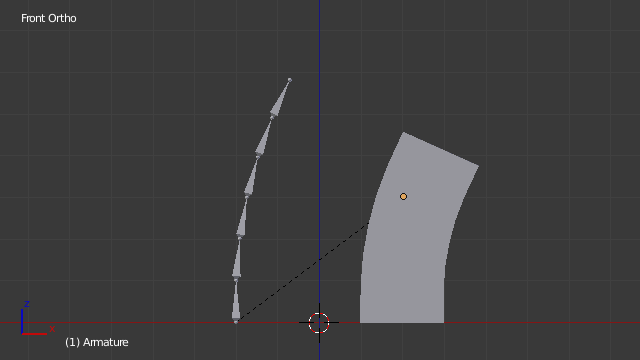

**********************
50 Rigging - Armatures
**********************

.. contents:: Contents

Introduction
============

An Armature in Blender can be thought of as similar to the armature of a real skeleton, and just like a real skeleton an Armature can consist of many bones. These bones can be moved around and anything that they are attached to or associated with will move and deform in a similar way.

An “armature” is a type of object used for rigging. Armature object borrows many ideas from real life skeletons.

Your first armature
-------------------

In order to see what we are talking about, let us try to add the default armature in Blender.

(Note that armature editing details are explained in the armatures editing section).

Open a default scene, then:

- Delete all objects in the scene. 
- Make sure the cursor is in the world origin
- Press Numpad1 to see the world in Front view. 
- Add a **Single Bone** (Add > Armature > Single Bone). 
- Press NumpadDelete to see the armature at maximum zoom. 

The default armature.

The Armature Object
-------------------

As you can see, an armature is like any other object type in Blender:

- It has a center, a position, a rotation and a scale factor. 
- It has an Object Data data-block, that can be edited in **Edit Mode**. 
- It can be linked to other scenes, and the same armature data can be reused on multiple objects. 
- All animation you do in **Object Mode** is only working on the whole object, not the armature’s bones (use the **Pose Mode** to do this). 

As armatures are designed to be posed, either for a static or animated scene, they have a specific state, called “rest position”. This is the armature’s default “shape”, the default position/rotation/scale of its bones, as set in **Edit Mode**.

In **Edit Mode**, you will always see your armature in rest position, whereas in **Object Mode** and **Pose Mode**, you usually get the current “pose” of the armature (unless you enable the **Rest Position** button of the **Armature** panel).

Armature Chapter Overview
-------------------------

In the “Armatures” section, we will only talk about armatures themselves, and specifically we will talk about:

- The basics of bones. 
- The different armature visualizations. 
- The armature structure types. 
- How to Select Bones, 
- How to Edit Armatures, 
- How to Edit Bones, 
- How to edit bones properties, 
- How to sketch armatures with the Etch-a-Ton tool, 
- How to use templates. 

Introduction
============

Bones are the base elements of armatures. The visualization of bones can be set in the Armatures Display Panel.

Structure
=========

.. image:: graphics/7.xx_Rigging_Armatures/100000000000008C000000CC89C6A6359714538F.png

The elements of a bone.

They have three elements:

- The “start joint” named **root** or **head**, 
- the “body” itself, 
- and the “end joint” named **tip** or **tail**. 

With the default armature in edit-mode, you can select the root and the tip, and move them as you do with mesh vertices.

Both root and tip (the “joints”) define the bone by their respective position.

They also have a radius property, only useful for the envelope deformation method (see below).

Roll
----

Activating **Axes** checkbox on the Armature tab > Display panel, will show local axes for each bone’s tip. The Y axis is always aligned along the bone, oriented from root to tip. So, this is the “roll” axis of the bones.

Bones Influence
---------------

.. image:: graphics/7.xx_Rigging_Armatures/10000000000000B4000000ECA3E411DFEF554149.png

A bone in Envelope visualization, in Edit Mode.

Basically, a bone controls a geometry when vertices “follow” the bone. This is like how the muscles and skin of your finger follow your finger-bone when you move a finger.

To do this, you have to define the strength of **influences** a bone has on a certain vertex.

The simplest way is to have each bone affecting those parts of the geometry that are within a given range from it. This is called the **envelope technique**, because each bone can control only the geometry “enveloped” by its own influence area.

If a bone is visualized as **Envelope**, in **Edit Mode** and in **Pose Mode** you can see the area of influence, which depends on:

- The **distance** property and 
- the root’s radius and the tip’s radius. 

Our armature in Envelope visualization, in Pose Mode.

All these influence parameters are further detailed in the skinning pages.

Selecting
=========

You can select and edit bones of armatures in **Edit Mode** and in **Pose Mode**. Here, we will see how to select bones in **Edit Mode**. Selecting bones in **Pose Mode** is similar to selecting in **Edit Mode** with a few specific differences that will be detailed in the posing part.

Similar to vertices/edges selection in meshes, there are two ways to select whole bones in **Edit Mode**:

- Directly, by selecting the bone’s body. 
- Selecting both of its joints (root and tip). 

This is an important point to understand, because selecting bones’ joints only might lead to non-obvious behavior, with respect to which bone you actually select, see the.

Note that unlike the mesh draw type the armature draw type has no effect on selection behavior. In other words, you can select a bone’s joint or body the same way regardless of the bone visualization chosen.

Selecting Bone Joints
---------------------

To select bones’ joints you have the standard selection methods.

Inverse selection
-----------------

As stated above, you have to remember that these selection tools are for bones’ joints only, not the bones’ bodies.

For example, the **Inverse** selection option Ctrl-I inverts the selection of bones’ joints, not of bones (see **Inverse selection**).

Remember that a bone is selected only if both its joints are selected. So, when the selection status of bones’ joints is inverted, a new set of bones is selected.

Inverse selection.

.. list-table::

	* - 	  - 

Selecting connected Bone Joints
-------------------------------

Another example is: when you select the root of a bone connected to its parent, you also implicitly select the tip of its parent (and vice versa).

.. list-table::

	* - Note

	* - Remember that when selecting bones’ joints, the tip of the parent bone is the “same thing” as the root of its children bones.

Selecting Bones
---------------

By RMB -clicking on a bone’s body, you will select it (and hence you will implicitly select its root and tip).

Using Shift-RMB, you can add to/remove from the selection.

You also have some **advanced selection** options, based on their relations.

You can select at once all the bones in the chain which the active (last selected) bone belongs to by using the **linked selection** tool, L.

Linked bones selection

.. list-table::

	* - 	  - 
Mirror Shift-Ctrl-M

Flip the selection from one side to another. 

Pick Shortest Path Ctrl-RMB

Selects the path from the active bone to the bone under the mouse. 

Deselecting connected Bones
---------------------------

There is a subtlety regarding connected bones.

When you have several connected bones selected, if you deselect one bone, its tip will be deselected, but not its root, if it is also the tip of another selected bone.

To understand this, look at Fig. Bone deselection in a selected chain..

Bone deselection in a selected chain.

.. list-table::

	* - 	  - 
After Shift-RMB -clicking “Bone.003”:

- “Bone.003” ‘s tip (which is same as “Bone.004” ‘s root) is deselected. 
- “Bone” is “Bone.003” ‘s parent. Therefore “Bone.003” ‘s root is same as the tip of “Bone”. Since “Bone” is still selected, its tip is selected. Thus the root of “Bone.003” remains selected. 

More/Less
---------

Reference
=========

More :kbd;`Ctrl-Numpad+` 

ToDo. 

Less :kbd;`Ctrl-Numpad-` 

ToDo. 

Parent [, Child ]

You can deselect the active bone and select its immediate parent or one of its children. 

Extend Parent Shift-[, Extend Child Shift-]

Similar to **Parent**/**Child** but it keeps the active bone in the selection. 

Similar
-------

Reference
=========

Children 

Extends the selection to all hierarchical descendant bones. 

Immediate Children 

Extends the selection to all direct child bones. 

Siblings 

Selects bones that have the same parent as the active bone. 

Length 

Selects bones with a similar bone length (between tip and tail) under the specified **Threshold**. 

Direction (Y axis) 

ToDo. 

Prefix 

ToDo. 

Suffix 

ToDo. 

Layer 

ToDo. 

Introduction
============

Reference
=========

As with any other object, you edit your armature in **Edit Mode****.**

Editing an armature means two main domains of action:

- Editing the bones – i.e. adding/inserting/deleting/extruding/sub-dividing/joining them... 
- Editing the bones’ properties – this includes key features, like transform properties (e.g. grab, scale, etc...) and relationships between bones (parenting and connecting), as well as bones’ names, influence, behavior in **Pose Mode**, etc. 

These are standard editing methods, quite similar for example to meshes editing. Blender also features a more advanced “armature sketching” tool, called Etch-a-Ton. The same tool might also be used in templating, i.e. using another armature as template for the current one...

.. list-table::

	* - Important

	* - One important thing to understand about armature editing is that you edit the **rest position** of your armature, i.e. its “default state”. An armature in its **rest position** has all bones with **no** rotation and scaled to 1.0 in their own local space.

The different poses you might create afterwards are based on this rest position. So if you modify it in **Edit Mode**, all the poses already existing will also be modified. Thus you should in general be sure that your armature is definitive before starting to skin and pose it!

.. list-table::

	* - Note

	* - Please note that some tools work on bones’ joints, while others work on bones themselves. Be careful not to get confused.

Transform
=========

Transform
---------

.. image:: graphics/7.xx_Rigging_Armatures/10000000000000A30000011D692E27BB1A63AE61.png

The Transform panel for armatures in Edit Mode.

We will not detail here the various transformations of bones, nor things like axis locking, pivot points, and so on, as they are common to most object editing, and already described here (note however, that some options, like snapping, do not seem to work, even though they are available...). The same goes for mirroring, as it is nearly the same as with mesh editing. Just keep in mind that bones’ roots and tips behave more or less like meshes’ vertices, and bones themselves act like edges in a mesh.

As you know, bones can have two types of relationships: They can be parented, and in addition connected. Parented bones behave in **Edit Mode** exactly as if they had no relations. They can be grabbed, rotated, scaled, etc. a parent bone without affecting its descendants. However, connected bones must always have parent’s tips connected to child’s roots, so by transforming a bone, you will affect all its connected parent/children/siblings.

Finally, you can edit in the **Transform** panel in the Properties region the positions and radius of both joints of the active selected bone, as well as its roll rotation.

Radius and Scaling in Envelope Visualization
--------------------------------------------

Reference
=========

When bones are displayed using **Octahedron**, **Stick** or **B-Bone** visualizations, scaling will behave as expected, similar to scaling mesh objects. When bones are displayed using **Envelope** visualization, scaling will have a different effect: it will scale the radius of the selected bones’s joints. (see: skinning part). As you control only one value (the radius), there is no axis locking here. And as usual, with connected bones, you scale at the same time the radius of the parent’s tip and of the children’s roots.

Scaling of a bone in **Octahedron** and **Envelope** visualizations.

.. list-table::

	* - 	  - 
	* - 	  - 
Note that when you resize a bone (either by directly scaling it, or by moving one of its joints), Blender automatically adjusts the end-radii of its envelope proportionally to the size of the modification. Therefore, it is advisable to place all the bones first, and only then edit these properties.

ScaleB and Envelope
-------------------

Reference
=========

activates a transform tool that is specific to armatures. It has different behavior depending on the active visualization, as explained below:

In **Envelope** visualization, it allows you to edit the influence of the selected bones (their **Distance** property, see the skinning part) – as with the “standard” scaling with this visualization (see the previous section), this is an one-value property, so there is no axis locking and such.

Envelope scaling example.

.. list-table::

	* - 	  - 
In the other visualizations, it allows you to edit the “bone size”. This seems to only have a visible effect in **B-Bone** visualization, but is available also with **Octahedron** and **Stick**... This tool in this situation has another specific behavior: While with other transform tools, the “local axes” means the object’s axes, here they are the bone’s own axes (when you lock to a local axis, by pressing the relevant key twice, the constraint is applied along the selected bone’s local axis, not the armature object’s axis).

“Bone size” scaling example.

.. list-table::

	* - 	  - 	  - 

Bone Roll
---------

In **Edit Mode**, you can control of the bones roll (i.e. the rotation around the Y axis of the bone).

However, after editing the armature, or when using euler rotation, you may want to set the bone roll.

Set Bone Roll
-------------

Reference
=========

This is a transform mode where you can edit the roll of all selected bones.

Recalculate Bone Roll
---------------------

Reference
=========

Axis Orientation 

	Local Tangent 

	Align roll relative to the axis defined by the bone and its parent.

	X, Z

	Global Axis 

	Align roll to global X, Y, Z axis.

	X, Y, Z

	Active Bone 

	Follow the rotation of the active bone. 

	View Axis 

	Set the roll to align with the view-port. 

	Cursor 

	Set the roll towards the 3D cursor. 

Flip Axis 

Reverse the axis direction. 

Shortest Rotation 

Avoids rolling the bone over 90 degrees from its current value. 

Switch Direction
----------------

Reference
=========

This tool is not available from the **Armature** menu, but only from the **Specials** pop-up menu W. It allows you to switch the direction of the selected bones (i.e. their root will become their tip, and vice versa).

Switching the direction of a bone will generally break the chain(s) it belongs to. However, if you switch a whole (part of a) chain, the switched bones will still be parented/connected, but in “reversed order”. See the Fig. Switching example..

Switching example.

.. list-table::

	* - 	  - 

Editing Bones
=============

Reference
=========

You will learn here how to add (Adding Bones), delete (Deleting Bones) or subdivide (Subdividing Bones) bones. We will also see how to prevent any bone transformation (Locking Bones) in **Edit Mode**, and the option that features an automatic mirroring (X-Axis Mirror Editing) of editing actions along the X axis.

Adding Bones
------------

To add bones to your armature, you have more or less the same options as when editing meshes:

- **Add** menu, 
- extrusion, 
- Ctrl-LMB clicks, 
- fill between joints, 
- duplication. 

Add Menu
--------

Reference
=========

This bone will be:

- of one Blender Unit of length, 
- oriented towards the global Z axis, 
- with its root placed at the 3D cursor position, 
- with no relationship with any other bone of the armature. 

Extrusion
---------

Reference
=========

When you press E, for each selected tip (either explicitly or implicitly), a new bone is created. This bone will be the child of “its” tip owner, and connected to it. As usual, once extrusion is done, only the new bones’ tips are selected, and in grab mode, so you can place them to your liking. See Fig. Extrusion example..

Extrusion example.

.. list-table::

	* - 	  - 
You also can use the rotating/scaling extrusions, as with meshes, by pressing respectively E-R and E-S – as well as locked extrusion along a global or local axis.

Mirror extrusion example.

.. list-table::

	* - 	  - 
Bones have an extra “mirror extruding” tool. By default, it behaves exactly like the standard extrusion. But once you have enabled the X-Axis mirror editing option (see X-Axis Mirror Editing), each extruded tip will produce **two new bones**, having the same name except for the “_L”/ “_R” suffix (for left/right, see the next page). The “_L” bone behaves like the single one produced by the default extrusion – you can grab/rotate/scale it exactly the same way. The “_R” bone is its mirror counterpart (along the armature’s local X axis), see Fig. Mirror extrusion example..

.. list-table::

	* - Warning

	* - Canceling the extrude action causes the newly created bones to snap back to the source position, (creating zero length bones). These will be removed when exiting Edit Mode, however, they can cause confusion and it’s unlikely you want to keep them. If you realize the problem immediately undo the extrude action.

Mouse Clicks
------------

Reference
=========

If at least one bone is selected, Ctrl-LMB -clicking adds a new bone.

About the new bone’s tip:

- after you Ctrl-LMB -clicked it becomes the active element in the armature, 
- it appears to be right where you clicked, but... 
- ...(as in mesh editing) it will be on the plane parallel to the view and passing through the 3D cursor. 

The position of the root and the parenting of the new bone depends on the active element:

Ctrl-clicking when the active element is a bone.

If the active element is a **bone**

- the new bone’s root is placed on the active bone’s tip 
- the new bone is parented and connected to the active bone (check the Outliner in Fig. Ctrl-clicking when the active element is a tip.). 

Ctrl-clicking when the active element is a tip.

If the active element is a **tip** :

- the new bone’s root is placed on the active tip 
- the new bone is parented and connected to the bone owning the active tip (check the Outliner in Fig. Ctrl-clicking when the active element is a tip.). 

Ctrl-clicking when the active element is a disconnected root.

If the active element is a **disconnected root** :

- the new bone’s root is placed on the active root 
- the new bone is **not** parented to the bone owning the active root (check the Outliner in Fig. Ctrl-clicking when the active element is a disconnected root.). 

And hence the new bone will **not** be connected to any bone.

Ctrl-clicking when the active element is a connected root.

If the active element is a **connected root** :

- the new bone’s root is placed on the active root 
- the new bone **is** parented and connected to the parent of the bone owning the active root (check the Outliner in Fig. Ctrl-clicking when the active element is a connected root.). 

This should be obvious because if the active element is a connected root then the active element is also the tip of the parent bone, so it is the same as the second case.

As the tip of the new bone becomes the active element, you can repeat these Ctrl-RMB several times, to consecutively add several bones to the end of the same chain.

Fill between joints
-------------------

Reference
=========

The main use of this tool is to create one bone between two selected joints by pressing F, similar to how in mesh editing you can “create edges/faces”.

If you have one root and one tip selected, the new bone:

- Will have the root placed on the selected tip. 
- Will have the tip placed on the selected root. 
- Will be parented and connected to the bone owning the selected tip. 

Fill between a tip and a root.

.. list-table::

	* - 	  - 
If you have two tips selected, the new bone:

- Will have the root placed on the selected tip closest to the 3D cursor. 
- Will have the tip placed on the other selected tip. 
- Will be parented and connected to the bone owning the tip used as the new bone’s root. 

Fill between tips.

.. list-table::

	* - 	  - 
If you have two roots selected, you will face a small problem due to the event system in Blender not updating the interface in real time.

When clicking F, similar to the previous case, you will see a new bone:

- With the root placed on the selected root closest to the 3D cursor. 
- With the tip placed on the other selected root. 
- Parented and connected to the bone owning the root used as the new bone’s root. 

If you try to move the new bone, Blender will update the interface and you will see that the new bone’s root moves to the tip of the parent bone.

Fill between roots.

.. list-table::

	* - 	  - 
Clicking F with only one bone joint selected will create a bone from the selected joint to the 3D cursor position, and it will not parent it to any bone in the armature.

Fill with only one bone joint selected.

.. list-table::

	* - 	  - 
You will get an error when:

- trying to fill two joints of the same bone, or 
- trying to fill more than two bone joints. 

Duplication
-----------

Reference
=========

.. list-table::

	* - Note

	* - This tool works on selected bones; selected joints are ignored.

As in mesh editing,

- the selected bones will be duplicated, 
- the duplicates become the selected elements and they are placed in grab mode, so you can move them wherever you like. 

If you select part of a chain, by duplicating it you will get a copy of the selected chain, so the copied bones are interconnected exactly like the original ones.

The duplicate of a bone which is parented to another bone will also be parented to the same bone, even if the root bone is not selected for the duplication. Be aware, though, that if a bone is parented **and** connected to an unselected bone, its copy will be parented, but **not** connected to the unselected bone (see Fig. Duplication example.).

Duplication example.

.. list-table::

	* - 	  - 

Split
-----

Reference
=========

Disconnects the selection and clears the parent at the start and end. ToDo.

Deleting Bones
--------------

You have two ways to remove bones from an armature: the standard deletion, and merging several bones in one.

Standard deletion
-----------------

Reference
=========

Note
====

To delete a bone, you can:

- press DEL
- use the menu Armature > Delete

If you delete a bone in a chain, its child(ren) will be automatically re-parented to its own parent, but **not** connected, to avoid deforming the whole armature.

Deletion example.

.. list-table::

	* - 	  - 

Dissolve
--------

Reference
=========

ToDo.

Merge
-----

Reference
=========

You can merge together several selected bones, as long as they form a chain. Each sub-chain formed by the selected bones will give one bone, whose root will be the root of the root bone, and whose tip will be the tip of the tip bone.

Confirm by clicking on Merge Selected Bones > Within Chains.

If another (non-selected) chain origins from inside of the merged chain of bones, it will be parented to the resultant merged bone. If they were connected, it will be connected to the new bone.

Here is a strange subtlety (see Fig. Merge example.): even though connected (the root bone of the unmerged chain has no root sphere), the bones are not visually connected. This will be done as soon as you edit one bone, differently depending in which chain is the edited bone (compare the bottom two images of the example to understand this better).

Merge example.

.. list-table::

	* - 	  - 
	* - 	  - 

Subdividing Bones
-----------------

Reference
=========

You can subdivide bones, to get two or more bones where there was just one bone. The tool will subdivide all selected bones, preserving the existing relationships: the bones created from a subdivision always form a connected chain of bones.

To create two bones out of each selected bone:

- select Armature > Subdivide from the header menu. 

To create an arbitrary number of bones from each selected bone in the Subdivide Multi Operator panel.

Number of Cuts 

Specifies the number of cuts. As in mesh editing, if you set **n** cuts, you will get **n** + 1 bones for each selected bone. 

Subdivision example.

.. list-table::

	* - 	  - 

Locking Bones
-------------

You can prevent a bone from being transformed in **Edit Mode** in several ways:

- All bones can be locked clicking on the **Lock** checkbox of their Transform panel in the **Bones** tab; 
- Press Shift-WToggle Bone Options > Locked
- Select Armature > Bone Settings > Toggle a Setting). 

**If the root of a locked bone is connected to the tip of an unlocked bone, it will not be locked**, i.e. you will be able to move it to your liking. This means that in a chain of connected bones, when you lock one bone, you only really lock its tip. With unconnected bones, the locking is effective on both joints of the bone.

X-Axis Mirror Editing
---------------------

Another very useful tool is the **X-Axis Mirror** editing option by Tool panel > Armature Options, while Armature is selected in **Edit Mode**. When you have pairs of bones of the same name with just a different “side suffix” (e.g. ”.R”/”.L”, or “_right”/”_left” ...), once this option is enabled, each time you transform (move/rotate/scale...) a bone, its “other side” counterpart will be transformed accordingly, through a symmetry along the armature local X axis. As most rigs have at least one axis of symmetry (animals, humans, ...), it is an easy way to spare you half of the editing work!

See also

naming bones.

Separating Bones in a new Armature
----------------------------------

You can, as with meshes, separate the selected bones in a new armature object Armature > Separate, and of course, in **Object Mode**, you can join all selected armatures in one Object > Join Objects,

Naming
======

Reference
=========

You can rename your bones, either using the **name** field of the **Item** panel in the 3D Views, for the active bone, or using the **name** field in each bone of the **Bones** tab in **Edit Mode**.

Blender also provides you some tools that take advantage of bones named in a left/right symmetry fashion, and others that automatically name the bones of an armature. Let us look at this in detail.

Naming Conventions
------------------

Naming conventions in Blender are not only useful for you in finding the right bone, but also to tell Blender when any two of them are counterparts.

In case your armature can be mirrored in half (i.e. it is bilaterally symmetrical), it is worthwhile to stick to a left/right naming convention. This will enable you to use some tools that will probably save you time and effort (like the **X-Axis Mirror** editing tool we saw above...).

.. image:: graphics/7.xx_Rigging_Armatures/10000000000001E000000122594AAFB7C581A6B5.png

An example of left/right bone naming in a simple rig.

- First you should give your bones meaningful base-names, like “leg”, “arm”, “finger”, “back”, “foot”, etc.
- If you have a bone that has a copy on the other side (a pair), like an arm, give it one of the following separators:
- Examples of valid saparators:
- 
- - Left/right separators can be either the second position “L**_**calfbone” or last-but-one “calfbone**.**R” 
- - If there is a lower or upper case “L”, “R”, “left” or “right”, Blender handles the counterpart correctly. See below for a list of valid separators. Pick one and stick to it as close as possible when rigging; it will pay off. 

- - (nothing): handLeft –> handRight 
- - _ (underscore): hand**_**L –> hand**_**R 
- - . (dot): hand**.**l –> hand**.**r 
- - - (dash): hand**-**l –> hand**-**r 
- - `` `` (space): hand LEFT –> hand RIGHT 

.. list-table::

	* - Note

	* - 
- - - Before Blender handles an armature for mirroring or flipping, it first removes the number extension, e.g. ”.001”.
- You can copy a bone named “bla.L” and flip it over using Specials > Flip Left-Right Names. Blender will name the copy “bla.L.001” and flipping the name will give you “bla.R”.

Flip Name
---------

Reference
=========

You can flip left/right markers (see above) in selected bone names, using Armature > Flip Name. This can be useful if you have constructed half of a symmetrical rig (marked for a left or right side) and duplicated and mirrored it, and want to update the names for the new side. Blender will swap text in bone names according to the above naming conventions, and remove number extensions if possible.

AutoName
--------

Reference
=========

The three **AutoName** entries of the **Armature** and **Specials** menu W allows you to automatically add a suffix to all selected bones, based on the position of their root relative to the armature center and its local coordinates:

AutoName Left/Right 

will add the ”.L” suffix to all bones with a **positive** X-coordinate root, and the ”.R” suffix to all bones with a **negative** X-coordinate root. If the root is exactly at 0.0 on the X-axis, the X-coordinate of the tip is used. If both joints are at 0.0 on the X-axis, the bone will just get a period suffix, with no “L”/ “R” (as Blender cannot decide whether it is a left or right bone...). 

AutoName Front/Back 

will add the ”.Bk” suffix to all bones with a **positive** Y-coordinate root, and the ”.Fr” suffix to all bones with a **negative** Y-coordinate root. The same as with **AutoName Left-Right** goes for 0.0 Y-coordinate bones... 

AutoName Top/Bottom 

will add the ”.Top” suffix to all bones with a **positive** Z-coordinate root, and the ”.Bot” suffix to all bones with a **negative** Z-coordinate root. The same as with **AutoName Left-Right** goes for 0.0 Z-coordinate bones... 

Parenting
=========

Reference
=========

You can edit the relationships between bones (and hence create/modify the chains of bones) both from the 3D Views and the Properties editor. Whatever method you prefer, it’s always a matter of deciding, for each bone, if it has to be parented to another one, and if so, if it should be connected to it.

To parent and/or connect bones, you can:

- In a 3D View, select the bone and **then** its future parent, and press Ctrl-P (or Armature > Parent > Make Parent...). In the small **Make Parent** menu that pops up, choose **Connected** if you want the child to be connected to its parent, else click on **Keep Offset**. If you have selected more than two bones, they will all be parented to the last selected one. If you only select one already-parented bone, or all selected bones are already parented to the last selected one, your only choice is to connect them, if not already done. If you select only one non-parented bone, you will get the **Need selected bone(s)** error message...

.. list-table::

	* - Note

	* - With this method, the newly-children bones will not be scaled nor rotated – they will just be translated if you chose to connect them to their parent’s tip.

- In the Properties editor, **Bones** tab, for each selected bone, you can select its parent in the **Parent** data-ID to the upper right corner of its Relations panel. If you want them to be connected, just enable the checkbox to the right of the list.

.. list-table::

	* - Note

	* - 
Parenting example.

.. list-table::

	* - 	  - 
	* - 	  - 
To disconnect and/or free bones, you can:

- In a 3D View, select the desired bones, and press Alt-P (or Armature > Parent > Clear Parent...). In the small **Clear Parent** menu that pops up, choose **Clear Parent** to completely free all selected bones, or **Disconnect Bone** if you just want to break their connections. 
- In the Properties editor, **Bones** tab, for each selected bone, you can select no parent in the **Parent** data-ID of its Relations panel, to free it completely. If you just want to disconnect it from its parent, disable the **Connected** checkbox. 

Note that relationships with non-selected children are never modified.

Properties
==========

Reference
=========

Most bones’ properties (excepted the transform ones) are regrouped in each bone’s panels, in the **Bones** tab in **Edit Mode**. Let us detail them.

Draw Wire 

ToDo. 

Deform 

Multiply Vertex Group by Envelope 

	These settings control how the bone influences its geometry, along with the bones’ joints radius. This will be detailed in the skinning part.

Inherit Rotation 

These settings affect the behavior of children bones while transforming their parent in **Pose Mode**, so this will be detailed in the posing part ! 

Inherit Scale 

ToDo. 

Lock 

This will prevent all editing of the bone in **Edit Mode**; 

Skeleton Sketching
==================

.. image:: graphics/7.xx_Rigging_Armatures/10000000000000F0000000BCDCBDEDD30574E186.png

The Bone Sketching panel.

If you think that creating a whole rig by hand, bone after bone, is quite boring, be happy: some Blender developers had the same feeling, and created the Skeleton Sketching tool, formerly the Etch-a-ton tool, which basically allows you to “draw” (sketch) whole chains of bones at once.

Skeleton Sketching is obviously only available in **Edit Mode**, in the 3D Views. You control it through its **Skeleton Sketching** panel in the **Transform panel**, which you can open with N. Use the mouse LMB to draw strokes, and RMB for gestures. Showing its tool panel will not enable sketching. You must tick the checkbox next to **Skeleton Sketching** to start drawing bone chains (otherwise, you remain in the standard **Edit Mode**...).

Sketching is done in two steps:

- Drawing Chains (called “strokes”). Each stroke corresponds to a chain of bones. 
- Converting to Bones, using different methods. 

The **point of view** is important, as it determines the future bones’ roll angle: the Z axis of a future bone will be aligned with the view Z axis of the 3D View in which you draw its “parent” stroke (unless you use the **Template** converting method...). Strokes are drawn in the current view plane passing through the 3D cursor, but you can create somewhat “3D” strokes using the **Adjust** drawing option in different views (see below).

If you enable the small **Quick Sketch** option, the two steps are merged into one: once you have finalized the drawing of a stroke (see Drawing Chains), it is immediately converted to bones (using the current active method) and deleted. This option makes bone sketching quick and efficient, but you lose all the advanced stroke editing possibilities.

Sketches are **not** saved into blend-files, so you cannot interrupt a sketching session without losing all your work! Note also that the sketching is common to the whole Blender session, i.e. there is only one set of strokes (one sketch) in Blender, and not one per armature, or even per file...

Drawing Chains
--------------

So, each stroke you draw will be a chain of bones, oriented from the starting point (the reddest or most orange part of the stroke) to its end (its whitest part). A stroke is made of several segments, delimited by small black dots. There will be at least one bone per segment (except with the **Template** conversion method, see next page), so all black points represents future bones’ joints. There are two types of segments, which can be mixed together:

.. image:: graphics/7.xx_Rigging_Armatures/1000000000000208000001548916CCE1ADE15141.png

Strokes example. From top to bottom: A selected polygonal stroke of four straight segments, oriented from left to right. An unselected free stroke of two segments, oriented from left to right. A mixed stroke, with one straight segment between two free ones, right to left.

Straight Segments
-----------------

To create a straight segment, click LMB at its starting point. Then move the mouse cursor, without pressing any button, a dashed red line represents the future segment. Click LMB again to finalize it. Each straight segment of a stroke will always create one and only one bone, whatever convert algorithm you use (except for the **Template** conversion method).

Drawing straight segments example.

.. list-table::

	* - 	  - 	  - 

Free Segments
-------------

To create a free (curved) segment, click and hold LMB at its starting point. Then draw your segment by moving the mouse cursor – as in any paint program! Release LMB to finalize the segment. You will then be creating a new straight segment, so if you would rather start a new free segment, you must immediately re-press LMB.

The free segments of a stroke will create different number of bones, in different manners, depending on the conversion method used. The future bones’ joints for the current selected method are represented by small green dots for each one of those segments, for the selected strokes only.

The free segment drawing uses the same **Manhattan Distance** setting as the grease pencil tool (**User Preferences**, **Edit Methods** “panel”, **Grease Pencil** group) to control where and when to add a new point to the segment. So if you feel your free segments are too detailed, raise this value a bit, and if you find them too jagged, lower it.

Drawing free segments example.

.. list-table::

	* - 	  - 
	* - 	  - 
You finalize a whole stroke by clicking RMB. You can cancel the stroke you are drawing by pressing Esc. You can also snap strokes to underlying meshes by holding Ctrl while drawing. By the way, the **Peel Objects** button at the bottom of the **Bone Sketching** panel is the same thing as the “monkey” button of the snapping header controls shown when **Volume** snap element is selected. See the snap to mesh page for details.

Selecting Strokes
-----------------

A stroke can be selected (materialized by a solid red-to-white line), or not (shown as an orange-to-white line) - see (Strokes example) above. As usual, you select a stroke by clicking RMB on it, you add one to/remove one from the current selection with a Shift-RMB click, and A (de)selects all strokes...

Deleting
--------

Clicking on the **Delete** button (**Bone Sketching** panel) deletes the selected strokes (be careful, no warning/confirmation pop-up menu here). See also Gestures.

Modifying Strokes
-----------------

You can adjust, or “redraw” your strokes by enabling the **Overdraw Sketching** option of the **Bone Sketching** panel. This will modify the behavior of the strokes drawing (i.e. LMB clicks and/or hold): when you draw, you will not create a new stroke, but rather modify the nearest one.

The part of the old stroke that will be replaced by the new one are drawn in gray. This option does not take into account stroke selection, i.e. all strokes can be modified this way, not just the selected ones... Note also that even if it is enabled, when you draw too far away from any other existing stroke, you will not modify any of them, but rather create a new one, as if **Overdraw Sketching** was disabled.

Adjusting stroke example.

.. list-table::

	* - 	  - 
.. list-table::

	* - Warning

	* - There is no undo/redo for sketch drawing...

Gestures
--------

There quite a few things about strokes editing that are only available through gestures. Gestures are started by clicking and holding Shift-LMB (when you are not already drawing a stroke), and materialized by blue-to-white lines. A gesture can affect several strokes at once.

There is no direct way to cancel a gesture once you have started “drawing” it. So the best thing to do, if you change your mind (or made a “false move”), is to continue to draw until you get a disgusting scribble, crossing your stroke several times. In short, something that the gesture system would never recognize!

.. list-table::

	* - 	  - 	  - 

Cut
---

To **cut** a segment (i.e. add a new black dot inside it, making two segments out of one), “draw” a straight line crossing the chosen segment where you want to split it.

.. list-table::

	* - 	  - 

Delete
------

To **delete** a stroke, draw a “V” crossing the stroke to delete twice.

.. list-table::

	* - 	  - 

Reverse
-------

To **reverse** a stroke (i.e. the future chain of bones will be reversed), draw a “C” crossing twice the stroke to reverse.

.. list-table::

	* - 	  - 

Converting to Bones
-------------------

Once you have one or more selected strokes, you can convert them to bones, using either the **Convert** button of the **Bone Sketching** panel, or the corresponding gesture (see Gestures). Each selected stroke will generate a chain of bones, oriented from its reddest end to its whitest one. Note that converting a stroke does not delete it.

There are four different conversion methods with three “simple” ones, and one more advanced and complex, **Template**, that reuses bones from the same armature or from another one as a template for the strokes to convert, and which is detailed in the next page. Anyway, remember that straight segments are always converted to one and only one bone (except for the **Template** conversion method), and that the future bones’ joints are shown as green dots on selected free segments.

Remember also that the roll rotation of the created bones has been set during their “parent” stroke drawing (except for the **Template** conversion method) - their Z axis will be aligned with the view Z axis of the active 3D View at draw time.

Fixed
-----

With this method, each free segment of the selected strokes will be uniformly divided in **n** parts (set in **Number** number button), i.e. will give **n** bones.

.. list-table::

	* - 	  - 

Adaptive
--------

With this method, each free segment of the selected strokes will create as many bones as necessary to follow its shape closely enough. This “closely enough” parameter being set by the **Threshold** number button; higher values giving more bones, following more closely the segments’ shape. So the more twisted a free segment, the more bones it will generate.

.. list-table::

	* - 	  - 

Length
------

With this method, each free segment of the selected strokes will create as many bones as necessary, so that none of them is longer than the **Length** number button value (in Blender Units).

.. list-table::

	* - 	  - 	  - 

Retarget
--------

Retarget template bone chain to stroke.

Template 

Template armature that will be retargeted to the stroke. This is a more complex topic, detailed in its own page. 

Retarget roll mode 

	None 

	Do not adjust roll. 

	View 

	Roll bones to face the view. 

	Joint 

	Roll bone to original joint plane offset. 

Autoname 

Todo. 

Number 

Todo. 

Side 

Todo. 

Armature Templating
===================

The idea of templating is to use an already existing armature as base (“template”) to create a new armature. It differs from a simple copy in that you can directly define the new armature different in some aspects than its reference rig.

In Blender, the only templating tool is the bone sketching one (Etch-a-ton, described in the previous page), with its **Template** conversion method, so you should have read its page before this one!

Using Bone Sketching
--------------------

Reference
=========

The **Template** conversion method of **Bone Sketching** tool maps a copy of existing bones to each selected stroke. The new bones will inherit some of their properties (influence, number of segments, etc.) from the corresponding bones in the template, but they will acquire their lengths, rolls and rotation from the sketch; so these properties would be different as compared to the template.

This is easier to understand with some examples.

In the following image, “armature.002” is set as the template, and the stroke maps with “chain_a” of this template. None of the bones are selected in the template. Note that there is no second stroke to map with chain “chain_b” of the template. The result is shown at right: Blender creates a copy of “chain_a” and matches the bones with the stroke.

Blender also creates a copy of “chain_b”, but this chain is not altered in any way; because this command can map only one selected chain with a stroke.

In the following example, no template is selected. (In other words, all the action is within the armature itself.)

Two bones are selected in “chain_b”, and the property panel is set to map the joints with the stroke. So these two selected bones are copied and the newly created copy of the chain is matched with the stroke. (Note that the newly created bones are named in continuation of the original chain.)

.. list-table::

	* - 	  - 	  - 
If you had selected both the chains (“Chain_a” and “Chain_b”), you would have still got the same result as in the example above, because the command maps to stroke only one selected chain.

In the following example also, only one chain is selected, but there are three strokes to map to. In this case, the same chain is copied three times (once for each stroke) and then mapped to individual strokes. Note how a two-bone chain is fitted to a three-segment stroke.

The newly created bones are numbered sequentially, after the original bones’ names.

.. list-table::

	* - 	  - 
OK now, here are some important ground rules:

- This conversion method can use as reference bones either the selected bones in the **currently** edited armature, or **all** bones from another armature. In general, it is a better idea to create new “templated” bones inside the “reference” armature, so you can precisely select which bones to use as template – if you want the new bones in a different armature, you can then use the **Separate**and optionally **Join** commands... 
- This tool only considers **one** chain of bones, so it is better to select only one chain of bones inside the current armature (or use a single-chain armature object as template). Else, the chain of the template containing the first created bones will be mapped to the selected strokes, and the other chains will just be “copied” **as is**, without any modification. 
- This tool maps the same chain of bones on all selected strokes, so you cannot use multiple strokes to map a multi-chains template – you will rather get a whole set of new bones for each selected stroke! 
- If you have strokes only made of straight segments, they must have **at least** as much segments as there are bones in the template chain (else, the newly created chain is not mapped at all to the stroke, and remains an exact duplicate of its template). If there are more segments than necessary, the conversion algorithm will chose the best “joints” for the bones to fit to the reference chain, using the same influence settings as for free segments (**Angle**, **Length** and **Definition** settings, see below). 
- If you try to **Convert** without template bones (i.e. either an empty armature selected as template, or no bones selected in the current edited armature), you will get the error message No Template and no deforming bones selected, and nothing will occur. 

The **Skeleton Sketching** panel with **Retarget** conversion method enabled.

.. list-table::

	* - 	  - 
Now, here are the settings of this conversion method:

No, View, Joint buttons 

	These three toggle buttons (mutually exclusive) control how the roll angle of newly created bones is affected:

	No 

	Do not alter the bones roll (i.e. the new bones’ rolls fit their reference ones). 

	View 

	Roll each bone so that one of its X, Y or Z local axis is aligned (as much as possible) with the current view’s Z axis. 

	Joint 

	New bones roll fit their original rotation (as **No** option), but with regards to the bend of the joint with its parent. 

Templating: bone roll example.

.. list-table::

	* - 	  - 	  - 
The “Bone.003” to “Bone.005” chain is the mapped-to-stroke version of “Bone” to “Bone.002” selected one, and “Bone.001” has a modified roll angle.

Template 

In this data-ID you can select the armature to use as template. If you choose **None**, the selected bones from the currently edited armature will be used as reference, else all bones of the other armature will be used. 

**Angle**, **Length**, **Definition** are numeric fields. 

	These settings control how the template is mapped to the selected strokes. Each one can have a value between (0.0 and 10.0), the default being 1.0.

	Angle 

	Controls the influence of the angle of the joints (i.e. angle between bones). The higher this value, the more the conversion process will try to preserve these joints angle in the new chain. 

	Length 

	Controls the influence of the bones’ length. The higher this value, the more the conversion process will try to preserve these lengths in the new bones. 

	Definition 

	Controls the influence of the stroke’s shape. The higher this value, the more the conversion process will try to follow the stroke with the new chain. 

Examples of Template conversions for various influence weights values, with one stroke quite similar to the template chain’s shape, and one stroke very different.

Side and Number text fields, **auto** button 

These control how the new bones are named. By default, they just take the same names as the originals from the template, except for the final number, increased as needed. However, if the template bones have “&s” somewhere in their name, this “placeholder” will be replaced in the “templated” bones’ names by the content of the **Side** text field. Similarly, a “&n” placeholder will be replaced by the **Number** field content. If you enable the small **auto** button, the **Number** field content is auto-generated, producing a number starting from nothing, and increased each time you press the **Convert** button, and the “&s” placeholder is replaced by the side of the bone (relative to the local X axis: “r” for negative X values, “l” for positive ones). 

Naming and placeholders, using a simple leg template.

.. list-table::

	* - 	  - 	  - 
Auto naming and placeholders, using a simple leg template.

.. list-table::

	* - 	  - 	  - 
Static text line 

	The line just above the **Peel Objects** button gives you two informations:

- The **n** joints part gives you the number of joints (i.e. bones’ joints, with connected joints considered as one joint), either from the selected bones of the edited armature, or in the whole other template armature. 
- The second part is only present when another armature has been selected as template – it gives you the **root bone’s name** of the chain that will be mapped to the strokes. Or, while you are drawing a stroke with straight segments, the name of the bone corresponding to the current segment (and “Done” when you have enough segments for all bones in the template chain). 

Introduction
============

Reference
=========

When bones are selected (hence in **Edit Mode** and **Pose Mode**), their properties are shown in the **Bone** tab of the Properties editor. This shows different panels used to control features of each selected bone; the panels change depending on which mode you are working in.

The Bone tab.

Relations 

In this panel you can arrange sets of bones in different layers for easier manipulation. 

Display 

Display panel lets you customize the look of your bones taking the shape of another existing object. 

Deform 

In this panel you can set basic deformation properties of the bones. 

Transform
---------

The Transform panel (edit mode).

When in edit mode you can use this panel to control position and roll of individual bones.

When in pose mode you can only set location for the main bone, and you can now set rotation and scale.

The Transform panel (pose mode).

.. list-table::

	* - Note

	* - This mode is only available in Edit Pose Modes.

Transform Locks
---------------

The Transform Locks panel.

This panel appears only in pose mode and allows you to restrict position, rotation and scale by axis on each bone in the armature.

.. list-table::

	* - Note

	* - This mode is only available in Pose Mode.

Inverse Kinematics
------------------

The Inverse Kinematics panel.

This panel controls the way a bone or set of bones behave when linked in an inverse kinematic chain.

.. list-table::

	* - Note

	* - This mode is only available in Pose Mode.

Custom Properties
-----------------

See the Custom Properties page for more information.

Bendy Bones
===========

Bendy Bones (B-Bones) are an easy way to replace long chains of many small rigid bones. A common use case for curve bones is to model spine columns or facial bones.

Technical Details
-----------------

Blender treats the bone as a section of a Bézier curve passing through the bones’ joints. Each **Segments** will bend and roll the to follow this invisible curve representing a tessellated point of the Bézier curve. The control points at each end of the curve are the endpoints of the bone. The shape of the B-Bones can be controlled using a series of properties or indirectly through the neighboring bones (i.e. first child and parent). The properties construct handles on either end of the bone to control the curvature.

When using the B-bone as a constraint target Data ID offers an option to follow the curvature.

.. list-table::

	* - Note 

	* - However, if the bone is used as an target rather than to deform geometry, the roll is not taken in account.

Display
-------

You can see these segments only if bones are visualized as **B-bones**.

When not visualized as **B-Bone** s, bones are always shown as rigid sticks, even though the bone segments are still present and effective. This means that even in e.g. **Octahedron** visualization, if some bones in a chain have several segments, they will nonetheless smoothly deform their geometry...

Rest Pose
---------

The initial shape of a B-Bone can be defined in Edit Mode as a rest pose of that bone. This is useful for curved facial features like curved eyebrows or mouths.

B-Bones have two sets of the Bendy Bone properties – one for Edit mode (i.e. the Rest Pose/Base Rig) and another for Pose Mode – adding together their values to get the final transforms.

Example
-------

.. list-table::

	* - 	  - 
	* - 	  - 
In Fig. The OLD B-Bones, in Edit Mode. ToDo. we connected three bones, each one made of five segments.

Look at Fig. The same armature in Object Mode., we can see how the bones’ segments smoothly “blend” into each other, even for roll.

.. image:: graphics/7.xx_Rigging_Armatures/10000000000002440000015434B8992A866CEAC9.png

An armature in Pose Mode, B-Bone visualization: Bone.003 has one segment, Bone.004 has four, and Bone.005 has sixteen.

Options
-------

Segments
--------

The **Segments** number button allows you to set the number of segments, which the given bone is subdivided into. Segments are small, rigid linked child bones that interpolate between the root and the tip. The higher this setting, the smoother “bends” the bone, but the heavier the pose calculations...

Curve XY Offsets
----------------

Applies an offsets the curve handle positions on the plane perpendicular to the bone’s primary (Y) axis. As a result, the handle moves per-axis (XY) further from its original location, causing the curve to bend.

Roll
----

Roll In, Out 

The roll value (or twisting around the main Y axis of the bone) is interpolated per-segment, between the start and end roll values. It is applied as a rotational offsets on top of the previous rotation. 

Inherit End Roll 

ToDo. 

Scale
-----

Scale In, Out 

Scaling factor that adjusts the thickness of each segment for X and Z axes only, i.e. length is not affected. Similar to **Roll** it is interpolated per-segment. 

Easing
------

Ease In, Out 

	The **Ease In/Out** number buttons, change the “length” of the “auto” Bézier handle to control the “root handle” and “tip handle” of the bone, respectively.

	These values are proportional to the default length, which of course automatically varies depending on bone length, angle with the handle reference, and so on.

Ease In/Out settings example, with a materialized Bézier curve.

.. list-table::

	* - 	  - 

Custom Handle Reference
-----------------------

B-Bones can use custom bones as their reference bone handles, instead of only using the parent/child bones. To do so, enable the **Use Custom Reference Handles** toggle in Pose Mode. If none are specified, then the BBone will only use the Bendy Bone properties. When the option is on, just use the specified bones instead of using trying looking at the bone’s neighbors.

Relative 

Instead of using the endpoints of the bones as absolute points in 3D space it computes how far the reference bone has moved away from its rest pose. The delta transformation is then applied as to the bone’s own endpoints to get the handle locations. This is useful if the custom control bone is far away from its target. 

.. list-table::

	* - Tip

	* - Keying Set

Example
-------

Visualization of the Bendy Bones properties.

Relations
=========

The Relations panel.

In this panel you can arrange sets of bones in different layers for easier manipulation.

Bone Layers
-----------

Reference
=========

Moving bones between layers
---------------------------

Obviously, you have to be in **Edit Mode** or **Pose Mode** to move bones between layers. Note that as with objects, bones can lay in several layers at once, just use the usual Shift-LMB clicks... First of all, you have to select the chosen bone(s)!

- In the Properties editor, use the “layer buttons” of each selected bone Relations panel (**Bones** tab) to control in which layer(s) it lays. 
- In the **3D View** editor, use the menu Armature > Move Bone To Layer or Pose > Move Bone To Layer or press M to show the usual pop-up layers menu. Note that this way, you assign the same layers to all selected bones. 

Bone Group
----------

Reference
=========

The Bone Group data-ID.

To assign a selected bone to a given bone group use the **Bone Group** data-ID.

Object Children
---------------

Reference
=========

Relative Parenting 

ToDo. 

Parenting
---------

Parent 

A data-ID to select the bone to set as a parent. 

Connected 

The **Connected** checkbox set the head of the bone to be connected with its parent root. 

Transformations
---------------

Bones relationships have effects on transformations behavior.

By default, children bones inherit:

- Their parent position, with their own offset of course. 
- Their parent rotation (i.e. they keep a constant rotation relatively to their parent). 
- Their parent scale, here again with their own offset. 

Examples of transforming parented/connected bones.

.. list-table::

	* - 	  - 	  - 
Exactly like standard children objects. You can modify this behavior on a per-bone basis, using the Relations panel in the **Bones** tab:

Relations panel in Pose Mode.

Inherit Rotation 

When disabled, this will “break” the rotation relationship to the bone’s parent. This means that the child will keep its rotation in the armature object space when its parent is rotated. 

Inherit Scale 

When disabled, this will “break” the scale relationship to the bone’s parent. 

These inheriting behaviors propagate along the bones’ hierarchy. So when you scale down a bone, all its descendants are by default scaled down accordingly. However, if you set one bone’s **Inherit Scale** or **Inherit Rotation** property on in this “family”, this will break the scaling propagation, i.e. this bone **and all its descendants** will no longer be affected when you scale one of its ancestors.

Examples of transforming parented/connected bones with Inherit Rotation disabled.

.. list-table::

	* - 	  - 	  - 
Connected bones have another specificity: they cannot be translated. Indeed, as their root must be at their parent’s tip, if you do not move the parent, you cannot move the child’s root, but only its tip, which leads to a child rotation. This is exactly what happens, when you press G with a connected bone selected, Blender automatically switches to rotation operation.

Bones relationships also have important consequences on how selections of multiple bones behave when transformed. There are many different situations which may not be included on this list, however, this should give a good idea of the problem:

- Non-related selected bones are transformed independently, as usual. 

Scaling bones, some of them related.

- When several bones of the same “family” are selected, **only** the “most parent” ones are really transformed – the descendants are just handled through the parent relationship process, as if they were not selected (see Fig. Scaling bones, some of them related. the third tip bone, outlined in yellow, was only scaled down through the parent relationship, exactly as the unselected ones, even though it is selected and active. Otherwise, it should have been twice smaller!). 
- When connected and unconnected bones are selected, and you start a grab operation, only the unconnected bones are affected. 
- When a child connected hinge bone is in the selection, and the “most parent” selected one is connected, when you press G, nothing happens, because Blender remains in grab operation, which of course has no effect on a connected bone. 

So, when posing a chain of bones, you should always edit its elements from the root bone to the tip bone. This process is known as **forward kinematics** (FK). We will see in a later page that Blender features another pose method, called **inverse kinematics** (IK), which allows you to pose a whole chain just by moving its tip.

.. list-table::

	* - Note

	* - This feature is somewhat extended/completed by the pose library tool.

Display Panel
=============

Reference
=========

The Display panel.

Display panel lets you customize the look of your bones taking the shape of another existing object.

Hide 

Hides the selected bone. 

Wireframe 

When enabled, bone is displayed in wireframe mode regardless of the viewport drawing mode. Useful for non-obstructive custom bone chains. 

Custom Shape
------------

Blender allows you to give to each bone of an armature a specific shape (in **Object Mode** and **Pose Mode**), using another object as “template”. In order to be visible the **Shapes** checkbox has to be enabled (Armature > Display panel).

Options
-------

Custom Shape 

Object that defines the custom shape of the selected bone. 

Bone Size 

Option not to use bones length, so that changes in Edit Mode don’t resize the custom-shape. 

Scale 

Avoids having multiple custom-shapes at different sizes. 

At 

Bone that defines the display transform of this shape bone. 

Workflow
--------

To assign a custom shape to a bone, you have to:

- Switch to **Pose Mode**
- Select the relevant bone by clicking on it with RMB. 
- Go to the **Display** panel **Custom Shape** field and select the 3D object previously created in the scene; in this example we are using a cube and a cone. You can optionally set the **At** field to another bone. 

The Display panel.

.. image:: graphics/7.xx_Rigging_Armatures/1000000000000244000001541F00945A5BB410E3.png

The armature with shape assigned to bone. Note the center of the Cone object.

.. Tip:: Note

So to summarize all this, you should use meshes as shape objects, with their center at their lower -Y end, and an overall Y length of 1.0 BU.

Deform
======

The Deform panel.

In this panel you can set basic properties of the bones.

Turning the Deform option on and off, includes the active bone in the Automatic Weight Calculation when the Mesh is Parented to the Armature using the Armature Deform with the “With Automatic Weights” option.

Also it is worth noting that by turning off a bone’s deform option, makes it not influence the mesh at all, overriding any weights that it might have been assigned before; It mutes its influence.

Envelope
--------

ToDo.

Introduction
============

Reference
=========

Let us first have a general overview of the various panels gathering the armature settings, in Properties editor, **Object** tab:

The Object property in the Properties editor.

Skeleton 

In this panel you can arrange sets of bones into different layers for easier manipulation. 

Display 

This controls the way the bones appear in 3D View. 

Bone Groups 

Bone Groups are meant to be used during the rig creation to define and assign a color to a meaningful set of bones. 

Pose Library 

Allows you to save different properties (location, rotation, scale) for selected bones for later use. 

Ghost 

Allows you to see a set of different poses, very useful when animating. 

Motion Paths 

In the Motion Paths panel you can enable visualization of the motion path your skeleton leaves when animated. 

Inverse Kinematics
------------------

The Inverse Kinematics panel.

Defines the type of IK solver used in your animation.

Custom Properties
-----------------

See the Custom Properties page for more information.

Skeleton
========

The Skeleton panel.

In this panel you can arrange sets of bones into different layers for easier manipulation.

Position
--------

A radio button to switch between Pose Position and Rest Position.

Whereas in **Edit Mode**, you always see your armature in its rest position, in **Object Mode** and **Pose Mode** you see it by default in its **Pose Position** (i.e. as it was transformed in the **Pose Mode**). If you want to see it in the rest position in all modes, enable the **Rest Position** button in the **Armature** tab (**Edit Mode**).

Armature Layers
---------------

Reference
=========

Each armature has 32 “Armature layers” which allow you to organize your armature by “regrouping” sets of bones into layers; this works similar to scene layers (those containing your objects). You can then “move” a bone to a given layer, hide or show one or several layers, etc.

Showing/hiding bone layers
--------------------------

Only bones in active layers will be visible/editable, but they will always be effective (i.e move objects or deform geometry), whether in an active layer or not. To (de)activate a layer, you have several options, depending in which mode you are in:

- In all modes, use the row of small buttons at the top of the **Display Options** group, **Armature** panel. If you want to enable/disable several layers at once, as usual, hold Shift while clicking... 
- In **Edit Mode** and **Pose Mode**, you can also do this from the **3D View**, either by using the menu Armature > Switch Armature Layers or Pose > Switch Armature Layers, to display a small pop-up menu containing the same buttons as described above (here again, you can use Shift-LMB clicks to (de)select several layers at once). 

Protected Layers
----------------

You can lock a given bone layer for all proxies of your armature, i.e. all bones in this layer will not be editable. To do so, in the **Skeleton** panel, Ctrl-LMB click on the relevant button, the layer lock will be enabled.

Protected layers in proxy are restored to proxy settings on file reload and undo.

Display Panel
=============

Reference
=========

The Display panel.

This controls the way the bones appear in 3D View; you have four different visualizations you can select.

Bone Types
----------

We have four basic bone visualization: Octahedral, Stick, B-Bone, Envelope and Wire:

.. list-table::

	* - 	  - 
	* - 	  - 
Octahedral bone 

	This is the default visualization, well suited for most of editing tasks. It materializes:

- The bone root (“big” joint) and tip (“small” joint). 
- The bone “size” (its thickness is proportional to its length). 
- The bone roll (as it has a square section). 

	Note the 40° rolled Bone.001 bone.

Stick bone 

	This is the simplest and most non-intrusive visualization. It just materializes bones by sticks of constant (and small) thickness, so it gives you no information about root and tip, nor bone size or roll angle.

	Note that Bone.001 roll angle is not visible (except by its XZ axes).

B-Bone bone 

	This visualization shows the curves of “smooth” multi-segmented bones; see the Bendy Bones for details.

.. list-table::

	* - 	  - 
Envelope bone 

	This visualization materializes the bone deformation influence. More on this in the bone page.

Wire bone 

	This simplest visualization shows the curves of “smooth” multi-segmented bones.

.. list-table::

	* - 	  - 

Draw Options
------------

Names 

When enabled, the name of each bone is drawn. 

Colors 

This is only relevant for **Pose Mode**, and is described in detail there. 

Axes 

When enabled, the (local) axes of each bone are drawn (only relevant for **Edit Mode** and **Pose Mode**). 

X-Ray 

When enabled, the bones of the armature will always be drawn on top of the solid objects (meshes, surfaces, ...) – i.e. they will always be visible and selectable (this is the same option as the one found in the **Display** panel of the **Object data** tab. Very useful when not in **Wireframe** mode. 

Shapes 

When enabled, the default standard bone shape is replaced, in **Object Mode** and **Pose Mode**, by the shape of a chosen object (see Shaped Bones for details). 

Delay Refresh 

When enabled, the bone does not deform its children when manipulating the bone in pose mode. 

Bone Groups
===========

Reference
=========

The Bone Groups panel.

This panel allows the creation, deletion and editing of Bone Groups. The panel **Bone Groups** is available in the tab **Armature** of the Properties editor.

Bone Groups can be used for selection or to assign a color theme to a set of bones. In example to color the left parts of the rig as blue and right parts as red.

Active Bone Group 

The Bone Group List view. 

Color Set
---------

The Bone Color Set selector and the color buttons.

You can assign a “color theme” to a group (each bone will have these colors). Remember you have to enable the **Colors** checkbox (**Display** panel) to see these colors.

Bone Color Set 

	A select menu.

- **Default Colors**: The default (gray) colors. 
- **nn** - **Theme Color Set**: One of the twenty Blender presets by the theme. 
- **Custom Set**: A custom set of colors, which is specific to each group. 

Normal 

The first color button is the color of unselected bones. 

Selected 

The second color button is the outline color of selected bones. 

Active 

The third color button is the outline color of the active bone. 

As soon as you alter one of the colors, it is switched to the **Custom Set** option.

Assign and Select
-----------------

In the 3D Views, using the Pose > Bone Groups menu entriesyou can:

Assign 

Assigns the selected bones to the active bone group. It is important to note that a bone can only belong to one group. 

Remove 

Removes the selected bones from the active bone group. 

Select 

Selects the bones in the active bone group. 

Deselect 

Deselects the bones in the active bone group. 

See also
========

See also
========

Pose Library Panel
==================

The Pose Library panel.

The **Pose Library** panel is used to save, apply, and manage different armature poses. **Pose Libraries** are saved to **Actions**. They are not generally used as actions, but can be converted to and from.

Action 

A Data-Block Menu for Actions or Pose Libraries. 

Pose Libraries 

	A List Views & Presets of poses for the active Pose Library.

	Add +

	If a pose is added a pose marker is created.

	Add New 

	Adds a new pose to the active Pose Library with the current pose of the armature. 

	Add New (Current Frame). 

	Will add a pose to the Pose Library based on the current frame selected in the Time line. In contrast to **Add New** and **Replace Existing** which automatically allocate a pose to an action frame. 

	Replace Existing 

	Replace an existing pose in the active Pose Library with the current pose of the armature. 

Apply Pose (magnifying glass icon) 

Apply the active pose to the selected pose bones. 

Sanitize Action (livesaver icon) 

Makes a action suitable for use as a Pose Library. This is used to convert an Action to a Pose Library. A pose is added to the Pose Library for each frame with keyframes. 

Ghost
=====

Reference
=========

Ghosts examples.

.. list-table::

	* - 	  - 
In traditional cartoon creation animators use tracing paper, to see several frames preceding the one they are working on. This allows them to visualize the overall movement of their character, without having to play it back.

Blender features something very similar for armatures in **Pose Mode**: the “ghosts”. The ghosts are black outlines (more or less opaque) of the bones as they are at certain frames.

Options
-------

The Ghost panel.

The ghosts settings are found in the **Armature** tab, only active in **Pose Mode**.

Type 

	Around Current Frame 

	This will display a given number of ghosts before and after the current frame. The ghosts are shaded from opaque at the current frame, to transparent at the most distant frames. 

	In Range 

	This will display the ghosts of the armature’s bones inside a given range of frames. The ghosts are shaded from transparent for the first frame, to opaque at the last frame. It has four options: 

	On Keyframes 

	This is very similar to the **In Range** option, but there are ghosts only for keyframes in the armature animation (i.e. frames at which you keyed one or more of the bones). So it has the same options as above, except for the **Step** one (as only keyframes generate ghosts). Oddly, the shading of ghosts is reversed compared to **In Range** - from opaque for the first keyframe, to transparent for the last keyframe. 

Range 

This number button specifies how many ghosts you will have on both “sides” (i.e. a value of 5 will give you ten ghosts, five before the current frame, and five after). 

Start, End 

This number button specifies the start/end frame of the range (exclusive). Note that unfortunately, it cannot take a null or negative value, which means you can only see ghosts starting from frame 2 included... 

Step 

This number button specifies whether you have a ghost for every frame (the default value of 1), or one each two frames, each three frames, etc. 

Display
-------

Selected Only 

When enabled, you will only see the ghosts of selected bones (otherwise, every bone in the armatures has ghosts...) 

Finally, these ghosts are also active when playing the animation Alt-A – this is only useful with the **Around Current Frame** option, of course...

.. Note:: There is no “global switch” to disable this display feature. To do so, you have to either set ``Ghost`` to 0 (for ``Around Current Frame`` option), or the same frame number in both ``Start`` and ``End`` (for the two other ghosts types).

Structure
=========

Example of a very basic armature.

Armatures mimic real skeletons. They are made out of bones, which are (by default) rigid elements. But you have more possibilities than with real skeletons: In addition to the “natural” rotation of bones, you can also translate and even scale them! And your bones do not have to be connected to each other; they can be completely free if you want. However, the most natural and useful setups imply that some bones are related to others, forming so-called “chains of bones”, which create some sort of “limbs” in your armature, as detailed in Chains of Bones.

Chains of Bones
---------------

The bones inside an armature can be completely independent from each other (i.e. the modification of one bone does not affect the others). But this is not often a useful set up: To create a leg, all bones “after” the thigh bone should move “with” it in a well-coordinated manner. This is exactly what happens in armatures by parenting a bone to the next one in the limb, you create a “chains of bones”. These chains can be ramified. For example, five fingers attached to a single “hand” bone.

An armature with two chains of bones.

Bones are chained by linking the tip of the parent to the root of the child. Root and tip can be **connected**, i.e. they are always exactly at the same point; or they can be **free**, like in a standard parent-child object relationship.

A given bone can be the parent of several children, and hence be part of several chains at the same time.

The bone at the beginning of a chain is called its **root bone**, and the last bone of a chain is the **tip bone** (do not confuse them with similar names of bones’ joints!).

Chains of bones are a particularly important topic in posing (especially with the standard **forward kinematics** versus “automatic” **inverse kinematics** posing techniques). You create/edit them in **Edit Mode**, but except in case of connected bones, their relationships have no effect on bone transformations in this mode (i.e. transforming a parent bone will not affect its children).

The easiest way to manage bones relationships is to use the Relations panel in the **Bone** tab.

Skinning Introduction
=====================

We have seen in previous pages how to design an armature, create chains of bones, etc. Now, having a good rig is not the final goal, unless you want to produce a “Dance Macabre” animation, you will likely want to put some flesh on your skeletons! Surprisingly, “linking” an armature to the object(s) it should transform and/or deform is called the “skinning” process...

.. image:: graphics/7.xx_Rigging_Armatures/1000000000000302000001AEBD022543982797A9.png

The human mesh skinned on its armature.

In Blender, you have two main skinning types:

- You can Parent/Constrain Objects to Bones - then, when you transform the bones in **Pose Mode**, their “children” objects are also transformed, exactly as with a standard parent/children relationship... The “children” are **never** deformed when using this method. 
- You can Using the Armature Modifier on entire Mesh, and then, some parts of this object to some bones inside this armature. This is the more complex and powerful method, and the only way to really deform the geometry of the object, i.e. to modify its vertices/control points relative positions. 

.. list-table::

	* - Hint 

	* - Retargeting

Armature Deform Parent
======================

In Blender Armature Object Types are usually used to associate certain bones of an Armature to certain parts of a Mesh Object Types Mesh Geometry. You are then able to move the Armature Bones and the Mesh Object will deform.

Bone associated with Mesh Object.

Armature Deform Parenting is one of the most flexible ways of associating Bones in an Armature to another Object, it gives a lot of freedom but that comes at the price of a little complexity, as there are multiple steps involved in setting up **Armature Deform Parenting** such that deformations are actually carried out.

Blender has several different ways of Parenting an Armature to an object, most of them can automate several of the steps involved, but all of them ultimately do all the steps we describe for Armature Deform Parenting.

Using the Armature Deform Parenting operator is the first step in setting up the relationship between an Armature Object and its Child Objects.

To use Armature Deform Parenting you must first select all the Child Objects that will be influenced by the Armature and then lastly, select the Armature Object itself. Once all the Child Objects and the Armature Object are selected and select Armature Deform in the Set Parent To pop-up menu.

Set Parent To menu with Armature Deform Parenting option highlighted.

Once this is done the Armature Object will be the Parent Object of all the other Child Objects, also we have informed Blender that the Bones of the Armature Object can be associated with specific parts of the Child Objects so that they can be directly manipulated by the Bones.

At this point however, all Blender knows is that the Bones of the Armature could be used to alter the Child Objects, we have not yet told Blender which Bones can alter which Child Objects or by how much.

To do that we must individually select each Child Object individually and toggle into Edit Mode on that Child Object. Once in Edit Mode we can then select the vertices we want to be influenced by the Bones in the Armature. Then with the vertices still selected navigate to Properties Editor > Object Data > Vertex Groups and create a new Vertex Group with the same name as the Bone that you want the selected vertices to be influenced by.

Once the Vertex Group has been created we then assign the selected vertices to the Vertex Group by clicking the Assign Button. By default when selected vertices are assigned to a Vertex Group they will have an Influence Weight of 1.0 This means that they are fully influenced when a Bone they are associated with is moved, if the Influence Weight had been 0.5 then when the bone moves the vertices would only move half as much.

Vertex groups panel with Assign Button and influence Weight Slider highlighted.

Once all these steps have been carried out, the Bones of the Armature Object should be associated with the Vertex Groups with the same names as the Bones. You can then select the Armature Object and switch to Pose Mode in the 3D View Editor Header > Mode Select menu.

Armature Bone in Pose Mode affecting the Mesh Object.

The bone is highlighted in Cyan.

Once in Pose Mode transforming one of the Bones of the Armature that has been associated with vertices of an object will result in those vertices also being transformed.

Armature Deform Parent With Empty Groups
----------------------------------------

The Armature Deform With Empty Groups parenting method works in almost the same way as Armature Deform parenting with one difference. That difference is that when you parent a Child Object to an Armature Object the names of the bones in the armature are copied to the Child Objects in the form of newly created Vertex Groups, one for each different deforming armature bone name. The newly created Vertex Groups will be empty this means they will not have any vertices assigned to those Vertex Groups. You still must manually select the vertices and assign them to a particular Vertex Group of your choosing to have bones in the armature influence them.

For example, if you have an Armature Object which consists of three bones named “BoneA”, “BoneB” and “BoneC” and Cube Mesh Object type called “Cube”. If you parent the Cube Child Object to the Armature Parent Object the Cube will get three new Vertex Groups created on it called “BoneA”, “BoneB” and “BoneC”. Notice that each Vertex Group is empty.

.. image:: graphics/7.xx_Rigging_Armatures/1000000000000280000001685877F2FAE7CC2F2D.png

Cube in Edit Mode using Armature Deform with empty groups.

Bones in an Armature can be generally classified into two different types:

- Deforming Bones 
- Control Bones 

Deforming Bones 

Are bones which when transformed will result in vertices associated with them also transforming in a similar way. Deforming Bones are directly involved in altering the positions of vertices associated with their bones. 

Control Bones 

Are Bones which act in a similar way to switches, in that, they control how other bones or objects react when they are transformed. A Control Bone could for example act as a sliding switch control when the bone is in one position to the left it could indicate to other bones that they react in a particular way when transformed, when the Control Bone is positioned to the right, transforming other bones or objects could do something completely different. Control Bones are not directly used to alter the positions of vertices, in fact, Control Bones often have no vertices directly associated with themselves. 

When using the Armature Deform With Empty Groups parenting method Vertex Groups on the Child Object will only be created for Armature Bones which are setup as Deforming Bone types. If a Bone is a Control Bone no Vertex Group will be created on the Child Object for that bone.

To check whether a particular bone in an armature is a Deforming Bone simply switch to Pose or Edit Mode on the armature and select the bone you are interested in by RMB it. Once the bone of interest is selected navigate to Properties Editor > Bone > Deform Panel and check if the Deform tickable option is ticked or not. If it is the selected bone is a Deforming Bone, otherwise, it is a Control Bone.

Three Bone Armature in **Pose** Mode with 1st bone selected.

Armature Deform With Automatic Weights
--------------------------------------

Armature Deform With Automatic Weights parenting feature does everything Armature Deform With Empty Groups does with one extra thing. That extra thing is that unlike Armature Deform With Empty Groups which leaves the automatically created Vertex Groups empty with no vertices assigned to them; Armature Deform With Automatic Weight will try to calculate how much Influence Weight a particular Armature Bone would have on a certain collection of vertices based on the distance from those vertices to a particular Armature Bone.

Once Blender has calculated the Influence Weight vertices should have it will assign that Influence Weight to the Vertex Groups that were previously created automatically by Blender on the Child Object when Armature Deform With Automatic Weights parenting command was carried out.

If all went well it should be possible to select the Armature Object switch it into Pose Mode and transform the bones of the Armature and the Child Object should deform in response. Unlike Armature Deform parenting you will not have to create Vertex Groups on the Child Object, neither will you have to assign Influences Weights to those Vertex Groups, Blender will try to do it for you.

To activate Armature Deform With Automatic Weights you must be in Object Mode or Pose Mode, then select all the Child Objects (usually Mesh Object Types) and lastly select the Armature Object; Once done press and select the Armature Deform With Automatic Weights from the Set Parent To pop-up menu.

This method of parenting is certainly easier setup but it can often lead to Armatures which do not deform Child Objects in ways you would want as Blender can get a little confused when it comes to determining which Bones should influence certain vertices when calculating Influence Weights for more complex armatures and Child Objects. Symptoms of this confusion are that when transforming the Armature Object in Pose Mode parts of the Child Objects do not deform as you expect; If Blender does not give you the results you require you will have to manually alter the Influence Weights of vertices in relation to the Vertex Groups they belong to and have influence in.

Armature Deform With Envelope Weights
-------------------------------------

Works in a similar way to Armature Deform With Automatic Weights in that it will create Vertex Groups on the Child Objects that have names matching those of the Parent Object Armature Bones. The created Vertex Groups will then be assigned Influence Weights. The major difference is in the way those Influence Weights are calculated.

Influence Weights that are calculated when using Armature Deform With Envelope Weights parenting are calculated entirely visually using Bone Envelopes.

Single Armature Bone in Edit Mode with Envelope Weight display enabled.

The gray volume around the bone is the Bone Envelope.

Fig. Single Armature Bone in Edit Mode with Envelope Weight display enabled. shows a single Armature Bone in Edit Mode with Envelope Weight activated. The gray semi-transparent volume around the bone is the Bone Envelope.

Any Child Object that has vertices inside the volume of the Bone Envelope will be influenced by the Parent Object Armature when the Armature Deform With Envelope Weights operator is used. Any vertices outside the Bone Envelope volume will not be influenced. When the bones are transformed in Pose Mode the results are very different.

.. image:: graphics/7.xx_Rigging_Armatures/100000000000028000000168A026A0959708ACF6.png

Two sets of Armatures each with three bones.

The default size of the Bone Envelope volume does not extend very far from the surface of a bone; You can alter the size of the Bone Envelope volume by clicking on the body of the bone you want to alter, switch to Edit Mode or Pose Mode and then pressing Ctrl-Alt-S then drag your mouse left or right and the Bone Envelope volume will alter accordingly.

Single Armature Bone with various different Bone Envelope sizes.

Envelope distance fields highlighted.

You can also alter the Bone Envelope volume by selecting the Bone you wish to alter and switching to Edit Mode or Pose Mode, then navigate to Properties Editor > Bone > Deform > Envelope > Distance then enter a new value into it.

Altering the Bone Envelope volume does not alter the size of the Armature Bone just the range within which it can influence vertices of Child Objects.

You can alter the radius that a bone has by selecting the head, body or tail parts of a bone while in Edit Mode, and then press Alt-S and move the mouse left or right. This will make the selected bone fatter or thinner without altering the thickness of the Bone Envelope volume.

.. image:: graphics/7.xx_Rigging_Armatures/1000000000000280000001689899A0C218D94621.png

Three Armature Bones all using Envelope Weight.

The 1st with a default radius value, the two others with differing Tail and Head radius values.

You can also alter the bone radius by selecting the tail or head of the bone you wish to alter and switching to Edit Mode, then navigate to Properties Editor > Bone > Deform > Radius Section and entering new values for the **Tail** and **Head** fields.

.. Note:: If you alter the Bone Envelope volume of a bone so that you can have it include/exclude certain vertices after you have already used Armature Deform With Envelope Weights, by default, the newly included/excluded vertices will not be affected by the change. When using Armature Deform With Envelope Weights it only calculates which vertices will be affected by the Bone Envelope volume at the time of parenting, at which point it creates the required named Vertex Groups and assigns vertices to them as required. If you want any vertices to take account of the new Bone Envelope volume size you will have to carry out the Armature Deform With Envelope Weights parenting again; In fact, all parenting used in the Set Parent To pop-up menu which tries to automatically assign vertices to Vertex Groups works like this.

Posing Introduction
===================

Once your armature is skinned by the needed object(s), you can start to pose it. Basically, by transforming its bones, you deform or transform the skin object(s). But you do not do that in **Edit Mode** – remember that in this mode, you edit the default, base, “rest” position of your armature. You cannot use the **Object Mode** either, as here you can only transform whole objects...

So, armatures in Blender have a third mode, **Pose**, dedicated to this process. It is a sort of “object mode for bones”. In rest position (as edited in **Edit Mode**), each bone has its own position/rotation/scale to neutral values (i.e. 0.0 for position and rotation, and 1.0 for scale). Hence, when you edit a bone in **Pose Mode**, you create an offset in its transform properties, from its rest position – this is quite similar to meshes relative shape keys, in fact.

Posing Section Overview
-----------------------

In this section, we will see:

- How to select and edit bones in this mode. 
- How to use pose library. 
- How to use constraints to control your bones’ DoF (degrees of freedom). 
- How to use inverse kinematics features. 
- How to use the Spline inverse kinematics features. 

Even though it might be used for completely static purposes, posing is heavily connected with animation features and techniques.

In this part, we will try to focus on animation-independent posing, but this is not always possible. So if you know nothing about animation in Blender, it might be a good idea to read the animation features and techniques chapter first, and then come back here.

Visualization
-------------

Bone State Colors
-----------------

The color of the bones are based on their state. There are six different color codes, ordered here by precedence (i.e. the bone will be of the color of the bottommost valid state):

- Gray: Default. 
- Blue wireframe: in Pose Mode. 
- Green: with Constraint. 
- Yellow: with IK Solver constraint. 
- Orange: with Targetless Solver constraint. 

.. list-table::

	* - Note

	* - When Bone Groups colors are enabled, the state colors will be overridden.

Selecting
=========

Selection in **Pose Mode** is very similar to the one in Edit Mode, with a few specificities:

You can only select **whole bones** in **Pose Mode**, not roots/tips...

Grouped
-------

You can select bones based on their group and/or layer, through the **Select Grouped**menu .

Editing
=======

Pose Tools.

In **Pose Mode**, bones behave like objects. So the transform actions (grab/rotate/scale, etc.) are very similar to the same ones in **Object** mode (all available ones are regrouped in the Pose > Transform sub-menu). However, there are some important specificities:

- Bones’ relationships are crucial (see Parenting). 
- The “transform center” of a given bone (i.e. its default pivot point, when it is the only selected one) is **its root**. Note by the way that some pivot point options seem to not work properly, In fact, except for the **3D Cursor** one, all others appear to always use the median point of the selection (and not e.g. the active bone’s root when **Active Object** is selected, etc.). 

Basic Posing
------------

As previously noted, bones’ transformations are performed based on the **Rest Position** of the armature, which is its state as defined in **Edit Mode**. This means that in rest position, in **Pose Mode**, each bone has a scale of 1.0, and null rotation and position (as you can see it in the **Transform** panel, in the 3D Views, N).

An example of locally-Y-axis locked rotation, with two bones selected. Note that the two green lines materializing the axes are centered on the armature’s center, and not each bone’s root...

Moreover, the local space for these actions is the bone’s own one (visible when you enable the **Axes** option of the **Armature** panel). This is especially important when using axis locking, for example, there is no specific “bone roll” tool in **Pose Mode**, as you can rotate around the bone’s main axis just by locking on the local Y axis R-Y-Y... This also works with several bones selected; each one is locked to its own local axis!

When you pose your armature, you are supposed to have one or more objects skinned on it! And obviously, when you transform a bone in **Pose Mode**, its related objects or object’s shape is moved/deformed accordingly, in real time. Unfortunately, if you have a complex rig set-up and/or a heavy skin object, this might produce lag, and make interactive editing very painful. If you experience such troubles, try enabling the **Delay Deform** button of the **Armature** panel the skin objects will only be updated once you validate the transform operation.

Auto IK
-------

Reference
=========

The auto IK option in the tool shelf enables a temporary IK constraint when posing bones. The chain acts from the tip of the selected bone to root of the uppermost parent bone. Note that this mode lacks options, and only works by applying the resulting transform to the bones in the chain.

Clear Transform
---------------

Reference
=========

Once you have transformed some bones, if you want to return to their rest position, just clear their transformations.

Note that in **Envelope** visualization, Alt-S does not clear the scale, but rather scales the **Distance** influence area of the selected bones (also available through the Pose > Scale Envelope Distance menu entry, which is only effective in **Envelope** visualization, even though it is always available...).

Apply
-----

Reference
=========

Conversely, you may define the current pose as the new rest position (i.e. “apply” current transformations to the **Edit Mode**), using the Pose > Apply Pose as Restpose menu entry. When you do so, the skinned objects/geometry is **also** reset to its default, undeformed state, which generally means you will have to skin it again.

In-Betweens
-----------

There are several tools for editing poses in an animation.

Push Pose
---------

Reference
=========

Push pose exaggerates the current pose.

Relax Pose
----------

Reference
=========

Relax pose is somewhat related to the above topic, but it is only useful with keyframed bones. When you edit such a bone (and hence take it “away” from its “keyed position”), using this command will progressively “bring it back” to its “keyed position”, with smaller and smaller steps as it comes near it.

Breakdowner
-----------

Reference
=========

Creates a suitable breakdown pose on the current frame.

There are also in **Pose Mode** a bunch of armature-specific editing options/tools, like auto-bones naming, properties switching/enabling/disabling, etc., that we already described in the armature editing pages. See the links above...

Copy/Paste Pose
---------------

Reference
=========

Panel: Tool Shelf > Tool > Pose Tools > Pose: Copy, Paste

Menu: Pose > Copy Current Pose, Pose > Paste Pose, Pose > Paste X-Flipped Pose

Blender allows you to copy and paste a pose, either through the **Pose** menu, or directly using the three “copy/paste” buttons found at the right part of the 3D Views header:

Copy Current Pose 

To copy the current pose of selected bones into the pose buffer. 

Paste Pose 

Paste the buffered pose to the currently posed armature. 

Paste X-Flipped Pose 

Paste the **X axis mirrored** buffered pose to the currently posed armature. 

Here are important points:

- This tool works at the Blender session level, which means you can use it across armatures, scenes, and even files. However, the pose buffer is not saved, so you lose it when you close Blender. 
- There is only one pose buffer. 
- Only the selected bones are taken into account during copying (i.e. you copy only selected bones’ pose). 
- During pasting, on the other hand, bone selection has no importance. The copied pose is applied on a per-name basis (i.e. if you had a forearm bone selected when you copied the pose, the forearm bone of the current posed armature will get its pose when you paste it – and if there is no such named bone, nothing will happen...). 
- What is copied and pasted is in fact the position/rotation/scale of each bone, in its own space. This means that the resulting pasted pose might be very different from the originally copied one, depending on: - The rest position of the bones, and - The current pose of their parents. 

.. list-table::

	* - 	  - 
Examples of pose copy/paste.

.. list-table::

	* - 	  - 	  - 
	* - 	  - 	  - 

Propagate
---------

Reference
=========

The Propagate tool copies the pose of the selected bones on the current frame over to the keyframes delimited by the **Termination Mode**. It automates the process of copying and pasting.

ToDo.

Options
-------

Termination Mode 

	Modes which determine how it decides when to stop overwriting keyframes.

	While Held 

	The most complicated of the modes available, as it tries to guess when to stop propagating by examining the pauses in the animation curves per control (i.e. all F-Curves for a bone, instead of per F-Curve). 

	To Next Keyframe 

	Simply copies the pose to the first keyframe after (but not including any keyframe on) the current frame. 

	To Last Keyframe 

	Will simply replace the last keyframe. (i.e. making action cyclic). 

	Before Frame 

	To all keyframes between current frame and the **End frame** option. This option is best suited for use from scripts due to the difficulties in setting this frame value, though it is possible to set this manually via the Operator panel if necessary. 

	Before Last Keyframe 

	To all keyframes from current frame until no more are found. 

	On Selected Keyframes 

	Will apply the pose of the selected bones to all selected keyframes. 

	On Selected Markers 

	To all keyframes occurring on frames with Scene Markers after the current frame. 

End Frame 

Defines the upper-bound for the frame range within which keyframes will be affected (with the lower bound being the current frame). 

Show/Hide
---------

Reference
=========

You can also use the **Hide** checkbox of the Bone tab > Display panel.

Note that hidden bones are specific to a mode, i.e. you can hide some bones in **Edit Mode**, they will still be visible in **Pose Mode**, and vice-versa. Hidden bone in **Pose Mode** are also invisible in **Object Mode**. And in **Edit Mode**, the bone to hide must be fully selected, not just his root or tip.

Bone Constraints Introduction
=============================

The Constraints panel in Pose Mode, with one Limit Rotation constraint applied to the active bone.

As bones behave like objects in **Pose Mode**, they can also be constrained. This is why the **Constraints** tab is shown in both **Object Mode** and **Edit Mode**. This panel contains the constraints **of the active bone** (its name is displayed at the top of the panel, in the **To Bone:...** static text field).

Constraining bones can be used to control their degree of freedom in their pose transformations, using e.g. the **Limit** constraints. You can also use constraints to make a bone track another object/bone (inside the same object, or in another armature), etc. And the inverse kinematics feature is also mainly available through the **IK Solver** constraint, which is specific to bones.

For example, a human elbow cannot rotate backward (unless the character has broken his hand), nor to the sides, and its forward and roll rotations are limited in a given range (for example, depending on the rest position of your elbow, it may be from (0 to 160) or from (-45 to 135).

So you should apply a **Limit Rotation** constraint to the forearm bone (as the elbow movement is the result of rotating the forearm bone around its root).

Using bones in constraints, either as owners or as targets, is discussed in detail in the constraints pages.

IK Introduction
===============

IK simplifies the animation process, and makes it possible to make more advanced animations with lesser effort.

IK allows you to position the last bone in a bone chain and the other bones are positioned automatically. This is like how moving someone’s finger would cause his arm to follow it. By normal posing techniques, you would have to start from the root bone, and set bones sequentially till you reach the tip bone: When each parent bone is moved, its child bone would inherit its location and rotation. Thus making tiny precise changes in poses becomes harder farther down the chain, as you may have to adjust all the parent bones first.

This effort is effectively avoided by use of IK.

Automatic IK
------------

Automatic IK is a tool for quick posing, it can be enabled in the tool shelf in the 3D View, when in pose mode. When the Auto IK option is enabled, translating a bone will activate inverse kinematics and rotate the parent bone, and the parent’s parent, and so on, to follow the selected bone. The IK chain can only extend from a child to a parent bone if the child is **connected** to it.

The length of the chain is increased (if there is a connected parent available to add to it) with Ctrl-PageUp or Ctrl-WheelDown, and decreased with Ctrl-PageDown or Ctrl-WheelUp. However, the initial chain length is 0, which effectively means follow the connections to parent bones as far as possible, with no length limit. So pressing Ctrl-PageUp the first time sets the chain length to 1 (move only the selected bone), and pressing Ctrl-PageDown at this point sets it back to 0 (unlimited) again. Thus, you have to press Ctrl-PageUp**more than once** from the initial state to set a finite chain length greater than 1.

This is a more limited feature than using an IK constraint, which can be configured, but it can be useful for quick posing.

IK Constraints
--------------

IK is mostly done with bone constraints. They work by the same method but offer more choices and settings. Please refer to these pages for detail about the settings for the constraints:

- IK Solver 
- Spline IK 

Armature IK Panel
-----------------

This panel is used to select the IK Solver type for the armature. **Standard** or **iTaSC**.

Properties > Armature > Inverse Kinematics Panel

Most the time people will use the **Standard** IK solver. There is some documentation for the **iTaSC** “instantaneous Task Specification using Constraints” IK solver here.

See also

Robot IK Solver.

Bone IK Panel
-------------

This panel is used to control how the **Pose Bones** work in the IK chain.

Properties > Bone > Inverse Kinematics Panel

Lock 

Disallow movement around the axis. 

Stiffness 

Stiffness around the axis. Influence disabled if using **Lock**. 

Limit 

Limit movement around the axis. 

Stretch 

Stretch influence to IK target. 

Arm Rig Example
---------------

This arm uses two bones to overcome the twist problem for the forearm. IK locking is used to stop the forearm from bending, but the forearm can still be twisted manually by pressing R-Y-Y in **Pose Mode**, or by using other constraints.

.. image:: graphics/7.xx_Rigging_Armatures/1000000000000276000001045777B17B368E3A36.png

IK Arm Example..

Note that, if a **Pole Target** is used, IK locking will not work on the root boot.

Spline IK
=========

Spline IK is a constraint which aligns a chain of bones along a curve. By leveraging the ease and flexibility of achieving aesthetically pleasing shapes offered by curves and the predictability and well integrated control offered by bones, Spline IK is an invaluable tool in the riggers’ toolbox. It is particularly well suited for rigging flexible body parts such as tails, tentacles, and spines, as well as inorganic items such as ropes.

Full description of the settings for the spline IK are detailed on the Spline IK page.

Basic Setup
-----------

The Spline IK Constraint is not strictly an ‘Inverse Kinematics’ method (i.e. IK Constraint), but rather a ‘Forward Kinematics’ method (i.e. normal bone posing). However, it still shares some characteristics of the IK Constraint, such as operating on multiple bones not being usable for Objects, and being evaluated after all other constraints have been evaluated. It should be noted that if a Standard IK chain and a Spline IK chain both affect a bone at the same time the Standard IK chain takes priority. Such setups are best avoided though, since the results may be difficult to control.

To setup Spline IK, it is necessary to have a chain of connected bones and a curve to constrain these bones to:

- With the last bone in the chain selected, add a Spline IK Constraint from the Bone Constraints tab in the Properties Editor. 
- Set the ‘Chain Length’ setting to the number of bones in the chain (starting from and including the selected bone) that should be influenced by the curve. 
- Finally, set the ‘Target’ field to the curve that should control the curve. 

Congratulations, the bone chain is now controlled by the curve.

Settings and Controls
---------------------

Roll Control
------------

To control the ‘twist’ or ‘roll’ of the Spline IK chain, the standard methods of rotating the bones in the chain along their y-axes still apply. For example, simply rotate the bones in the chain around their y-axes to adjust the roll of the chain from that point onwards. Applying copy rotation constraints on the bones should also work.

Offset Controls
---------------

The entire bone chain can be made to follow the shape of the curve while still being able to be placed at an arbitrary point in 3D-space when the ‘Chain Offset’ option is enabled. By default, this option is not enabled, and the bones will be made to follow the curve in its untransformed position.

Thickness Controls
------------------

The thickness of the bones in the chain is controlled using the constraint’s ‘XZ Scale Mode’ setting. This setting determines the method used for determining the scaling on the X and Z axes of each bone in the chain.

The available modes are:

None 

this option keeps the X and Z scaling factors as 1.0. 

Volume Preserve 

the X and Z scaling factors are taken as the inverse of the Y scaling factor (length of the bone), maintaining the ‘volume’ of the bone 

Bone Original 

this options just uses the X and Z scaling factors the bone would have after being evaluated in the standard way. 

In addition to these modes, there is an option, **Use Curve Radius**. When this option is enabled, the average radius of the radii of the points on the curve where the joints of each bone are placed, are used to derive X and Z scaling factors. This allows the scaling effects, determined using the modes above, to be tweaked as necessary for artistic control.

Tips for Nice Setups
--------------------

- For optimal deformations, it is recommended that the bones are roughly the same length, and that they are not too long, to facilitate a better fit to the curve. Also, bones should ideally be created in a way that follows the shape of the curve in its ‘rest pose’ shape, to minimize the problems in areas where the curve has sharp bends which may be especially noticeable when stretching is disabled. 
- For control of the curve, it is recommended that hooks (in particular, Bone Hooks) are used to control the control-vertices of the curve, with one hook per control-vertex. In general, only a few control-vertices should be needed for the curve (e.g one for every 3-5 bones offers decent control). 
- The type of curve used does not really matter, as long as a path can be extracted from it that could also be used by the Follow Path Constraint. This really depends on the level of control required from the hooks. 
- When setting up the rigs, it is currently necessary to have the control bones (for controlling the curve) in a separate armature to those used for deforming the meshes (i.e. the deform rig containing the Spline IK chains). This is to avoid creating pseudo “Dependency Cycles”, since Blender’s Dependency Graph can only resolve the dependencies the control bones, curves, and Spline IK’ed bones on an object by object basis. 

