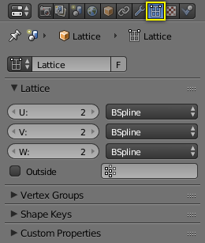
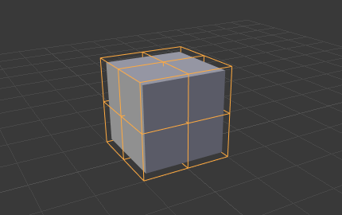

51 Lattice
==========

Lattice – or commonly called deformation cage outside of Blender. A lattice consists of a three-dimensional non-renderable grid of vertices. Its main use is to apply a deformation to the object it controls with a Lattice Modifier. If the object is parented with **Lattice Deform** a Lattice Modifier is automatically applied.

Editing
-------

Flip (Distortion Free) 

	Mirrors the vertexes displacement from their base position.

	U, V, W

Make Regular 

Resets the whole lattice to a regular grid, where the cells are scaled to one cubic Blender Unit. 

Properties
----------

Lattice properties.

Lattice 

A Data-Block Menu. 

Lattice
-------

Points 

	Rate of subdivision in the axes:

	U, V, W

Interpolation Type 

	Selector for each axis. See Different types of interpolation..

	Linear, Cardinal, Catmull-Rom, B-Spline

Outside 

Takes only the vertices on the surface of the lattice into account. 

Vertex Group 

The strength of the influence assigned as a weight to the individual vertices in the selected vertex group. 

Usage
-----

Lattice around the cube object in Object Mode.

The lattice should be scaled and moved to fit around your object in Object Mode. Any scaling applied to the object in Edit Mode will result in the object deforming. This includes applying scale with Ctrl-A as this will achieve the same result as scaling the lattice in Edit Mode, and therefore the object.

