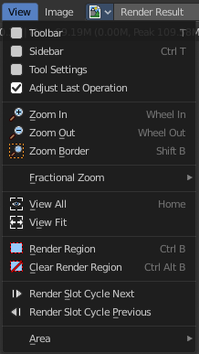
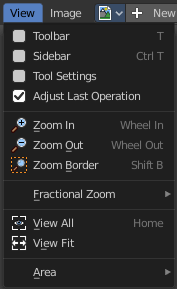

*************************************************
8.1.1 Editors - Image Editor - Header - View menu
*************************************************

.. contents:: Contents

Image Editor - View Menu
========================

The View menu contains all View related tools.

It is available in all sub modes. With a render result the view image shows a bit more content.

Toolbar
-------

Shows or hides the toolbar at the left.

Sidebar
-------

Shows or hides the sidebar at the right in the viewport.

Tool Settings
-------------

Shows or hides the tool settings above the header in the 3D view.

Adjust Last Operation
---------------------

Shows or hides the Adjust Last Operation panel down left. 

Note that the Adjust Last Operation menu item in the Edit menu in the main header and the Last button in the toolbar are not related and not functional with this last operator panel. It is an independant element.

View Zoom In
------------

Zooms into the viewport. 

View Zoom Out
-------------

Zooms out of the viewport.

Zoom Border
-----------

Draws a rectangle and zooms then to fit the size of this rectangle.

Zooming in is done with drawing the rectangle with left mouse button. Zooming out is done with drawing the rectangle with middle mouse button.

Fractional Zoom
---------------

A sub menu where you can choose between predefined zoom factors.

View All
--------

View all zooms in or out in the viewport until all objects in the scene are displayed fitting in the viewport.

View Fit
--------

Zooms out or in to fit the image to the viewport.

Render Region
-------------

Render result only. Allows you to draw a rectangle. And when you rerender the image, just the content in this rectangle region gets rendered.

This tool does, different from the 3d view, not draw a permanent red rectangle to define the render region area. You will see what you have chosen when you render the image.

Clear Render Region
-------------------

Render result only. Removes any existing render region rectangle.

Render Slot Cycle Next
----------------------

Render result only. Cycle through the Render slots.

Render Slot Cycle Previous
--------------------------

Render result only. Cycle through the Render slots.

Center View to Cursor
---------------------

Mask Mode only. Centers the view to the 2D cursor.

Area
----

This menu contains general view functionality. And exists in most other editor types too.

Horizontal Split
----------------

Splits the current view horizontally into two independant editor windows.

Vertical Split
--------------

Splits the current view vertically into two independant editor windows.

Duplicate Area into New Window
------------------------------

Duplicate Area into New Window makes the selected editor window floating. You can then drag it around at the monitor. It is not connected with the rest of the UI anymore.

A separated window cannot be merged into the main window again. You have to close it when not longer needed.

Toggle Maximize Area
--------------------

Displays the editor maximized with menus.

To return from the maximized view press hotkey ctrl + spacebar. Or reuse the menu item in the area menu.

Toggle Full screen Area
-----------------------

Displays the editor maximized without menus.

To return from the full screen view press hotkey ctrl + alt + spacebar.

