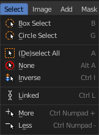

***************************************************
8.1.3 Editors - Image Editor - Header - Select menu
***************************************************

.. contents:: Contents

Image Editor - Select menu
==========================

This menu just appears when you are in Mask mode. And you need to create a new mask layer to set all items active. The select functionality in this menu covers the mask geometry. The splines.

Border Select
-------------

Border select enters the Border Select mode. This is a special select mode where you can select elements by dragging a rectangle. And what's inside of the rectangle gets selected then. It adds to selection by default. 

To subtract from selection hold down Shift key. 

The selection gets applied when you release the mouse. You leave the mode automatically when you release the mouse.

Circle Select
-------------

Circle select enters the Circle Select mode. This is a special select mode where you can select elements by moving with the mouse over it. It adds to selection by default. 

To subtract from selection hold down Shift key. To exit the Circle select click with the right mouse button.

The pencil radius of the circle select tool can be adjusted with the scroll wheel.

(De)select All
--------------

Toggles between select all and deselect all.

None
----

Select nothing.

Inverse
-------

Inverts the current selection.

Linked
------

Select all vertices linked to the active spline(s). The previous selection gets cleared.

More
----

Select more from the current active spline(s).

Less
----

Select less from the current active spline(s).

