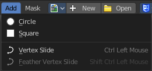

************************************************
8.1.4 Editors - Image Editor - Header - Add menu
************************************************

.. contents:: Contents

Image Editor - Add menu
=======================

This menu just appears when you are in Mask mode. 

In this menu you can create circle or square spline curves to use them for masking. They appear at the 2D cursor, and have four handlers. 

They can be moved, rotated and resized with the usual W E R keys. See also mask menu, Transform. The handlers allows to change the shape and size too.

You can add multiple spline curves to a mask layer.

Circle
------

Adds a circle shaped spline curve.

Last Operator Add Circle
------------------------

Size
----

The size of the circle spline curve.

Location X Y
------------

The location of the circle spline curve. Calculation happens from the center of the spline. 0 / 0 is down left.

Square
------

Adds a square shaped spline curve.

Last Operator Add Square
------------------------

Size
----

The size of the square spline curve.

Location X Y
------------

The location of the square spline curve. Calculation happens from the center of the spline. 0 / 0 is down left.

Vertex Slide
------------

Allows you to draw freehand curves by holding down shift and clicking into the viewport. Hotkey only functionality!

Last Operator Add Vertex and Slide
----------------------------------

Location X / Y
--------------

Here you can adjust the location of the last created curve point.

Feather vertex slide
--------------------

Create and define a feathering outline curve. 

Usage: Hold down shift + control, click at a vertex, and pull outwards. This will create the feathering outline curve, displayed in green.

Last Operator Add Feather Vertex and Slide
------------------------------------------

Location X / Y
--------------

Here you can adjust the location of the last created feather curve point.

