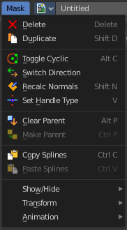
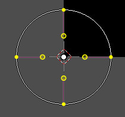
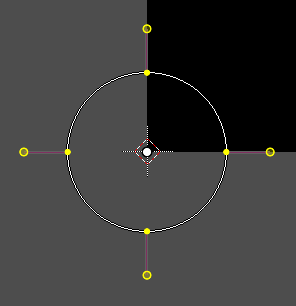
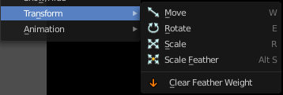

*************************************************
8.1.5 Editors - Image Editor - Header - Mask menu
*************************************************

.. contents:: Contents

Image Editor - Mask menu
========================

This menu appears when you are in Mask mode. It contains further functionality to modify the masking spline curves.

Delete
------

Deletes the selected spline(s) or spline points.

Duplicate
---------

Deletes the selected spline(s) or spline points.

Toggle Cyclic
-------------

Closes or opens the spline.

Switch Direction
----------------

A curve has a start point and a end point. Here you can switch them. The end point becomes the starting point and vice versa. As a consequence the handler can switch their location too. With handle type aligned single they can appear outside or inside of the circle.

Recalc Normals
--------------

Recalculating the normals smoothens out the curve, and realigns the handlers. A square shape with handle type aligned would becomre round.

Set Handle Type
---------------

Opens a sub menu where you can choose different handle types. 

Last Operator Set Handle Type
-----------------------------

Type
----

Here you can choose the handle type again.

Clear Parent
------------

Clears the parent relationship.

Make Parent
-----------

Parents the selected spline points. Mask splines can be parented to motion tracker markers.

Copy Splines
------------

Copys the selected spline(s) or spline points.

Paste Splines
-------------

Pastes the copied spline(s) or spline points.

Show/Hide
---------

Show/Hide Faces
---------------

This is a sub menu where you can show or hide the selection. 

Show Hidden
-----------

Makes hidden splines visible again.

Hide Selected
-------------

Hides the selected spline(s).

Hide Unselected
---------------

Hides the not selected spline(s). The selected spline(s) stays visible.

Transform
---------

This is a sub menu with some transform menu items. This menu items are hotkey tools!

Translate
---------

Move the selection.

Rotate
------

Rotate the selection.

Scale
-----

Scale the selection.

Scale Feather
-------------

Shrinkfattens the selection.

Clear Feather Weight
--------------------

Resets the scale to its original dimensions.

Animation
---------

Masks can be animated.

Insert Shape Key
----------------

Inserts a shape key for the currently selected curve points

Clear Shape Key
---------------

Removes the shape keys for the currently selected curve points at the current frame.

Feather Reset Animation
-----------------------

Resets the feather weight on all selected curve points at the current frame.

Re-Key Points of Selected Shapes
--------------------------------

Recalculate animation data for the currently selected curve points for frames that are selected in the dopesheet.

