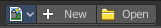
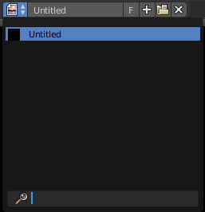
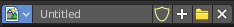
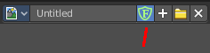
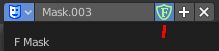
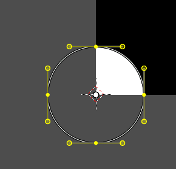
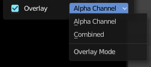
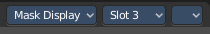
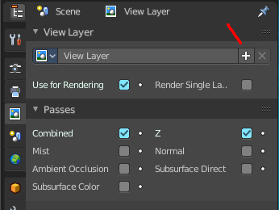

****************************************************
8.1.6 Editors - Image Editor - Header - Header Tools
****************************************************

.. contents:: Contents

Image Editor - Header Tools
===========================

The header contains several tools, dependand of what you do and what toolset is selected.

Image Prop
----------

This property contains the list of loaded images. When no image is loaded then it displays the New and Open Buttons. When an image exists then it displays the name of the currently selected image.

From left to right ...

List of images in the scene
---------------------------

This is a list of the images in the scene. Here you can switch to other images.

Image Edit Box
--------------

Here you can read the name of the currently selected image. And you can rename the image here too.

Fake User
---------

Wit this button you assign a fake user to this selected image.

Data, like images, that is not longer linked to anything else gets removed when you save and reload a scene. Bforartists has the concept of fake users to go around this behaviour. An image with a fake user is in fact linked to something. And so it is not lost when you save and reload the scene.

Search form
-----------

Here you can search for specific images.

New Image
---------

Create a new image.

Creates a new image. You will get a dialog where you can define settings for the new image.

Name
----

The name of the new image

Width
-----

The width of the new image.

Height
------

The height of the new image.

Color
-----

Here you can adjust the color of the new image. A click will call a color picker.

Alpha
-----

Check this checkbox if the new image should have an alpha channel.

Generated Type
--------------

Here you can define what kind of texture you want to create. 

Blank is one plain color.

UV Grid is a checker texture in black and white.

Color Grid is a colored checker texture.

32 Bit Float
------------

Check this checkbox if the image should be in 32 Bit floating point bit depth per channel. Else it is in 8 bit per channel.

Open Image
----------

Opens the file browser to load an image.

Unlink Datablock
----------------

This deletes the selected image. Unfortunately not immediately. You need to save the scene and to reload it.

And you need to make sure that it is not linked to anything else. A mesh or a fake user for example. Have a look if there is a number besides the F button. When this is the case then the image has still a user, and so still loads with loading the scene.

Use Image Pin
-------------

When you select another object. for UV mapping for example, then usually the connected images for this object gets displayed. Use image pin nails the currently selected image so that it stays displayed.

Display Channels
----------------

Here you can adjust what channels of the image gets displayed.

Color and Alpha
---------------

Displays the whole image, including alpha channel.

Color
-----

Displays the whole image, but without alpha channel.

Alpha
-----

Displays the alpha channel of the image.

Red
---

Displays the red channel of the image.

Green
-----

Displays the green channel of the image.

Blue
----

Displays the blue channel of the image.

Mask Prop
---------

When you are in Mask mode then you can create a new mask, and work with this mask then.

Masks have many purposes. They can be used to mask out, or influence a particular object in the footage in Motion tracking. They can be used for manual rotoscoping to pull a particular object out of the footage. They can be used as a rough matte for green-screen keying.

Masks are independent from a particular image of movie clip, and so they can also be used for creating motion graphics or other effects in the compositor. 

Masks can be driven over the time so that they follow some object from the footage. For example a running actor. This can be achieved with shape keys or parenting the mask to tracking markers.

List of Masks
-------------

This is a list of the masks in the scene. Here you can switch to other masks.

Mask Edit Box
-------------

Here you can read the name of the currently selected mask. And you can rename the image mask too.

Fake User
---------

Wit this button you assign a fake user to this selected mask. Masks gets created with a fake user already. Means when you save the scene and reopen it, then this mask will still be there.

Data, like images, that is not longer linked to anything else gets removed when you save and reload a scene. Bforartists has the concept of fake users to go around this behaviour. An image with a fake user is in fact linked to something. And so it is not lost when you save and reload the scene.

Search form
-----------

Here you can search for specific images.

Create Mask
-----------

Adds a new mask.

Unlink Datablock
----------------

This deletes the selected mask. Unfortunately not immediately. You need to save the scene and to reload it.

And you need to make sure that it is not linked to anything else. A mesh or a fake user for example. Have a look if there is a number besides the F button. When this is the case then the image has still a user, and so still loads with loading the scene.

Mask Display
------------

In Mask mode and with a Render result. Here you can adjust the display of the mask.

Smooth
------

Smoothens the outline of the mask curve.

Overlay
-------

When it's a closed curve then this closed area gets displayed as filled where it covers the image. When you tick Overlay then a second dropdown box appears where you can choose the overlay method.

Edge Display Type
-----------------

The mask curve can be displayed in different styles.

Slot
----

Just with a render result. Here you can render a new image into a new slot, which allows you to compare the two images then.

You need to render into this slot. So you need to choose it beforehand. Slots without a render result does not show the Render and Pass dropdown boxes.

Layers
------

Here you can choose in which layer the render result is.

Renders can be separated into layers. This allows you to composite them back together afterwards.

For example blurring the background and foreground layers separately for depth of field, or rendering different lighting variations of the same scene.

Using View Layers can also save you from having to re-render your entire image each time you change something, allowing you to instead re-render only the layer(s) that you need.

You can create more View Layers in the Properties editor. In the View Layer Tab.

Pass
----

Here you can set the pass mode. Combined or Depth.

Combined
--------

The final combination of render passes with everything included. 

Depth
-----

Just the Depth render pass.

