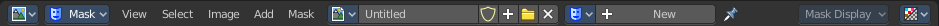
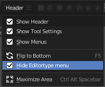

***********************************
8.1 Editors - Image Editor - Header
***********************************

.. contents:: Contents

Detailed Table of content
=========================

Image Editor - Header
=====================

The Header contains various menus, navigation elements, settings and tools for theviewport. This content differs, dependant of the sub mode.

The header is divided into two areas. Left mode and menus. Right settings.

Header right click menus
========================

The general right click menu functionality is explained in chapter 6 Editors introduction.

Editortype Menu
===============

.. image:: graphics/8.1_Editors_-_Image_Editor_-_Header/1000020100000249000001281A20E1122FFA8030.png

Bforartist is made of several editor types. Headers can display a menu where you can switch to other editor types.

This menu is hidden by default. It is meant to edit the layouts, and should not be necessary for regular work. You can reveal it in the header right click menu. 

Sub Modes
=========

The Image Editor has three submodes. View, Paint and Mask.

View Mode
---------

It is as the name says a pure view mode. You can view your content.

Paint Mode
----------

Paint mode allows to paint at your image material.

Mask Mode
---------

This mode comes with masking functionality. You can mask out parts of the image.

