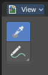
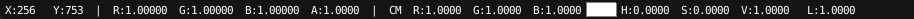
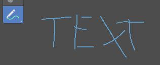
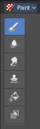
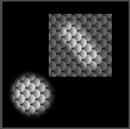

***************************************
8.2 Editors - Image Editor - Tool Shelf
***************************************

.. contents:: Contents

Tool Shelf in View Mode
=======================

This menu just appears when you are in Mask mode.

In this menu you can create circle or square spline curves to use them for masking. They appear at the 2D cursor, and have four handlers. 

They can be moved, rotated and resized with the usual W E R keys. See also mask menu, Transform. The handlers allows to change the shape and size too.

You can add multiple spline curves to a mask layer.

Sample
------

Samples the color under the mouse cursor. This sampled information is just an information. It has no real use, you don't pick up the color. There is no tool that could use it.

The sample result gets displayed in the footer.

Annotate Tools group
--------------------

The annotation tool is available in multiple editors. With this tool you can write notes at the screen. The annotate tools is the little brother of the grease pencil objects.

Further settings for annotate can be found in the sidebar. Here you can also remove an annotation when you don't longer need it. And here you can also adjust the size of the stroke.

Annotate
--------

Draw free-hand strokes in the main window.

Annotate Line
-------------

Click and drag to create a line.

Annotate Polygon
----------------

Click multiple times to create multiple connected lines. The current polygon is finished when Esc or RMB is pressed.

Tool Settings
-------------

The tool settings for Annotate, Annotate Line and Annotate Polygon are the same. Different from the 3D view, there is no placement option for the 3d cursor.

Color
-----

Clicking at the left color field reveals a color picker where you can define the color for the annotation stroke.

Note
----

Clicking at the Note dropdown box reveals a panel with further settings. It's the same content than in the annotations in the View tab.

Annotations list
----------------

Here you can add, remove and rename new annotations.

.. image:: graphics/8.2_Editors_-_Image_Editor_-_Tool_Shelf/10000201000000FF0000010D549C1B788BA0397E.png

Edit Box
--------

The name of the current annotation. You can rename the annotation to your needs here.

Fake User
---------

Assign a fake user to this annotation. Fake users is a odd concept to keep data in the scene even if it has no user somewhere. The fake user is then a dummy user so that the object is not deleted when saving the scene. 

Add Annotation
--------------

Add a new annotation.

Unlink Annotation
-----------------

Delete the annotation.

Thickness
---------

The thickness of the annotation stroke.

Frame Locked/Unlocked
---------------------

Lock frame displayed by current layer. This toggles whether the active layer is the only one that can be edited.

Delete Active Frame
-------------------

Deletes the active frame from the active grease pencil layer.

Thickness
---------

The thickness of the annotation stroke.

Annotate Eraser
---------------

Click and drag to remove annotate lines.

Tool Settings
-------------

Radius
------

The radius of the eraser pencil.

Tool Shelf in Paint Mode
========================

The settings for these tools are in the tools tab in the sidebar. This content is explained in the chapter Image Editor - Sidebar. Here we just explain what the tool does and how to use it.

Draw
----

The draw brush allows you to draw at the canvas. The color cna be adjusted in the brush panel in the sidebar.

The Tools Tab provides you with further options and settings.

Soften
------

Softens the image under the brush.

Smear
-----

Smears the image under the brush.

Clone
-----

Despite the name it is not a clone tool. It is a stencilmap paint tool. You load an image, and can then use it to paint parts of this stencil image onto the canvas.

You can move the stencil image around with the right mouse button.

Last Operator Grab Clone
------------------------

Delta X Y
---------

The position of the stencil image. The position gets calculated from the lower left corner. It is not calculated in pixels, but relative to the source image. The width and height of it is the range between 0 and 1

Fill
----

Fills areas with the same color with another color of your choice. The color can be set in the Brush panel in the sidebar.

Mask
----

This tool allows you to mask out image parts.

