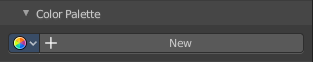
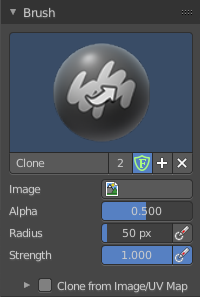
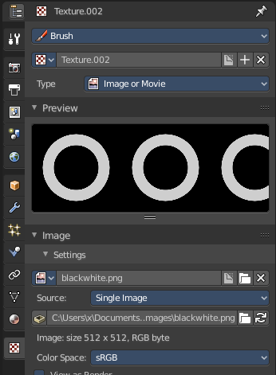
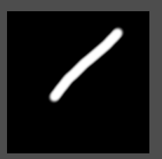
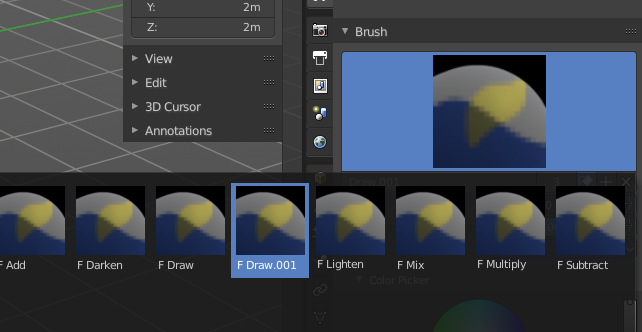
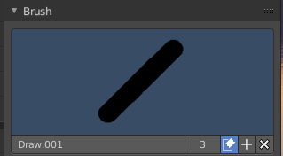

****************************************************************
8.3.1 Editors - Image Editor - Sidebar - Tools Tab in Paint Mode
****************************************************************

.. contents:: Contents

Detailed Table of Content
=========================

Tool Shelf in View Mode
=======================

In View and Mask mode you don't have any further content in the Tool tab. But in Paint mode the tools tab contains several panels with functionality for the brushes. It is in big parts similar functionality to the paint tools in the 3D view.

The Brush panel shows different content, dependant of which brush is chosen in the tool shelf.

Save Image
----------

A short warning. A modified image does NOT save with the scene. You have to save out the image when you want to save the changes at the texture. There is no warning. So DON'T FORGET TO SAVE THE IMAGE.

Brush Panel with Draw pencil
============================

The Brush Panel contains the different paint brushes, a color dialog, and some brush specific settings.

Browse Brush
------------

The big image at the top is a dropdown box where you can see the current active brush. You can add duplicates of this active brush, and customize it to your needs. But the active brush gets chosen in the Tool Shelf at the left of the 3D View. 

.. image:: graphics/8.3.1_Editors_-_Image_Editor_-_Sidebar_-_Tools_Tab_in_Paint_Mode/10000201000000DB0000009991B7BA1218EF648C.png

When you have added a few more brushes then the dropdown box may be more than full. You will see some little white arrows then. Either in the top left or in the bottom right corner. They indicate that some brushes are hidden before or after the current display.

To scroll to this hidden content use the mouse wheel, or the arrow up and down buttons at the keyboard.

The edit box below the Image shows you the name of the current active brush. 

The number right of it, in this case 2, indicates how much number of users ( internally ) this brush uses. This means that this data block (the brush) shares currently settings with at least one other object. Most probably the parent brush where we have created it from. Click at the value to make this brush a single user. The button will vanish then.

Fake userset the brush to have a fake user. Zero user data-blocks are normally not saved. But sometimes you want to force the data to be kept even when the data block has no user.

The + button allows you to add a new pencil with the current settings. Note that the brushes are NOT saved when you close Bforartists. You can save them into the current blend file. Or you can save the startup file. But be careful here. This saves everything else of the current state of Bforartists too.

The X button deletes the brush as the active one. It does NOT delete it from the brushes list.

Radius 
-------

The Radius edit box allows you to adjust the radius of the brush. The button behind the edit box enables tablet pressure sensitivity for radius.

.. image:: graphics/8.3.1_Editors_-_Image_Editor_-_Sidebar_-_Tools_Tab_in_Paint_Mode/100002010000013A000000176C6AA346D69414C8.png

Strength
--------

The Strength edit box allows you to adjust the strength of the brush. The button behind the edit box enables tablet pressure sensitivity for strength.

Blend
-----

Here you can define how the stroke will blend. You can choose between various blend modes.

Color Picker
------------

Here you can define the color for your brush.

The active color is the left one. When you click the button with the two arrows down right then you can swap the color with the secondary color. Then this secondary color becomes the primary color, and is active.

A click at one of the the color fields will open a more detailed color dialog, where you can set up the color by using rgb, hsv and hex colors and with value sliders.

.. image:: graphics/8.3.1_Editors_-_Image_Editor_-_Sidebar_-_Tools_Tab_in_Paint_Mode/10000201000001010000012FF1ECD8CC5E58ECC0.png

Color Palette
-------------

Here you can create a color palette for later reuse. 

First create a new palette by clicking at New. Then adjust the color in the color picker. And then click at the add button to add this color to the palette.

.. image:: graphics/8.3.1_Editors_-_Image_Editor_-_Sidebar_-_Tools_Tab_in_Paint_Mode/100002010000013A000000705B8408BFA6D880F3.png

To set the color picker to a palette color simply click at this palette color. 

To remove a color from the palette, choose it, then click at the remove button. The active palette color that gets removed is the one with the triangle at it.

The color palette cannot be saved externally. It is part of the current blend file. You can however append color palettes from other blend files.

The elements are explained from left to right.

Palette browser
---------------

The button at the left opens a dropdown list where you can choose between your palettes.

Edit Box
--------

Here you can read the name of the currently active palette. You can also rename the palette here. A click into the edit box makes the name editable.

Number of users
---------------

Here you can see how many users the palette currently has.

Fake User
---------

Fake Usersets the element to have a fake user. Zero user data-blocks are normally not saved. But sometimes you want to force the data to be kept even when the data block has no user.

Add palette
-----------

Here you can add a new palette.

Options
-------

Accumulate
----------

Accumulates stroke daubs on top of each other.

Adjust Strength for Spacing
---------------------------

Automatically adjust the strength for spacing to give consistent results for different spacings.

Affect Alpha
------------

When unchecked, lock Alpha while painting.

Brush Panel with Draw pencil
============================

Browse Brush
------------

The big image at the top is a dropdown box where you can see the current active brush. It is the same functionality than for the Draw pencil. So please have a look there.

Direction
---------

If you want to sharpen or to soften.

Sharp Threshold
---------------

Threshold below which no sharpening is performed.

Kernel Radius
-------------

The blur radius for the single pixels in Pixels.

Blur Mode
---------

Here you can choose the blur method. 

Radius
------

The radius of the brush.

Strength
--------

How powerful the effect is applied.

Brush Panel with Smear pencil
=============================

Browse Brush
------------

The big image at the top is a dropdown box where you can see the current active brush. It is the same functionality than for the Draw pencil. So please have a look above.

Radius
------

The radius of the brush.

Strength
--------

How powerful the effect is applied.

Brush Panel with Clone pencil
=============================

The Clone Pencil is no clone tool, but a stencil map tool. You could also use the Draw pencil, and use the stencil map functionality there. The setup there is a bit more complicated though. For this tool you just need to load an image and then choose it in the Image slot.

Browse Brush
------------

The big image at the top is a dropdown box where you can see the current active brush. It is the same functionality than for the Draw pencil. So please have a look above.

Image
-----

Here you can load the stencil map.

Alpha
-----

How opaque the stencil image is displayed.

Radius
------

The radius of the brush.

Strength
--------

How powerful the effect is applied.

Clone from Image/UV Map
-----------------------

This feature is not documented yet. And the functionality is not to find out. Just to guess.

You need a material at the mesh to show the panel. Without material the panel content does not show. 

Source Clone Slot
-----------------

A list of available texture nodes. 

This panel is unreliable. It works sometimes. Sometimes not.

Brush Panel with Fill tool
==========================

Browse Brush
------------

The big image at the top is a dropdown box where you can see the current active brush. It is the same functionality than for the Draw pencil. So please have a look avove.

Gradient Type
-------------

The threshold above which is not filled. Or in other words, how equal the neighbour color needs to be to be considered as an area that can be filled.

Strength
--------

How strong the fill be applied. 1 is opaque. 0 is completely transparent.

Blend
-----

Here you can adjust the Blend mode for the fill operation.

Color Picker, Color Palette
---------------------------

Color Picker and Color Palette are the same like for the draw brush. So please have a look avove.

Options
-------

Antialiasing
------------

Use Antialiasing at the border of the fill.

Texture Panel
=============

Texture Panel
-------------

The Texture panel allows you to paint with textures. This allows you for example to grab a foto from some fish scales, and simply paint them onto the mesh by using this image as a pencil. Or as a blueprint where you calk through ( Stencil method ).

Browse Texture to be linked
---------------------------

The image at the top of the panel is a image browser. Here you can choose a texture that you can choose for painting then. You can also have more than one image loaded at once. 

In this shot there is already a texture added. The way to add the texture here is a bit more complicated. And not done with clicking at the New button.

First click at the New button below the image. This will create a new texture slot. This slot is still empty, it displays black. 

We need to load a texture in this slot. This must be done in the Properties editor in the Textures tab.

The problem is, we have an object with a material and a texture already selected. And when we change this texture , then we don't get the pencil texture loaded. But we change the texture at our mesh.

What we need to do is to create a material first. And in this material we load our pencil texture then. And then this texture becomes available in the image browser of the Texture panel.

.. image:: graphics/8.3.1_Editors_-_Image_Editor_-_Sidebar_-_Tools_Tab_in_Paint_Mode/1000020100000165000001DD14C44CD2386FE788.png

.. image:: graphics/8.3.1_Editors_-_Image_Editor_-_Sidebar_-_Tools_Tab_in_Paint_Mode/1000020100000154000000DEC60309A689328201.png

And when we go back to the texture panel, then the texture should be loaded here. And we can work with this texture.

Texture Edit box
----------------

The Texture edit box is the edit box below the Image browser. When there's no image loaded then it displays the New button. When there's a image (or more) loaded, then you will see the name of the current texture. 

The F button turns this texture into a data block with a fake user. Means it will exists even when there is no data connected to it anymore.

When you activate Fake User, then you may get a value in front of it, which displays how much users this data block (our texture slot) currently has.

The + Button adds another texture slot. Note that you will have to load a texture too, as explained above.

The X button deletes the texture slot.

Brush Mapping
-------------

Our texture can be mapped in different methods. The Brush mapping is a dropdown box where you can choose this different brush mapping methods.

The settings vary. So we will go through them by the different brush mapping methods.

Brush Mapping with mapping method Tiled
---------------------------------------

The brush mapping method Tiled tiles the brush stroke at the surface. The mapping happens from the current view. The result may be distorted when the view does not align with the surface of the object.

Angle
-----

The angle of the brush.

Offset 
-------

The offset of the texture in the brush.

Size
----

The size of the texture in the brush.

Brush Mapping with mapping method View Plane
--------------------------------------------

The brush mapping method View Plane simply paints onto the surface. The mapping happens from the current view. The result may be distorted when the view does not align with the surface of the object.

Angle
-----

The angle of the brush.

Rake
----

The angle follows the direction of the brush stroke. 

Random
------

The brush angle gets set random.

Offset 
-------

The offset of the texture in the brush.

Size
----

The size of the texture in the brush.

Brush Mapping with mapping method 3D
------------------------------------

The brush mapping method 3D paints the texture at the surface, by tiling it 1/1 at the object surface. 

Offset 
-------

The offset of the texture in the brush.

Size
----

The size of the texture in the brush.

Brush Mapping with mapping method Random
----------------------------------------

The brush mapping method Random paints onto the surface, and randomizes the texture position in the brush while that. The mapping happens from the current view. The result may be distorted when the view does not align with the surface of the object.

Angle
-----

The angle of the brush.

Rake
----

The angle follows the direction of the brush stroke. 

Random
------

The brush angle gets set random.

Brush Mapping with mapping method Stencil
-----------------------------------------

The former methods uses the textures for the brush. The method Stencil works different. You have your texture displayed in the workspace above the object, and you paint this texture onto your object with your pencil strokes.

Note that the texture in the 3d space is just visible when you are with the mouse over the viewport.

It gets by default displayed down left. You have to position it where you need it. See Brush menu in the 3D view, Stencil Texture controls.

Image Aspect
------------

Adjust the stencil size to fit to the image aspect ratio.

Reset Transform
---------------

Resets the stencil image to be down right in the 3D view.

Angle edit box
--------------

Here you can adjust the angle of the brush. The button at the end allows you to set the radius by dragging the mouse. This should be done in the viewport and with the hotkey. This button is just a visible reminder.

Offset
------

Fine tune the offset of the texture in the brush.

Size
----

Fine tune the size of the texture in the brush. 

Texture Mask Panel
==================

Texture Mask Panel
------------------

The texture mask panel allows you to use a texture as a mask to define the strength of painting. It paints just where the mask texture is bright. You can also use gradients to define the paint strength.

Browse Texture to be linked
---------------------------

The image at the top of the panel is a image browser. Here you can choose a texture that you can choose for painting then. You can also have more than one image loaded at once. 

In this shot there is already two textures added. The way to add the texture here is a bit more complicated. And not done with clicking at the New button.

.. image:: graphics/8.3.1_Editors_-_Image_Editor_-_Sidebar_-_Tools_Tab_in_Paint_Mode/10000201000000C700000097FA20D25C965D6DBF.png

First click at the New button below the image. This will create a new texture slot. This slot is still empty, it displays black. 

We need to load a texture in this slot. This must be done in the Properties editor in the Textures tab.

The problem is, we have an object with a material and a texture already selected. And when we change this texture , then we don't get the pencil texture loaded. But we change the texture at our mesh.

What we need to do is to create a material first. And in this material we load our pencil texture then. And then we can choose this texture in the image browser of the texture.

.. image:: graphics/8.3.1_Editors_-_Image_Editor_-_Sidebar_-_Tools_Tab_in_Paint_Mode/1000020100000165000001DD14C44CD2386FE788.png

.. image:: graphics/8.3.1_Editors_-_Image_Editor_-_Sidebar_-_Tools_Tab_in_Paint_Mode/1000020100000154000000DEC60309A689328201.png

And when we switch back to the tools tab, then the texture is loaded. And we can work with this texture.

Make sure that you use another texture in the Texture panel than in the Texture Mask panel, or no texture at all. When both is the same then you will get the same result with all Mask Mapping methods since they overlap each other at the very same positions.

Brush Mapping with mapping method Tiled
---------------------------------------

The brush mapping method Tiled tiles the brush stroke at the surface. The mapping happens from the current view. The result may be distorted when the view does not align with the surface of the object.

Pressure Masking
----------------

Enable pressure masking when you use a tablet.

Angle
-----

The angle of the brush.

Offset 
-------

The offset of the texture in the brush.

Size
----

The size of the texture in the brush.

Brush Mapping with mapping method View Plane
--------------------------------------------

The brush mapping method View Plane simply paints onto the surface. The mapping happens from the current view. The result may be distorted when the view does not align with the surface of the object.

Pressure Masking
----------------

Enable pressure masking when you use a tablet.

Angle
-----

The angle of the brush.

Rake
----

The angle follows the direction of the brush stroke. 

Random
------

The brush angle gets set random.

Offset 
-------

The offset of the texture in the brush.

Size
----

The size of the texture in the brush.

Brush Mapping with mapping method Random
----------------------------------------

The brush mapping method Random paints onto the surface, and randomizes the texture position in the brush while that.

Pressure Masking
----------------

Enable pressure masking when you use a tablet.

Mask Pressure Mode
------------------

A dropdown box where you can choose the mask pressure mode for tablets.

Angle
-----

The angle of the brush.

Rake
----

The angle follows the direction of the brush stroke. 

Random
------

The brush angle gets set random.

Offset 
-------

The offset of the texture in the brush.

Size
----

The size of the texture in the brush.

Brush Mapping with mapping method Stencil
-----------------------------------------

The former methods uses the textures for the brush. The method Stencil works different. You have your texture displayed in the workspace above the image, and you paint this texture onto your object with your pencil strokes.

Note that the stencil texture is just visible when you are with the mouse over the viewport. It gets by default displayed down left. You have to position it where you need it. See Brush menu, Stencil Texture controls.

Image Aspect
------------

Adjust the stencil size to fit to the image aspect ratio.

Reset Transform
---------------

Resets the stencil image to be down right in the 3D view.

Pressure Masking
----------------

Enable pressure masking when you use a tablet.

Angle edit box
--------------

Here you can adjust the angle of the brush. The button at the end allows you to set the radius by dragging the mouse. This should be done in the viewport and with the hotkey. This button is just a visible reminder.

Offset
------

Fine tune the offset of the texture in the brush.

Size
----

Fine tune the size of the texture in the brush. 

Stroke Panel
============

Stroke Panel
------------

The Stroke panel contains settings to influence the behaviour of the brush stroke. There are various stroke methods available. We will go through them one by one.

Stroke method Space
-------------------

This is the default Stroke method. The stroke gets added continuously with given settings.

Spacing Edit Box
----------------

The sculpt drawing happens by mapping the pencil onto the mouse position. And when you move the mouse then the next mapping happens. Here you can adjust the spacing after what mouse movement the next mapping should happen. The lower the value, the lower the distance between the single dots.

The icon behind the edit box enables tablet pressure sensitivity for tablets.

Jitter Edit Box
---------------

Here you can add Jitter to the brush while painting.

The icon in front of the edit box toggles between jittering in screen space and relative to brush size.

The icon behind the edit box enables tablet pressure sensitivity for tablets.

Input Samples Edit Box
----------------------

Average multiple input samples together to smooth the brush stroke.

Smooth Stroke
-------------

The brush lags behind the mouse position, and produces a much smoother stroke by that.

Smooth Stroke Radius Edit Box
-----------------------------

Is just active when Smooth Stroke is activated. Here you can adjust the radius of the smoothing.

Smooth Stroke Factor Edit Box
-----------------------------

Is just active when Smooth Stroke is activated. Here you can adjust the factor of the smoothing.

Stroke method Curve
-------------------

The Stroke method curve doesn't simply influence the way how the stroke is painted. It is a special method. 

First you draw a curve object by holding down ctrl and clicking with right mouse button. Then you tweak the curve. You can click at the curve point, and drag out handlers to make the curve points smoooth. This way you get one handler. When you click and drag then you will get two handlers at the curve point.

When done you hit the Draw Curve button or click left outside of the image. And the curve gets drawn onto the surface.

Spacing Edit Box
----------------

The drawing happens by mapping the pencil onto the mouse position. And when you move the mouse then the next mapping happens. Here you can adjust the spacing after what mouse movement the next mapping should happen. The lower the value, the lower the distance between the single dots.

The icon behind the edit box enables tablet pressure sensitivity for tablets.

Paint Curve edit box
--------------------

Here you set the active curve.

The first element is a dropdown box where you will find your curves objects. You can have more than one.

The second element is the edit box that displays the active curve.

The number right of it, in this case 2, indicates how much number of users ( internally ) this brush uses. This means that this data block (the brush) shares currently settings with at least one other object. Most probably the parent brush where we have created it from. Click at the value to make this brush a single user. The button will vanish then.

F set the brush to have a fake user. Zero user data-blocks are normally not saved. But sometimes you want to force the data to be kept even when the data block has no user.

The + button allows you to add a new pencil with the current settings. Note that the brushes are NOT saved when you close Bforartists. You can save them into the current blend file. Or you can save the startup file. But be careful here. This saves everything else of the current state of Bforartists too.

The X button deletes the brush as the active one. It does NOT delete it from the brushes list.

Draw Curve Button
-----------------

A click at it to turns the curve into curve.

Jitter Edit Box
---------------

Here you can add Jitter to the brush while painting.

The icon in front of the edit box toggles between jittering in screen space and relative to brush size.

The icon behind the edit box enables tablet pressure sensitivity for tablets.

Input Samples Edit Box
----------------------

Average multiple input samples together to smooth the brush stroke.

Stroke method Line
------------------

With Stroke method line you draw a line between a starting point and a endpoint. And when you release the mouse then the line gets drawn.

Spacing Edit Box
----------------

The drawing happens by mapping the pencil onto the mouse position. And when you move the mouse then the next mapping happens. Here you can adjust the spacing after what mouse movement the next mapping should happen. The lower the value, the lower the distance between the single dots.

The icon behind the edit box enables tablet pressure sensitivity for tablets.

Jitter Edit Box
---------------

Here you can add Jitter to the brush while painting.

The icon in front of the edit box toggles between jittering in screen space and relative to brush size.

The icon behind the edit box enables tablet pressure sensitivity for tablets.

Input Samples Edit Box
----------------------

Average multiple input samples together to smooth the brush stroke.

Stroke method Anchored
----------------------

Click and drag to place a dot and to scale it.

Edge to edge
------------

Drag Anchor Brush from edge to edge.

Jitter
------

Adds a jitter to the dot.

Input Sample Edit Box
---------------------

Average multiple input samples together to smooth the brush stroke.

Stroke method Airbrush
----------------------

The stroke acts like an airbrush pencil. The dots gets placed randomly.

Rate Edit Box
-------------

Here you can define the rate of the drawing.

Jitter Edit Box
---------------

Here you can add Jitter to the brush while painting.

The icon in front of the edit box toggles between jittering in screen space and relative to brush size.

The icon behind the edit box enables tablet pressure sensitivity for tablets.

Input Samples Edit Box
----------------------

Average multiple input samples together to smooth the brush stroke.

Smooth Stroke
-------------

The brush lags behind the mouse position, and produces a much smoother stroke by that.

Smooth Stroke Radius Edit Box
-----------------------------

Is just active when Smooth Stroke is activated. Here you can adjust the radius of the smoothing.

Smooth Stroke Factor Edit Box
-----------------------------

Is just active when Smooth Stroke is activated. Here you can adjust the factor of the smoothing.

Stroke method Drag Dots
-----------------------

Paint a dot and drag it around. The actual painting happens then at releasing the mouse.

Jitter Edit Box
---------------

Here you can add Jitter to the brush while painting.

The icon in front of the edit box toggles between jittering in screen space andrelative to brush size.

The icon behind the edit box enables tablet pressure sensitivity for tablets.

Input Samples Edit Box
----------------------

Average multiple input samples together to smooth the brush stroke.

Stroke method Dots
------------------

The stroke method Dots draws dots of the pencil onto the surface. The mapping happens from the current view. Means you will get distortions when your view is not aligned with the surface of the object.

Jitter Edit Box
---------------

Here you can add Jitter to the brush while painting.

The icon in front of the edit box toggles between jittering in screen space and relative to brush size.

The icon behind the edit box enables tablet pressure sensitivity for tablets.

Input Samples Edit Box
----------------------

Average multiple input samples together to smooth the brush stroke.

Smooth Stroke
-------------

The brush lags behind the mouse position, and produces a much smoother stroke by that.

Smooth Stroke Radius Edit Box
-----------------------------

Is just active when Smooth Stroke is activated. Here you can adjust the radius of the smoothing.

Smooth Stroke Factor Edit Box
-----------------------------

Is just active when Smooth Stroke is activated. Here you can adjust the factor of the smoothing.

Falloff Panel
=============

Here you can define the falloff for the border of the brush.

.. image:: graphics/8.3.1_Editors_-_Image_Editor_-_Sidebar_-_Tools_Tab_in_Paint_Mode/10000201000000B60000010169AD638C1F84AE80.png

Display Panel
=============

Curve Alpha
-----------

This setting is interesting for the Stroke method Curve. Here you can adjust how transparent the curve is.

The eye icon button in front of the slider is to show the curve object in viewport. The brush icon button behind the slider is to hide the overlay during a stroke.

Texture Alpha
-------------

This setting is interesting for Texture painting. Here you can adjust how transparent the texture is.

The eye icon button in front of the slider is to show the texture in the viewport. The brush icon button behind the slider is to hide the overlay during a stroke.

Mask Texture Alpha
------------------

This setting is interesting for Texture painting. Here you can adjust how transparent the Mask texture is.

The eye icon button in front of the slider is to show the texture in the viewport. The brush icon button behind the slider is to hide the overlay during a stroke.

Appearance
----------

The Appearance subtab provides you with some settings to adjust the appearance of the brush.

Show Brush
----------

Show the brush in 3D view.

.. image:: graphics/8.3.1_Editors_-_Image_Editor_-_Sidebar_-_Tools_Tab_in_Paint_Mode/10000201000001390000003F14C4AB5E81A9B3CD.png

Color
-----

The color that the brush cursor has.

CustomIcon
----------

Here you can define a custom icon for the brush.

.. image:: graphics/8.3.1_Editors_-_Image_Editor_-_Sidebar_-_Tools_Tab_in_Paint_Mode/10000201000001390000003BC548AC5D3E17CB6A.png

Edit Box
--------

The button at the right allows you to load a custom brush image.

How to:

Select an existing brush type. Create a new brush out of it.

Now load our new brush. The image in the browser will turn into this icon.

To turn this into a own brush with own shape you would need to load a texture now too. This feature here just loads a icon for the currently active brush in the brush browser.

Tiling panel
============

Tiling allows you to draw over the borders and continue the stroke at the other side of the image. You can tile in X and Y direction.

