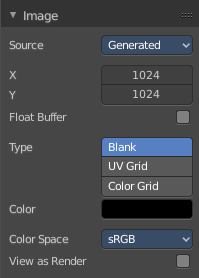

**************************************************
8.3.2 Editors - Image Editor - Sidebar - Image Tab
**************************************************

.. contents:: Contents

Introduction
============

In the Image tabs you can find further options and image settings. These settings changes, dependant of what you have selected. And in what mode you are

Options Panel
=============

In View and Mask mode
---------------------

Update Automatically
--------------------

Update other editor windows simultaneously with the changes in the Image Editor.

Show Metadata
-------------

Draw Metadata properties of the image.

In Paint Mode
-------------

Update Automatically
--------------------

Update other editor windows simultaneously with the changes in the Image Editor.

Show Metadata
-------------

Draw Metadata properties of the image.

Display Texture Paint UV's
--------------------------

Display the UV wire from the active mesh. It needs to be in edit mode.

Show same material
------------------

This is for the case that you work at a texture for the current mesh. Just show faces of the mesh where the material with this texture is assigned to.

Unified Brush
-------------

Size, strength or color is shared across the brushes. And not at a brush by brush base.

Image Panel
===========

Here you can find image related settings. Size, type, and so on.

Source
------

Here you can choose the image type. This type gets usually automatically set. When you create a new image, then this image is generated. When you load an image then the Source switches to Single Image.

Generated images does not have a path.

Source Type Generated
---------------------

X / Y
-----

The image width and height.

Float Buffer
------------

Use a floating point buffer. 8 Bit images uses integers. 32 Bit works with floats.

Generated Type Blank
--------------------

This type displays an image with one blank color

Color
-----

The color of the blank image.

Generated Type UV Grid
----------------------

This type displays an with a black and white checker texture but colored dots. 

Generated Type Color Grid
-------------------------

This type displays an with a colored checker texture with numbers. 

Color Space
-----------

Here you can choose the color space type for the image.

View as Render
--------------

Displays the image with the color management settings.

Source Type Movie + Image Sequence
----------------------------------

Path edit box
-------------

Pack
----

With this button you can pack the movie or the image sequence into the blend file. It gets packed when you save the blend file the next time.

Path edit box
-------------

Here you can see and edit the path to your movieor image sequence files.

Open
----

Here you can open a new movie or image sequence files. A file dialog will appear.

Refresh
-------

Here you can reread the movie or image sequence files.

Info string
-----------

Some information about the currently loaded movie. Frames, resolution and colorspace.

Frames
------

The number of frames of the movie or image sequence.

Match Movie Length
------------------

Set Users Image Length to the one of this video.

Start
-----

The start frame of the movie or image sequence

Offset
------

Offset the number of the frame to use in the animation. -1 means off.

Cyclic
------

Cycle the images in the movie.

Auto Refresh
------------

Always refresh image on frame changes.

Deinterlace
-----------

Deinterlace the movie file on load.

Color Space
-----------

Here you can choose the color space type for the movie or image sequence files.

Alpha
-----

Here you can choose the alpha channel mode. Straight or Premultiplied.

View as Render
--------------

Display the image with using the color management settings.

Source Type Single Image
------------------------

Path edit box
-------------

Pack
----

With this button you can pack the movie or the image sequence into the blend file. It gets packed when you save the blend file the next time.

Path edit box
-------------

Here you can see and edit the path to your movieor image sequence files.

Open
----

Here you can open a new movie or image sequence files. A file dialog will appear.

Refresh
-------

Here you can reread the movie or image sequence files.

Info string
-----------

Some information about the currently loaded image. Resolution and colorspace.

Color Space
-----------

Here you can choose the color space type for the movie or image sequence files.

Alpha
-----

Here you can choose the alpha channel mode. Straight or Premultiplied.

View as Render
--------------

Display the image with using the color management settings.

Metadata Panel
==============

Displays existing meta data of the file.

