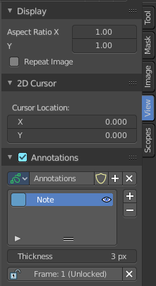
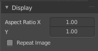
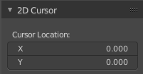
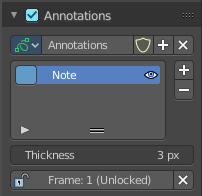
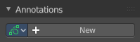
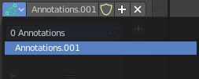
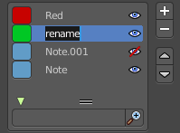

*************************************************
8.3.3 Editors - Image Editor - Sidebar - View Tab
*************************************************

.. contents:: Contents

Introduction
============

The View tab contains some view related settings. And it contains the annotation panel.

Display Panel
=============

Aspect Ratio X , Y
------------------

Here you can set the aspect ratio of the image. 

Repeat
------

With this ticked the image is repeated in the UV Image canvas.

2D Cursor Panel
===============

Here you can see and set the 2D cursor location.

This panel is just visible in Mask mode.

Annotations Panel
=================

Here you can manage the Annotation layers and materials.

When you don't have drawn a annotation yet then the panel just contains a New button.

Annotations prop
----------------

Here you can add, remove and rename new annotations.

.. image:: graphics/8.3.3_Editors_-_Image_Editor_-_Sidebar_-_View_Tab/10000201000000FF0000010D549C1B788BA0397E.png

Dropdown box
------------

A list of the available annotation layers.

Edit Box
--------

The name of the current annotation. You can rename the annotation to your needs here.

Fake User
---------

Assign a fake user to this annotation. Fake users is a odd concept to keep data in the scene even if it has no user somewhere. The fake user is then a dummy user so that the object is not deleted when saving the scene. 

Add Annotation
--------------

Add a new annotation.

Delete Annotation
-----------------

Delete the annotation.

List of Annotation Strokes
--------------------------

Here you see your Annotation layers for the current Annotation. Every layer can have a own color. 

At the right side you find buttons to sort them and to add and remove new Annotation layers. 

You can change the color by clicking at the color field. A color dialog will pop up. You can rename annotation layers by double clicking at it. 

The eye icon allows you to make it invisible And it has a search field.

Thickness
---------

The thickness of the annotation stroke.

Frame Locked/Unlocked
---------------------

Lock frame displayed by current layer. This toggles whether the active layer is the only one that can be edited.

