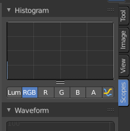
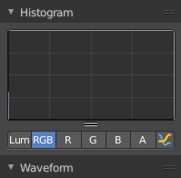

***************************************************
8.3.4 Editors - Image Editor - Sidebar - Scopes Tab
***************************************************

.. contents:: Contents

Scopes Tab
==========

The Scopes tab contains several panels with analytic tools.

Histogram
---------

Histogram is a graph that displays the color distribution of the pixels in the image. The range from left to right goes from 0, which represents black, to 255, which represents white. And the height represents how much pixels in the image have this specific color.

The different display modes are: 

Luma
----

Shows the luminosity of an image.

RGB
---

Shows theRGB channels.

R/G/B/A
-------

Shows the R, G, B, A channels.

Show line
---------

Displays lines instead of filled shapes.

Waveform
--------

The waveform graph is another way to display the color information of the image.

Waveform Opacity
----------------

Here you can adjust the opacity of the pixels in the waveform histogram.

Waveform Mode
-------------

This is a dropdown box menu where you can choose further options.

Luma
----

Shows the luminosity of an image.

Parade
------

The RGB channels are shown side-by-side.

YCbCr (jpeg)
------------

Displays the channels in the YCbCr standard, fitting to Jpg.

YCbCr (ITU 709)
---------------

Displays the channels in the YCbCr standard, fitting to ITU 709 standard.

YCbCr (ITU 601)
---------------

Displays the channels in the YCbCr standard, fitting to ITU 601 standard.

Red Green Blue
--------------

Shows the RGB channels overlaid as a “Full color” waveform. 

Vectorscope
-----------

This is a graph to display the pixel color distribution in the image in a radial way. The radial arrangement allows to display data that is behind the maximum 255 of the normal histogram. This can happen with 32 bit float images for example.

Vectorscope Opacity
-------------------

Here you can adjust the opacity of the pixels in the waveform histogram.

Sample Line
-----------

The Sample Line scope is a graphthat allows you to get the sample data from a line.

Click at the Sample Line button above the histogram to draw a line. The pixels under this line will then be used toread the sample data from.

The different display modes are: 

Luma
----

Shows the luminosity of an image.

RGB
---

Shows theRGB channels.

R/G/B/A
-------

Shows the R, G, B, A channels.

Show line
---------

Displays lines instead of filled shapes.

Samples
-------

The general sample settings for the above histograms. More accurate or more fast.

Full Sample
-----------

Sample every pixel of the image.

Accuracy
--------

Proportion of original image source pixel lines to sample.

