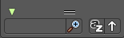

*************************************************
8.3.5 Editors - Image Editor - Sidebar - Mask Tab
*************************************************

.. contents:: Contents

Introduction
============

The mask tab just shows in Mask mode and with an existing mask.

It contains tools and settings for the mask mode. Like a layer system.

Mask Settings Panel
===================

This values are of interest for the Sequencer, where you work with movies and image sequences.

Start Frame
-----------

Here you can set the first Frame of the mask.

End Frame
---------

Here you can set the last Frame of the mask.

Mask Layers Panel
=================

When you add a spline, a circle or a square or a freehand one, then a Mask Layer gets created.

You can create several mask layers and work with them in the sequencer or the Node editors. They can be used to create complex shapes, and define how the splines interact with each other. Splines at the same layer can be animated together.

Splines can be copied and pasted from one layer to another.

Mask Layer List
---------------

The list of available mask layers. 

Restrict View
-------------

Don't show this mask layer in the viewport.

Restrict Select
---------------

Selection in the viewport is enabled or disabled. The spline handlers becomes invisible.

Restrict Render
---------------

Don't render this mask layer for the final image(s).

Drag Handler
------------

The two vertical lines at the end is a handler with which you can expand the list.

Search Field
------------

You can expand a search field at the bottom of the list. Type in your term and hit enter to filter for your term.

Invert
------

Here you can exclude the search term instead of searching for it.

Sort by Name
------------

Sort the List by name

Revert
------

Revert the list. The last list item beomes the first, and vice versa.

Add Mask Layer
--------------

Add a new mask layer to the list.

Last Operator Add Mask Layer
----------------------------

Name
----

Here you can rename the new created mask layer. 

Note that you can also rename it in the list.

Remove Mask Layer
-----------------

Remove the currently selected mask layer from the list.

Move Layer
----------

Move the selected layer up or downwards in the list.

Opacity
-------

Set the opacity of the mask layer.

Invert
------

Inverts the values (colors) in the mask layer.

Blend
-----

Here you can adjust the layer blending.

Note, Merge add and Merge subtract should be used with a Feather on overlapping masks to get a better result.

Falloff
-------

Here you can adjust the Feather falloff

Overlap
-------

Fill self-intersecting areas.

Holes
-----

Overlapping splines from the same layer will generate holes in the mask. 

Mask Layers Panel
=================

When there is a spline in the current mask layer, then the Active Spline Panel shows. Here you can adjust some settings for the currently active spline.

Feather Offset
--------------

The method to calculate the feather offset.

Interpolation
-------------

The weight interpolation method.

Cyclic
------

Make the spline closed or open.

Fill
----

Fill the spline.

Self Intersection Check
-----------------------

Prevent feather from self intersecting.

Active Point Panel
==================

When you select a point of one of the splines, then the Active Point Panel will show up. 

This panel is of interest for motion tracking. Control Points can be parented to motion tracks. And this allows to mask out parts of the motion tracked footage.

The masking happens at the Viewer Node.

Parent
------

Here you can choose the motion track that you want to parent the control point to.

Parent Type
-----------

Here you can choose between the methods Point Track or Plane Track.

Object
------

The parent object. Usually the camera where you track from.

Track
-----

Here you can choose the tracking point that you want to follow with the mask.

