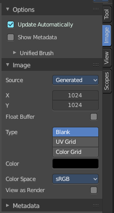
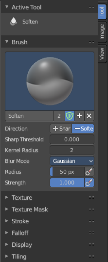
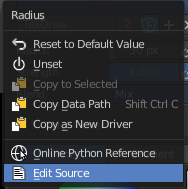

************************************
8.3 Editors - Image Editor - Sidebar
************************************

.. contents:: Contents

Introduction
============

The Image Editor is made of several areas. At the right side you will find the sidebar. Here you will find further options and settings for the Image Editor and its tools.

The tools tab in paint mode contains several panels with functionality for the brushes. The Image tab contains image related settings. And so on.

The Scopes tab just appears with an image selected.

Right Click menus
=================

You will open the usual right click menus when clicking with the right mouse at elements in the sidebar. Its content is in big parts self explaining. 

The right click menus are explained in the chapter 6 Editors Introduction.

