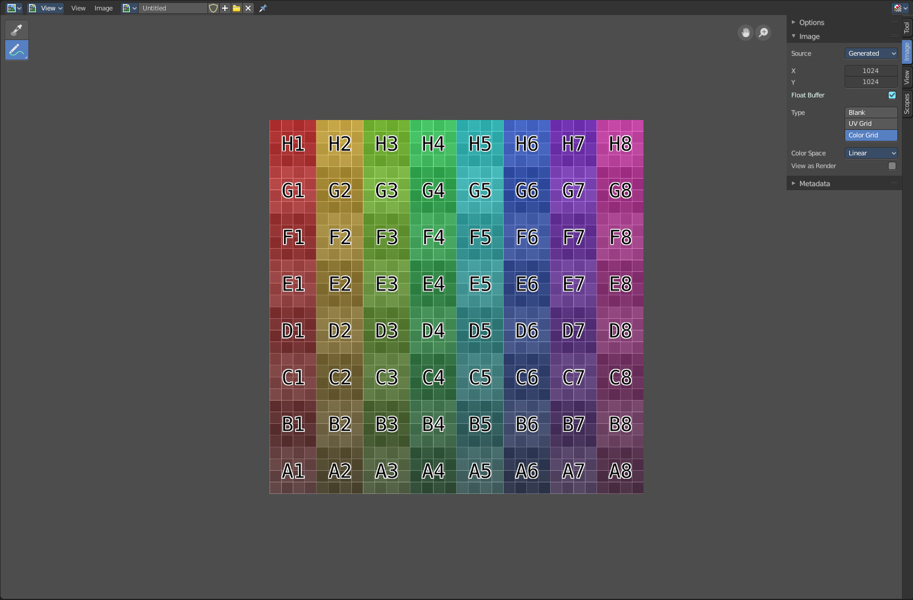
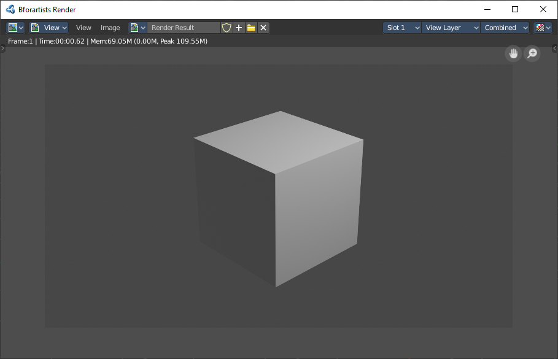
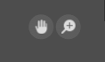
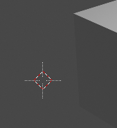
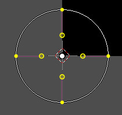
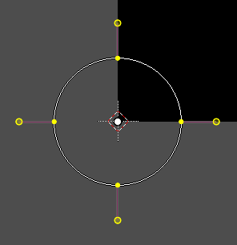
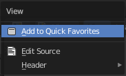
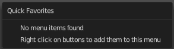

************************
8 Editors - Image Editor
************************

.. contents:: Contents

Image Editor
============

In the Image Editor you can show and edit 2D Assets like textures or images. Images created or edited in the Image editor can also be used in the UV Editor and in the different Node Editors.

It is also the editor type in which the final renderings are displayed.

The Image editor is divided into several areas has several tool areas. Tool Settings Area, Viewport, Header, Tool Shelf and Sidebar.

The Tool Settings area contains the same functionality than the Tools tab in the Sidebar. So we won't cover it.

Navigating in the Image Editor viewport
=======================================

The Viewport is the place where you view and edit your image content.

Hotkeys
-------

Pan the view - MMB

Zoom - Mouse Wheel, LMB+CTRL, Numpad + / -

View All - Home

View Fit - Numpad Period

Navigation Elements
-------------------

There are also two navigation elements for panning and zoom in the upper right corner. Click at them, hold the mouse button down, and move.

2D Cursor
---------

In Mask mode you will see a 2D cursor. It is the center point for tool operations. And can be set with Alt + Right Mouse click.

Viewport context menus
======================

When you double right click into the viewport, then you will open a menu. Its content is to 100% double content to already existing menus. And it is despite the name not contextual.

There are two different menus. One in Paint mode. And one in Mask mode. The View mode has no right click menu.

Double right click in Paint mode
--------------------------------

A double right click in paint mode opens a color picker with some further settings.

Blend Mode
----------

Here you can choose the blend mode for drawing.

Radius
------

The Brush radius.

Strength
--------

The Brush strength.

Double right click in Mask mode
-------------------------------

Without a mask
--------------

New Mask
--------

Creates a new mask.

Last Operator New Mask
----------------------

Name
----

Here you can type in the name of the new mask.

Add Circle
----------

Adds a circle shaped spline curve.

Last Operator Add Circle
------------------------

Size
----

The size of the circle spline curve.

Location X Y
------------

The location of the circle spline curve. Calculation happens from the center of the spline. 0 / 0 is down left.

Add Square
----------

Adds a square shaped spline curve.

Last Operator Add Square
------------------------

Size
----

The size of the square spline curve.

Location X Y
------------

The location of the square spline curve. Calculation happens from the center of the spline. 0 / 0 is down left.

With existing mask
------------------

Set Handle Type
---------------

Opens a sub menu where you can choose different handle types. 

Last Operator Set Handle Type
-----------------------------

Type
----

Here you can choose the handle type again.

Switch Direction
----------------

A curve has a start point and a end point. Here you can switch them. The end point becomes the starting point and vice versa. As a consequence the handler can switch their location too. With handle type aligned single they can appear outside or inside of the circle.

Toggle Cyclic
-------------

Closes or opens the spline.

Add Circle
----------

Adds a circle shaped spline curve.

Last Operator Add Circle
------------------------

Size
----

The size of the circle spline curve.

Location X Y
------------

The location of the circle spline curve. Calculation happens from the center of the spline. 0 / 0 is down left.

Add Square
----------

Adds a square shaped spline curve.

Last Operator Add Square
------------------------

Size
----

The size of the square spline curve.

Location X Y
------------

The location of the square spline curve. Calculation happens from the center of the spline. 0 / 0 is down left.

Copy Splines
------------

Copys the selected spline(s) or spline points.

Paste Splines
-------------

Pastes the copied spline(s) or spline points.

Re-Key Shape Points
-------------------

Recalculate animation data for the currently selected curve points for frames that are selected in the dopesheet.

Clear Feather Weight
--------------------

Resets the scale to its original dimensions.

Reset Feather Animation
-----------------------

Resets the feather weight on all selected curve points at the current frame.

Make Parent
-----------

Parents the selected spline points. Mask splines can be parented to motion tracker markers.

Clear Parent
------------

Clears the parent relationship.

Delete
------

Deletes the selected spline(s) or spline points.

Quick Favourites menu
=====================

When you right click at a menu or a button, then a right click menu will open. Tools have usually a Add to Quick Favourites menu entry.

The Quick Menu is empty by default. With Add to Quick favourites you can add this menu to the Quick menu.

In the 3D view we have a menu called Quick in the header, which shows this content then. In the Image Editor you can just call it with its hotkey. Q. It has no regular menu entry here.

