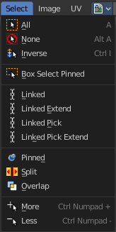
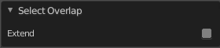

************************************************
9.1.2 Editors - UV Editor - Header - Select Menu
************************************************

.. contents:: Contents

Image Editor - Select menu
==========================

This menu just appears when you are in Mask mode. And you need to create a new mask layer to set all items active. The select functionality in this menu covers the mask geometry. The splines.

All 
----

Select everything.

None
----

Select nothing.

Inverse
-------

Invert the current selection.

Box Select Pinned
-----------------

Box select enters the Border Select mode. This is a special select mode where you can select elements by dragging a rectangle. And what's inside of the rectangle gets selected then. It adds to selection by default. Box Select Pinned just selects pinned UV vertices. The other box select method can be found in the tool shelf.

To subtract from selection hold down Shift key. 

The selection gets applied when you release the mouse. You leave the mode automatically when you release the mouse.

Circle Select
-------------

Circle select enters the Circle Select mode. This is a special select mode where you can select elements by moving with the mouse over it. It adds to selection by default. 

To subtract from selection hold down Shift key. To exit the Circle select click with the right mouse button.

The pencil radius of the circle select tool can be adjusted with the scroll wheel.

Linked
------

Select all UV vertices linked to the active UV map. The previous selection gets cleared.

Linked Pick
-----------

Hotkey Only Tool!

Select all UV vertices linked to the active UV map. The previous selection gets cleared.

Last Operator Select Linked Pick
--------------------------------

Extend
------

The previous selection gets kept, the selection gets extended.

Deselect
--------

Deselect instead of select

Location X / Y
--------------

The mouse position in the UV space, normalized to the 0.0 to 1.0 range of the UV space.

Linked Pick Extend
------------------

Hotkey Only Tool!

Select all UV vertices linked to the active UV map. The previous selection gets kept.

Pinned
------

Select pinned UV vertices.

Split
-----

Select only entirely selected faces.

Overlap
-------

Select all UV faces that overlaps each other.

Last Operator Select Overlap
----------------------------

Extend
------

Extend the current selection.

More
----

Grow the selection.

Less
----

Shrink the selection.

