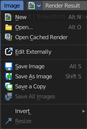
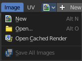
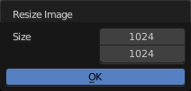
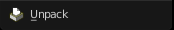
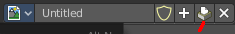

***********************************************
9.1.3 Editors - UV Editor - Header - Image Menu
***********************************************

.. contents:: Contents

Image Editor - Image Menu
=========================

The Image menu contains the load and save functionality.

.. image:: graphics/9.1.3_Editors_-_UV_Editor_-_Header_-_Image_Menu/10000201000000B00000014850A9834079745658.png

Not all content shows with all image types. A Render Result shows a different menu content.

New
---

Creates a new image. You will get a dialog where you can define settings for the new image.

Name
----

The name of the new image

Width
-----

The width of the new image.

Height
------

The height of the new image.

Color
-----

Here you can adjust the color of the new image. A click will call a color picker.

Alpha
-----

Check this checkbox if the new image should have an alpha channel.

Generated Type
--------------

Here you can define what kind of texture you want to create. 

Blank is one plain color.

UV Grid is a checker texture in black and white.

Color Grid is a colored checker texture.

32 Bit Float
------------

Check this checkbox if the image should be in 32 Bit floating point bit depth per channel. Else it is in 8 bit per channel.

Open
----

Opens the file browser to load an image.

Open Cached Render
------------------

To get it to work you need to have Cycles as the renderer selected. This feature does not work with Eevee or Workbench renderer.

Read all the current scene's render layers from cache, as needed. For this featute to work save Buffers needs to be activated in the Performance tab in the render settings.

This feature can be be used to save RAM while rendering because the render layers do not have to be saved in RAM. It can also be used to recover some information from a fail render.

Replace Image
-------------

Replaces the currently active image by an image that you load.

Reload Image
------------

Reloads the currently selected image. 

Note that the images must already exist somewhere at your hard disk. When you create a new image in Bforartists, then this image isn't saved yet, and so you cannot reload it.

Edit Externally
---------------

Here you can open the image in a defined external image editor like The Gimp or Photoshop. 

The image must be saved. And the image editor must be defined in the User Preferences.

Save Image
----------

Saves the currently selected image without any further questions. Note that the images must already exist somewhere at your hard disk.

Save As Image
-------------

Saves the currently selected image. 

Save Copy
---------

Saves a copy of the currently selected image. This will save the file to a specified name, but will keep the old one open in the Image editor.

Save all Images
---------------

Saves all images.

Note that the images must already exist somewhere at your hard disk so that they can be saved. The item is greyed out as long as the image is not saved to disk.

Invert
------

Invert is a sub menu where you can invert the colors of the whole image, or just specific colors.

Resize
------

Allows you to change the dimensions of the image. The tool calls a resize panel.

Pack Image / Pack as PNG
------------------------

Packs the currently active image into the blend file. When you save the blend file the next time, then this image will be embedded. The Pack menu item turns into a Unpack menu item with packed textures.

Packed images are marked with a pack icon. A click at this icon will unpack the texture, and try to save it to file. Usually to the last existing location before it was packed.

.. list-table::

	* - Warnning

	* - You cannot modify packed images. Changes at the image will not be saved. You need to unpack the image when you want to modify it. And repack it after you have done the changes.

