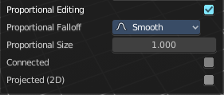
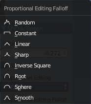

********************************************
9.1.4 Editors - UV Editor - Header - UV menu
********************************************

.. contents:: Contents

UV menu
=======

Transform
---------

Shear
-----

Shear shears the selection.

Last Operator Shear
-------------------

Offset
------

Here you can adjust an offset.

Axis
----

Defines one axis of the imaginary shear axis plane.

Axis Ortho
----------

Defines the other axis of the imaginary shear axis plane.

Orientation
-----------

Here you can choose the orientation for the shear action.

Proportional editing
--------------------

Enables proportional editing. Activating proportional editing reveals further settings.

Proportional Falloff
--------------------

Here you can adjust the falloff methods.

Proportional Size
-----------------

Here you can see and adjust the falloff radius.

Connected
---------

The proportional falloff gets calculated for connected parts only.

Projected(2D)
-------------

The proportional falloff gets calculated in the screen space. Depth doesn't play a role. When it's in the radius, then it gets calculated.

Mirror
------

Copy Mirrored UV coords
-----------------------

Copies and pastes the selected UV geometry on the X axis based on a mirrored mesh.

Use UV Select Sync must be off. The tool does not work with Use UV Select Sync on. And it is not fully reliable as our example shows.

X
-

Mirrors the selection in X axis. The mirror point is the pivot of the selection.

Y
-

Mirrors the selection in Y axis. The mirror point is the pivot of the selection.

Last Operator Mirror
--------------------

The Last Operator Mirror panel gives you tools to adjust the mirror action.

Orientation
-----------

Orientation is a drop-down box where you can choose the type of orientation for the mirroring action.

Constraint Axis
---------------

Constraint Axis gives you the possibility to define the mirror axis. You can choose more than one axis here.

Proportional Editing
--------------------

Activates proportional editing.

Proportional Editing Falloff
----------------------------

Proportional Editing Falloff is a drop-down box where you can choose a method for the falloff for the proportional editing.

Connected
---------

The proportional falloff gets calculated for connected parts only.

Projected(2D)
-------------

The proportional falloff gets calculated in the screen space. Depth doesn't play a role. When it's in the radius, then it gets calculated.

Snap
----

Snap is a sub menu with some snapping tools. The menu items should be pretty self explaining. Selected to Pixels snaps the selected geometry to the pixels of the image, and so on.

Last Operator Snap Selection and Snap Cursor
--------------------------------------------

Target
------

Here you can set the snap target method again.

Unwrap ABF
----------

Unwrap ABF unwraps the selected geometry with the method Angle based. ABF stands for Angle Based Flattening. ABF can give a bit better result than LSCM when unwrapping organic shapes.

Note that you need to have the geometry selected in the 3D view.

Unwrap LSCM
-----------

Unwrap ABF unwraps the selected geometry with the method Angle based. ABF stands for Angle Based Flattening. LSCM can give a bit better results than ABF with geometric shapes.

Note that you need to have the geometry selected in the 3D view.

Last Operator Unwrap
--------------------

The last operator appears in the 3D view. Unwrap ABF and Unwrap LSCM shares the same Last Operator.

Method
------

Method is a drop down box where you can choose between Unwrap method Angle Based and Conformal.

Fill Holes
----------

Fill holes in the mesh before unwrapping.

Correct Aspect
--------------

Take the Image Aspect Ratio into account.

Use Subsurf Modifier
--------------------

Unwraps an existing Subsurf Modifier. You need to add a Subsurf Modifier first.

Margin
------

The distance between the single UV patches.

.. image:: graphics/9.1.4_Editors_-_UV_Editor_-_Header_-_UV_menu/10000201000000EA000000EC1CCAF8B500F35119.png

Pin 
----

Pins the selected vertices . This vertices are now nailed for the unwrap algorithms Angle based and Conformal. Their positions will not change when you repeat the unrwapping. And the algorithms will try to fit the rest of the geometry to this pinned vertices.

Pinned vertices are marked red.

A use case is for example when you have a distorted result for symmetric geometry like a face with the Conformal method. Then you can try to align two center vertices, pin them, and repeat the conformal method. It may be more symmetrical afterwards.

Unpin
-----

Unpins pinned geometry.

Last operator Pin
-----------------

This last opeartor appears in the 3D view. Pin and unpin shares the same last operator. 

Clear
-----

Unpins pinned geometry.

Pack Islands
------------

Pack Islands tries to pack the selected UV geometry as close together as possible. Without to waste too much empty space.

Note that the algorithm fails at round geometry. It calculates with rectangle shapes. 

Last Operator Pack Islands
--------------------------

This last opeartor appears in the 3D view.

Rotate
------

Allow the UV patches to be rotated while the pack operation.

Margin
------

UV patches needs a margin between the single patches. So that the pixels of the texture doesn't bleed into other areas. Here you can adjust this margin.

Average Island Scale
--------------------

Scales the selected UV geometry to have the same relative size than the rest of the mesh. So that the texels at the mesh have roughly the same size everywhere.

Minimize Stretch
----------------

You might end in a UV mapping result that still shows unwanted distortions here and there. For example when you uv map a human face. Minimize Stretch tries to minimize this stretching effects in the UV patches.

To view stretched areas at your UV patches, tick Stretch in the Properties Sidebar in the Display panel, and switch from Angle to Area. Then a stretch mask gets displayed. The color range goes from blue to green to red, where blue is minimal stretch and red is maximal stretch.

Let's explain it with an example. A sphere where the cut is nearly at the pole. And uv mapped with Angle Based. The result will of course show heavy stretched areas.

Note that the UV geometry must be selected in the UV Image editor. Now let's use the Minimize stretch tool. The algorithm now first tries its best to find the best fitting result that shows fewest stretching across the overall UV geometry.

The header shows a help text while the algorithm works. The Blend factor is the value between the original unwrapped UV mesh, and the maximum minimized stretch. You can set this value manually by using the scroll wheel at your mouse, or with the + and - keys.

Last Operator Minimize Stretch
------------------------------

Fill Holes
----------

Fill holes virtually fills holes before unwrapping to avoid overlappings and to preserve the geometry.

Blend
-----

The Blend factor is the value between the original and the maximum minimized stretch. 

Iterations
----------

Number of iterations for the Minimize stretch algorithm.

Stitch
------

Stitch tries to union UV patches along the selected edges or vertices. 

Last Operator Stitch
--------------------

This last opeartor appears in the 3D view. 

Use Limit
---------

Just snap when the elements are below a given distance.

Snap Island
-----------

Snap the whole UV patch, or just the selected edge(s)/vertices

Limit
-----

The limit distance for Use Limit.

Static Island
-------------

Here you can adjust which island stays in place when stitching.

Active Object
-------------

Index of the active object.

Snap at Midpoint
----------------

Snap at the center point of the two elements instead the first to the last.

Clear Seams
-----------

Unmarks seams when stitching.

Operation Mode
--------------

The operation mode. Calculate with Edges or Vertices.

Mark Seam
---------

The unwrap algorithms Angle based and Conformal requires to have edges marked as seams. Think of it as a cutting pattern for a trouser for example. Such a trouser is also made of fabric patterns. 

.. image:: graphics/9.1.4_Editors_-_UV_Editor_-_Header_-_UV_menu/10000201000002150000011E150E2BC0C8145FCF.png

Same goes for the UV patches when you use Angle based or conformal unwrapping. You need to cut your mesh into parts and mark edges as seams, so that the algorithm knows where the seams are.

Mark seam marks the currently selected edge(s) as a seam. Seam edges will be displayed as red in the 3D viewport. But not in the UV Image Editor. The UV patches represents the seams.

You need to unwrap the mesh again when you want to apply changes by the new marked seams.

Last Operator Mark Seam
-----------------------

Clear
-----

Clears the seam instead of marking it.

Clear Seam
----------

Clear seam removes the seam from the currently selected edge(s) in the 3D view.

Seams from Islands
------------------

Unwrapping creates the UV geometry from the 3D object. You mark the seams, then you click at unwrap, and the UV mesh gets created.

Mark Seams from islands goes the other way around for marking seams. It creates the seams at the mesh object in the 3D view from the UV geometry in the UV Image Editor. 

A use case is wheen you import meshes. Then you usually just have the UV patches in the UV Image editor. And when you want to modify the UV's further, then you need the seams at the mesh.

Weld / Align
------------

Weld 
-----

Welds selected vertices together. The weld happens at the center point.

Merge UV's by Distance
----------------------

Welds overlapping UV vertices together.

Last operator Remove Doubles UV
-------------------------------

This last opeartor appears in the 3D view.

Merge Distance
--------------

The distance below the vertices gets merged.

Unselected
----------

Merge selected to other unselected vertices.

Straighten
----------

Straightens the selected geometry in both directions, X and Y axis.

Straighten X
------------

Straightens the selected geometry along the X axis.

Straighten Y
------------

Straightens the selected geometry along the Y axis.

Align Auto
----------

Aligns the selection. The align axis gets chosen from the selection itself. When it's higher than tall, then it aligns along the Y axis. When it's taller than high, then it aligns along the X axis.

The align point is the pivot of the selection.

Align X
-------

Aligns the selection along the X axis. The align point is the pivot of the selection.

Align Y
-------

Aligns the selection along the Y axis. The align point is the pivot of the selection.

Last operator Align
-------------------

The Last operator Align unions all the single straighten and align actions in one operator.

Axis
----

Lists the straighten and align methods again.

UV Select Mode
--------------

This is a double menu by design. Here you can see and assign shortcuts to the mode buttons in the header.

Show / Hide Faces
-----------------

Here you can show or hide faces. This happens in both, the 3D View and the UV editor

Show Hidden
-----------

Makes all geometry visible again.

Hide Selected
-------------

Hides the selected geometry.

Hide Unselected
---------------

Hides the not selected geometry. The selected geometry stays visible.

Last Operator Reveal Hidden / Hide Selected
-------------------------------------------

Select
------

Here you can define if the selected or the unselected elements gets hidden or revealed.

Export UV Layout
----------------

Here you can export the UV layout to an image, so that you can use it as a mask to build your texture in your favourite image editing software like Phothoshop. It will open a file dialog, where you can define further export settings down left.

All UV's
--------

Export all UV's, not just the visible ones.

Modified
--------

Export UV's from the modified mesh.

Format
------

Here you can choose the export format. 

Size
----

Here you can define the size of the image.

Fill Opacity
------------

How opaque the wireframe lines are.

