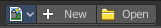
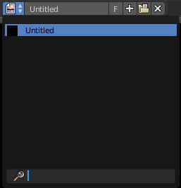
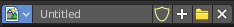
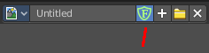
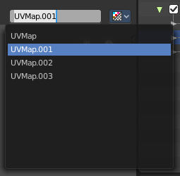

*************************************************
9.1.5 Editors - UV Editor - Header - Header Tools
*************************************************

.. contents:: Contents

Image Editor - Header Tools
===========================

The header contains several tools, dependand of what you do and what toolset is selected.

Image Prop
----------

This property contains the list of loaded images. When no image is loaded then it displays the New and Open Buttons. When an image exists then it displays the name of the currently selected image.

From left to right ...

List of images in the scene
---------------------------

This is a list of the images in the scene. Here you can switch to other images.

Image Edit Box
--------------

Here you can read the name of the currently selected image. And you can rename the image here too.

Fake User
---------

Wit this button you assign a fake user to this selected image.

Data, like images, that is not longer linked to anything else gets removed when you save and reload a scene. Bforartists has the concept of fake users to go around this behaviour. An image with a fake user is in fact linked to something. And so it is not lost when you save and reload the scene.

Search form
-----------

Here you can search for specific images.

New Image
---------

Create a new image.

Creates a new image. You will get a dialog where you can define settings for the new image.

Name
----

The name of the new image

Width
-----

The width of the new image.

Height
------

The height of the new image.

Color
-----

Here you can adjust the color of the new image. A click will call a color picker.

Alpha
-----

Check this checkbox if the new image should have an alpha channel.

Generated Type
--------------

Here you can define what kind of texture you want to create. 

Blank is one plain color.

UV Grid is a checker texture in black and white.

Color Grid is a colored checker texture.

32 Bit Float
------------

Check this checkbox if the image should be in 32 Bit floating point bit depth per channel. Else it is in 8 bit per channel.

Open Image
----------

Opens the file browser to load an image.

Unlink Datablock
----------------

This deletes the selected image. Unfortunately not immediately. You need to save the scene and to reload it.

And you need to make sure that it is not linked to anything else. A mesh or a fake user for example. Have a look if there is a number besides the F button. When this is the case then the image has still a user, and so still loads with loading the scene.

Use Image Pin
-------------

When you select another object. for UV mapping for example, then usually the connected images for this object gets displayed. Use image pin nails the currently selected image so that it stays displayed.

UV Map Property
---------------

A mesh can have more than one UV map. You create them in the Properties editor in the Object Data Properties tab in the UV Map Panel. 

The property in the header allows you to switch to another UV map, and to rename the UV map.

Display Channels
----------------

Here you can adjust what channels of the image gets displayed. It just shows when an image is loaded and active.

Color and Alpha
---------------

Displays the whole image, including alpha channel.

Color
-----

Displays the whole image, but without alpha channel.

Alpha
-----

Displays the alpha channel of the image.

Red
---

Displays the red channel of the image.

Green
-----

Displays the green channel of the image.

Blue
----

Displays the blue channel of the image.

