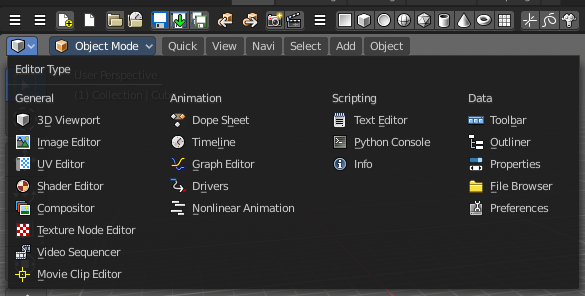
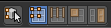
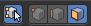

********************************
9.1 Editors - UV Editor - Header
********************************

.. contents:: Contents

UV Editor - Header
==================

The Header contains various menus, navigation elements, settings and tools for theviewport. This content differs, dependant of the sub mode.

The header is divided into two areas. Left mode and menus. Right settings.

Header right click menus
========================

The general right click menu functionality is explained in chapter 6 Editors introduction.

Editortype Menu
===============

Bforartist is made of several editor types. Headers can display a menu where you can switch to other editor types.

This menu is hidden by default. It is meant to edit the layouts, and should not be necessary for regular work. You can reveal it in the header right click menu. 

.. image:: graphics/9.1_Editors_-_UV_Editor_-_Header/10000201000000DA000000B5235A77E3221EDB3D.png

Sub Modes
=========

The UV Editor has two submodes. Sync Off and Sync On.

UV Select Sync off
------------------

With UV Select Sync off you will be able to modify single UV elements, like whole UV patches. And the 3D view will not change its selection.

When you have some geometry in the 3D view not selected, then it will not show up in the UV image editor neither.

You can switch between the selection modes with hotkeys 1, 2, 3, 4 

Vertex selection mode
---------------------

Select vertices in the UV geometry.

Edge selection mode
-------------------

Select edges in the UV geometry.

Face selection mode
-------------------

Select single faces in the UV geometry

Island selection mode
---------------------

Select whole UV patches in the UV geometry.

Sticky Selection mode
---------------------

This options controls how UV's are selected when Sync Selection is off. This mainly affects vertices. But edge and face selection relies at vertices too.

Disabled
--------

No sticky selection. You can just move one UV vertice at time. In case you have two vertices above each other, like with a UV patch with two faces, then just one vertice gets selected. Even when it's the same UV patch.

Shared Location
---------------

Selects all UV vertices under the mouse in case it's part of the same UV patch. Vertices of other UV patches gets ignored.

In this shot the two down left faces are one UV patch.

Shared Vertex
-------------

Selects all UV vertices that shares the same vertice at the 3D mesh. Regardless if it's the same UV patch or not.

UV Select Sync on
-----------------

With UV Select Sync on you will keep selections of UV space and 3D view in sync. But you cannot modify single UV elements anymore. In this mode you work with Vertices, Edges and Faces.

All UV geometry of the object will show up, no matter what's selected in the 3D view.

You can switch between the selection modes with hotkeys 1, 2, 3. Note that this selection mode is in sync with the selection modes in the 3D view. When you change it in the one editor, then it changes in the other editor too.

Vertex selection mode
---------------------

Select vertices in the UV geometry and at the 3D mesh object.

Edge selection mode
-------------------

Select edges in the UV geometry and at the 3D mesh object.

Face selection mode
-------------------

Select single faces in the UV geometry and at the 3D mesh object.

