************************************
9.2 Editors - UV Editor - Tool Shelf
************************************

.. contents:: Contents

Tool Shelf in View Mode
=======================

Select Tools Group
------------------

Tools with a triangle down right are a group of tools. Click and hold to reveal the content. Then choose the tool that you need.

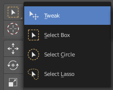

Tweak
-----

Allows you to select or tweak single elements by clicking at it.

Select Box
----------

Draws a box to select several elements at once. Click at the start point, then drag.

Tool Settings
-------------

Mode
----

The available selection modes. The mode titles are pretty self explaining. So i won't go into detail here.

Set a new selection
-------------------

Extend existing selection
-------------------------

Subtract existing selection
---------------------------

Select Circle
-------------

Draws a box to select several elements at once. Click at the start point, then drag.

Tool Settings
-------------

Mode
----

The available selection modes. The mode titles are pretty self explaining. So i won't go into detail here.

Set a new selection
-------------------

Extend existing selection
-------------------------

Subtract existing selection
---------------------------

Radius
------

The brush radius.

Select Lasso
------------

Draws a box to select several elements at once. Click at the start point, then drag.

Tool Settings
-------------

Mode
----

The available selection modes. The mode titles are pretty self explaining. So i won't go into detail here.

Set a new selection
-------------------

Extend existing selection
-------------------------

Subtract existing selection
---------------------------

Cursor
------

The cursor tool allows you to move the 2d cursor around.

Move
----

Activates the move tool. Activating the move tool also reveals a move widget at the object. This widget allows you to move the object around, by using the corresponding axis.

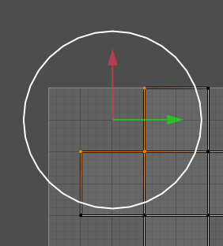

When you click at one of the square buttons at the icon, then you can move the object along the plane of the two adjacent axis. The rectangle buttons between the arrows allows you to move in direction of the blue and green arrows. This can also be done by clicking at the tip of the arrow and holding down shift. Then you can move the cube along the two other axis.

Snapping
--------

Holding down Ctrl activates temporary global snapping.

Precision movement
------------------

When you hold down shift, then you will have a much slower but also much preciser movement.

Header Values
-------------

When you move your object then you will see some values in the header, which defines the current position of the object. 

.. image:: graphics/9.2_Editors_-_UV_Editor_-_Tool_Shelf/10000201000000F00000001AC426EC5611FEF97B.png

The value m stands for the default metric system. Meters. You can change the units in the Properties editor in the Scene properties in the Units panel. When you choose kilometers here then you will see a km instead m.

The value D stands for the distance of the current selected axis. This can also be two axis. Then you have two d values. The value in the brackets is then the direct distance to the starting point.

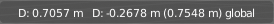

These values are always relative to the starting point. You always start with zero, regardless of the real world position.

Move without widget
-------------------

You don't have to use the widget to move the object. You can also click aside of it, and drag the selection around. 

Limit Axis
----------

When you want to move into a specific axis, then press X or Y to limit the movement to this axis. 

.. image:: graphics/9.2_Editors_-_UV_Editor_-_Tool_Shelf/10000201000000F00000001AC426EC5611FEF97B.png

Last Operator Move
------------------

Move X, Y Z
-----------

The position. Attention, the actual world orientation and rotation does not matter here. It always starts with a value of zero, and moves relative to this zero then. For the actual location values have a look in the sidebar in the transform panel.

Orientation
-----------

The widget can have different orientations. The menu items should be self explaining.

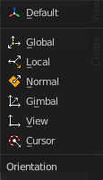

Proportional editing
--------------------

Enables proportional editing. Activating proportional editing reveals further settings.

Proportional Falloff
--------------------

Here you can adjust the falloff methods.

Proportional Size
-----------------

Here you can see and adjust the falloff radius.

Connected
---------

The proportional falloff gets calculated for connected parts only.

Projected(2D)
-------------

The proportional falloff gets calculated in the screen space. Depth doesn't play a role. When it's in the radius, then it gets calculated.

Rotate
------

Activates the Rotate tool. Activating the move tool also reveals a rotate widget at the object. This widget allows you to rotate the object, by using the corresponding axis.

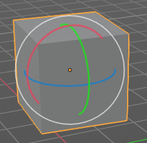

Snapping
--------

Holding down Ctrl activates temporary global snapping.

Precision rotation
------------------

When you hold down shift, then you will have a much slower but also much preciser rotation.

Header Values
-------------

When you rotate your object then you will see some values in the header, which defines the current rotation of the object. The rotation is shown in degrees.

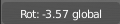

Rotate without widget
---------------------

You don't have to use the widget to rotate the object. You can also click asides and drag the selection around. 

Limit Axis
----------

When you want to rotate a specific axis, then press X or Y to limit the rotation to this axis. 

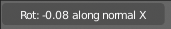

By holding down the mouse button and pressing the X, Y or Z key twice you can toggle this to local. But also to other orientations. This depends in what orientation you start. With normal you can toggle that way between Normal and Global.

Last Operator Rotate
--------------------

Angle
-----

The rotation. Attention, the actual world orientation and rotation does not matter here. It always starts with a value of zero, and rotates relative to this zero then. For the actual rotation values have a look in the sidebar in the transform panel.

Axis
----

Which axis to rotate.

Orientation
-----------

The widget can have different orientations. The menu items should be self explaining.

Proportional editing
--------------------

Enables proportional editing. Activating proportional editing reveals further settings.

Proportional Falloff
--------------------

Here you can adjust the falloff methods.

Proportional Size
-----------------

Here you can see and adjust the falloff radius.

Connected
---------

The proportional falloff gets calculated for connected parts only.

Projected(2D)
-------------

The proportional falloff gets calculated in the screen space. Depth doesn't play a role. When it's in the radius, then it gets calculated.

Scale 
------

Activates the Scale tool. Activating the scale tool also reveals a traditional scale widget at the object. This widget allows you to scale the object, by using the corresponding axis. When you click at the outer white circle and drag, then you can scale the object uniformly.

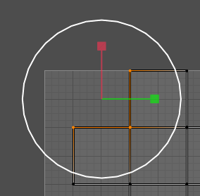

The rectangle buttons between the arrows allows you to scale in direction of the adjacent arrows. This can also be done by clicking at the tip of the arrow and holding down shift. Then you can scale the cube along the two other axis.

Snapping
--------

Holding down Ctrl activates temporary global snapping.

Precision Scale
---------------

When you hold down shift, then you will have a much slower but also much preciser scale.

Header Values
-------------

When you scale your object then you will see some values in the header, which defines the current scale of the object.

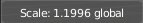

These values are always relative to the starting point. You always start with 1, regardless of the real world scale.

Scale without widget
--------------------

You don't have to use the widget to scale the object. You can also click asides and drag the selection around. 

Limit Axis
----------

When you want to rotate a specific axis, then press X or Y to limit the scale to this axis.

Last Operator Resize
--------------------

Angle
-----

The rotation. Attention, the actual world orientation and rotation does not matter here. It always starts with a value of zero, and rotates relative to this zero then. For the actual rotation values have a look in the sidebar in the transform panel.

Axis
----

Which axis to rotate.

Orientation
-----------

The widget can have different orientations. The menu items should be self explaining.

Proportional editing
--------------------

Enables proportional editing. Activating proportional editing reveals further settings.

Proportional Falloff
--------------------

Here you can adjust the falloff methods.

Proportional Size
-----------------

Here you can see and adjust the falloff radius.

Connected
---------

The proportional falloff gets calculated for connected parts only.

Projected(2D)
-------------

The proportional falloff gets calculated in the screen space. Depth doesn't play a role. When it's in the radius, then it gets calculated.

Transform
---------

Transform reveals a multi transform widget with all three transform methods available at once. Move, Rotate and Scale.

The rules are the same than for the single tools, and also the last operators. Dependant of which widget part you pull here. So i won't go into detail again here.

Clicking into the area of the widget allows you to move the selection.

Grabbing the sticking out round circle part allows to rotate the selection. 

Grabbing one of the corner points allows you to scale the selection.

Annotate Tools group
--------------------

The annotation tool is available in multiple editors. With this tool you can write notes at the screen. The annotate tools is the little brother of the grease pencil objects.

Further settings for annotate can be found in the sidebar. Here you can also remove an annotation when you don't longer need it. And here you can also adjust the size of the stroke.

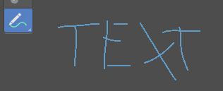

Annotate
--------

Draw free-hand strokes in the main window.

Annotate Line
-------------

Click and drag to create a line.

Annotate Polygon
----------------

Click multiple times to create multiple connected lines. The current polygon is finished when Esc or RMB is pressed.

Tool Settings
-------------

The tool settings for Annotate, Annotate Line and Annotate Polygon are the same. Different from the 3D view, there is no placement option for the 3d cursor.

Color
-----

Clicking at the left color field reveals a color picker where you can define the color for the annotation stroke.

Note
----

Clicking at the Note dropdown box reveals a panel with further settings. It's the same content than in the annotations in the View tab.

Annotations list
----------------

Here you can add, remove and rename new annotations.

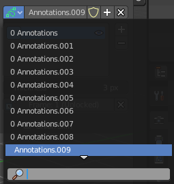

Edit Box
--------

The name of the current annotation. You can rename the annotation to your needs here.

Fake User
---------

Assign a fake user to this annotation. Fake users is a odd concept to keep data in the scene even if it has no user somewhere. The fake user is then a dummy user so that the object is not deleted when saving the scene. 

Add Annotation
--------------

Add a new annotation.

Unlink Annotation
-----------------

Delete the annotation.

Thickness
---------

The thickness of the annotation stroke.

Frame Locked/Unlocked
---------------------

Lock frame displayed by current layer. This toggles whether the active layer is the only one that can be edited.

Delete Active Frame
-------------------

Deletes the active frame from the active grease pencil layer.

Thickness
---------

The thickness of the annotation stroke.

Annotate Eraser
---------------

Click and drag to remove annotate lines.

Tool Settings
-------------

Radius
------

The radius of the eraser pencil.

Grab
----

This is a brush tool that has further settings in the Tool tab in the sidebar at the right. Grab allows you to grab and move the geometry under the brush.

The brush radius can be changed with hotkey F. See also the Tool settings in the Brush panel.

Relax
-----

This is a brush tool that has further settings in the Tool tab in the sidebar at the right. Relax allows you to relax the geometry under the brush. The vertices are more evenly distributed.

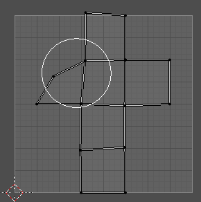

The brush radius can be changed with hotkey F. See also the Tool settings in the Brush panel.

Pinch
-----

This is a brush tool that has further settings in the Tool tab in the sidebar at the right. Pinch allows you to pinch the geometry under the brush. The vertices comes closer to each other.

The brush radius can be changed with hotkey F. See also the Tool settings in the Brush panel.

