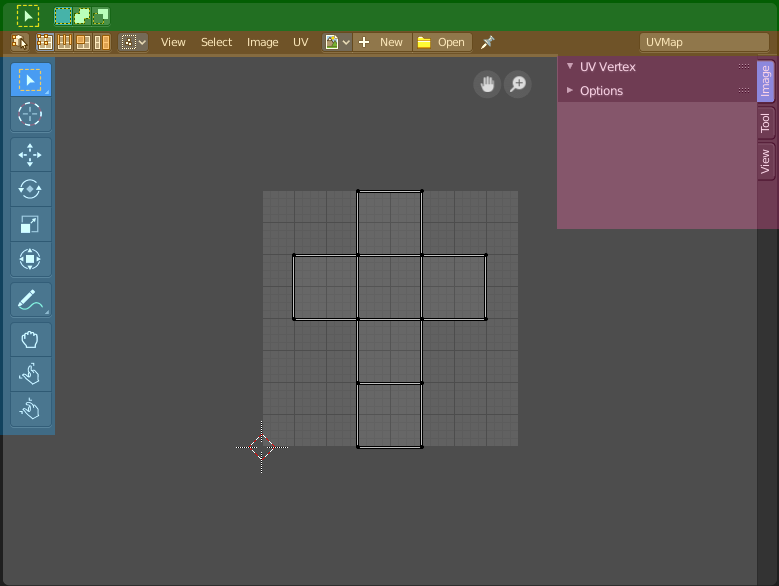
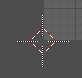
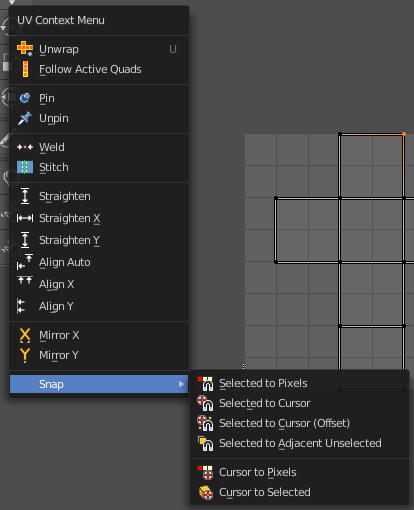
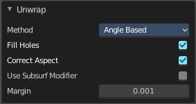
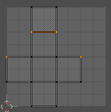
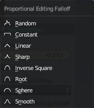
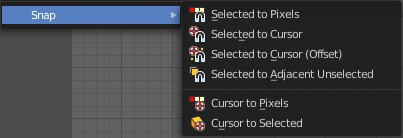
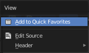
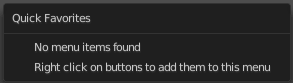

*********************
9 Editors - UV Editor
*********************

.. contents:: Contents

UV Editor
=========

The UV Image Editor is the place where you can display and edit the UV mapping, which doesn't necessarily require to have a image to be loaded.

The functionality of the UV Editor is connected to the 3D view. You need to have a mesh object selected, and you need to be in Edit mode to show the UV wire.

The UV editor is divided into several areas has several tool areas. 

Green - Tool Settings Area

Grey - Viewport

Orange - Header

Blue - Tool Shelf

Pink - Sidebar

The Tool Settings area contains the same functionality than the Tools tab in the Sidebar. So we won't cover it.

Navigating in the UV IMage Editor viewport
==========================================

Hotkeys
-------

Pan the view - MMB

Zoom - Mouse Wheel, LMB+CTRL, Numpad + / -

View All - Home

View Fit - Numpad Period

Navigation Elements
-------------------

There are also two navigation elements for panning and zoom in the upper right corner. Click at them, hold the mouse button down, and move.

2D Cursor
---------

The 2D Cursor is the center point for tool operations. It can be set to mouse position with Alt + Right Mouse click. Or with the Cursor tool in the 

Viewport context menu
=====================

When you double right click into the viewport, then you will open a menu. The UV Context menu. Its content is to 100% double content to already existing menus. And it is despite the name not contextual.

Unwrap
------

Unwraps the selected geometry with the method Angle based. ABF stands for Angle Based Flattening. 

Last Operator Unwrap
--------------------

The last operator appears in the 3D view. Unwrap ABF and Unwrap LSCM shares the same Last Operator.

Method
------

Method is a drop down box where you can choose between Unwrap method Angle Based and Conformal.

Fill Holes
----------

Fill holes in the mesh before unwrapping.

Correct Aspect
--------------

Take the Image Aspect Ratio into account.

Use Subsurf Modifier
--------------------

Unwraps an existing Subsurf Modifier. You need to add a Subsurf Modifier first.

Margin
------

The distance between the single UV patches.

Follow Active Quads
-------------------

Follow Active quads maps UV coordinates starting from an active face, and maps all adjacent faces in quad shape then. This way you can for example unwrap a pipe or a road. You first need to have a face selected. Then select everything. And then click at Follow Active Quads.

Last Operator Follow Active Quads
---------------------------------

The Last Operator contains the same settings than the Settings dialogue.

Edge Length Mode
----------------

Edge Length Mode is a drop-down box where you can choose the Length method.

Pin 
----

Pins the selected vertices . This vertices are now nailed for the unwrap algorithms Angle based and Conformal. Their positions will not change when you repeat the unrwapping. And the algorithms will try to fit the rest of the geometry to this pinned vertices.

Pinned vertices are marked red.

A use case is for example when you have a distorted result for symmetric geometry like a face with the Conformal method. Then you can try to align two center vertices, pin them, and repeat the conformal method. It may be more symmetrical afterwards.

Unpin
-----

Unpins pinned geometry.

Last operator Pin
-----------------

This last opeartor appears in the 3D view. Pin and unpin shares the same last operator. 

Clear
-----

Unpins pinned geometry.

Weld 
-----

Welds selected vertices together. The weld happens at the center point.

Stitch
------

Stitch tries to union UV patches along the selected edges or vertices. 

.. image:: graphics/9_Editors_-_UV_Editor/10000201000000E4000000DF5E62B67D30F72C56.png

Last Operator Stitch
--------------------

This last opeartor appears in the 3D view. 

Use Limit
---------

Just snap when the elements are below a given distance.

Snap Island
-----------

Snap the whole UV patch, or just the selected edge(s)/vertices

Limit
-----

The limit distance for Use Limit.

Static Island
-------------

Here you can adjust which island stays in place when stitching.

Active Object
-------------

Index of the active object.

Snap at Midpoint
----------------

Snap at the center point of the two elements instead the first to the last.

Clear Seams
-----------

Unmarks seams when stitching.

Operation Mode
--------------

The operation mode. Calculate with Edges or Vertices.

Straighten
----------

Straightens the selected geometry in both directions, X and Y axis.

Straighten X
------------

Straightens the selected geometry along the X axis.

Straighten Y
------------

Straightens the selected geometry along the Y axis.

Align Auto
----------

Aligns the selection. The align axis gets chosen from the selection itself. When it's higher than tall, then it aligns along the Y axis. When it's taller than high, then it aligns along the X axis.

The align point is the pivot of the selection.

Align X
-------

Aligns the selection along the X axis. The align point is the pivot of the selection.

Align Y
-------

Aligns the selection along the Y axis. The align point is the pivot of the selection.

Last operator Align
-------------------

The Last operator Align unions all the single straighten and align actions in one operator.

Axis
----

Lists the straighten and align methods again.

Mirror X
--------

Mirrors the selection along the X axis. The mirror point is the pivot of the selection.

Mirror Y
--------

Mirrors the selection along the Y axis. The mirror point is the pivot of the selection.

Last Operator Mirror
--------------------

The Last Operator Mirror panel gives you tools to adjust the mirror action.

Orientation
-----------

Orientation is a drop-down box where you can choose the type of orientation for the mirroring action.

.. image:: graphics/9_Editors_-_UV_Editor/1000020100000090000000932D2EC1559DCA838C.png

Constraint Axis
---------------

Constraint Axis gives you the possibility to define the mirror axis. You can choose more than one axis here.

Proportional Editing
--------------------

Activates proportional editing

Proportional Editing Falloff
----------------------------

Proportional Editing Falloff is a drop-down box where you can choose a method for the falloff for the proportional editing.

Connected
---------

The proportional falloff gets calculated for connected parts only.

Projected(2D)
-------------

The proportional falloff gets calculated in the screen space. Depth doesn't play a role. When it's in the radius, then it gets calculated.

Snap
----

Snap is a sub menu with some snapping tools. The menu items should be pretty self explaining. Selected to Pixels snaps the selected geometry to the pixels of the image, and so on.

Last Operator Snap Selection and Snap Cursor
--------------------------------------------

Target
------

Here you can set the snap target method again.

Quick Favourites menu
=====================

When you right click at a menu or a button, then a right click menu will open. Tools have usually a Add to Quick Favourites menu entry.

The Quick Favourites Menu is empty by default. With Add to Quick favourites you can add this menu to the Quick menu.

In the 3D view we have a menu called Quick in the header, which shows this content then. In the Image Editor you can just call it with its hotkey. Q. It has no regular menu entry here.

